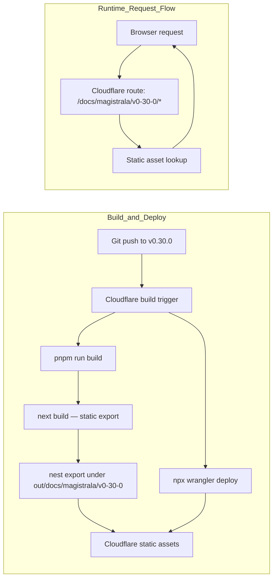

# Magistrala Docs (v0.30.0)

Documentation site for [Magistrala](https://github.com/absmach/magistrala), built with [Fumadocs](https://fumadocs.dev) and Next.js.

This branch is a versioned snapshot of the docs, deployed as its own Cloudflare Worker separate from `main`. Following [Fumadocs' full versioning approach](https://fumadocs.dev/docs/navigation#full-versioning), it's a fully independent app served under a versioned path prefix rather than a live-switching version.

Visiting `/docs/magistrala/v0-30-0/` redirects to `/docs/magistrala/v0-30-0/user-guide/architecture/`.

## Development

```bash
pnpm dev
```

Open http://localhost:3000 with your browser to see the result.

## Deployment

This site uses:

- **Next.js static export** — `next build` outputs static files to `out/`
- **Next.js `basePath`** — generates links and assets under `/docs/magistrala/v0-30-0`
- **Post-build nesting** — `scripts/nest-static-export.mjs` moves the export under `out/docs/magistrala/v0-30-0/` so Cloudflare static assets can serve it from the route prefix without custom Worker code

This branch deploys to a **separate Cloudflare Workers Builds project** from `main`, tracking the `v0.30.0` branch as its production branch. `wrangler.jsonc` here declares its own Worker `name` (`magistrala-docs-v0-30-0`) and a `routes` entry (`absmach.eu/docs/magistrala/v0-30-0/*`) so it serves that path prefix on the same zone without touching the `main` Worker's route (`absmach.eu/docs/magistrala/*`) — Cloudflare matches the more specific route first.

### Cloudflare build settings (Dashboard)

| Setting          | Value                   |
|------------------|-------------------------|
| Production branch | `v0.30.0`              |
| Build command    | `pnpm run build`        |
| Deploy command   | `npx wrangler deploy`   |
| Version command  | `npx wrangler versions upload` |
| Root directory   | `/`                     |

### Architecture



## Environment Variables

Only one runtime variable is needed:

```env
NEXT_PUBLIC_BASE_URL=https://absmach.eu/docs/magistrala/v0-30-0
```

Set this as a Cloudflare build variable so it is embedded into the static output at build time.

## Project structure

| Path                        | Description                                             |
|-----------------------------|---------------------------------------------------------|
| `app/[[...slug]]`           | Documentation pages and root redirect                   |
| `app/api/search/route.ts`   | Static search index route handler                       |
| `app/og/[...slug]`          | OG image generation for docs pages                      |
| `app/llms-full.txt`         | LLM-readable full docs text                             |
| `content/docs`              | MDX source files                                        |
| `lib/source.ts`             | Fumadocs source adapter                                 |
| `lib/layout.shared.tsx`     | Shared layout options                                   |
| `scripts/nest-static-export.mjs` | Moves static export under `/docs/magistrala/v0-30-0` |

## Learn More

- [Fumadocs](https://fumadocs.dev)
- [Next.js Documentation](https://nextjs.org/docs)
