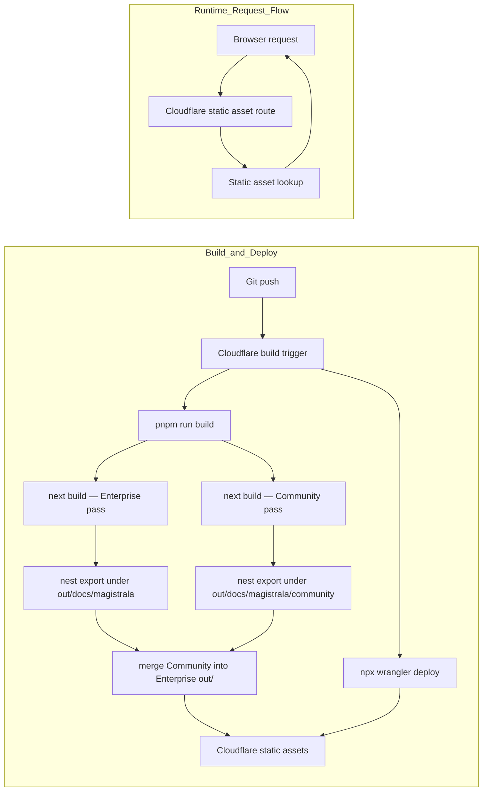

# Magistrala Docs

Documentation site for [Magistrala](https://github.com/absmach/magistrala), built with [Fumadocs](https://fumadocs.dev) and Next.js.

Visiting `/docs/magistrala/` redirects to `/docs/magistrala/user-guide/architecture/`.

## Development

```bash
pnpm dev
```

Open http://localhost:3000 with your browser to see the result.

## Editions

`latest` ships as two editions from one deployment:

- **Enterprise Edition** — full feature set, served at the root path (`/docs/magistrala/`)
- **Community Edition** — Reports, Alarms, Rules Engine, and Dashboards docs excluded, served nested at `/docs/magistrala/community/`

`content/docs` is a single shared tree. Pages/folders flagged `enterprise: true` (folder-level via `meta.json`, page-level via frontmatter — see `source.config.ts`) are filtered out of the Community build only, in `lib/source.tsx`. The sidebar's Edition switcher (`components/edition-switcher.tsx`) lets readers flip between the two; it only renders on `latest`, since `v0.30.0` predates the edition split and is unaffected — it keeps its own single-pass build on its own branch/Worker.

## Deployment

This site uses:

- **Next.js static export** — `next build` outputs static files to `out/`
- **Next.js `basePath`** — generates links and assets under `/docs/magistrala` (Enterprise) or `/docs/magistrala/community` (Community), driven by `NEXT_PUBLIC_BASE_PATH`
- **Post-build nesting** — `scripts/nest-static-export.mjs` moves each pass's export under its base path so Cloudflare static assets can serve it from the route prefix without custom Worker code
- **Edition build orchestration** — `scripts/build-editions.mjs` runs `next build` twice (once per edition, with different env vars) and merges Community's nested output as a `community/` subfolder inside Enterprise's tree — no second Worker or Cloudflare project needed, since `/docs/magistrala/community/*` is just a sub-path of the `/docs/magistrala/*` route the Worker already serves

### Cloudflare build settings (Dashboard)

| Setting          | Value                   |
|------------------|-------------------------|
| Build command    | `pnpm run build`        |
| Deploy command   | `npx wrangler deploy`   |
| Version command  | `npx wrangler versions upload` |
| Root directory   | `/`                     |

### Architecture



## Environment Variables

`scripts/build-editions.mjs` sets these per build pass, so no Cloudflare dashboard configuration is required:

```env
NEXT_PUBLIC_EDITION=enterprise|community
NEXT_PUBLIC_BASE_PATH=/docs/magistrala[/community]
NEXT_PUBLIC_BASE_URL=https://absmach.eu/docs/magistrala[/community]
```

Defaults (when unset, e.g. running `next build` directly) match the Enterprise pass.

## Project structure

| Path                        | Description                                             |
|-----------------------------|---------------------------------------------------------|
| `app/[[...slug]]`           | Documentation pages and root redirect                   |
| `app/api/search/route.ts`   | Static search index route handler                       |
| `app/og/[...slug]`          | OG image generation for docs pages                      |
| `app/llms-full.txt`         | LLM-readable full docs text                             |
| `content/docs`              | MDX source files                                        |
| `lib/source.ts`             | Fumadocs source adapter — also filters Enterprise-only content out of the Community build |
| `lib/edition.ts`            | Edition switcher data + `CURRENT_EDITION` (env-driven)  |
| `lib/layout.shared.tsx`     | Shared layout options                                   |
| `scripts/nest-static-export.mjs` | Moves one build pass's static export under its base path |
| `scripts/build-editions.mjs` | Runs both edition builds and merges them into one `out/` |

## Learn More

- [Fumadocs](https://fumadocs.dev)
- [Next.js Documentation](https://nextjs.org/docs)
