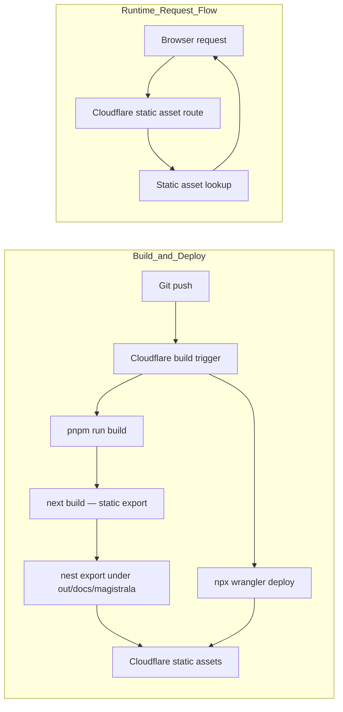

# Magistrala Docs

Documentation site for [Magistrala](https://github.com/absmach/magistrala), built with [Fumadocs](https://fumadocs.dev) and Next.js.

Visiting `/docs/magistrala/` redirects to `/docs/magistrala/user-guide/architecture/`.

## Development

```bash
pnpm dev
```

Open http://localhost:3000 with your browser to see the result.

## Deployment

This site uses:

- **Next.js static export** — `next build` outputs static files to `out/`
- **Next.js `basePath`** — generates links and assets under `/docs/magistrala`
- **Post-build nesting** — `scripts/nest-static-export.mjs` moves the export under `out/docs/magistrala/` so Cloudflare static assets can serve it from the route prefix without custom Worker code

### Cloudflare build settings (Dashboard)

| Setting          | Value                   |
|------------------|-------------------------|
| Build command    | `pnpm run build`        |
| Deploy command   | `npx wrangler deploy`   |
| Version command  | `npx wrangler versions upload` |
| Root directory   | `/`                     |

### Architecture



## Environment Variables

Only one runtime variable is needed:

```env
NEXT_PUBLIC_BASE_URL=https://absmach.eu/docs/magistrala
```

Set this as a Cloudflare build variable so it is embedded into the static output at build time.

## Project structure

| Path                        | Description                                             |
|-----------------------------|---------------------------------------------------------|
| `app/[[...slug]]`           | Documentation pages and root redirect                   |
| `app/api/search/route.ts`   | Static search index route handler                       |
| `app/og/[...slug]`          | OG image generation for docs pages                      |
| `app/llms-full.txt`         | LLM-readable full docs text                             |
| `content/docs`              | MDX source files                                        |
| `lib/source.ts`             | Fumadocs source adapter                                 |
| `lib/layout.shared.tsx`     | Shared layout options                                   |
| `scripts/nest-static-export.mjs` | Moves static export under `/docs/magistrala` |

## Learn More

- [Fumadocs](https://fumadocs.dev)
- [Next.js Documentation](https://nextjs.org/docs)
