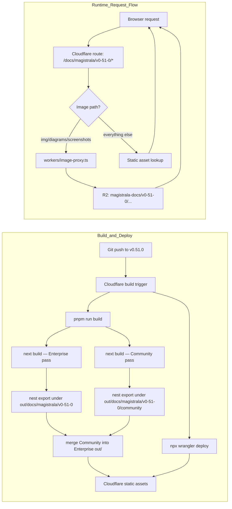

# Magistrala Docs (v0.51.0)

Documentation site for [Magistrala](https://github.com/absmach/magistrala), built with [Fumadocs](https://fumadocs.dev) and Next.js.

This branch is a versioned snapshot of the docs, deployed as its own Cloudflare Worker separate from `main`. Following [Fumadocs' full versioning approach](https://fumadocs.dev/docs/navigation#full-versioning), it's a fully independent app served under a versioned path prefix rather than a live-switching version. It is a frozen copy of `main` as it existed immediately before the "Latest" documentation overhaul (Workspaces/Devices/Gateways/Device Types terminology, screenshot regeneration, etc.) — content on this branch should not be modernized further; only deployment/config fixes belong here.

Visiting `/docs/magistrala/v0-51-0/` redirects to `/docs/magistrala/v0-51-0/user-guide/users-quick-start`.

## Development

```bash
pnpm dev             # Enterprise Edition — http://localhost:3000/docs/magistrala/v0-51-0/
pnpm dev:community   # Community Edition — http://localhost:3001/docs/magistrala/v0-51-0/community/
```

Run both at once, in separate terminals, to check edition-gated content side by side. Each `next dev` process only serves one edition (its `basePath`/`NEXT_PUBLIC_EDITION` are baked in at startup — see [Environment Variables](#environment-variables)), so the Edition switcher can't navigate correctly between two different dev ports; visit each URL directly instead. To test the real merged deployment, including the switcher, run `pnpm run build && pnpm start` and visit both editions on the same port (see [Deployment](#deployment)).

## Editions

This snapshot ships as two editions from one deployment, same as `main` did at freeze time:

- **Enterprise Edition** — full feature set, served at `/docs/magistrala/v0-51-0/`
- **Community Edition** — Reports, Alarms, Rules Engine, and Dashboards docs excluded, served nested at `/docs/magistrala/v0-51-0/community/`

`content/docs` is a single shared tree. Pages/folders flagged `enterprise: true` (folder-level via `meta.json`, page-level via frontmatter — see `source.config.ts`) are filtered out of the Community build only, in `lib/source.tsx`. The sidebar's Edition switcher (`components/edition-switcher.tsx`) only renders on `latest` and `v0.51.0`, since `v0.30.0` predates the edition split and keeps its own single-pass build on its own branch/Worker.

## Deployment

This site uses:

- **Next.js static export** — `next build` outputs static files to `out/`
- **Next.js `basePath`** — generates links and assets under `/docs/magistrala/v0-51-0` (Enterprise) or `/docs/magistrala/v0-51-0/community` (Community), driven by `NEXT_PUBLIC_BASE_PATH`
- **Post-build nesting** — `scripts/nest-static-export.mjs` moves each pass's export under its base path so Cloudflare static assets can serve it from the route prefix without custom Worker code
- **Edition build orchestration** — `scripts/build-editions.mjs` runs `next build` twice (once per edition, with different env vars) and merges Community's nested output as a `community/` subfolder inside Enterprise's tree

This branch deploys to a **separate Cloudflare Workers Builds project** from `main`, tracking the `v0.51.0` branch as its production branch. `wrangler.jsonc` here declares its own Worker `name` (`magistrala-docs-v0-51-0`) and a `routes` entry (`absmach.eu/docs/magistrala/v0-51-0/*`) so it serves that path prefix on the same zone without touching the `main` Worker's route — Cloudflare matches the more specific route first.

### Cloudflare build settings (Dashboard)

| Setting            | Value                           |
|--------------------|----------------------------------|
| Production branch  | `v0.51.0`                       |
| Build command      | `pnpm run build`                |
| Deploy command     | `npx wrangler deploy`           |
| Version command    | `npx wrangler versions upload`  |
| Root directory     | `/`                              |

No Cloudflare build environment variables are required — the version-specific `basePath`/base URL defaults are hardcoded directly in `next.config.mjs`, `lib/base-path.ts`, and `lib/metadata.ts` on this branch, so a plain `next build` (or `pnpm dev`) already produces `/docs/magistrala/v0-51-0/...` output without any dashboard configuration to remember.

### Architecture


```mermaid
flowchart LR
  subgraph Build_and_Deploy
    A[Git push to v0.51.0] --> B[Cloudflare build trigger]
    B --> C[pnpm run build]
    C --> D1[next build — Enterprise pass]
    D1 --> E1[nest export under out/docs/magistrala/v0-51-0]
    C --> D2[next build — Community pass]
    D2 --> E2[nest export under out/docs/magistrala/v0-51-0/community]
    E1 --> M[merge Community into Enterprise out/]
    E2 --> M
    B --> F[npx wrangler deploy]
    M --> G[Cloudflare static assets]
    F --> G
  end

  subgraph Runtime_Request_Flow
    U[Browser request] --> H[Cloudflare route: /docs/magistrala/v0-51-0/*]
    H --> J{Image path?}
    J -->|"img/diagrams/screenshots"| K[workers/image-proxy.ts]
    K --> L[R2: magistrala-docs/v0-51-0/...]
    J -->|everything else| N[Static asset lookup]
    L --> U
    N --> U
  end
```

## Environment Variables

None are required to reproduce this branch's own build — see the note under [Deployment](#deployment). `scripts/build-editions.mjs` still sets these per pass internally:

```env
NEXT_PUBLIC_EDITION=enterprise|community
NEXT_PUBLIC_BASE_PATH=/docs/magistrala/v0-51-0[/community]
NEXT_PUBLIC_BASE_URL=https://absmach.eu/docs/magistrala/v0-51-0[/community]
```

## Project structure

| Path                        | Description                                             |
|-----------------------------|---------------------------------------------------------|
| `app/[[...slug]]`           | Documentation pages and root redirect                   |
| `app/api/search/route.ts`   | Static search index route handler                       |
| `app/og/[...slug]`          | OG image generation for docs pages                      |
| `app/llms-full.txt`         | LLM-readable full docs text                             |
| `content/docs`              | MDX source files (frozen at the v0.51.0 snapshot)       |
| `lib/source.ts`             | Fumadocs source adapter — also filters Enterprise-only content out of the Community build |
| `lib/edition.ts`            | Edition switcher data + `CURRENT_EDITION` (env-driven)  |
| `lib/versions.ts`           | Version switcher data; `CURRENT_VERSION = "v0.51.0"` here |
| `lib/layout.shared.tsx`     | Shared layout options                                   |
| `scripts/nest-static-export.mjs` | Moves one build pass's static export under its base path |
| `scripts/build-editions.mjs` | Runs both edition builds and merges them into one `out/` |
| `workers/image-proxy.ts`    | Worker serving `/docs/magistrala/v0-51-0/{img,diagrams,screenshots}/*` from a **version-scoped R2 prefix** — see [Image immutability](#image-immutability) |
| `lib/remark-doc-images.ts`  | Remark plugin resolving markdown image paths (relative or `/screenshots/...`) to their R2-proxy URL at build time |

## Image immutability

Doc images are served from the shared `websites-images` R2 bucket, not committed to git. Unlike `latest`, which reads/writes the unversioned prefix (`magistrala-docs/{img,diagrams,screenshots}/...`), this branch's Worker (`workers/image-proxy.ts`) reads only from the version-scoped prefix `magistrala-docs/v0-51-0/{img,diagrams,screenshots}/...`. This is a one-time fork of the Worker, not a shared runtime config, so future `pnpm run publish-image` uploads on `latest` can never change what this branch displays.

That version-scoped prefix must be populated with a copy of every object `main` referenced at the freeze point (see the image-preservation handoff produced alongside this branch) **before** this branch is deployed — until that copy happens, every image on this deployment 404s. `lib/remark-doc-images.ts` and `scripts/publish-image.mjs` are unchanged from `main`; they only know about the unversioned prefix, and are not used to publish into the versioned one (that copy is a direct R2-to-R2 operation, not a re-upload of local files).

## Learn More

- [Fumadocs](https://fumadocs.dev)
- [Next.js Documentation](https://nextjs.org/docs)
