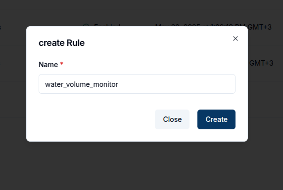
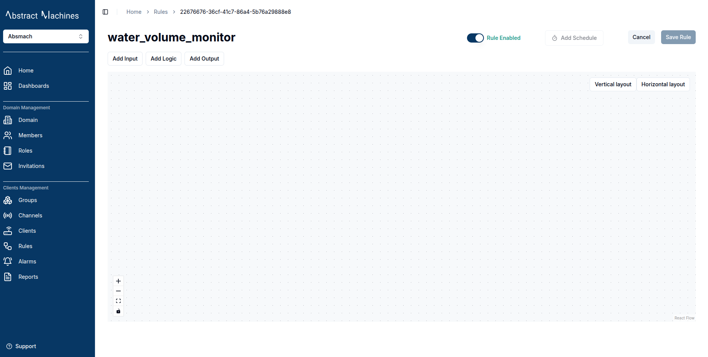
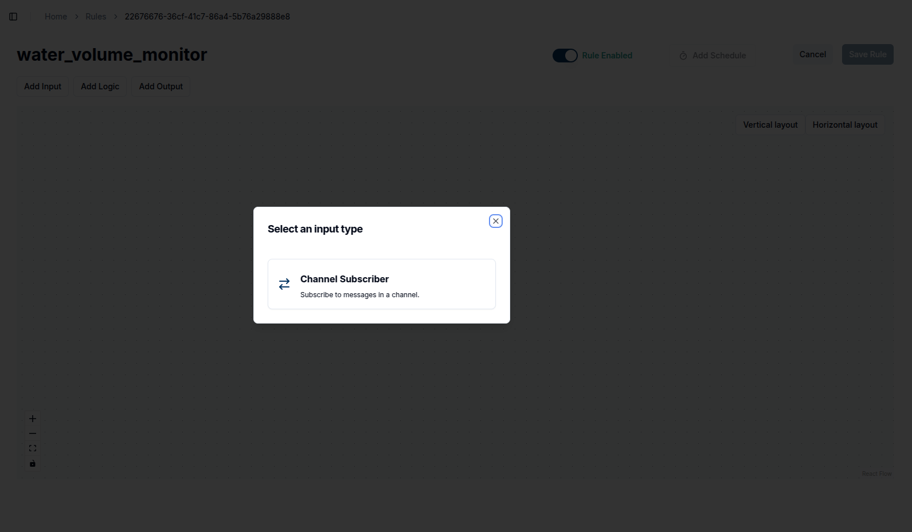
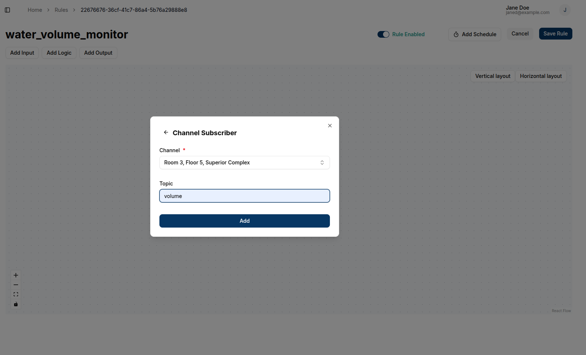
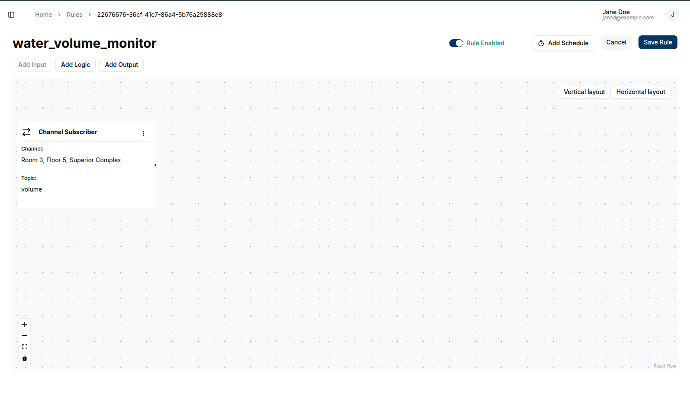
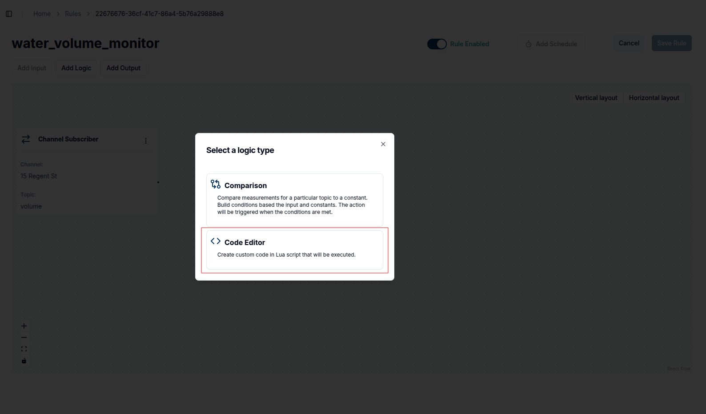
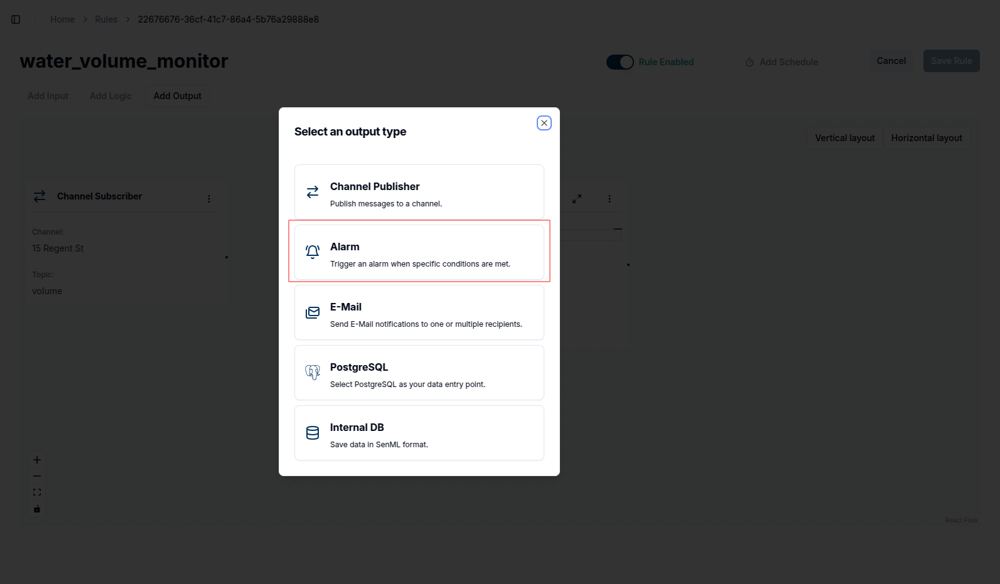
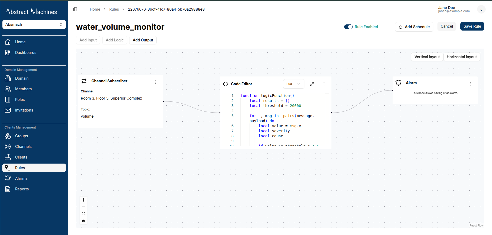

# IoT Alarm Management with Magistrala: Architecture and Implementation

Magistrala has put into place an alarm system that fully integrates сonverged IoT monitoring. The Rules Engine service is utilized by the system as an alarm generation and context processing service over raw sensor data. It offers an end-to-end solution to the IoT alarm management problems ranging from simple limits checking to intricate multi-condition use cases. Having this architecture allows an organization to go beyond simplistic threshold notifications to implement intricate policies beyond business rule disregard sensor data that is context-aware and produces alarms that make sense.

### Common Use Cases

Magistrala's alarm system addresses diverse IoT monitoring scenarios:

- **Environmental Monitoring**: Temperature, humidity, air quality thresholds in smart buildings, greenhouses, and data centers
- **Industrial Safety**: Gas leak detection, pressure monitoring, vibration analysis for predictive maintenance
- **Energy Management**: Power consumption alerts, battery level monitoring, grid stability detection
- **Security & Access Control**: Unauthorized access detection, motion sensors, perimeter monitoring
- **Asset Health**: Equipment failure prediction, performance degradation, maintenance scheduling
- **Compliance Monitoring**: Regulatory threshold enforcement, audit trail generation, quality assurance

## System Architecture

Magistrala's alarm system implements an event-driven microservices architecture where the Rules Engine serves as the intelligent processing layer that evaluates IoT data and generates alarms. The architecture separates alarm creation (handled by Rules Engine) from alarm management (handled by Alarm Service), enabling scalable and flexible monitoring solutions.

### Core Service Components

**Rules Engine**: Processes incoming IoT data and executes programmed rule scripts written in Go or Lua. When rule conditions are satisfied, it handles alarm creation and publishes alarm events via message brokers. The Rules Engine supports both Go and Lua programming languages, providing flexibility in choosing the optimal language for specific alarm logic requirements.

**Alarm Service**: Consumes alarm creation events from the Rules Engine via NATS message brokers and provides comprehensive alarm lifecycle management through REST APIs. The service manages alarm states (active, cleared), coordinates notification delivery, maintains alarm history, and provides real-time status updates through WebSocket connections.

**Repository Layer**: PostgreSQL-backed storage optimized for alarm data, state history, and metadata. This layer handles CRUD operations, tracks state transitions, maintains audit trails, and supports fast queries on alarm status and historical lookups.

**Notification Engine**: Multi-channel alarm delivery system supporting email, SMS, webhooks, and push notifications. Includes escalation policies, notification suppression to prevent alarm fatigue, delivery confirmation tracking, and integrations with external systems like PagerDuty and Slack.

### The Alarm Data Journey

The system processes data through distinct stages: data ingestion via MQTT/HTTP/CoAP protocols, rule matching based on channel configuration, condition evaluation using Go or Lua scripts, alarm creation with enriched context, event publishing to message brokers, consumption by Alarm Service, alarm lifecycle management, and notification dispatch with escalation handling.

### Event-Driven Architecture Flow

```
┌─────────────────┐    ┌──────────────────┐    ┌─────────────────┐
│   IoT Devices   │    │  Message Brokers │    │ Rules Engine    │
│                 │───▶│                  │───▶│                 │
│ • Temperature   │    │ • NATS           │    │ • Rule Matching │
│ • Pressure      │    │ • RabbitMQ       │    │ • Script Eval   │
│ • Flow Sensors  │    │                  │    │ • Alarm Creation│
│ • Status LEDs   │    │                  │    │ • Event Publish │
└─────────────────┘    └──────────────────┘    └─────────────────┘
                                                         │
                                                         │ Alarm Events
                                                         ▼
┌─────────────────┐    ┌──────────────────┐    ┌─────────────────┐
│ Notification    │    │  Alarm Service   │    │   PostgreSQL    │
│ Engine          │◀───│                  │───▶│                 │
│                 │    │ • Event Consumer │    │ • Alarm Records │
│ • Email/SMS     │    │ • State Mgmt     │    │ • State History │
│ • Webhooks      │    │ • Lifecycle      │    │ • Audit Trails  │
│ • Push Alerts   │    │ • API Endpoints  │    │ • Metadata      │
└─────────────────┘    └──────────────────┘    └─────────────────┘
```

### Language Choice Guidelines

The Rules Engine supports both Go and Lua programming languages for writing alarm logic scripts. You can choose either language depending on your team's preferences and requirements:

**Go**: Best for complex logic, high-performance scenarios, and teams with Go expertise.

**Lua**: Ideal for simple threshold checks, lightweight operations, and rapid prototyping.

### How Alarm Creation Works

When the Rules Engine processes IoT data, it executes the logic script for each matching rule. If the script returns alarm data, the system automatically creates an alarm with the returned information. The alarm is then published to the message brokers and consumed by the Alarm Service for lifecycle management.

### Alarm Object Structure

When alarms are generated, they contain the following fields:

| Field | Description | Required | Format |
|-------|-------------|----------|--------|
| `id` | Unique identifier of the alarm | ❌ (auto-generated) | UUID |
| `rule_id` | ID of the rule that triggered the alarm | ✅ (system-added) | UUID |
| `domain_id` | ID of the domain this alarm belongs to | ✅ (system-added) | UUID |
| `channel_id` | ID of the channel related to the alarm | ✅ (system-added) | UUID |
| `client_id` | ID of the client associated with the alarm | ✅ (system-added) | UUID |
| `subtopic` | Subtopic of the message that triggered the alarm | ❌ | string |
| `status` | Current status of the alarm | ❌ (defaults to active) | `active`, `cleared` |
| `measurement` | Name of the measurement involved in the alarm condition | ✅ | string |
| `value` | Value that triggered the alarm | ✅ | string |
| `unit` | Unit of the measurement value | ❌ | string |
| `threshold` | Threshold value set in the rule | ✅ | string |
| `cause` | Explanation of why the alarm was triggered | ✅ | string |
| `severity` | Severity level of the alarm (0-100) | ✅ | integer |
| `assignee_id` | ID of the user assigned to resolve the alarm | ❌ | UUID |
| `created_at` | Timestamp when the alarm was created | ❌ (auto-generated) | RFC3339 |
| `updated_at` | Timestamp when the alarm was last updated | ❌ | RFC3339 |
| `updated_by` | ID of the user who last updated the alarm | ❌ | string |
| `assigned_at` | Timestamp when the alarm was assigned | ❌ | RFC3339 |
| `assigned_by` | ID of the user who assigned the alarm | ❌ | string |
| `acknowledged_at` | Timestamp when the alarm was acknowledged | ❌ | RFC3339 |
| `acknowledged_by` | ID of the user who acknowledged the alarm | ❌ | string |
| `resolved_at` | Timestamp when the alarm was resolved | ❌ | RFC3339 |
| `resolved_by` | ID of the user who resolved the alarm | ❌ | string |
| `metadata` | Additional metadata related to the alarm | ❌ | object |

## Examples

The following examples demonstrate real-world rule configurations that generate alarms in production IoT environments. All alarm generation is handled through Rules Engine rule scripts.

### API Examples

The following examples show how to interact with the alarm system programmatically. Alarm creation occurs exclusively through Rules Engine events, while alarm management uses REST API endpoints:

#### Creating Rules for Alarm Generation

```bash
curl -X POST http://localhost:9008/{domain_id}/rules \
  -H "Content-Type: application/json" \
  -H "Authorization: Bearer $ACCESS_TOKEN" \
  -d '{
    "name": "Server Room Temperature Monitor",
    "description": "Critical temperature monitoring for server room with alarm generation",
    "channel_id": "e9f0a1b2-c3d4-5678-90ab-cdef01234567",
    "logic": {
      "type": 0,
      "script": "if msg.temperature > 28.0 then return { name = \"Server Room Temperature Critical\", description = \"Temperature exceeded safe operating threshold\", severity = \"critical\", condition_met = true, metadata = { current_temp = msg.temperature, threshold = 28.0 } } end return nil"
    },
    "outputs": [
      {
        "type": "alarms"
      }
    ]
  }'
```

> **Note**: The `logic.type` field uses numeric values: `0` for Lua scripts and `1` for Go scripts.

#### Alarm Management via REST API

**Available Query Parameters for Listing Alarms:**

| Parameter | Description | Default | Format |
|-----------|-------------|---------|--------|
| `offset` | Pagination offset | 0 | integer |
| `limit` | Number of results to return | 10 (max: 100) | integer |
| `domain_id` | Filter by domain ID | - | UUID |
| `channel_id` | Filter by channel ID | - | UUID |
| `client_id` | Filter by client ID | - | UUID |
| `subtopic` | Filter by message subtopic | - | string |
| `rule_id` | Filter by rule ID that generated the alarm | - | UUID |
| `status` | Filter by alarm status | all | `active`, `cleared`, `all` |
| `assignee_id` | Filter by assigned user ID | - | UUID |
| `severity` | Filter by severity level | - | 0-100 |
| `updated_by` | Filter by user who last updated the alarm | - | string |
| `assigned_by` | Filter by user who assigned the alarm | - | string |
| `acknowledged_by` | Filter by user who acknowledged the alarm | - | string |
| `resolved_by` | Filter by user who resolved/cleared the alarm | - | string |
| `created_from` | Filter by creation date (start) | - | RFC3339 |
| `created_to` | Filter by creation date (end) | - | RFC3339 |

```bash
# List all alarms with filtering
curl -X GET "http://localhost:8050/{domain_id}/alarms?status=active&severity=1&limit=50&channel_id=e9f0a1b2-c3d4-5678-90ab-cdef01234567&rule_id=d2e3f4a5-b6c7-8901-2345-6789abcdef01" \
  -H "Authorization: Bearer $ACCESS_TOKEN"

# Get specific alarm details
curl -X GET "http://localhost:8050/{domain_id}/alarms/b4f8c6a2-1e5d-4a7b-9c3e-8f2d1a6b5c9e" \
  -H "Authorization: Bearer $ACCESS_TOKEN"

# Acknowledge an alarm
curl -X PUT "http://localhost:8050/{domain_id}/alarms/b4f8c6a2-1e5d-4a7b-9c3e-8f2d1a6b5c9e" \
  -H "Authorization: Bearer $ACCESS_TOKEN" \
  -H "Content-Type: application/json" \
  -d '{
    "acknowledged_by": "admin@example.com",
    "acknowledged_at": "2025-07-28T10:30:00Z"
  }'

# Clear an alarm
curl -X PUT "http://localhost:8050/{domain_id}/alarms/b4f8c6a2-1e5d-4a7b-9c3e-8f2d1a6b5c9e" \
  -H "Authorization: Bearer $ACCESS_TOKEN" \
  -H "Content-Type: application/json" \
  -d '{
    "status": "cleared",
    "resolved_by": "technician@example.com",
    "resolved_at": "2025-07-28T11:00:00Z"
  }'

# Assign an alarm to a user
curl -X PUT "http://localhost:8050/{domain_id}/alarms/b4f8c6a2-1e5d-4a7b-9c3e-8f2d1a6b5c9e" \
  -H "Authorization: Bearer $ACCESS_TOKEN" \
  -H "Content-Type: application/json" \
  -d '{
    "assignee_id": "7f3e2c8a-1b4d-4e9f-a7c2-9d5e8f1a2b3c",
    "assigned_by": "admin@example.com",
    "assigned_at": "2025-07-28T09:15:00Z"
  }'
```

### UI Examples

While the API examples above show programmatic access, all alarm management operations can be easily performed through Magistrala's intuitive web interface. The UI provides a user-friendly way to create rules, view alarms, and manage alarm lifecycles without requiring technical expertise.

The Magistrala web interface provides a comprehensive dashboard for managing alarms through an intuitive user interface. The following examples demonstrate common alarm management workflows using the UI.

#### Creating Alarm Rules

To create an alarm rule that generates alarms when conditions are met:

1. Go to the **Rules** page and create a new rule.

   

2. Click the rule in the table to open its details.

   

3. Add an **Input** node, providing the channel and topic.

   

   

   

4. Add an **Editor** block as the logic node.

   

   

5. Add the **Alarm** node as the output node.

   

6. Configure the logic script using Lua or Go to define alarm conditions. Example Lua script for water level monitoring:

   ```lua
   function logicFunction()
       local results = {}
       local threshold = 20000

       for _, msg in ipairs(message.payload) do
           local value = msg.v
           local severity
           local cause

           if value >= threshold * 1.5 then
               severity = 100  -- Critical
               cause = "Critical level exceeded"
           elseif value >= threshold * 1.2 then
               severity = 80   -- High
               cause = "High level detected"
           elseif value >= threshold then
               severity = 60   -- Medium
               cause = "Threshold reached"
           end

           if severity then
               table.insert(results, {
                   measurement = msg.n,
                   value = tostring(value),
                   threshold = tostring(threshold),
                   cause = cause,
                   unit = msg.u,
                   severity = severity,
               })
           end
       end

       return results
   end
   return logicFunction()
   ```

7. Save the rule.

   

#### Viewing Alarms

Navigate to the **Alarms** page via the sidebar to view all generated alarms. The alarms page displays:

- Complete list of all generated alarms
- Alarm severity indicators and status
- Timestamp information
- Rule information that triggered each alarm
- Current alarm state (Active/Cleared)
- Assignment and acknowledgment details

#### Acknowledging Alarms

To acknowledge an alarm and mark it as being investigated:

1. **Locate Alarm**: Find the alarm in the alarms list
2. **Open Actions Menu**: Click the quick links button (three dots) next to the alarm
3. **Select Acknowledge**: Choose "Acknowledge" from the dropdown menu
4. **Confirm**: Click confirm to acknowledge the alarm

The alarm will now show acknowledgment details including who acknowledged it and when.

#### Clearing Alarms

To clear an alarm when the underlying issue has been resolved:

1. **Open Actions Menu**: Click the quick links button next to the alarm
2. **Select Clear**: Choose "Clear" from the dropdown menu
3. **Confirm Clearing**: Click confirm to clear the alarm

The alarm status will change to "Cleared" indicating the issue is resolved.

### Deleting Alarms

To permanently remove an alarm from the system:

1. **Open Actions Menu**: Click the quick links button next to the alarm
2. **Select Delete**: Choose "Delete" from the dropdown menu
3. **Confirm Deletion**: Confirm the deletion in the dialog

> **Note**: Use deletion with caution as this permanently removes the alarm record.

> **Note**: Screenshots and detailed UI documentation are available in the main Magistrala documentation portal, providing visual step-by-step guides for each workflow described in this guide.

## Conclusion

Magistrala’s alarm system exemplifies advanced methods of monitoring using IoT technology with intelligent context-sensitive alarm management. The utilization of the Rules Engine for alarm generation empowers the system to use intricate business rules that appreciate the context of the operations and formulate relevant alerts.

A focus on event-driven architecture guarantees system scalability and reliability and preserves the alarm generation and management separation of concerns. The use of both Go and Lua scripting languages guarantees flexibility in the approach to monitoring.

This architecture empowers organizations to:

- **Implement Intelligent Monitoring**: Sophisticated context monitoring moves beyond multi-layer alerts.
- **Scale Effectively**: High-volume streaming of IoT data, alarm generation and processing at low latency, all supported in parallel.
- **Maintain Operational Excellence**: Enhanced management in the alarm lifecycle with advanced escalation, notification, and audit capabilities.
- **Integrate Seamlessly**: Unify operations with existing enterprise systems for notification channels.

Due to its sophisticated API access, thorough state management, and flexible rule scripting, Magistrala‘s alarm system is applicable to diverse IoT monitoring needs. It can be used for everything from basic environmental monitoring to intricate industrial process controls. This foundation gives the system the dependability and adaptability essential for managing IoT alarms in production settings.
