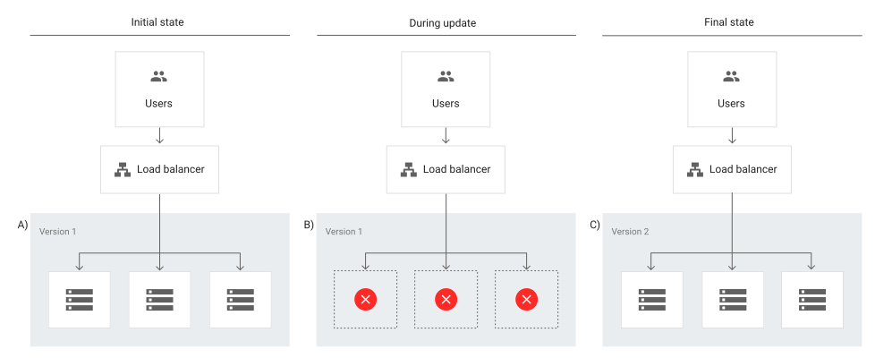
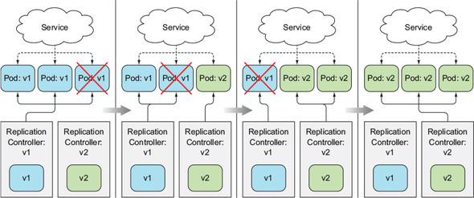
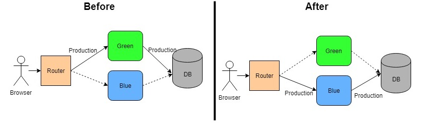
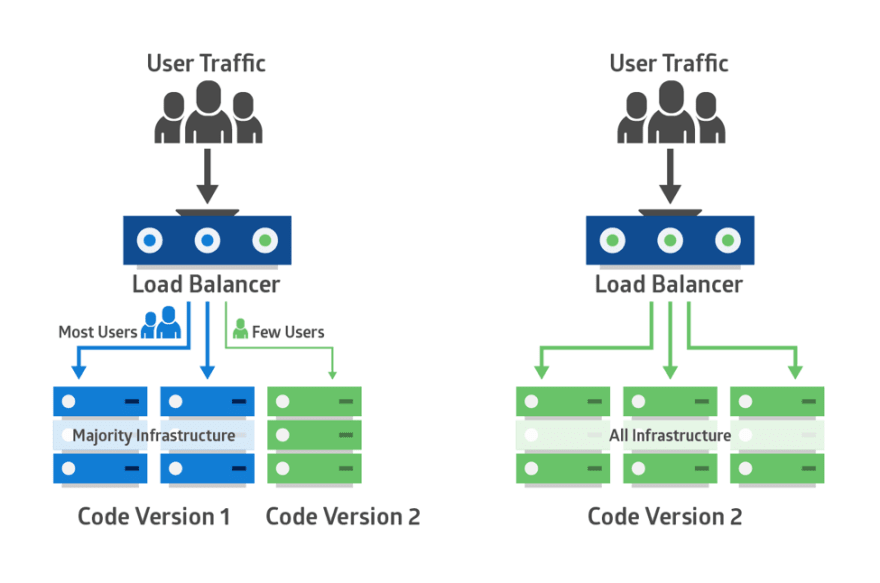
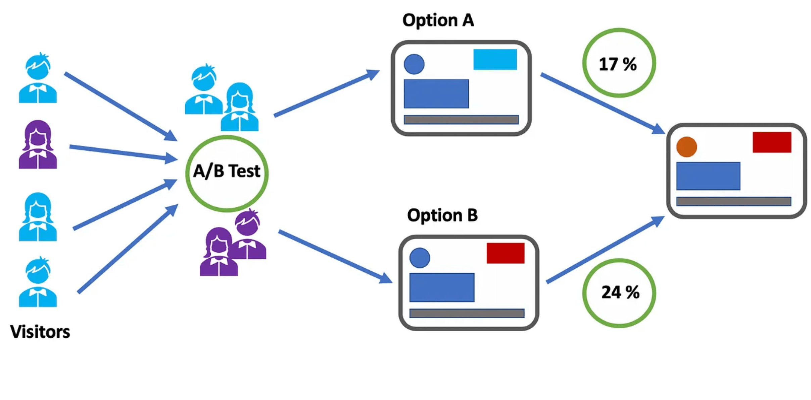

# Kubernetes Deployment

## Introduction

Modern software teams deploy new versions of applications faster than ever, making reliability during deployments critical. Customers are quick to leave if they encounter issues – according to research, 32% of customers will abandon a liked company after a single bad experience. To maintain uptime and trust, Kubernetes provides multiple deployment strategies that balance rollout velocity against the risk of failure.

The significance of this choice is not theoretical. In October 2021, Facebook suffered a global outage that lasted over 6 hours. The root cause was a faulty configuration update to backbone routers. Although this was not strictly a Kubernetes workload, the event highlighted the consequences of deploying changes across all infrastructure at once without staging, traffic segmentation, or rollback mechanisms. Billions of users were unable to access Facebook, Instagram, or WhatsApp, and the company lost an estimated $100 million in revenue, with broader reputational damage.

By contrast, Google deploys thousands of production changes per day using progressive delivery techniques. A 2021 post by the Waze team (a Google subsidiary) described how automated canary analysis across over 1000 pipelines allowed them to catch performance regressions in less than 10 minutes, before they reached general users. This approach reduced incident rates and enabled daily deployments of backend and frontend services across a global user base.

At Abstract Machines, SuperMQ processes millions of messages per second across distributed environments. Every deployment has the potential to impact throughput, latency, delivery guarantees, or integration behavior across thousands of connected clients. To reduce risk and maintain platform stability during continuous delivery, we evaluated all major Kubernetes deployment strategies — including Recreate, Rolling Update, Blue/Green, Canary, Shadow, and A/B Testing. This post outlines the operational characteristics of each approach and explains why we selected A/B Testing as the default deployment strategy for SuperMQ’s control plane and user-facing services.

## Kubernetes Deployment Strategies

### 1. Recreate

The **Recreate** deployment strategy in Kubernetes involves terminating all existing pods in a deployment before launching the new version. It is a **stop-then-start** model. During the window between shutdown and readiness of new pods, the application is entirely unavailable.

This strategy is supported natively in Kubernetes by configuring the `strategy.type` field in a Deployment object to `"Recreate"`.

#### Operational Impact in Real-Time Systems

In a stateless web application, this momentary downtime may be acceptable under controlled conditions. In **real-time, stateful, or latency-sensitive systems like SuperMQ**, the impact is more severe:

- All live connections to broker nodes are dropped
- Message queues are interrupted mid-delivery
- Client retries increase dramatically, causing backlog and pressure on the queue
- Monitoring systems register false-positive alerts complicating triage

If even a few seconds of downtime violate SLAs or message integrity contracts, this strategy is unsuitable.

Recreate is mostly used in early-stage development, CI testing, or non-critical workloads. According to a **2023 CNCF deployment report**, fewer than **7% of production workloads** in surveyed organizations used recreate as a deployment strategy. Additionally, Google’s SRE book advises avoiding deployment patterns that require full application downtime, especially in distributed systems with external dependencies.

#### Performance Characteristics of Recreate

A 2022 Kubernetes deployment benchmark by Codefresh evaluated the time-to-recovery and user impact of five strategies under failure conditions. Recreate had the **highest Mean Time to Recovery (MTTR)** due to the complete shutdown of all pods:

| Strategy      | Average Downtime (seconds) | MTTR (seconds) | Error Rate During Deployment (%) |
| ------------- | -------------------------- | -------------- | -------------------------------- |
| Recreate      | 11.6                       | 16.3           | 100%                             |
| RollingUpdate | 1.8                        | 3.0            | 8–15%                            |
| Blue/Green    | 0.7                        | 1.2            | 0%                               |
| Canary        | 0.5                        | 1.0            | Less than 5% (canary only)       |

The 100% error rate in Recreate is expected — during deployment, the service endpoint becomes completely unreachable. In SuperMQ, this means all connected clients — whether using **MQTT, WebSocket, or HTTP APIs** — experience **connection timeouts**, **subscription drops**, and **unacknowledged message failures**. Since SuperMQ handles continuous message streams across thousands of persistent sessions, this interruption can trigger downstream retries, duplicate delivery attempts, or failed handshakes with device clients.

Recreate provides **no rollback window**. If a new version fails, the previous version must be manually redeployed from scratch. If the container image has already been garbage collected or configuration mismatches arise, recovery may take additional time.

The strategy also assumes the application supports zero-state startup - meaning it can be safely restarted with no in-memory state, active socket sessions, or attached ephemeral volumes. In SuperMQ, which is built on NATS-based messaging infrastructure, this assumption does not hold. NATS JetStream provides message persistence, stream ordering, and durable consumer state, all of which require coordinated state recovery during pod restarts. When a Recreate deployment is triggered, all active connections and in-flight state are lost simultaneously. This includes unacknowledged messages, durable stream offsets, and delivery guarantees managed through NATS’s at-least-once semantics.

During the restart window, consumer group leadership must be reassigned, stream replicas re-elected, and JetStream metadata resynchronized across the SuperMQ cluster. If this process is interrupted or rushed, clients may experience out-of-order message delivery, missed acknowledgments, or dropped sessions - all of which compromise SuperMQ’s platform guarantees around delivery integrity and continuity. Because Recreate does not permit a phased switchover, the risks apply to every tenant and queue simultaneously, making the approach operationally unsafe for SuperMQ’s deployment model.

| Attribute           | Recreate                                    |
| ------------------- | ------------------------------------------- |
| Downtime            | 100% during rollout                         |
| Resource Overhead   | Minimal                                     |
| Rollback Time       | Slow – redeployment needed                  |
| Observability       | Low                                         |
| Version Coexistence | No                                          |
| Suitability         | Limited to dev/test or pre-approved outages |
| Industry Adoption   | Less than 7% of prod workloads (CNCF, 2023) |

---

### 2. Rolling Update

The **Rolling Update** strategy incrementally replaces old pods with new ones while keeping the application available. Kubernetes’s default behavior is a rolling update, controlled by `maxUnavailable` (pods allowed to be down) and `maxSurge` (extra pods allowed above the desired count) in the Deployment spec. This gradual rollout ensures that the application remains **available to users during the update**, maintaining uninterrupted service. In practice, a rolling deployment achieves near zero downtime by routing traffic to remaining instances as pods update one-by-one.

In **real-time or stateful systems like SuperMQ**, rolling updates avoid a full outage but still pose challenges. Because pods update sequentially (or in small batches), only a portion of clients are disrupted at any given time. However, each pod restart triggers **localized impact** including:

- **Partial Connection Drops:** When a broker pod is terminated for update, all clients connected to that node are disconnected. These clients will attempt to reconnect to other pods, causing a brief spike in reconnection traffic. Unlike the Recreate strategy, other SuperMQ pods continue to serve clients, so **most users experience only a brief blip** rather than total downtime.
- **In-Flight Message Rerouting:** SuperMQ’s message queues (backed by NATS JetStream) remain live on the remaining pods. If the updating pod was a leader for certain message streams, those streams fail over to a replica on another pod. During failover, in-flight messages for that stream pause momentarily and may be reprocessed once a new leader is elected, possibly causing **duplicate deliveries** under at-least-once semantics.
- **Version Skew Risks:** During the rollout, the cluster runs a mix of old and new SuperMQ versions. If the new version introduced any **protocol or data format changes** that the old version doesn’t understand, it can break broker-to-broker communication or client interactions in subtle ways. For example, an increase in a heartbeat timeout or a change in message encoding could lead older pods to misinterpret or drop connections with newer pods. This version skew can result in **partial outages** – e.g., certain topics or features malfunction until all pods are upgraded.
- **Gradual Load Redistribution:** As each pod is taken down and replaced, SuperMQ temporarily runs with reduced capacity (unless `maxSurge` adds extra pods). The remaining pods handle additional load, which can lead to **slight latency spikes** or throughput reduction during each update step. Clients connected to a restarted pod may experience a few seconds of delay before resuming on a new connection. Monitoring systems will see a series of small blips (in error rates or latency) rather than a single large outage. This can complicate alerting – the deployment might not trigger a full alarm, yet a sequence of minor issues still impacts the user experience.

Rolling updates are by far the most widely used Kubernetes deployment strategy in production. They are suitable for most stateless services and microservices because they require no downtime while offering a straightforward rollout process. In fact, many surveys indicate that a majority of Kubernetes workloads (>80%) use rolling updates as the default. The popularity of rolling updates comes from their balance of **availability and simplicity** – they are built into the Deployment controller and require minimal setup.

However, rolling deployments work well only if **backward compatibility** is maintained. For instance, any schema or protocol change should be done in a **two-phase** manner (deploying a version that can read both old and new formats, then a version that activates writing the new format). This ensures that during a rolling update, no data is produced that the still-running old pods can’t understand, preventing the kind of partial outages or rollback failures that naive rolling updates could cause. According to an AWS report on deployment safety, the most common cause of rolling update failures was incompatible changes introduced mid-rollout, such as a new version writing data that older versions can’t parse.

Rolling updates lack the explicit stage gating of canary or blue/green deployments, so issues can “sneak in” gradually. Operators should use **observability tools** (logs, metrics, tracing) to watch for error spikes or performance regressions as each batch of pods updates. If a problem is detected, Kubernetes allows the rollout to be **paused** or rolled back quickly. In fact, one advantage of rolling updates is that they are relatively easy to abort and reverse: since the previous ReplicaSet of pods is still around until the deployment completes, a rollback can simply scale it back up, reverting traffic to the stable version.

That said, the default rolling update has limited fine-grained control. Kubernetes will progress the update automatically once started, and cannot, for example, automatically shift traffic percentages or perform advanced analysis of the new version’s health (beyond basic readiness probes).

#### Performance Characteristics of Rolling Update

Benchmark comparisons show that rolling updates dramatically reduce user impact relative to a Recreate deployment. In a 2022 Kubernetes deployment benchmark (simulating various failure conditions), rolling updates achieved an **average downtime of under 2 seconds** and an error rate in the single digits (%) during the upgrade window, versus \~12 seconds downtime and a 100% error rate for Recreate. This is because at any given time, the vast majority of pods in a rolling update remain serving traffic. Only a small fraction of requests or connections encounter errors – for example, those unlucky users connected to or served by the pod that is restarting at that moment. In SuperMQ’s context, instead of all clients timing out as in Recreate, perhaps 10–20% of clients (proportionate to one pod’s share in the cluster) experience a brief reconnection. Those clients might see a one-time message resend or a second of publish delay, whereas the other 80–90% continue normally. The **overall error rate** during the deployment is thus much lower, and **throughput** remains close to normal aside from minor dips with each pod replacement.

Crucially, rolling updates also improve **Mean Time to Recovery (MTTR)** when things go wrong. If a new SuperMQ release has a critical bug, operators can quickly roll back to the previous ReplicaSet (often within a few seconds to a minute) because the old pods can be brought back without redeploying from scratch. Kubernetes keeps the prior pod template in history, enabling fast reversions. By contrast, with Recreate, a failed update means the team must scramble to redeploy the old version entirely, prolonging the outage. This quick rollback ability is one reason rolling deployments are considered **less risky** than all-at-once deploys.

From an observability standpoint, rolling updates produce more complex metrics patterns. Instead of a single outage spike, the system may show a **stair-step pattern** in metrics: e.g., a series of small error spikes or latency increases corresponding to each updated pod. For SuperMQ, internal metrics might show that each broker restart causes, say, a 2% increase in client reconnects and a transient queue backlog, which then recovers, only for another pod to restart and repeat the pattern. Careful tuning of deployment pace (perhaps updating one pod at a time and waiting for full recovery before the next) can smooth these effects. Techniques like **PodDisruptionBudgets** can ensure that not too many pods are down simultaneously, protecting overall service quality.

| Attribute               | Rolling Update                                                                                            |
| ----------------------- | --------------------------------------------------------------------------------------------------------- |
| **Downtime**            | None to low – service stays up throughout                                                                 |
| **Resource Overhead**   | Low to moderate – can use surge pods for capacity                                                         |
| **Rollback Time**       | Fast – can quickly revert using old ReplicaSet                                                            |
| **Observability**       | Moderate – issues are granular; need monitoring to catch partial failures                                 |
| **Version Coexistence** | Yes – old and new run simultaneously during rollout                                                       |
| **Suitability**         | Ideal for stateless or backward-compatible updates; use with caution for tightly coupled or stateful apps |
| **Industry Adoption**   | Very high – default strategy for most Kubernetes deployments                                              |

---

### 3. Blue/Green

The **Blue/Green** deployment strategy involves provisioning a **parallel production environment** (Green) that runs the new application version, while the existing environment (Blue) continues to serve users. Once the new version is verified - through automated tests, synthetic monitoring, or shadow traffic - live traffic is switched from Blue to Green, typically at the load balancer or ingress level. If issues arise post-switch, rollback is instantaneous by redirecting traffic back to Blue. This results in **zero downtime** for users and a **fast recovery window** if something goes wrong.

In Kubernetes, Blue/Green deployments can be implemented using separate Deployments, namespaces, or even clusters, with traffic switching managed via:

- Service selectors
- Ingress controller routing (e.g., NGINX or Istio VirtualServices)
- External load balancers (e.g., AWS ALB, GCP Load Balancer)

Unlike Rolling Update, where pods of different versions co-exist during rollout, Blue/Green **preserves version isolation** until the cutover moment. This guarantees that all live traffic is served by a single version at any time, simplifying debugging and ensuring clean version boundaries.

#### Operational Considerations in Real-Time Systems like SuperMQ

At first glance, Blue/Green appears ideal for real-time platforms like **SuperMQ**, where uptime guarantees are strict, and rollback speed is critical. However, this strategy carries **hidden complexities** for distributed, stateful systems:

##### 1. **Double Resource Footprint**

Blue/Green demands that the Green environment be fully provisioned and running before cutover - this includes broker pods, stream processors, sidecars, volumes, load balancers, and stateful infrastructure like NATS JetStream nodes. For SuperMQ clusters, which may span dozens of brokers and terabytes of message state, this effectively **doubles compute and storage costs** during deployment. While feasible for small clusters or during low-traffic windows, this overhead is **prohibitively expensive at scale**.

##### 2. **State Synchronization Challenges**

SuperMQ relies on **durable stream state, replicated across broker nodes** via NATS JetStream. Unlike stateless apps, spinning up an isolated Green environment cannot proceed without addressing:

- **Stream migration**: Message offsets, delivery guarantees, and consumer acks must be replicated or synchronized from Blue to Green.
- **Leadership reassignment**: Stream leaders in Blue cannot automatically transfer roles to Green brokers unless explicitly coordinated.
- **Metadata consistency**: Durable consumer configurations, subject subscriptions, and JetStream cluster metadata must remain synchronized across both environments.

Attempting Blue/Green deployment without solving these challenges risks data loss, **split-brain JetStream clusters**, or **duplicate message delivery**.

##### 3. **Connection Stickiness and Client Drift**

Clients in SuperMQ maintain **long-lived connections** (MQTT, WebSocket, etc.) with brokers. Even if ingress traffic is cut over to Green, existing connections may **linger on Blue**, causing message routing inconsistencies. In worst-case scenarios:

- A client connects to Green while a consumer is still connected to Blue
- Messages published never reach subscribers (due to topic isolation between versions)
- Sessions resume incorrectly due to mismatched state

Solving this requires forcibly **draining connections** from Blue (via graceful shutdown or eviction), or implementing **connection-aware routing**, which adds operational complexity.

##### 4. **No Live Observability Until Cutover**

Since Green doesn’t handle production traffic until the switch, its performance under real-world load is unknown. Any issues - memory leaks, queue overload, TLS handshake failures - only become visible **after** the switchover. In contrast, Rolling or Canary strategies offer **progressive exposure**, letting operators detect anomalies gradually. For a latency-sensitive system like SuperMQ, this lack of **live smoke-testing** introduces deployment risk.

##### 5. **Rollback Is Fast, But Not Always Safe**

In theory, rollback is as simple as redirecting traffic to Blue. However, **state drift** may have occurred:

- A Green broker may have advanced stream offsets or acknowledged messages that Blue has not seen
- If clients reconnected to Green, they may lose session state when dropped back to Blue
- In-flight messages or delivery guarantees may be violated unless cross-version state merging is handled correctly

Thus, while rollback is fast, it must be planned with **state reconciliation mechanisms** in mind.

#### Benchmark and Performance Characteristics

In the 2022 Codefresh benchmark (under simulated user load), Blue/Green deployments achieved:

| Metric                    | Blue/Green Value |
| ------------------------- | ---------------- |
| **Average Downtime**      | 0.7 seconds      |
| **Mean Time to Recovery** | 1.2 seconds      |
| **Deployment Error Rate** | 0%               |

The 0% error rate is due to the **all-or-nothing switch** - traffic remains on Blue until Green is validated, and there’s no partial exposure. Downtime is measured only during the DNS or load balancer update (\~subsecond for L4 switches, longer for DNS-based routing). Evidently, Blue/Green deployment provides **strong safety guarantees and clean rollback paths** but comes at the cost of infrastructure overhead and complexity - especially for **stateful, high-throughput systems like SuperMQ**. While valuable for major upgrade paths or one-time migrations, it is less suitable for frequent iteration unless supported by robust **state synchronization and connection draining** mechanisms. For day-to-day operations, **Rolling Update** strikes a better balance of safety, cost, and simplicity.

| Attribute               | Blue/Green                                                                 |
| ----------------------- | -------------------------------------------------------------------------- |
| **Downtime**            | None (cutover is instantaneous)                                            |
| **Resource Overhead**   | High – duplicates entire production stack temporarily                      |
| **Rollback Time**       | Instant – revert routing                                                   |
| **Observability**       | Low before cutover; high post-switch                                       |
| **Version Coexistence** | No – traffic fully switches from Blue to Green                             |
| **Suitability**         | Ideal for large, state-breaking upgrades; overkill for routine deployments |
| **Industry Adoption**   | Moderate – popular in fintech, health, and critical upgrade scenarios      |

---

### 4. Canary

A **Canary** deployment introduces the new application version to a **small subset of production traffic**, allowing real users to interact with the new code before a full rollout. If no regressions are observed, the canary share is progressively increased until the new version handles all traffic. If errors are detected, the deployment can be aborted and traffic quickly reverted to the stable version.

Kubernetes does **not natively support traffic shaping or request-level routing**. While Deployment objects can incrementally increase pod counts, they do not control **which users or requests hit which version**. To implement true canary behavior - where only X% of traffic reaches the new version - external tooling is required:

- **Service meshes** like **Istio**, **Linkerd**, or **Kuma**, which allow L7 traffic splitting via routing rules.
- **Progressive delivery tools** like **Flagger**, which automate rollout progression based on live telemetry.
- **Ingress controllers** that support weighted backends (e.g., **NGINX**, **AWS ALB**).

At its core, a Canary deployment aims to **de-risk changes** by exposing them to production workloads in **small, monitored increments**. Unlike Blue/Green, which switches environments wholesale, Canary lets teams observe **how the new version behaves in the wild**, gradually building confidence before full adoption.

#### Canary in Real-Time Systems like SuperMQ

Canary deployment is appealing for **latency-sensitive or user-critical platforms** like **SuperMQ**, because it offers **fine-grained control**, real-world validation, and **fast rollback**. However, it also introduces significant **complexity for stateful or streaming systems**, especially when **version coexistence** impacts protocol behavior, message delivery guarantees, or state replication.

Let’s examine the major considerations for SuperMQ:

##### 1. **Fine-Grained Exposure with Real Telemetry**

Canary allows SuperMQ to push a new broker or gateway version to, say, 5% of clients. This provides **real feedback under production conditions** - actual device types, edge latency, malformed packets, throughput anomalies, and so on. Logs, traces, and metrics from the canary version can reveal:

- TLS handshake issues with legacy clients
- Topic-level performance regressions
- Memory leaks or goroutine buildup under load
- Schema compatibility issues (e.g., client sends JSON with new fields that old backend mishandles)

This is **invaluable** for validating non-functional aspects (performance, stability, observability) that **staging cannot reliably replicate**.

##### 2. **State and Protocol Skew Risks**

However, in SuperMQ’s case, the message broker is a **strongly stateful system**:

- Clients maintain **persistent sessions** (MQTT, WS) with specific broker pods.
- Topics are **sharded across stream leaders** via NATS JetStream.
- Streams use **durable offsets**, and messages carry delivery guarantees (e.g., at-least-once).

If only a portion of pods run the new version:

- Some topics may behave differently (e.g., timeout behavior, ack handling)
- Stream metadata may **desynchronize** between old and new brokers
- Client reconnections may switch versions unexpectedly, resulting in **in-flight message duplication or loss**

Unless full **wire protocol compatibility** and **idempotent session state handling** are enforced, canary brokers must be carefully siloed - e.g., routing only HTTP or REST API traffic to canaries, while leaving broker traffic untouched.

##### 3. **Workload Selection and Traffic Routing**

A well-designed canary requires **traffic segmentation**:

- Which tenants? (high-volume vs low-risk?)
- Which protocols? (only HTTP? or include MQTT?)
- Which regions? (try in a low-load region first?)

Without proper segmentation, **user experience variance** can compromise the test. A skewed cohort (e.g., low activity, all internal users) yields false positives. Conversely, a bad canary configuration - e.g., routing an entire VIP customer workload to the new version - risks **uncontained impact**.

Tools like **Flagger** mitigate this by analyzing **SLIs** (e.g., request latency, error rate, CPU usage) and automatically rolling forward or back based on thresholds. However, they must be tuned to avoid **false alarms**. According to a 2021 study by Google’s CRE team, automated canary analysis triggered **spurious rollbacks in 19%** of cases due to noisy telemetry or small cohort size.

##### 4. **Rollback and Recovery**

Rollback is fast in canary mode — typically just **rerouting traffic to the stable version** and scaling down the canary pod set. However, if **state divergence** has occurred, rollback must include:

- Stream failover (if leadership was transferred)
- Session cleanup
- Reverting any new telemetry pipelines or schema changes

Unlike Blue/Green, which maintains complete version isolation, Canary allows **bidirectional leakage** - e.g., metrics, telemetry, or partial configuration drift. Cleanup is required post-rollback to restore system uniformity.

##### 5. **Deployment Complexity**

From a DevOps standpoint, canary is the **most operationally complex** strategy:

- Requires observability integration (Grafana, Prometheus, etc.)
- Requires traffic routing (via service mesh or ingress rules)
- Requires rollout controllers (e.g., Flagger) to automate decision-making

These layers increase the **blast radius if misconfigured**. A faulty traffic-splitting rule can route all traffic to the canary unintentionally. A missing SLI can allow bad versions to proceed undetected.

Nonetheless, with correct setup, Canary is the **most precise and data-driven** way to deploy new versions - particularly for:

- Experimenting with broker optimizations
- Validating schema migrations
- Incrementally adopting new observability layers

#### Performance Characteristics of Canary Deployment

In a 2022 Kubernetes deployment benchmark, Canary deployments had **lowest error rates** and **shortest MTTR** among all strategies:

| Strategy      | Average Downtime (seconds) | MTTR (seconds) | Error Rate During Deployment (%)        |
| ------------- | -------------------------- | -------------- | --------------------------------        |
| Recreate      | 11.6                       | 16.3           | 100%                                    |
| RollingUpdate | 1.8                        | 3.0            | 8–15%                                   |
| Blue/Green    | 0.7                        | 1.2            | 0%                                      |
| **Canary**    | **0.5**                    | **1.0**        | **less than5% (canary traffic only)**   |

This result is expected. Since only a **small slice of traffic** hits the new version, the **overall system error rate remains negligible**. Rollbacks are fast because only a minor subset of pods (or traffic) needs to be shut down. In SuperMQ, this translates to **low client impact** if the canary is isolated to APIs or secondary workloads. However, error detection is **delayed** - problems only emerge once canary traffic scales up. And unless monitored properly, **small anomalies in early stages can go unnoticed**.

| Attribute               | Canary                                                                               |
| ----------------------- | ------------------------------------------------------------------------------------ |
| **Downtime**            | None – gradual exposure protects users                                               |
| **Resource Overhead**   | Moderate – runs two versions in tandem                                               |
| **Rollback Time**       | Fast – reroute traffic, scale down canary                                            |
| **Observability**       | High – real user telemetry from live traffic                                         |
| **Version Coexistence** | Yes – different versions run concurrently                                            |
| **Suitability**         | Ideal for gradual rollouts of APIs or stateless services; risky for stateful brokers |
| **Industry Adoption**   | Moderate to high – especially in fintech, e-commerce, cloud platforms                |

### 5. Shadow Deployment

**Shadow deployments** (also called **mirrored traffic deployments**) allow teams to test a new version of the application by mirroring real production traffic to it - **without exposing the responses to users**. The shadowed service processes the same input as the live version but its output is discarded. This approach is especially effective for **load testing**, **behavioral regression analysis**, and **performance profiling** under production-scale traffic, without user risk.

Shadow deployments are **read-only by design**: the shadow version must not produce side effects. In Kubernetes, shadowing is not natively supported and typically requires:

- **Ingress controller support** (e.g., NGINX Ingress with `mirror` module)
- **Service mesh features** (e.g., Istio’s `mirrorPercentage`)
- **Custom proxy layers** or API gateways that fork incoming traffic

Shadow deployments offer several strategic benefits in production environments:

1. **Performance Benchmarking**: New service versions can be subjected to **live production traffic volumes**, including real request patterns, concurrency levels, and edge-case payloads. This enables accurate assessment of **CPU usage, memory consumption, I/O behavior**, and latency under realistic load conditions.

2. **Compatibility Validation**: Shadowing allows for testing **backward compatibility** with existing protocols or client expectations. Connection flows, negotiation sequences, and response handling logic can be evaluated without disrupting live traffic.

3. **Regression Detection**: By comparing logs, metrics, and behavioral outputs of the shadow version against the live system, teams can identify **functional regressions**, **timing inconsistencies**, or **unexpected side effects** prior to rollout.

However, shadow deployments introduce several technical challenges:

- **Resource Duplication**: The shadow service must run a **fully functional replica** of the production stack — including processing engines, persistence layers, and observability components. This often **doubles the load** on ingress routers, message pipelines, or traffic forwarding layers during testing.

- **Storage and Memory Load**: Even if response data is discarded, the shadow version still **processes incoming requests**, which can incur significant memory usage and storage pressure if buffering, caching, or stateful processing is involved.

- **Unintended Side Effects**: If not properly isolated, the shadow service may still **interact with shared systems** — such as logging pipelines, metrics sinks, or downstream databases — inadvertently introducing **data duplication or contamination**.

- **Idempotency and Isolation**: When dealing with **stateful behavior** — such as session persistence, message acknowledgments, or write operations — the shadow version must simulate full functionality **without altering real system state**. Ensuring this behavior requires careful sandboxing and strict idempotency guarantees.

The table below outlines practical scenarios where shadow deployments are beneficial, as well as situations where they should be avoided. While shadowing enables high-fidelity validation under live traffic conditions, it is only effective when the mirrored system can remain isolated and side-effect free. These considerations help teams determine whether the additional infrastructure cost and complexity are justified for a given deployment.

| Suitable Scenarios                                        | Avoid When...                                               |
| --------------------------------------------------------- | ----------------------------------------------------------- |
| Validating performance of new broker core under real load | System performs side effects on incoming messages           |
| Checking compatibility with diverse client behaviors      | Session or message state cannot be cleanly sandboxed        |
| Testing edge-case latency, jitter, and retry behaviors    | System lacks capacity to double broker and stream footprint |
| Simulating telemetry pipelines (e.g., new trace exporter) | Lack of mirror support in ingress or mesh                   |

This table summarizes the core attributes of the shadow deployment strategy. Unlike other strategies, shadowing does not directly impact user experience, but it imposes significant resource and observability demands. It is especially well-suited for testing high-risk changes in systems that can safely mirror and process production traffic without producing external effects. The table also contextualizes its current level of adoption across industry-grade platforms.

| Attribute               | Shadow                                                             |
| ----------------------- | ------------------------------------------------------------------ |
| **Downtime**            | None – does not affect live traffic                                |
| **Resource Overhead**   | High – full duplication of request processing                      |
| **Rollback Time**       | Not applicable – output is never promoted                          |
| **Observability**       | High – captures system performance under real traffic              |
| **Version Coexistence** | Yes – shadow version runs silently alongside production            |
| **Suitability**         | Ideal for dry-run testing of risky changes without user exposure   |
| **Industry Adoption**   | Moderate – used by Netflix, Uber, others for scale/load validation |

While shadow deployments offer strong validation benefits, they are **not ideal for SuperMQ’s core messaging plane** due to the platform’s tightly coupled stateful behavior and connection persistence model. Mirroring live traffic in SuperMQ implies duplicating broker nodes, stream replication engines, and session-aware message flows - all of which consume significant memory, storage, and network bandwidth. Moreover, any misconfiguration in sandboxing risks side effects such as duplicate telemetry, corrupted session state, or unintended interactions with durable queues. These challenges make shadowing impractical for continuous delivery in SuperMQ’s production brokers, and limit its use to short-term, controlled evaluations of non-critical components.

---

### 6. A/B Testing

**A/B testing** is a deployment strategy designed not just to validate the safety of a release, but to measure whether that release delivers meaningful improvement. Unlike canary deployments, which answer the question "Can we deploy this safely?", A/B testing focuses on the more strategic question: **"Should we deploy this at all?"**. As such, A/B testing involves comparing two versions of an application to see which performs better, where versions A and B are presented to users at random. For performance-critical platforms like SuperMQ, where optimization is the product, this distinction is essential. Statistical analysis of the results determines which version, A or B, performs better based on predefined indicators.

SuperMQ uses A/B testing extensively across its stateless, user-facing services: API gateways, authentication flows, telemetry APIs, and administrative dashboards. These components are ideal for experimentation because they can be isolated from the stateful broker infrastructure that underpins core messaging guarantees.

To implement A/B testing in production, SuperMQ leverages **Argo Rollouts** integrated with its Helm-based Kubernetes deployment pipeline. Argo enables declarative traffic control, metric-based analysis, and versioned deployment graphs. More importantly, SuperMQ couples Argo with domain-aware routing via service mesh logic. Rather than using random percentage splits, traffic is segmented deterministically by tenant metadata - such as Domain ID or headers - ensuring that each tenant consistently interacts with only one version during the experiment window.

This tenant-aware routing is crucial for our SaaS platform:

- Scoped Risk: An experiment is limited to specific, often consenting, tenants (e.g., those in a beta program). This prevents a potentially suboptimal variant from affecting our entire customer base.
- Clean Data: By routing an entire tenant's traffic to one version, we avoid inconsistent user experiences and gather clean, isolated metrics for that cohort, leading to more reliable statistical analysis.
- Alignment with SaaS Model: This approach respects tenant isolation boundaries and allows us to test features or performance tiers relevant to specific customer segments.

The benefits of A/B testing extend far beyond the release pipeline. By requiring every experiment to prove its value through data, it becomes a primary defense against performance regressions and premature feature rollouts. It supports unit economics optimization by enabling measurement of how architectural changes - such as new encodings or memory strategies - affect cloud spend. It also encourages product innovation, allowing bold ideas to be deployed safely to a small subset of users and refined through iteration. Finally, A/B testing **decouples deployment from release**. New code can be shipped to infrastructure at any time but activated only when data justifies it.

While A/B testing requires a mature observability stack and careful experimental design, its ability to validate the business and performance impact of changes makes it an indispensable strategy for a high-stakes platform like SuperMQ. It ensures that every change we deploy not only works but makes the product quantifiably better.

#### A/B Testing Deployment Attributes

| Attribute               | A/B Testing                                                                 |
| ----------------------- | --------------------------------------------------------------------------- |
| **Downtime**            | None – both versions are fully live and independently routed                |
| **Resource Overhead**   | Moderate – requires dual deployments and expanded monitoring infrastructure |
| **Rollback Time**       | Instant – revert routing or disable feature flags                           |
| **Observability**       | High – depends on detailed metrics, tracing, and cohort isolation           |
| **Version Coexistence** | Yes – parallel versions run concurrently for analysis                       |
| **Suitability**         | Ideal for validating performance optimizations and tenant-specific features |
| **Industry Adoption**   | High – common in SaaS, e-commerce, and experimentation-first environments   |
