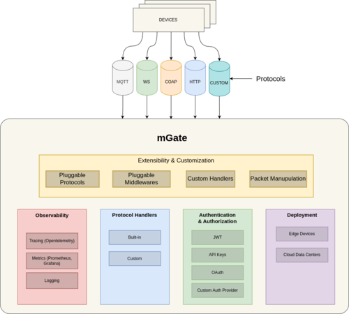
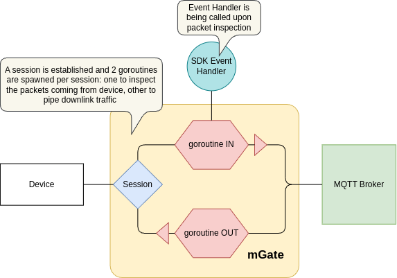
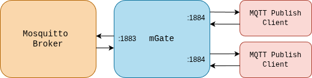

# mGate

## Summary

This blog post introduces mGate, a lightweight, scalable, and customizable IoT API gateway designed to streamline communication across multiple protocols like MQTT, HTTP, and WebSocket. We'll explore mGate's key features, including its real-time packet manipulation, pluggable authentication mechanisms, and comprehensive observability tools. A practical demo showcases mGate's power in a real-world scenario, demonstrating how it integrates with an MQTT broker to provide protocol-agnostic authentication and authorization, ultimately simplifying IoT architecture and enhancing security.

## Introduction

Imagine having a single point of entry for all client requests to backend services and being able to handle authentication, authorization and request transformation over multiple protocols. This can help you in your quest to build scalable, high performance and fault tolerant architecture. Enter mGate!

mGate is a lightweight, scalable, and customizable IoT API gateway designed to support seamless communication across multiple protocols. It enables real-time packet manipulation, features pluggable authentication mechanisms, and offers observability for monitoring and troubleshooting. Built for flexibility, mGate can be deployed as a sidecar or standalone service and can also function as a library for easy integration into applications.

The extensible nature of mGate allows developers to customize it to fit various IoT ecosystems, ensuring optimal performance and security.

## Features

Some of the key features of mGate are highlighted below:



### Multi-Protocol Support

mGate is built to interface with a wide range of IoT protocols, including:

- MQTT
- HTTP
- WebSocket

It is easily extendable to support additional protocols with progress on way to support the CoAP protocol.

### On-the-Fly Packet Manipulation

With mGate you are able to perform real-time packet transformation and processing. Custom logic or package interceptors can be injected for modifying incoming and outgoing messages.

### Authentication and Authorization

Mgate also features a pluggable authentication system supporting different providers like OAuth, JWT, API Keys, and more. It also provides access control for fine-grained resource authorization. There are easily replaceable auth modules for integration with custom or enterprise identity systems.

### Observability

mGate provides real-time metrics for monitoring system health and performance. It offers logging and tracing to facilitate troubleshooting and optimization and options to easily integrate with Prometheus, Grafana, and OpenTelemetry for detailed tracing and visualization.

### Scalable Architecture

mGate is designed to scale horizontally, ensuring it can handle high-throughput environments.

### Pluggable and Extensible

The Core components of mGate are modular, making it easy to plug in custom modules or replace existing ones. It is extendable to add new IoT protocols, middleware, and features as needed.

### Customizable

mGate is highly configurable, allowing adjustment of protocol-specific behaviors, observability, and performance optimizations. Minimal configuration is required for default deployment but supports deep customization.

### Lightweight

Built with Go programming language, mGate is optimized for low resource usage, making it suitable for both high-performance data centers and resource-constrained IoT edge devices.

### Deployment Flexibility

mGate can be deployed as a sidecar to enhance existing microservices or as a standalone service for direct IoT device interaction. It is available as a library for integration into existing applications.

## Architecture

mGate starts protocol servers, offering connections to devices. Upon the connection, it establishes a session with a remote protocol server. It then pipes packets from devices to the protocol server, inspecting or modifying them as they flow through the proxy.

The can be procedurally described as:

1. The Device connects to mGate's server
2. mGate accepts the inbound (IN) connection and establishes a new session with the remote server (e.g. it dials out to the MQTT broker only once it accepts a new connection from a device. This way one device-mGate connection corresponds to one mGate-MQTT broker connection.)
3. mGate then spawns 2 goroutines: one that will read incoming packets from the device-mGate socket (INBOUND or UPLINK), inspect them (calling event handlers) and write them to mGate-server socket (forwarding them towards the server) and other that will be reading server responses from mGate-server socket and writing them towards device, in device-mGate socket (OUTBOUND or DOWNLINK).

The process flow is shown in the image below:



mGate can parse and understand protocol packages, and upon their detection, it calls external event handlers. mGate specifies the interface for the Event handler as follows:

```golang
// Handler is an interface for mGate hooks
type Handler interface {
    // Authorization on client `CONNECT`
    // Each of the params are passed by reference, so that it can be changed
    AuthConnect(ctx context.Context) error

    // Authorization on client `PUBLISH`
    // Topic is passed by reference, so that it can be modified
    AuthPublish(ctx context.Context, topic *string, payload *[]byte) error

    // Authorization on client `SUBSCRIBE`
    // Topics are passed by reference, so that they can be modified
    AuthSubscribe(ctx context.Context, topics *[]string) error

    // After client successfully connected
    Connect(ctx context.Context)

    // After client successfully published
    Publish(ctx context.Context, topic *string, payload *[]byte)

    // After client successfully subscribed
    Subscribe(ctx context.Context, topics *[]string)

    // After client unsubscribed
    Unsubscribe(ctx context.Context, topics *[]string)

    // Disconnect on connection with client lost
    Disconnect(ctx context.Context)
}
```

The Handler interface is inspired by MQTT protocol control packets; if the underlying protocol does not support some of these actions, the implementation can simply omit them. An example of implementation is given [here](https://github.com/absmach/mgate/blob/main/examples/simple/simple.go), alongside with it's main() function

## Use case

What better way to demonstrate the power of mGate than to run a demo for a real world use case for this. The demo is based on how [SuperMQ](https://github.com/absmach/supermq) uses mGate for authorization and authentication. SuperMQ is a distributed, highly scalable, and secure open-source cloud platform for messaging and event-driven architecture (EDA). The platform has its own authentication and authorization system which it uses for clients connecting to it through all supported protocols. To achieve this auth has to be done protocol-agnostic. This is where mGate shines. To show how this works we will walk through a demo using a simple MQTT broker, mGate running in standalone mode and two simple MQTT clients.
The diagram below shows the test setup:



### Requirements

To build this demo we will require the following tools:

- [Golang](https://go.dev/) =>v1.23.0
- [Mosquitto MQTT Server](https://mosquitto.org/download/)
- [Mosquitto Publisher and Subscriber Client](https://mosquitto.org/download/)

### Setting up the broker

We will use the Mosquitto broker as our MQTT broker. For that we can write a simple conf file as below and save it as mgate-test.conf:

```nano=
# mgate-test.conf

# Listen on the default 1883 MQTT port.
listener 1883

# Allow anonymous clients (no username/password required)
# We will use mGate for Auth functionality
allow_anonymous true
```

We can now run the broker with:

```bash=
mosquitto -c mgate-test.conf
```

Where we expect the output to be:

```bash=
$ mosquitto -c mgate-test.conf
1753385733: mosquitto version 2.0.20 starting
1753385733: Config loaded from mgate-test.conf.
1753385733: Opening ipv4 listen socket on port 1883.
1753385733: Opening ipv6 listen socket on port 1883.
1753385733: mosquitto version 2.0.20 running
```

Our broker is successfully set up

### Setting up our MQTT Clients

We will use Mosquitto publish and subscribe tools for this, you can download these tools from [https://mosquitto.org/download/](https://mosquitto.org/download/)

### Setting up our handler

We will set up mGate to run on port 1884 and proxy traffic to our broker on port 1883.
As stated above mGate enable us to customize the handler interface. We will do so to perform authentication for our MQTT clients before messages reach our broker. To do this we will modify the [simple.go](https://github.com/absmach/mgate/blob/main/examples/simple/simple.go) file provided with mGate.

The changes to the file are as follows:

```golang
// Copyright (c) Abstract Machines
// SPDX-License-Identifier: Apache-2.0

package simple

import (
	"context"
	"errors"
	"fmt"
	"log/slog"

	"github.com/absmach/mgate/pkg/session"
)

// Create a simple in memory lookup for user credentials
var authKeys = map[string]string{
	"user1": "1234",
	"user2": "1234",
}

// example authorize function to perform authorization
func authorize(ctx context.Context) error {
	_, ok := session.FromContext(ctx)
	if !ok {
		// Return error if session info not in context
		return fmt.Errorf("Client not initialized")
	}
	return nil
}

var errSessionMissing = errors.New("session is missing")

var _ session.Handler = (*Handler)(nil)

// Handler implements mqtt.Handler interface.
type Handler struct {
	logger *slog.Logger
}

// New creates new Event entity.
func New(logger *slog.Logger) *Handler {
	return &Handler{
		logger: logger,
	}
}

// prior forwarding to the MQTT broker.
func (h *Handler) AuthConnect(ctx context.Context) error {
	// Extract the session holding client username and password from context
	s, ok := session.FromContext(ctx)
	if !ok {
		// Return error if session info not in context
		return fmt.Errorf("Client not initialized")
	}
	// Retrieve pasword for the username
	pass, ok := authKeys[s.Username]
	if !ok {
		// If user not in lookup return error
		return fmt.Errorf("Auth error: user not found.")
	}
	//Check if saved password for user is same as one from look up table.
	if string(s.Password) != pass {
		// Return error if passwords do not much
		return fmt.Errorf("Auth error: user password does not match")
	}
	// Log success and proceed
	return h.logAction(ctx, "AuthConnect", nil, nil)
}

// prior forwarding to the MQTT broker.
func (h *Handler) AuthPublish(ctx context.Context, topic *string, payload *[]byte) error {
	if err := authorize(ctx); err != nil {
		return fmt.Errorf("Auth error: failed to authorize")
	}
	return h.logAction(ctx, "AuthPublish", &[]string{*topic}, payload)
}

// prior forwarding to the MQTT broker.
func (h *Handler) AuthSubscribe(ctx context.Context, topics *[]string) error {
	if err := authorize(ctx); err != nil {
		return fmt.Errorf("Auth error: failed to authorize")
	}
	return h.logAction(ctx, "AuthSubscribe", topics, nil)
}

// Connect - after client successfully connected.
func (h *Handler) Connect(ctx context.Context) error {
	return h.logAction(ctx, "Connect", nil, nil)
}

// Publish - after client successfully published.
func (h *Handler) Publish(ctx context.Context, topic *string, payload *[]byte) error {
	return h.logAction(ctx, "Publish", &[]string{*topic}, payload)
}

// Subscribe - after client successfully subscribed.
func (h *Handler) Subscribe(ctx context.Context, topics *[]string) error {
	return h.logAction(ctx, "Subscribe", topics, nil)
}

// Unsubscribe - after client unsubscribed.
func (h *Handler) Unsubscribe(ctx context.Context, topics *[]string) error {
	return h.logAction(ctx, "Unsubscribe", topics, nil)
}

// Disconnect on connection lost.
func (h *Handler) Disconnect(ctx context.Context) error {
	return h.logAction(ctx, "Disconnect", nil, nil)
}

func (h *Handler) logAction(ctx context.Context, action string, topics *[]string, payload *[]byte) error {
	s, ok := session.FromContext(ctx)
	args := []interface{}{
		slog.Group("session", slog.String("id", s.ID), slog.String("username", s.Username)),
	}
	if s.Cert.Subject.CommonName != "" {
		args = append(args, slog.Group("cert", slog.String("cn", s.Cert.Subject.CommonName)))
	}
	if topics != nil {
		args = append(args, slog.Any("topics", *topics))
	}
	if payload != nil {
		args = append(args, slog.Any("payload", *payload))
	}
	if !ok {
		args = append(args, slog.Any("error", errSessionMissing))
		h.logger.Error(action+"() failed to complete", args...)
		return errSessionMissing
	}
	h.logger.Info(action+"() completed successfully", args...)

	return nil
}
```

The code above:

- creates a simple look up comprising of two users and their hard coded passwords.
- creates an example authorization function that runs on AUthPublish and AuthSubscribe
- creates authentication logic that runs on AuthConnect

With the above we can now securely access the broker through the mGate gateway.
We can test this by saving the changes in the simple.go file and running mGate as below:

```bash=
 $ go run ./cmd/main.go
{"time":"2025-07-24T23:29:32.061974246+03:00","level":"INFO","msg":"MQTT proxy server started at localhost:1884  with no TLS"}
{"time":"2025-07-24T23:29:32.062420567+03:00","level":"INFO","msg":"MQTT proxy server started at localhost:8883  with TLS"}
{"time":"2025-07-24T23:29:32.062899579+03:00","level":"INFO","msg":"MQTT websocket proxy server started at localhost:8083/mgate-ws with no TLS"}
{"time":"2025-07-24T23:29:32.062952288+03:00","level":"INFO","msg":"MQTT proxy server started at localhost:8884  with TLS and RequireAndVerifyClientCert"}
{"time":"2025-07-24T23:29:32.063343226+03:00","level":"INFO","msg":"MQTT websocket proxy server started at localhost:8084/mgate-ws with TLS"}
{"time":"2025-07-24T23:29:32.063956067+03:00","level":"INFO","msg":"MQTT websocket proxy server started at localhost:8085/mgate-ws with TLS and RequireAndVerifyClientCert"}
{"time":"2025-07-24T23:29:32.064003756+03:00","level":"INFO","msg":"HTTP proxy server started at :8086/mgate-http with no TLS"}
{"time":"2025-07-24T23:29:32.064583115+03:00","level":"INFO","msg":"HTTP proxy server started at :8087/mgate-http with TLS"}
{"time":"2025-07-24T23:29:32.065298037+03:00","level":"INFO","msg":"HTTP proxy server started at :8088/mgate-http with TLS and RequireAndVerifyClientCert"}
```

### Testing

To test our setup we will test four scenarios:

#### Succesful publish

We send a message with a known client with the right password like so:

```bash=
$ mosquitto_pub -t /mgate-test -p 1884 -m "Hello, world" -i test-client -u user1 -P 1234 -d
Client test-client sending CONNECT
Client test-client received CONNACK (0)
Client test-client sending PUBLISH (d0, q0, r0, m1, '/mgate-test', ... (12 bytes))
Client test-client sending DISCONNECT
```

and the logs from mGate will show:

```bash=
{"time":"2025-07-24T23:41:18.757565969+03:00","level":"INFO","msg":"Accepted new client"}
{"time":"2025-07-24T23:41:18.757917374+03:00","level":"INFO","msg":"AuthConnect() completed successfully","session":{"id":"test-client","username":"user1"}}
{"time":"2025-07-24T23:41:18.757965694+03:00","level":"INFO","msg":"Connect() completed successfully","session":{"id":"test-client","username":"user1"}}
{"time":"2025-07-24T23:41:18.758157962+03:00","level":"INFO","msg":"AuthPublish() completed successfully","session":{"id":"test-client","username":"user1"},"topics":["/mgate-test"],"payload":"SGVsbG8sIHdvcmxk"}
{"time":"2025-07-24T23:41:18.758185353+03:00","level":"INFO","msg":"Publish() completed successfully","session":{"id":"test-client","username":"user1"},"topics":["/mgate-test"],"payload":"SGVsbG8sIHdvcmxk"}
{"time":"2025-07-24T23:41:18.758224175+03:00","level":"INFO","msg":"Disconnect() completed successfully","session":{"id":"test-client","username":"user1"}}
{"time":"2025-07-24T23:41:18.758229345+03:00","level":"WARN","msg":"EOF"}
```

#### Successful Subscribe

We subscribe to a topic with a known client with the right password like so:

```bash=
$ mosquitto_sub -t /mgate-test -p 1884 -i test-client -u user1 -P 1234 -d
Client test-client sending CONNECT
Client test-client received CONNACK (0)
Client test-client sending SUBSCRIBE (Mid: 1, Topic: /mgate-test, QoS: 0, Options: 0x00)
Client test-client received SUBACK
Subscribed (mid: 1): 0
```

and the logs from mGate will show:

```bash=
{"time":"2025-07-24T23:43:55.821727225+03:00","level":"INFO","msg":"Accepted new client"}
{"time":"2025-07-24T23:43:55.822041811+03:00","level":"INFO","msg":"AuthConnect() completed successfully","session":{"id":"test-client","username":"user1"}}
{"time":"2025-07-24T23:43:55.822102123+03:00","level":"INFO","msg":"Connect() completed successfully","session":{"id":"test-client","username":"user1"}}
{"time":"2025-07-24T23:43:55.822231494+03:00","level":"INFO","msg":"AuthSubscribe() completed successfully","session":{"id":"test-client","username":"user1"},"topics":["/mgate-test"]}
{"time":"2025-07-24T23:43:55.82225628+03:00","level":"INFO","msg":"Subscribe() completed successfully","session":{"id":"test-client","username":"user1"},"topics":["/mgate-test"]}
```

#### Publish with unknown user

We will try to publish with an unkown user, like so:

```bash=
$ mosquitto_pub -t /mgate-test -p 1884 -m "Hello, world" -i test-client -u user3 -P 1234 -d
Client test-client sending CONNECT
Error: The connection was lost.
```

and the logs from mGate will show:

```bash=
{"time":"2025-07-24T23:46:32.11466641+03:00","level":"INFO","msg":"Accepted new client"}
{"time":"2025-07-24T23:46:32.115206297+03:00","level":"INFO","msg":"Disconnect() completed successfully","session":{"id":"test-client","username":"user3"}}
{"time":"2025-07-24T23:46:32.115220844+03:00","level":"WARN","msg":"failed to proxy from MQTT broker to client with id test-client with error: Auth error: user not found."}
```

We are able to successfully carry out authentication

#### Publish with invalid password

We will try to publish with a password that does not match the one from the look up, like so:

```bash=
$ mosquitto_pub -t /mgate-test -p 1884 -m "Hello, world" -i test-client -u user1 -P 4567 -d
Client test-client sending CONNECT
Error: The connection was lost.
```

and the logs from mGate will show:

```bash=
{"time":"2025-07-24T23:49:21.673540769+03:00","level":"INFO","msg":"Accepted new client"}
{"time":"2025-07-24T23:49:21.673859253+03:00","level":"INFO","msg":"Disconnect() completed successfully","session":{"id":"test-client","username":"user1"}}
{"time":"2025-07-24T23:49:21.673867979+03:00","level":"WARN","msg":"failed to proxy from MQTT broker to client with id test-client with error: Auth error: user password does not match"}
```

We are able to successfully carry out authentication

## Conclusion

mGate offers a powerful and flexible solution for managing IoT communication. Its ability to act as a single entry point for diverse protocols, coupled with real-time packet manipulation, pluggable authentication, and comprehensive observability, makes it an ideal choice for building scalable, high-performance, and fault-tolerant IoT architectures. The demonstration clearly illustrates how mGate can seamlessly integrate into existing systems, providing robust authentication and authorization capabilities that are protocol-agnostic. By centralizing these critical functions, mGate simplifies development, enhances security, and ensures efficient operation across various IoT ecosystems.
