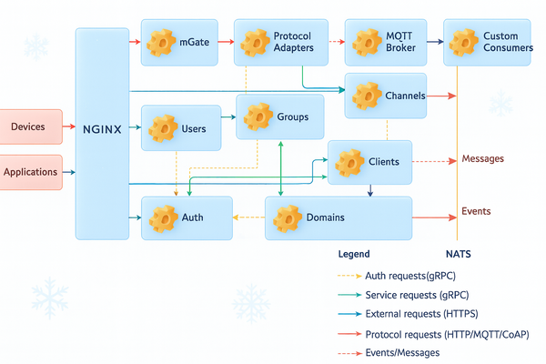

# MQTT Broker Selection

## Summary

This blog compares popular open-source MQTT brokers—EMQX, Mosquitto, NanoMQ, VerneMQ, RabbitMQ, and NATS—against key criteria such as licensing, MQTT protocol support, performance, scalability, security, and monitoring. After evaluating their strengths and trade-offs, we explain why RabbitMQ was selected to power MQTT support in SuperMQ, our distributed and open-source cloud platform designed for IoT.

## Introduction

SuperMQ is a distributed, highly scalable, and secure open-source cloud platform. Remember this; it will be useful for later. One of the key pillars of the platform is its multiprotocol support. A use case for the platform is in the ever-growing field of IoT (Internet of Things). It would therefore be remiss if it did not support one of the most popular protocols in the field, MQTT. To achieve this we had to select an MQTT broker that would work under the hood. Following an analytical review of the landscape, we settled on [RabbitMQ](https://www.rabbitmq.com/). The following is a summary of what we considered and eventually why we chose our broker.

_A simplification of the architecture of SuperMQ to show where the broker sits_

## The contenders

Based on popularity and size, we can narrow down the search for a broker to the following:

1. [EMQX](https://github.com/emqx/emqx) - Released in 2012. Written in Erlang

2. [Mosquitto](https://github.com/eclipse-mosquitto/mosquitto) - Released in 2009. Written in C/C++

3. [NanoMQ](https://github.com/nanomq/nanomq) - Released in 2020. Written in C

4. [VerneMQ](https://github.com/vernemq/vernemq) - Released in 2014. Written in Erlang

The above represent the brokers with the most influence in the open-source community based on their GitHub stars and contributions.

As SuperMQ also has an internal message broker, two more contenders are introduced, which are primarily message brokers but offer support for MQTT.

5. [RabbitMQ](https://github.com/rabbitmq) - Released in 2007. Written in Erlang

6. [NATS](https://github.com/nats-io) - Released in 2011. Written in Go

## The criteria

To choose a broker, a set of analytical criteria was established. The main goal was to make sure we did not compromise the SuperMQ offering but instead enriched it. For our consideration we will define the following criteria:

- Licensing and open‑source commitment
- Protocol support (MQTT versions, QoS, retained messages, LWT)
- Performance: connections, throughput, latency
- Scalability and clustering
- Security: TLS, authentication, authorization
- Management and monitoring capabilities

### Distribution and licensing

SuperMQ is an open-source project licensed under Apache 2.0; therefore, any broker we use for our infrastructure should have the same commitment to open source.

From the list of our contenders, RabbitMQ, VerneMQ, and NATS have an Apache 2.0 license. Although VerneMQ has restrictions on redistributing the Docker image as detailed in the [EULA](https://vernemq.com/end-user-license-agreement). NanoMQ has the MIT license, which is as permissive as the Apache license but not as explicit. Mosquitto has an Eclipse dual license, and EMQX has a Business Source License. These can be limiting to distribution. In the case of SuperMQ, it would have to be a point in favor of the projects with Apache and MIT licenses. This metric serves as a non-negotiable for our project.

### MQTT protocol compliance and features

The MQTT protocol has features set out by the [MQTT specifications.](https://mqtt.org/mqtt-specification/)

We would like to offer support for various versions of MQTT (v3.1, v3.1.1, and v5). Furthermore, we aim to offer support for various levels of QoS (Quality of Service), Retained Messages, and Last Will and Testament (LWT).

### Feature support summary

| Feature Area                 | Mosquitto       | EMQX            | VerneMQ         | RabbitMQ        | NanoMQ      | NATS        |
| ---------------------------- | --------------- | --------------- | --------------- | --------------- | ----------- | ----------- |
| **MQTT Protocol Support**    | 5.0, 3.1.1, 3.1 | 5.0, 3.1.1, 3.1 | 5.0, 3.1.1, 3.1 | 5.0, 3.1.1, 3.1 | 5.0, 3.1.1  | 3.1.1       |
| **Quality of Service (QoS)** | QoS 0, 1, 2     | QoS 0, 1, 2     | QoS 0, 1, 2     | QoS 0, 1        | QoS 0, 1, 2 | QoS 0, 1, 2 |
| **Retained Messages & LWT**  | Yes             | Yes             | Yes             | Yes             | Yes         | Yes         |
| **MQTT over WS**             | Yes             | Yes             | Yes             | Yes             | Yes         | Yes         |

From the above there is little to separate the brokers, each having a strong implementation of the specifications. However, NATS stands out because of its lack of support for MQTT v 5.0 and RabbitMQ for its lack of support of QoS 2. For SuperMQ, having the latest version of MQTT is non-negotiable.

### Performance

This can be characterized by the number of connections supported, message throughput, and latency. This stands as a key metric of making SuperMQ highly performant.

Performance data for a comparison between our contenders is obtained from a combination of third-party evaluations of the brokers as well as vendor-based benchmarks.

In terms of the number of connections supported, vendor-based benchmarks put EMQX, VerneMQ, and RabbitMQ in the millions range, with EMQX having the edge with a reported support of 4M+ connections per node [1] [2].

Mosquitto and NanoMQ have lower connections per node numbers.

A third-party benchmark puts the sustainable message throughput of EMQX at 28K messages per second, while that of VerneMQ is at 10K messages per second [3]. From benchmark comparisons provided by EMQX, we can extrapolate that the message throughputs of NanoMQ and Mosquitto are lower than EMQX and VerneMQ [1].

A vendor-based benchmark provided by RabbitMQ puts the message throughput at 17K messages per second, having an average forward latency of 2.880 milliseconds [2].

With VerneMQ and EMQX having a reported latency of 8.7 and 6.4 milliseconds per 1000 messages per second [3].

From vendor-based benchmarks, NanoMQ is reported to have lower latency than EMQX and VerneMQ at lower numbers of active connections but higher latency at higher numbers of active connections [4].

The same benchmark puts the latency of Mosquitto to be higher than EMQX and NanoMQ.

It is at this point where it is important to note that NanoMQ was authored by EMQ Technologies, the authors of EMQX, to be a fast and lightweight broker for the IoT edge.

Limited comparison benchmarks are available for NATS as an MQTT broker; we can attribute it to being less popular as compared to our other contenders as an MQTT broker.

### Perfomance summary

| Broker    | Connections Supported (per node) | Message Throughput (messages/second) | Latency                                              |
| :-------- | :------------------------------- | :----------------------------------- | :--------------------------------------------------- |
| EMQX      | Millions (e.g., 4M+)             | 28K (sustainable)                    | 6.4 ms per 1000 messages/second                      |
| Mosquitto | Lower                            | Lower than EMQX/VerneMQ              | Higher than EMQX/NanoMQ (can be ~40ms)               |
| NanoMQ    | Lower                            | Lower than EMQX/VerneMQ              | Lower at low connections, higher at high connections |
| VerneMQ   | Millions                         | 10K (sustainable)                    | 8.7 ms per 1000 messages/second                      |
| RabbitMQ  | Millions                         | 17K                                  | 2.880 milliseconds (average forward latency)         |
| NATS      | Limited benchmark data           | Limited benchmark data               | Limited benchmark data                               |

With SuperMQ we wanted a highly performant broker, and EMQX, VerneMQ, and RabbitMQ seem to be at the top of the pile.

### Scalability

Here we were looking for a broker that offers high availability and clustering, all while maintaining efficient resource consumption.

Two of our contenders fail at this point, as Mosquitto and NanoMQ do not support clustering, which is important in our mission to make a distributed and scalable platform.

EMQX natively supports clustering. VerneMQ is built as a distributed message broker with masterless clustering technology based on Erlang distribution. RabbitMQ supports clustering as a logical grouping of nodes that share users, virtual hosts, queues, streams, exchanges, bindings, and other distributed states.

Each of our contenders boasts of their high availability and fault tolerance.

In terms of resource consumption, third-party studies concur on Mosquitto being lightweightwith low RAM usage. The study highlights that VerneMQ and EMQX are similar in their CPU and memory use [5].

### Security

The broker should offer built-in or pluggable options for authentication and authorization as well as support for TLS encryption.

All the contenders offer support for TLS/SSL.

EMQX, RabbitMQ, VerneMQ, and NATS offer high pluggability when it comes to authentication and authorization.

This serves as a nice-to-have, as SuperMQ relies on [Mgate for authentication and authorization for client connections.

### Management and monitoring

Observability was another critical factor:

- **Native Prometheus metrics**: EMQX, RabbitMQ, VerneMQ, and NATS support this out of the box.

- **HTTP APIs**: All except Mosquitto provide HTTP APIs for configuration and monitoring.

- **Dashboards**: EMQX includes a web dashboard, but SuperMQ already has internal visualization tools.

Mosquitto relies on $SYS topics and third‑party tools for advanced monitoring.

## Conclusion

Choosing a broker for the platform is an important decision, one that has to be made analytically. In terms of performance, with the available information, RabbitMQ, VerneMQ, and EMQX come up as favorites. As we would like a scalable solution, we have to eliminate NanoMQ and Mosquitto. These brokers seem to be built to be performant on single-node deployments on the edge. Finally, our commitment to open source means we eliminate VerneMQ and EMQX.

We chose RabbitMQ because:

- It is committed to open source: As an Apache 2.0 licensed project

- It displays exceptional scalability and distributed architecture: RabbitMQ's robust clustering capabilities are paramount for SuperMQ, which is designed for high availability and distributed operations.

- It has proven performance: While other contenders also showed strong performance, RabbitMQ's benchmarks for message throughput and low latency are impressive and fully capable of meeting SuperMQ's demanding performance requirements [6].

- It has comprehensive management and monitoring: RabbitMQ offers native support for Prometheus metrics, alongside an HTTP API for configuration and monitoring. These features integrate with SuperMQ's existing observability methodologies, providing the visibility and control necessary for operational excellence.

- It has security integration: It supports TLS/SSL and has highly pluggable authentication and authorization mechanisms that align with SuperMQ's security architecture.

## References

1. [A comprehensive comparison of open-source MQTT brokers](https://www.emqx.com/en/blog/a-comprehensive-comparison-of-open-source-mqtt-brokers-in-2023)

2. [Native MQTT in RabbitMQ](https://www.rabbitmq.com/blog/2023/03/21/native-mqtt)

3. [A Comparison of MQTT Brokers for Distributed IoT Edge Computing](https://link.springer.com/chapter/10.1007/978-3-030-58923-3_23#citeas)

4. [Open MQTT benchmarking comparison of MQTT brokers](https://www.emqx.com/en/blog/open-mqtt-benchmarking-comparison-mqtt-brokers-in-2023)

5. [Stress-Testing MQTT Brokers: A Comparative Analysis of Performance Measurements](https://www.mdpi.com/1996-1073/14/18/5817)

6. [Using IoT Protocols in Real-Time Systems: Protocol Analysis and Evaluation of Data Transmission Characteristics](https://onlinelibrary.wiley.com/doi/10.1155/2022/7368691)

[1]: https://www.emqx.com/en/blog/a-comprehensive-comparison-of-open-source-mqtt-brokers-in-2023
[2]: https://www.rabbitmq.com/blog/2023/03/21/native-mqtt
[3]: https://link.springer.com/chapter/10.1007/978-3-030-58923-3_23#citeas
[4]: https://www.emqx.com/en/blog/open-mqtt-benchmarking-comparison-mqtt-brokers-in-2023
[5]: https://www.mdpi.com/1996-1073/14/18/5817
[6]: https://onlinelibrary.wiley.com/doi/10.1155/2022/7368691
