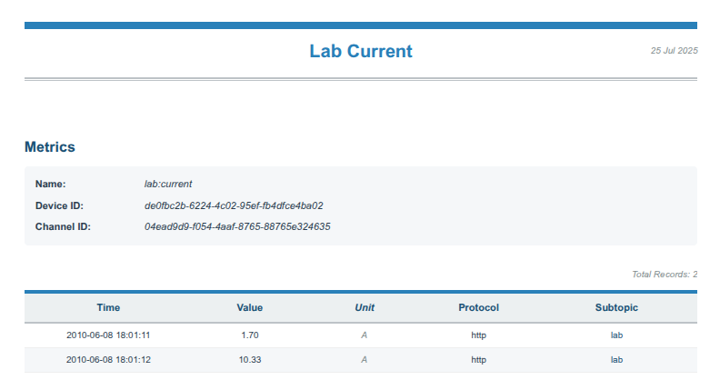
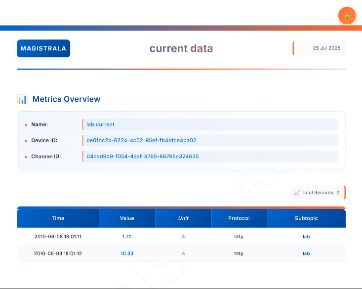
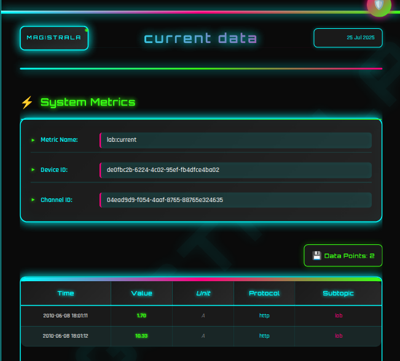

# Building IoT Data Reports with Magistrala: A Developer's Deep Dive

## Introduction

If you've been working with IoT systems for a while, you know that collecting sensor data is just the beginning. The real challenge is turning that flood of telemetry into actionable insights that actually help your team make decisions. That's where Magistrala's reporting system comes in.

After spending months working with this feature, I wanted to share what I've learned about building robust IoT reports. Magistrala's reporting service has become one of our go-to tools for everything from daily operational summaries to executive dashboards.

## System Architecture

The reporting system isn't just bolted on as an afterthought - it's built into Magistrala's core architecture. Here's what you're working with:

### Core Service Components

1. **Report Service** : This is the heart of the operation. It handles all the business logic for creating, updating, and generating reports. The service manages everything from parsing time expressions like `now()-1h` to orchestrating the entire report generation pipeline. It communicates with the readers service via gRPC to fetch historical IoT data, applies aggregations (MIN, MAX, AVG, SUM, COUNT), and coordinates with the template engine for output formatting. The gRPC client connection allows for efficient, type-safe communication when querying large datasets.

2. **Repository Layer** : All your report configurations, schedules, and metadata live here in PostgreSQL. This layer handles CRUD operations for report configs, stores custom templates, and manages the scheduling state. It's designed to handle the multi-tenant nature of Magistrala, so each domain's reports stay completely isolated.

3. **API Layer** : The REST endpoints that actually don't make you want to pull your hair out. This layer handles authentication, request validation, and all the HTTP routing. It includes proper error handling and follows Magistrala's consistent API patterns, so if you've used other parts of the platform, this will feel familiar.

4. **Scheduler Component**: Built on top of a ticker system, this handles the "set it and forget it" functionality. It wakes up periodically, checks for reports that need to run, and kicks off the generation process. The scheduler is smart enough to handle failures and won't spam you if something goes wrong.

5. **Template Engine & PDF Generation**: This is what makes your PDFs look professional instead of like something from 1995. The system uses a two-part approach: first, it processes your data through Go HTML templates with custom styling, then sends the rendered HTML to **Gotenberg** - a dedicated microservice that converts HTML to clean PDF output. Gotenberg runs as a separate Docker container and provides a stateless API for document conversion. The engine validates templates to prevent security issues and the whole pipeline is designed for high-throughput PDF generation.

6. **Email Integration**: Uses Magistrala's built-in emailer service to handle SMTP delivery. It validates recipient addresses, handles attachments properly, and includes retry logic for when email servers are being temperamental. The integration respects domain policies so you can't accidentally send internal data to external addresses.

### The Data Journey

```
Your IoT Devices → Message Brokers → Readers Service → Reports Service → Reports
```

What's nice is that the reporting service doesn't reinvent the wheel. It hooks into the existing readers infrastructure, so you're querying the same data store your other services use.

### System Data Flow

Let me show you how data flows through the system when you generate a report. Understanding this helps a lot when things don't work as expected.

```
┌─────────────────┐    ┌──────────────────┐    ┌─────────────────┐
│   IoT Devices   │    │  Message Brokers │    │  Readers Service│
│                 │───▶│                  │───▶│                 │
│ • MQTT Sensors  │    │ • NATS           │    │ • Data Query    │
│ • HTTP Devices  │    │ • RabbitMQ       │    │ • Aggregation   │
│ • CoAP Sensors  │    │ • Kafka          │    │ • Time Filtering│
└─────────────────┘    └──────────────────┘    └─────────────────┘
                                                         │
                                                         │
                                                         │
                                                         |
                       ┌──────────────────┐              │
                       │   Gotenberg      │              │
                       │   (PDF Service)  │              │
                       │                  │              │
                       │ • chromedp       │              │
                       │ • HTML→PDF       │              │
                       │ • REST API       │              │
                       └──────────────────┘              │
                                │      ▲                 │
                                │      │                 │
                                ▼      │                 ▼
┌─────────────────┐    ┌──────────────────┐    ┌─────────────────┐
│  Email Service  │    │ Reports Service  │    │   PostgreSQL    │
│                 │◀───│                  │───▶│                 │
│ • SMTP Delivery │    │ • Query Builder  │    │ • Report Configs│
│ • Attachment    │    │ • CSV Export     │    │ • Schedules     │
│ • Validation    │    │ • Scheduling     │    │ • Templates     │
└─────────────────┘    │ • Template Engine│    └─────────────────┘
                       └──────────────────┘              
                                │                        
                                ▼                        
                       ┌──────────────────┐              
                       │   Report Output  │
                       │                  │
                       │ • PDF Files      │
                       │ • CSV Files      │
                       │ • JSON Data      │
                       │ • Email Delivery │
                       └──────────────────┘
```

### The Step-by-Step Process

Here's what happens when you generate a report:

1. **Configuration Phase**: You create a report config with metrics, time ranges, and output preferences
2. **Data Query**: Reports service calls the Readers service with your parameters
3. **Data Retrieval**: Readers service queries the message store (PostgreSQL/TimescaleDB) 
4. **Processing**: Raw sensor data gets aggregated according to your config (hourly averages, daily sums, etc.)
5. **Template Rendering**: If you want PDF/CSV, the template engine processes your data through HTML templates, then sends it to Gotenberg for PDF conversion
6. **Delivery**: Depending on your action (view/download/email), the report gets returned or sent

### Understanding Metrics: The Core Filtering Mechanism

In the Magistrala reports system, **metrics** are the primary way to filter and retrieve data from the TimescaleDB database. Each metric in your report configuration corresponds to specific filtering parameters that the TimescaleDB readers use to query sensor data.

When you define a metric in your report configuration, you're telling the system exactly what data to retrieve from the TimescaleDB database. Each metric acts as a set of filters that get translated into SQL WHERE clauses. Think of it like building a search query - the more specific your metric parameters, the more targeted your data retrieval becomes.

The available metric fields are:

**ChannelID** - Mandatory field that serves as the primary partition key. This identifies which channel (data stream) to query from.

**ClientIDs** - Optional array that filters by specific devices. This maps to the `publisher` field in the database and allows you to get data from particular IoT devices.

**Name** - Mandatory field that specifies the metric or sensor name you want to retrieve data for.

**Subtopic** - Optional field for message routing path. Helps organize data by location, sensor type, or other logical groupings.

**Protocol** - Optional field to filter by communication protocol (mqtt, http, coap). Useful in multi-protocol environments.

**Format** - Optional field for data format type. Specifies the format of the data being queried.

For example, this metric configuration:

```json
{
    "channel_id": "{{CHANNELID}}",
    "client_ids": ["{{THINGID}}"],
    "name": "lab2:current",
    "subtopic": "test",
    "protocol": "http",
    "format": "messages"
}
```

Will retrieve all "lab2:current" sensor readings from the specified channel and device, filtered to only include messages with "test" subtopic that came via HTTP protocol, using the standard messages table format.

#### Template Validation Requirements

When you create custom HTML templates, Magistrala validates them to ensure they'll work correctly with the PDF generation system. Your template must include:

**Required Template Fields:**
- `{{$.Title}}` - Report title
- `{{$.GeneratedDate}}` and `{{$.GeneratedTime}}` - Generation timestamps  
- `{{.Metric.Name}}`, `{{.Metric.ClientID}}`, `{{.Metric.ChannelID}}` - Metric information
- `{{len .Messages}}` - Record count
- `{{range .Messages}}...{{end}}` - Data iteration block
- `{{formatTime .Time}}`, `{{formatValue .}}`, `{{.Unit}}`, `{{.Protocol}}`, `{{.Subtopic}}` - Message fields

**Required HTML Structure:**
- Valid HTML5 document with `<!DOCTYPE html>`
- Complete `<html>`, `<head>`, `<body>`, and `<style>` tags
- Proper table structure with `<table>`, `<thead>`, `<tbody>`, `<th>`, `<td>`
- Expected table headers: Time, Value, Unit, Protocol, Subtopic

**Required CSS Classes:**
- `.page` - Main page container
- `.header` - Report header section
- `.content-area` - Main content area
- `.metrics-section` - Metrics information display
- `.data-table` - Data table styling
- `.footer` - Report footer

The validation system ensures your custom templates maintain compatibility with the PDF generation engine while giving you complete creative control over the visual design.

## Examples

Let me walk you through real-world examples and show you how to build reports that actually work in production.

Let me walk you through setting up a real report - the kind we actually use in production. This one pulls temperature data from our warehouse sensors and emails a summary to the facilities team every morning:

```go
reportConfig := reports.ReportConfig{
    Name:        "Daily Temperature Summary",
    Description: "Hourly temperature averages from all warehouse sensors",
    Schedule: schedule.Schedule{
        StartDateTime:   time.Now().Add(time.Hour),
        Recurring:       schedule.Daily,
        RecurringPeriod: 1,
    },
    Config: &reports.MetricConfig{
        From:        "now()-24h",        // Last 24 hours
        To:          "now()",            // Right now
        Title:       "Temperature Report",
        FileFormat:  reports.PDF,
        Aggregation: reports.AggConfig{
            AggType:  reports.AggregationAVG,
            Interval: "1h",              // Hourly averages
        },
    },
    Metrics: []reports.ReqMetric{
        {
            ChannelID: "04ead9d9-f054-4aaf-8765-88765e324635",
            Name:      "temperature",
            ClientIDs: []string{"f47ac10b-58cc-4372-a567-0e02b2c3d479", "6ba7b810-9dad-11d1-80b4-00c04fd430c8", "6ba7b811-9dad-11d1-80b4-00c04fd430c8"},
            Protocol:  "mqtt",
        },
    },
    Email: &reports.EmailSetting{
        To:      []string{"ops@company.com", "manager@company.com"},
        Subject: "Daily Temperature Report",
        Content: "Here's yesterday's temperature summary from the warehouse.",
    },
}
```

### Practical curl Examples

Here are the actual curl commands you'll use in production. These work with real endpoints and show you exactly how to interact with the reports API.

#### Generate a Report On-Demand (with default template)

This is the most common operation - generating a report immediately and downloading it:

```bash
curl --location 'http://localhost:9017/{{DOMAINID}}/reports?action=download' \
--header 'Content-Type: application/json' \
--header 'Authorization: Bearer {{ACCESS_TOKEN}}' \
--data-raw '{
    "name": "lab 1 report",
    "description": "lab 1 sensors report",
    "config": {
        "from": "now()-5d",
        "to": "now()",
        "file_format": "pdf",
        "title": "current data"
    },
    "metrics": [
        {
            "channel_id": "22a043e9-401e-4e3f-b603-1c1e8cd52000",
            "client_ids": ["bd9dce02-73d1-4525-8229-71d25ba35d65"],
            "name": "lab2:current"
        }  
    ]
}'
```

**Note**: When you omit the `report_template` field, the system uses the default template automatically. This is usually what you want for standard reports.

#### Create a Scheduled Report

Set up a report that runs automatically every day:

```bash
curl --location 'http://localhost:9017/{{DOMAINID}}/reports/configs' \
--header 'Content-Type: application/json' \
--header 'Authorization: Bearer {{ACCESS_TOKEN}}' \
--data-raw '{
    "name": "Daily Temperature Summary",
    "description": "Hourly temperature averages from warehouse sensors",
    "schedule": {
        "start_datetime": "2024-01-01T09:00:00Z",
        "recurring": "daily",
        "recurring_period": 1
    },
    "config": {
        "from": "now()-24h",
        "to": "now()",
        "title": "Temperature Report",
        "file_format": "pdf",
        "aggregation": {
            "agg_type": "avg",
            "interval": "1h"
        }
    },
    "metrics": [
        {
            "channel_id": "04ead9d9-f054-4aaf-8765-88765e324635",
            "name": "temperature",
            "client_ids": ["f47ac10b-58cc-4372-a567-0e02b2c3d479", "6ba7b810-9dad-11d1-80b4-00c04fd430c8"],
            "protocol": "mqtt"
        }
    ],
    "email": {
        "to": ["ops@company.com"],
        "subject": "Daily Temperature Report",
        "content": "Yesterday's temperature summary is attached."
    }
}'
```

#### Generate a CSV Report

Sometimes you need data in spreadsheet format:

```bash
curl --location 'http://localhost:9017/{{DOMAINID}}/reports?action=download' \
--header 'Content-Type: application/json' \
--header 'Authorization: Bearer {{ACCESS_TOKEN}}' \
--data-raw '{
    "name": "Energy Data Export",
    "config": {
        "from": "now()-7d",
        "to": "now()",
        "title": "Weekly Energy Report",
        "file_format": "csv"
    },
    "metrics": [
        {
            "channel_id": "04ead9d9-f054-4aaf-8765-88765e324635",
            "name": "power_consumption"
        }
    ]
}'
```

#### List Existing Report Configurations

Check what reports you have set up:

```bash
curl --location 'http://localhost:9017/{{DOMAINID}}/reports/configs?limit=10&offset=0&status=enabled' \
--header 'Authorization: Bearer {{ACCESS_TOKEN}}'
```

#### Enable/Disable a Scheduled Report

Control whether a scheduled report runs:

```bash
# Enable a report
curl --location --request POST 'http://localhost:9017/{{DOMAINID}}/reports/configs/{{REPORT_CONFIG_ID}}/enable' \
--header 'Authorization: Bearer {{ACCESSTOKEN}}'

# Disable a report
curl --location --request POST 'http://localhost:9017/{{DOMAINID}}/reports/configs/{{REPORT_CONFIG_ID}}/disable' \
--header 'Authorization: Bearer {{ACCESSTOKEN}}'
```

#### Update Report Schedule

Modify the schedule of an existing report configuration:

```bash
curl --location --request PATCH 'http://localhost:9017/{{DOMAINID}}/reports/configs/{{REPORT_CONFIG_ID}}/schedule' \
--header 'Content-Type: application/json' \
--header 'Authorization: Bearer {{ACCESSTOKEN}}' \
--data '{
    "schedule": {
        "start_datetime": "2025-04-07T00:00:00.000Z",
        "time": "0001-01-01T00:00:00.000Z",
        "recurring": "daily",
        "recurring_period": 1
    }
}'
```

#### Update Report Template

Update the HTML template for an existing report configuration:

```bash
curl --location --request PUT 'http://localhost:9017/{{DOMAINID}}/reports/configs/{{REPORT_CONFIG_ID}}/template' \
--header 'Content-Type: application/json' \
--header 'Authorization: Bearer {{ACCESSTOKEN}}' \
--data-raw '{
     "report_template": "<!DOCTYPE html><html lang=\"en\"><head><meta charset=\"UTF-8\"><meta name=\"viewport\" content=\"width=device-width,initial-scale=1.0\"><title>{{.Title}}</title><style>:root{--primary-color:#4527a0;--secondary-color:#311b92;--subtle-color:#b0bec5;--table-header-bg:#ede7f6;--alternate-row:#f3e5f5;--text-primary:#263238;--text-secondary:#546e7a;--white:#fff;--header-height:35mm;--footer-height:20mm;--page-padding:15mm}*{margin:0;padding:0;box-sizing:border-box}body{font-family:Arial,sans-serif;background-color:var(--white);color:var(--text-primary);line-height:1.4}.page{max-width:210mm;min-height:297mm;padding:var(--page-padding) 10mm;margin:5mm auto 0;background:var(--white);box-shadow:0 0 10px rgba(0,0,0,0.1);position:relative;display:flex;flex-direction:column}.header{height:var(--header-height);min-height:var(--header-height);max-height:var(--header-height);position:relative;flex-shrink:0;display:flex;flex-direction:column}.header-top-bar{height:8px;background-color:var(--primary-color);margin:0 -10mm 15px -10mm;flex-shrink:0}.header-content{display:flex;justify-content:space-between;align-items:center;margin-bottom:10px;flex-shrink:0}.header-title{font-size:20px;font-weight:700;color:var(--primary-color);text-align:center;flex-grow:1}.header-date{font-size:10px;font-style:italic;color:var(--text-secondary);text-align:right;width:100px}.header-separator{height:2px;background-color:var(--subtle-color);margin:5px 0 10px;position:relative;flex-shrink:0}.header-separator:after{content:\'\\\'\\\';position:absolute;top:3px;left:0;right:0;height:1px;background-color:var(--subtle-color)}.content-area{flex-grow:1;display:flex;flex-direction:column;min-height:0;overflow:hidden}.metrics-section{margin-bottom:15px;flex-shrink:0}.metrics-title{font-size:16px;font-weight:700;color:var(--secondary-color);margin-bottom:10px}.metrics-info{background-color:var(--alternate-row);padding:12px;border-radius:4px;margin-bottom:10px}.metric-row{display:flex;margin-bottom:8px}.metric-row:last-child{margin-bottom:0}.metric-label{font-weight:700;color:var(--text-primary);width:120px;font-size:11px}.metric-value{font-style:italic;color:var(--text-primary);font-size:11px;flex-grow:1}.record-count{text-align:right;font-size:10px;font-style:italic;color:var(--text-secondary);margin-bottom:10px;flex-shrink:0}.table-container{flex-grow:1;overflow:auto;min-height:0}.data-table{width:100%;border-collapse:collapse}.table-header-bar{height:4px;background-color:var(--primary-color)}.data-table th{background-color:var(--table-header-bg);color:var(--secondary-color);font-weight:700;font-size:11px;padding:8px;text-align:center;border-bottom:2px solid var(--subtle-color);position:sticky;top:0}.data-table td{padding:6px 8px;font-size:10px;text-align:center;border-bottom:1px solid #eee}.data-table tr:nth-child(even){background-color:var(--alternate-row)}.data-table tr:hover{background-color:rgba(69,39,160,0.05)}.col-time{width:25%;color:var(--text-primary)}.col-value{width:17%;color:var(--text-primary);font-weight:400}.col-unit{width:17%;color:var(--text-secondary);font-style:italic}.col-protocol{width:17%;color:var(--text-primary)}.col-subtopic{width:24%;color:var(--secondary-color)}.footer{height:var(--footer-height);min-height:var(--footer-height);max-height:var(--footer-height);border-top:2px solid var(--subtle-color);padding-top:8px;flex-shrink:0;display:flex;flex-direction:column;justify-content:flex-start}.footer-separator{height:1px;background-color:var(--subtle-color);margin-bottom:6px;position:relative;flex-shrink:0}.footer-separator:after{content:\'\\\'\\\';position:absolute;top:1px;left:0;right:0;height:1px;background-color:var(--subtle-color)}.footer-content{display:flex;justify-content:space-between;align-items:center;margin:0;padding:0;flex-shrink:0}.footer-generated{font-size:8px;font-style:italic;color:var(--text-secondary);margin:0;padding:0}.footer-page{font-size:9px;font-weight:700;color:var(--text-primary);margin:0;padding:0}@media print{.page{box-shadow:none;margin:0;max-width:none;height:297mm;min-height:auto;page-break-after:always}.page:last-child{page-break-after:auto}}</style></head><body>{{$totalPages := len .Reports}}{{$globalPage := 0}}{{range $index, $report := .Reports}}{{$globalPage = add $globalPage 1}}<div class=\"page\"><div class=\"header\"><div class=\"header-top-bar\"></div><div class=\"header-content\"><div style=\"width:100px\"></div><div class=\"header-title\">{{$.Title}}</div><div class=\"header-date\">{{$.GeneratedDate}}</div></div><div class=\"header-separator\"></div></div><div class=\"content-area\"><div class=\"metrics-section\"><div class=\"metrics-title\">Metrics</div><div class=\"metrics-info\"><div class=\"metric-row\"><div class=\"metric-label\">Name:</div><div class=\"metric-value\">{{.Metric.Name}}</div></div>{{if .Metric.ClientID}}<div class=\"metric-row\"><div class=\"metric-label\">Device ID:</div><div class=\"metric-value\">{{.Metric.ClientID}}</div></div>{{end}}<div class=\"metric-row\"><div class=\"metric-label\">Channel ID:</div><div class=\"metric-value\">{{.Metric.ChannelID}}</div></div></div></div><div class=\"record-count\">Total Records: {{len .Messages}}</div><div class=\"table-container\"><div class=\"table-header-bar\"></div><table class=\"data-table\"><thead><tr><th class=\"col-time\">Time</th><th class=\"col-value\">Value</th><th class=\"col-unit\">Unit</th><th class=\"col-protocol\">Protocol</th><th class=\"col-subtopic\">Subtopic</th></tr></thead><tbody>{{range .Messages}}<tr><td class=\"col-time\">{{formatTime .Time}}</td><td class=\"col-value\">{{formatValue .}}</td><td class=\"col-unit\">{{.Unit}}</td><td class=\"col-protocol\">{{.Protocol}}</td><td class=\"col-subtopic\">{{.Subtopic}}</td></tr>{{end}}</tbody></table></div></div><div class=\"footer\"><div class=\"footer-separator\"></div><div class=\"footer-content\"><div class=\"footer-generated\">Generated: {{$.GeneratedTime}}</div><div class=\"footer-page\">Page {{$globalPage}} of {{$totalPages}}</div></div></div></div>{{end}}</body></html>"
}'
```

#### View Report Template

Retrieve the current HTML template for a report configuration:

```bash
curl --location 'http://localhost:9017/{{DOMAINID}}/reports/configs/{{REPORT_CONFIG_ID}}/template' \
--header 'Authorization: Bearer {{ACCESSTOKEN}}'
```

#### Delete Report Template

Remove the custom HTML template from a report configuration (reverts to default template):

```bash
curl --location --request DELETE 'http://localhost:9017/{{DOMAINID}}/reports/configs/{{REPORT_CONFIG_ID}}/template' \
--header 'Authorization: Bearer {{ACCESSTOKEN}}'
```

#### Delete Report Configuration

Permanently remove a report configuration and all its associated data:

```bash
curl --location --request DELETE 'http://localhost:9017/{{DOMAINID}}/reports/configs/{{REPORT_CONFIG_ID}}' \
--header 'Authorization: Bearer {{ACCESSTOKEN}}'
```

**Note**: Replace `{{REPORT_CONFIG_ID}}` with your actual report configuration ID. You can get this ID from the response when you create a report or by listing your existing reports.

#### Quick Data Export for Analysis

Sometimes you just need to grab data quickly for analysis:

```bash
curl --location 'http://localhost:9017/{{DOMAINID}}/reports?action=download' \
--header 'Content-Type: application/json' \
--header 'Authorization: Bearer {{ACCESS_TOKEN}}' \
--data-raw '{
    "name": "Quick Temperature Analysis",
    "config": {
        "from": "now()-2h",
        "to": "now()",
        "title": "Temperature Data",
        "file_format": "csv"
    },
    "metrics": [
        {
            "channel_id": "a1b2c3d4-e5f6-7890-abcd-ef1234567890",
            "name": "temperature",
            "client_ids": ["de0fbc2b-6224-4c02-95ef-fb4dfce4ba02", "0a8e82d6-d7aa-436f-9987-6486f165d7c5"]
        }
    ]
}' --output temperature_data.csv
```

**Note**: The `--output` flag - this saves the CSV directly to a file instead of displaying it in the terminal.

#### Sample Report Outputs: From Standard to Extraordinary

**Default Template - Professional and Clean**

Here's what you get out of the box. This PDF uses the default template with clean styling that works for most business needs:



**Custom Template - Branded for Your Organization**

Want to add your company branding? Here's the same data with a custom template featuring company colors and styling:



**Cyberpunk Theme - Because Why Not?**

This is where it gets fun. With full HTML/CSS control, you can create reports that match any aesthetic. Here's a cyberpunk-themed report that turns boring sensor data into something from Blade Runner:



**The only limit is your imagination.** Whether you need corporate-standard reports for the board meeting, branded dashboards for clients, or creative themes that make data exciting, the template system gives you complete creative control. You can build anything from minimalist designs to elaborate visual experiences.

**CSV Output - Data Analysis Ready**

For when you need the numbers in spreadsheet format:

```csv
Lab Current

Report Information:
Name,lab:current
Device ID,de0fbc2b-6224-4c02-95ef-fb4dfce4ba02
Channel ID,04ead9d9-f054-4aaf-8765-88765e324635

Time,Value,Unit,Protocol,Subtopic
2010-06-08 18:01:11,1.70,A,http,lab
2010-06-08 18:01:12,10.33,A,http,lab
```

### Conclusion

After working with Magistrala's reporting system for months, what strikes me most is how it gets out of your way and lets you focus on what matters - turning your IoT data into insights that actually help your team make decisions. The beauty isn't just in the technical capabilities (though the custom templating and multi-protocol support are genuinely impressive) - it's in how it adapts to real-world workflows. Need a quick CSV export for analysis? Two minutes. Want branded PDFs for executive meetings? The template system has you covered. Managing dozens of sensor types across different protocols? No problem.

I've seen teams go from manually exporting data and fighting with spreadsheets to having automated reports that just work. The facilities team gets their daily temperature summaries, the finance team has their monthly energy reports, and the ops team can monitor system health - all without anyone having to remember to run queries or format data. The reporting system does what good infrastructure should do: it becomes invisible once it's working, freeing you up to focus on the insights rather than the mechanics of data extraction.
