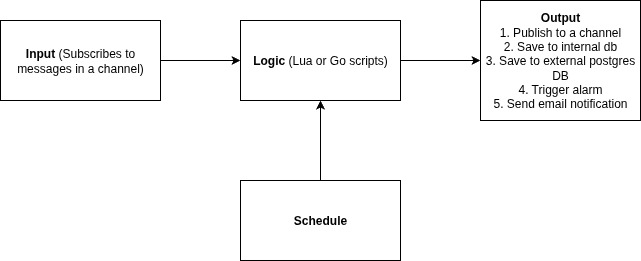

# Building a Scriptable Rules Engine for Real-Time IoT Message Processing

The ability to **process data on the edge**, apply conditional logic, and initiate workflows **without redeploying services** is crucial in modern data pipelines, particularly IoT and event-driven systems.

Presenting the **Rules Engine**, a Magistrala platform microservice. With extensive scheduling, observability, and an intuitive interface, it enables developers to create rules that listen for incoming messages, process them using **custom logic written in Lua or Go**, and publish the results to output channels.

---

## What Problems are we solving?

With our rules engine, users get to enjoy the following features:

1. User defined dynamic logic using scripts (Lua or Go)
2. **Real-time** or **custom** scheduled processing
3. Multiple output options (Internal DB, external PostgreSQL DB, alarms, publishing to a channel, Email notification)
4. All rules are **managed per-domain**, enabling multi-tenant or isolated rule environments.

---

## Wait, but what is a "Domain"?

In Magistrala, a **domain** is a **logical tenant or project namespace** that separates different tenants and governs access control.

Each domain has it's own:

- Groups
- Devices
- Channels
- Rules

This allows isolated environments for different clients, project teams and business units. Think of it like a scoped rule engine environment. Rules and resources in one domain do not interfere with those of another domain.

---

## Rules Engine Architecture at a Glance



1. **Input** - This contains the channel and an optional topic that the rule will subscribe to so as to listen for incoming messages.
2. **Logic** - The logic contains the scripts for processing the messages. They can be in Lua or Go scripts.
3. **Schedule** - The rule can be scheduled to run at specific times or on a recurring basis.
4. **Output** - This is what will happen after the rule has been processed.

### Input

The input of the rule contains a **channel** and a **topic**. Currently Magistrala only supports one input per rule. The input allows the rule to subscribe to messages in a particular channel or filtered by a specific topic.

### Logic

The logic in rules engine is like the brains of the operation. With the logic a user is able to process the message and optionally output results of the operation.
You can choose the language best suited to your team's experience or rule complexity.

#### Lua Example

```Lua
function logicFunction()
  return message.payload
end
return logicFunction()
```

#### Go Example

```go
package main
import (
      m "messaging"
  )
func logicFunction() any {
    return m.message.Payload
}
```

> The scripting engine safely isolates each execution, ensuring domain specific transformation logic.

### Schedule

The scheduler allows you to configure when the rule should execute.
The fields available are:

- **Start Time** - This is the date when the schedule becomes active
- **Time** - The time of day when the rule should run
- **Recurring** - The interval at which the rule should recur(e.g., hourly, daily, weekly)
- **Recurring Period** - The frequency at which the rule should recur (e.g., 1,2 ).

> This means if *recurring=daily*, and the *recurring period=2*, then the rule will be executed **once every two days**.

Schedule config example:

```json
{
  "start_datetime": "2024-01-01T00:00",
  "time": "2024-01-01T09:00",
  "recurring": "weekly",
  "recurring_period": 2
}
```

### Output

The output(s) allow you to perform an activity after the message has been successfully processed.
Magistrala currently supports the following output options:

1. Publish to channel
2. Trigger an alarm
3. Send email notification
4. Save to external postgreSQL db
5. Save to internal Magistrala db

#### Publish to channel

When choosing to publish to a channel, you need to provide the **channel** and an **optional topic**. This allows you to send the response to other devices or applications.

```json title="Channel"
{
  "type": "channels",
  "channel": "0c20e05c-d580-45ed-b5d4-35e255a8a054",
  "topic": "messages"
}
```

#### Trigger an alarm

The trigger alarm option can be achieved by returning the result of the logic as an alarm and passing the **"alarms"** as an output. This allows you to generate alarms in the case where a threshold has been exceeded.

Alarm:

```json title="Alarm"
{
  "type": "alarms"
}
```

---

#### Send email notification

To send an email notification, you need to pass the email as one of the outputs. Furthermore you need to configure the following:

1. **To**
2. **Subject**
3. **Content** - Data contained in the email. Magistrala allows the use of Go HTML templating in the email content.

```json title="Email notification"
{
  "type": "email",
  "to": ["janedoe@email.com"],
  "subject": "Test email",
  "content": "This is the content of the email with message value {{.Message.payload.v}}"
}
```

#### Save to external PostgreSQL db

This output option enables you to store processed message results in your own PostgreSQL database. This provides you with the flexibility of not having to store your messages on the internal Magistrala database.

To set it up the following fields are required:

1. **Host**
2. **Port**
3. **Username**
4. **Password**
5. **Database name**
6. **Table name**
7. **Data mapping**

```json title="PostgreSQL"
{
  "type": "save_remote_pg",
  "host": "postgres",
  "port": "1337",
  "user": "johnDoe",
  "password": "password",
  "database": "messages",
  "table": "messages",
  "mapping": "<json_mapping>"
}
```

An example of a mapping is:

```json
{
  "channel": "{{.Message.Channel}}",
  "value": "{{(index .Result 0).v}}",
  "unit": "{{(index .Result 0).u}}"
}
```

#### Save to internal Magistrala db

This output allows you to store messages in the internal Magistrala database. This output requires the result of your logic to be a message in **SenML** format. 
Internal storage output:

```json
{
  "type": "save_senml"
}
```

---

## Rules API

The Rules Engine exposes a powerful **RESTful API** that allows full lifecycle management of rules - making it easy to create, modify, and control rules programmatically.

Here are the core API operations currently supported:

### Rule Management

- **Create Rule** - Define a new rule with Lua or Go logic, inputs, outputs and optional scheduling.
- **List Rules** - Fetch all rules in a given domain, optionally with filters and pagination.
- **View Rule** - Retrieve the configuration of a single rule by its ID.

### Rule Modification

- **Update Rule** - Change the rule's logic, metadata, input/outputs config, and name.
- **Update Rule Tags** - Add or remove rule tags for categorization and filtering.
- **Update Rule Schedule** - Adjust the rule's scheduling parameters without affecting other rule attributes.

### Rule Lifecycle

- **Delete Rule** - Delete a rule to prevent future execution.
- **Enable Rule** - Activate a rule so it begins processing messages or running on a schedule.
- **Disable Rule** - Temporarily pause rule execution without deleting it.

> To dive deeper into request/response formats, authentication headers, and schema definitions, checkout the [developers guide](https://docs.magistrala.abstractmachines.fr/dev-guide/rules-engine) in our documentation.

---

## Explore Managing Rules with our UI

Good news for those who prefer working with graphical tools: Magistrala ships with a **powerful web-based UI** that makes managing rules and other system resources intuitive and visual - no need to interact directly with the API if you don't want to.

### What you can do with the UI

The UI provides a comprehensive management experience for the entire Magistrala platform, and includes a dedicated section for Rules Engine operations:

1. Create and edit rules.
2. Write logic in Lua or Go with syntax highlighting.
3. Configure input and outputs.
4. Set us rule schedules visually with date and time pickers.
5. Rules listing and filtering.

### Node-Based Rule Visualization

Rules in the UI are managed and visualized using a node-based interface, where:

- Each rule contains three sections - **input**, **logic**, **output nodes**.
- The input node can only be a single node.
- The logic node is also a single node.
- We support multiple output nodes.
- All the nodes can be connected visually, helping users understand data flow.

> Whether you are a backend developer or a domain expert configuring automation logic, the UI provides a low-friction, high-visibility interface for interacting with your rules.

To learn more about how to use the UI for Rules Engine management, please visit our [Rules Engine guide](https://docs.magistrala.abstractmachines.fr/user-guide/rules-engine/) in our user-guide documentation.

---

## Health and Observability

To make the service production-ready, we've added essential endpoints for monitoring the health and metrics of the service.

### Health check

Returns the service status.

```bash
/health
```

Sample response:

```json
{
  "status": "pass",
  "version": "unknown",
  "commit": "3cd9774a91c4889136095265bdf63ceb6b2bfb72",
  "description": "rule_engine service",
  "build_time": "2025-07-21_11:36:05",
  "instance_id": "39e3a615-438f-4940-8848-b844d49ecd98"
}
```

### Metrics

Exposes Prometheus-style metrics.

```bash
/metrics
```

---

## Conclusion

This micro-service puts **real-time decision-making power** into your hands. Whether you are building an alerting system, filtering messages, or automating scheduled tasks, the Rules Engine lets you do it dynamically - with safety, flexibility, and observability built in.  

No redeployments. No vendor lock-in. Just write your logic and let it run.
