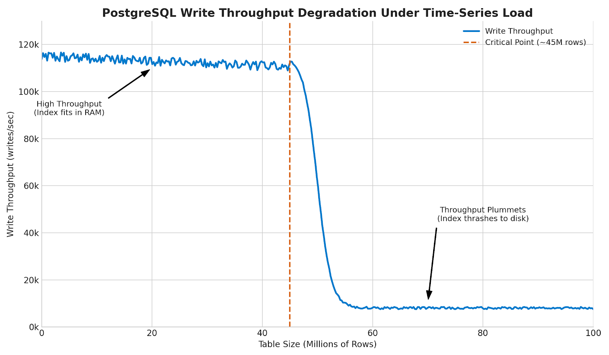
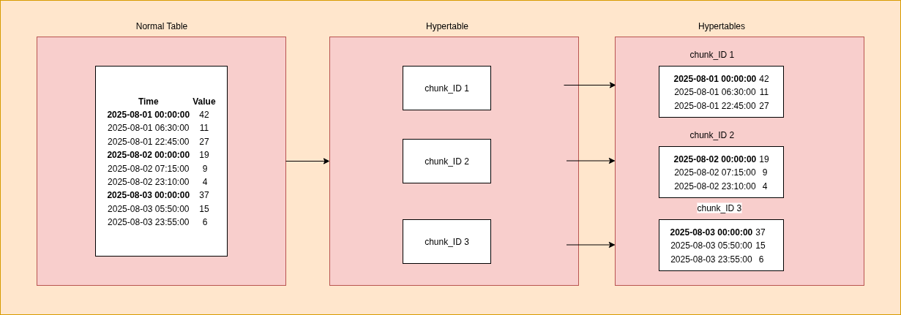
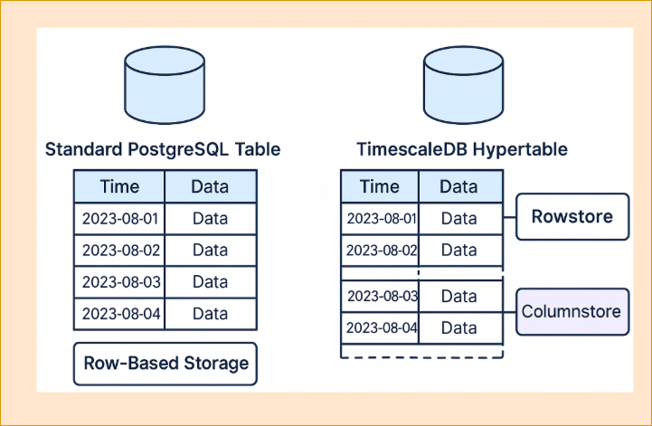

## Introduction

Building a modern IoT messaging platform is no small feat. And when that platform is engineered to be distributed, highly scalable, and secure, the complexity increases exponentially. Why? The goal quickly shifts from just handling a high volume of messages to managing an ecosystem that connects countless users and millions of devices interacting through a mix of communication protocols. So, how do you manage your most valuable asset - your data - at this scale?

A common temptation is to throw a single, massive database at the problem. But that’s a recipe for disaster -  a classic “jack of all trades, master of none” that quickly buckles under pressure. It not only creates performance bottlenecks, but also limits scalability, and opens the door to security risks. The truth is, the data flowing through a modern IoT messaging platform isn’t all the same. It comes in many forms - structured, unstructured, relational, temporal - and each type has its own specific needs.

That is where SuperMQ takes a smarter path. Rather than forcing every kind of data into a single model, it embraces Polyglot Persistence - a strategy that is as practical as it is powerful. The idea is simple: use the right tool for the job. So, how does SuperMQ put this into practice? It breaks down its data needs like this:

- Core Metadata: It includes entities like users, clients (devices or applications), groups, and channels.
- Event Data: It consists of the billions of messages published by clients, where each message is an immutable event stamped with a precise time.
- Authorization Data: It defines who can perform what action on which resource and requires a model that can efficiently represent and query relationships with very low latency.

The table below provides a high-level overview of the above strategy, which will be explored in detail in the subsequent sections.

| Data Domain              | Selected Technology |
|--------------------------|---------------------|
| Core Entity Metadata     | PostgreSQL          |
| Time-Series Message Data | TimescaleDB         |
| Authorization Data       | SpiceDB             |

> SuperMQ also supports writing and reading messages using Cassandra, InfluxDB, or MongoDB. The databases are used through separate services. Writers receive messages from the internal broker and store them. Readers provide HTTP APIs for querying stored messages. The services are optional and can be used if needed based on your environment.

## Core Metadata

As mentioned before, at the core of SuperMQ’s architecture are a set of foundational domain entities that define how messaging, identity, and access control are structured across the platform. These include:

- `Users`: Authenticate and manage resources
- `Clients`: Represent devices or applications
- `Groups`: Organize users and clients hierarchically
- `Channels`: Define topics for message routing

All the above metadata in SuperMQ is stored in PostgreSQL, which acts as the system of record for the control plane. The data defines not just what exists in the platform, but how it relates, who can access it, and how messages are routed. Unlike the high-frequency message payloads that flow through the system, the above metadata changes relatively infrequently. But when it does, it must be updated atomically, consistently, and reliably, because it forms the foundation of the entire system.

### Why PostgreSQL?

- **ACID Transactions**  
  PostgreSQL guarantees atomicity, consistency, isolation, and durability. Multi-step operations—like creating a user, assigning clients, or updating channel access - either succeed entirely or not at all. This eliminates any chance of partial, invalid state.

- **Enforced Relational Integrity**  
   The schema captures and enforces real-world constraints - such as "a client must belong to a valid user" or "a channel cannot be deleted if it has active clients." These relationships are protected at the database level using foreign keys, cascading rules, and check constraints.

- **Race Condition Protection**  
  With transactional isolation and row-level locking, PostgreSQL prevents concurrent operations from corrupting critical state, which is especially important under multi-tenant workloads.

- **Operational Maturity**  
  PostgreSQL comes with a well-developed ecosystem of tools for monitoring, backup, replication, and schema migration. This reduces ops complexity and enables confident day-to-day administration.

- **Auditability**  
  The relational model makes it easy to trace historical state, apply row-level security, and version schema changes in ways that are deterministic and reviewable.

- **Simplified Application Logic**  
  By enforcing constraints at the database layer, the application logic can stay clean. It doesn’t have to double-check for invalid references or race conditions—it can rely on the database to reject impossible operations.

The above ensures that SuperMQ’s control plane remains robust, auditable, and resistant to data anomalies even under high-scale concurrent operations. To truly appreciate why PostgreSQL is the right choice here, let's consider the alternative. What if the team had opted for a flexible NoSQL document database for this same job? While NoSQL databases are incredibly powerful for other tasks, they would introduce significant problems for managing this specific type of core metadata.

Let’s make this concrete.

### Client-to-Channel Connection

Imagine a SuperMQ tenant issues an API call to connect a `client` to a `channel`. This operation touches multiple critical entities: the client, the channel, and the domain context that governs them.

In **PostgreSQL**, this relationship is enforced through a normalized schema:

- The `connections` table includes a **composite foreign key** on `(client_id, domain_id)`, ensuring the client exists and belongs to the correct domain.
- It also enforces a **CHECK constraint** on the `type` column.
- A **composite primary key** on `(channel_id, domain_id, client_id, type)` guarantees uniqueness of the connection.

If any part of the linkage is invalid - such as a disabled client, mismatched domain, or malformed type - PostgreSQL **rejects the operation entirely**. The constraints are enforced at the database layer, regardless of application logic, ensuring internal consistency.

In contrast, performing the same operation in a **NoSQL database** like MongoDB or DynamoDB involves:

- A series of **best-effort writes** with no enforced schema.
- Documents with invalid `client_id`, mismatched `domain_id`, or undefined `type` can be stored without error.
- No built-in constraint prevents cross-domain linking or ensures client existence.

These shortcomings may result in:

- **Broken routing logic**
- **Cross-tenant data leakage**
- **Brittle access control rules**

### Querying

Even querying becomes fragile. Suppose you need to retrieve all active connections for a given channel, where the client is enabled and tagged with `region = EU`.

In PostgreSQL:

You can rely on foreign keys and relational joins to ensure that any connected client is valid, and then use an efficient, indexed query:

```sql
SELECT c.*
FROM connections AS conn
JOIN clients AS c ON conn.client_id = c.id AND conn.domain_id = c.domain_id
WHERE conn.channel_id = $1
  AND c.status = 0
  AND c.tags @> '["region:EU", "status:active"]';
````

This query is fast, accurate, and protected by the schema itself.

In NoSQL:

- There is **no guarantee** that `client_id` exists or is valid.
- The `tags` field may be missing, inconsistently structured, or unindexed.
- **Cross-collection joins are unsupported**, forcing application logic to manually enforce integrity.

This results in higher complexity, latency, and risk of inconsistency.

---

## Message Storage

In SuperMQ, every piece of client data, event log, or telemetry update is recorded as a message with a timestamp. This makes message storage a time-series challenge. Messages are generated, queued, and consumed in a stream and exhibit specific properties:

- High Write Volume: The system must sustain hundreds of thousands to millions of writes per second, particularly during IoT bursts or synchronized device reporting
- Time-Driven Access Patterns: Every single data point is indexed by time
- Append-Only Semantics: Messages are immutable. Once published, they are not modified or deleted

But message storage requirements extend beyond the above properties. The message storage database for SuperMQ must also deliver on the following fronts:

- Query Flexibility: Users must be able to query messages by any attribute, including metadata, customer ID, event type, or status.
- Operational Simplicity: The database must automate data management tasks like partitioning and data retention, reducing the need for dedicated database administration.
- Reliability: The system must provide transactional guarantees for message persistence.

Finding a single database that excels across all the above fronts is challenging, and after evaluation, we chose TimescaleDB. To understand our choice, it is useful to see how other excellent databases fall short for our specific use case.

### The PostgreSQL Scaling Problem

We love Postgres. It is the gold standard for relational databases, offering unmatched reliability and the full power of SQL. But out of the box, a standard PostgreSQL table would quickly buckle under our load. As a single messages table grows into the billions of rows, its B-tree indexes become monstrously large. Once the indexes no longer fit in memory, write throughput plummets. Benchmarks show this clearly: The ingestion rate of PostgreSQL can crash from over 100,000 rows/sec to just a few thousand once a table exceeds 50 million rows. One  can argue that the tables can be manually partitioned, but this is a complex, error-prone process that one has to manage by themselves forever.



The chart above visualizes this exact performance cliff. On the left, write throughput is high and stable while the indexes of the table fit within RAM. As the table grows past a critical point, the database can no longer hold the indexes in memory and must constantly read from disk. This "disk thrashing" state is shown on the right, where performance collapses to a fraction of its original rate.

In benchmarks published by TigerData, declarative partitioning in PostgreSQL can improve some aspects of query latency, but still requires manual creation of partitions, constant monitoring for data gaps, and complex management of retention logic. Even then, TimescaleDB outperforms it by up to 1,000x on real queries, while remaining 100% Postgres-compatible.

### The InfluxDB Querying Limitation

InfluxDB is purpose-built for time-series data and is incredibly fast at ingestion. For simple metrics like CPU usage or raw sensor values, it is a fantastic tool. However, its query language and data model are optimized primarily for time-based lookups, not the rich, multi-attribute queries required in real-world IoT deployments.

Take a typical SuperMQ use case:

> Show me all temperature readings from cold-storage sensors in Warehouse-19, tagged with `"region:EU"` and `"status:active"`, where the value exceeded 5°C, on Tuesday last week.

In InfluxDB, this becomes significantly harder and less efficient to execute. First, all filtering attributes (region, status, zone, etc.) must be stored as tags (not fields) to be indexed. But tags in InfluxDB come with cardinality limitations, especially when each device has a unique tag set. Also, the lack of native join support means metadata like `location` or `owner` must be denormalized into each series, bloating storage and introducing inconsistency risks.

By contrast, TimescaleDB runs on PostgreSQL, meaning complex filters, joins, and aggregations are not just possible — they’re optimized. You can join time-series messages with metadata from `clients`, `zones`, or `users`, and express nuanced queries with full SQL flexibility.

In benchmarks comparing the two:

- TimescaleDB was 3.4x to 71x faster than InfluxDB for real-world, multi-dimensional queries.
- It delivered sub-second responses (10–100ms), while InfluxDB often took multiple seconds on similar loads.
- For threshold-based queries (e.g., `temperature > 5°C`), TimescaleDB was 1.75x to 8.6x faster.
- It also achieved 10x better resource efficiency, even while handling 30% more query volume.

Queries are only part of the picture. Let’s talk about insert performance.

If you’re ingesting data from a small number of temperature sensors, InfluxDB might be acceptable. In fact, in a benchmark with just 100 devices, it slightly outperformed TimescaleDB.

But that’s not the world SuperMQ operates in.

We routinely handle hundreds of thousands to millions of concurrently publishing devices — industrial chillers, smart meters, air quality sensors — each pushing telemetry with unique tags, locations, and context. This high-cardinality workload is where InfluxDB begins to fail: write throughput collapses, memory usage spikes, and queries start crashing.

In fact, TigerData’s benchmark shows:

| Devices            | InfluxDB Insert Performance | TimescaleDB Insert Performance |
| ------------------ | --------------------------- | ------------------------------ |
| 100 devices        | 100% (baseline)             | 69%                            |
| 4,000 devices      | 100%                        | 226%                           |
| 100,000 devices    | 100%                        | 264%                           |
| 1 million devices  | 100%                        | 294%                           |
| 10 million devices | 100%                        | 443%                       |

TimescaleDB achieves \~3.5x better insert throughput at scale — and without crashing or requiring tuning of batch sizes and shard configurations. This should come as no surprise: high cardinality is a well-documented pain point in InfluxDB ([source](https://github.com/search?q=repo%3Ainfluxdata%2Finfluxdb+%22high+cardinality%22&type=Issues)).

### The Compromise of Other NoSQL Databases

We briefly considered other NoSQL databases. They are either too specific (optimized only for sequential reads) or lack the transactional integrity and rich query capabilities we need. Building our own storage layer was out of the question - we’d rather stand on the shoulders of giants - and TimescaleDB allows us to do just that.

### TimescaleDB

TimescaleDB is not a completely separate database technology; it is implemented as an extension for PostgreSQL. As a result, SuperMQ gains best-in-class time-series capabilities without the overhead of introducing and managing an entirely new database system. The platform leverages the same connection protocols, client libraries, and backup tools already in place for PostgreSQL. This makes creating and working with hypertables similar to standard Postgres.

The core feature that makes TimescaleDB effective is the hypertable. From a user point of view, a hypertable looks like simple singular table, but it is, in fact, much more – an abstraction (or more precisely a virtual view) of many smaller, regular PostgreSQL tables called chunks. Each chunk is defined by a time range and only contains data that falls within that time range. When TimescaleDB creates a chunk, the creation time is stored in the catalog metadata. Chunk creation time is not the same as the partition ranges for the data contained in the chunk. When a new record is inserted into a hypertable, one of the following two things happens in the background:

- If the chunk with the appropriate time range already exists, the record is simply inserted in that chunk
- Otherwise, if the chunk does not yet exist, it is first created and then the record is inserted into it

For example, let’s say we have a hypertable with a chunk_interval set to 1 day – meaning each chunk corresponds to one day. In that case, we will have a situation as shown in the picture below, all rows for the 1st of August will go to one chunk, all rows for the 2nd of August to another, and so on. If then a new row comes for the 17th of August, a new chunk for this date will be created as it does not yet exist and the row will be inserted into it.



And behind the scenes, something even cooler is at play. In traditional databases, you usually have to choose: do you want fast inserts (row-based storage), or do you want fast analytics (columnar storage)? The hybrid row-columnar storage engine in TimescaleDB says - why not both? It automatically stores data in the format that makes the most sense based on where it is in its lifecycle:

- Recent data lives in the rowstore
- Older data gets compressed into the columnstore

By default, each chunk covers 7 days. You can change this to better suit your needs. However, to maintain a high performance when scaling, choose strategic chunk size and limit the number of hypertables in your services. Why? Because when the chunks are too big (i.e., you store too much data per partition), the benefit of partitioning diminishes because you have more data in the partition than the PostgreSQL cache available to manage it, similar to having one large regular PostgreSQL table. But if you have too many chunks (i.e., you store only a little data per partition), you may overwhelm the query planner or create extra overhead in other management areas.



Nonetheless, the architecture provides two benefits:

- Sustained High-Ingest Performance: New data is written only to the most recent chunk. Because this chunk is small, its indexes fit comfortably in memory. This avoids the disk I/O bottleneck that cripples a large, single-table setup, allowing SuperMQ to maintain a consistently high ingest rate of over 100,000 rows/second, even as the total dataset grows to billions of rows.  
- Massively Faster Queries: When a user queries for data within a specific time range (e.g., WHERE time > NOW() - '24 hours'), the query planner uses a technique called "chunk pruning." It instantly knows it only needs to scan the relevant chunks that fall within that time range, completely ignoring the vast majority of the data on disk. This results in queries that are orders of magnitude faster - in some benchmarks, up to 1,000x faster than an equivalent query on a standard PostgreSQL table.

This choice provides a significant advantage over using a completely separate time-series database like InfluxDB (which is also supported as an optional add-on). With TimescaleDB, it becomes possible to execute a single, powerful SQL query that joins the time-series event data in the messages hypertable with the relational metadata in the core PostgreSQL tables.

Let us consider a common query for an IoT platform:

```bash
Show me the last 100 temperature readings from all sensors located in 'Building 7' that are owned by 'user-alice'.
```

With TimescaleDB, this is a single, elegant, and efficient SQL query:

```sql
SELECT
    msg.time,
    msg.value,
    c.name AS client_name,
    u.name AS owner_name
FROM messages AS msg
JOIN clients AS c ON msg.publisher = c.id
JOIN users AS u ON c.owner_id = u.id
WHERE
    u.name = 'user-alice'
    AND c.metadata->>'location' = 'Building 7'
    AND msg.name = 'temperature'
ORDER BY msg.time DESC
LIMIT 100;
```

The above query is only possible because the `messages` hypertable and the `clients` and `users` standard PostgreSQL tables reside in the same database. TimescaleDB's query planner will first use chunk pruning to narrow down the messages data to only the most recent chunks, and then perform an efficient join against the other tables.

To perform the same query in InfluxDB, the data model must be fundamentally different. Since InfluxDB does not support server-side relational joins, all necessary metadata — like `owner` and `location` — must be denormalized and stored as tags alongside every single temperature reading. Assuming that data structure, the query is:

```sql
from(bucket: "iot_platform")
  |> range(start: -30d)
  |> filter(fn: (r) => r._measurement == "temperature")
  |> filter(fn: (r) =>
      r.client_id == "sensor-d7e8" or
      r.client_id == "sensor-f3b9" or
      r.client_id == "sensor-a1c4" or
      r.client_id == "sensor-99b1" or
      // ... this list could contain hundreds of IDs
      r.client_id == "sensor-c8e2"
  )
  |> sort(columns: ["_time"], desc: true)
  |> limit(100)
```

Thus, executing the same logic with a separate time-series database like InfluxDB would require:

1. A query to the PostgreSQL database to find the ID for `'user-alice'`.
2. A query to PostgreSQL again to find all client IDs owned by that user that are in `'Building 7'`.
3. Your application code to construct a massive query to InfluxDB with a huge `WHERE... IN (...)` clause containing all the client IDs.

This multi-step, application-level join is slow, complex, and doesn't scale.

---

## Relationship-Based Authorization

SuperMQ requires a mechanism to determine which users can access which resources across tenants, domains, and devices. The access control logic must work across a wide range of actions: publishing to channels, subscribing to topics, provisioning clients, and managing domains. Traditional Role-Based Access Control (RBAC), which assigns users fixed roles like "admin" or "viewer," is not sufficient.

A typical SuperMQ permission check involves multiple layers:

**“Can user alice, who belongs to group: eng\_team, which has editor rights on domain\:smart\_building, publish to channel\:hvac\_updates owned by client\:sensor\_12?”**

Expressing and evaluating the above logic using a relational schema would require recursive joins, join tables, and nested queries. The above approach leads to complex queries, limits in query planning, and coordination overhead across services.

To address this, SuperMQ externalizes all access control logic to SpiceDB, an open-source permissions database inspired by Google's Zanzibar system. Zanzibar manages permissions across products like Google Drive, YouTube, and Docs by modeling authorization as a graph of relationships rather than a set of roles. It operates at a mind-boggling scale, processing millions of authorization checks per second across trillions of access control lists (ACLs), with 95% of checks returning in under 10 milliseconds.

SpiceDB introduces three primitives:

**1. Schema:**

Developers define a human-readable schema that specifies the types of objects in their domain (`user`, `group`, `domain`, `client`, `channel`) and the possible relations between them (`member`, `editor`, `owner`). It also defines permissions as computed relations.

```bash
definition user {}

definition group {
  relation member: user | group
}

definition domain {
  relation editor: user | group#member
}

definition client {
  relation owner: domain#editor
}

definition channel {
  relation publisher: client#owner
  permission publish = publisher
}
```

**2. Relationships:**

The application writes simple facts, or "tuples," to SpiceDB that represent relationships. For our example, the relationships would be:

```bash
group:eng_team#member@user:alice  
domain:smart_building#editor@group:eng_team#member  
client:sensor_12#owner@domain:smart_building#editor  
channel:hvac_updates#publisher@client:sensor_12#owner  
```

**3. Check API:**

To authorize an action, a SuperMQ service makes a simple, low-latency API call to SpiceDB, asking a direct question.

The superiority of the above approach becomes clear when compared to the alternative of modeling permissions in PostgreSQL. A recent load test of a large-scale SpiceDB deployment demonstrated its capability to handle **1 million queries per second** (with 1% writes) against a dataset of **100 billion relationships**, all while maintaining a **p95 latency of just 5.76ms** for permission checks. A DIY solution in a relational database cannot approach this level of performance.

| Capability                  | PostgreSQL (The "DIY" Approach)                                                                                         | SpiceDB (The Purpose-Built Engine)                                                                                             | Advantage for SuperMQ                                                                                     |
| --------------------------- | ----------------------------------------------------------------------------------------------------------------------- | ------------------------------------------------------------------------------------------------------------------------------ | --------------------------------------------------------------------------------------------------------- |
| **Data Model**              | Complex JOIN tables (`user_roles`, `group_members`, `channel_permissions`). Logic is spread across tables.              | A simple, unified graph of relationship tuples (subject, relation, object).                                                    | Simplicity & Clarity. The model directly reflects the permissions logic, making it easier to understand.  |
| **Performance**             | Permission checks require multiple, often recursive, SQL JOINs. Performance degrades rapidly with depth and complexity. | A single, low-latency API call. 5.76ms p95 at 1 Million QPS. The distributed graph engine is optimized for parallel traversal. | Speed at Scale. Authorization checks do not become a bottleneck, which is critical for real-time systems. |
| **Flexibility**             | Adding new roles or relationships requires complex schema migrations and application code changes.                      | Changes are made by updating the human-readable schema and adding new relationship types. No database migration needed.        | Agility. The permissions model can evolve with the product without requiring risky and expensive changes. |
| **The "New Enemy" Problem** | Highly susceptible. A permission granted at time T might be checked against a relationship that was revoked at T-1.     | Solved. SpiceDB provides configurable consistency models that prevent this classic distributed authorization bug.              | Correctness & Security. Guarantees that permission checks are evaluated against a consistent snapshot.    |

Let’s make this concrete with our example:

**"Can user alice, who belongs to group\:eng\_team, which has editor rights on domain\:smart\_building, publish to channel\:hvac\_updates owned by client\:sensor\_12?"**

### The PostgreSQL Nightmare

This would require a monstrously complex, multi-level recursive query. You would have to:

- Find all groups alice is a member of (potentially nested groups, requiring a recursive JOIN).
- Check if any of those groups have editor rights on `domain:smart_building`.
- Check if `client:sensor_12` is owned by something that has editor rights on that domain.
- Finally, check if `channel:hvac_updates` grants publish rights to the owner of `client:sensor_12`.

The query would be slow, brittle, and a nightmare to write, debug, and maintain.

#### The SpiceDB Elegance

The application makes one simple call:

**`Check(user:alice, 'publish', 'channel:hvac_updates')`**

SpiceDB's engine does the work, instantly traversing the graph to find a valid path:

1. Does `user:alice` have the `publish` permission on `channel:hvac_updates`?
2. The schema says `publish` is granted to the channel's `publisher`.
3. The channel's `publisher` is the `owner` of `client:sensor_12`.
4. The `owner` of `client:sensor_12` is an `editor` on `domain:smart_building`.
5. An `editor` on `domain:smart_building` is a `member` of `group:eng_team`.
6. `user:alice` is a `member` of `group:eng_team`.
7. **Path found.** The check returns true.

The entire traversal is optimized, distributed, and happens in milliseconds.

Analyzing each database in isolation, as above, is useful. But the true elegance of SuperMQ's polyglot architecture is revealed when we see how they work together. Let's trace the complete, end-to-end journey of a single message to illustrate the interplay between **PostgreSQL**, **TimescaleDB**, and **SpiceDB**.

### Scenario

An HVAC sensor (a SuperMQ client) in `"Building-A"` is configured to publish temperature readings to the `building-a/hvac/temp` channel. A facility manager later logs into a dashboard to view the temperature trends from the last 24 hours.

1. **Connection & Authentication (PostgreSQL):**

   The HVAC sensor establishes a connection with a SuperMQ MQTT adapter. It presents its unique credentials (e.g., a client ID and secret key). The adapter's authentication service queries the PostgreSQL database to validate these credentials against the `clients` table. It confirms that `client:hvac-sensor-01` is a known, active device and retrieves its identity.

2. **Authorization to Publish (SpiceDB):**

   Before accepting any data, the MQTT adapter must ensure the sensor is allowed to publish to the target channel. It makes a `Check` request to the SpiceDB service:
   *"Does `client:hvac-sensor-01` have the `publish` permission on `channel:building-a/hvac/temp`?"*
   SpiceDB traverses its relationship graph in milliseconds—finding that the sensor is a member of the `'hvac_devices'` group, which has been granted publish rights to that channel—and returns **true**.

3. **Message Ingestion (NATS):**

   With authentication and authorization complete, the adapter accepts the temperature reading and publishes it as a standardized message onto the internal NATS message bus.

4. **Message Persistence:**

   The `timescale-writer` service, which is subscribed to the relevant NATS subject, immediately consumes the message from the bus. It transforms the payload into the normalized schema and executes an `INSERT` statement, persisting the message as a new row in the `messages` hypertable within TimescaleDB.

5. **Authorization to Read (SpiceDB):**

   Hours later, the facility manager logs into a web application. The application backend, using the manager's session token, must verify their permission to view the data. It makes a `Check` request to SpiceDB:
   *"Does `user:facility-manager-bob` have the `view` permission on `channel:building-a/hvac/temp`?"*
   SpiceDB confirms the permission and returns **true**.

6. **Data Retrieval:**

   The application backend calls the `timescale-reader` service’s HTTP API to fetch the data. The reader service constructs a time-bound SQL query and sends it to the TimescaleDB instance:

   ```sql
   SELECT * FROM messages WHERE channel = '...' AND time > NOW() - '24 hours';
   ```

   The database scans only the relevant time chunks and returns the requested data, which the application then renders on the manager's dashboard.

## Optional Message Storage Services

As mentioned before, in addition to the default databases (PostgreSQL, TimescaleDB, and SpiceDB), SuperMQ supports other storage systems that can be used for message persistence. These are implemented as separate writer and reader services. They are useful when the deployment environment or integration needs require different databases.

The supported databases are:

| Database  | Writer Service     | Reader Service     |
| --------- | ------------------ | ------------------ |
| Cassandra | `cassandra-writer` | `cassandra-reader` |
| InfluxDB  | `influxdb-writer`  | `influxdb-reader`  |
| MongoDB   | `mongodb-writer`   | `mongodb-reader`   |

### What do these services do?

- **Writers** listen to internal message streams (via the message broker) and store messages in the selected database.
- **Readers** provide an HTTP API for retrieving messages from the database.

Each service includes:

- A database connection
- Basic logging, metrics, and telemetry
- Support for gRPC-based authorization

### When to use them

These services are optional. They are available when PostgreSQL or TimescaleDB is not a good fit, or when a project already uses one of the supported databases. They follow the same message structure as the default pipeline, so switching between backends does not require changes to the core message format.

In conclusion, the polyglot architecture avoids the trade-offs of one-size-fits-all systems. Each system does one job well, and together they form a platform that is consistent, scalable, and secure by design.
