# Step-by-Step Guide to the Magistrala IoT UI Platform

Magistrala is an open-source IoT messaging platform designed for real-time data collection, routing, rule processing, alerting, and reporting. While if offers a robuts API and CLI experience, Magistrala also comes with a powerfule **Graphical User Interface (UI)** for users who prefer to work visually.
In this guide, we'll walk through every major feature available in the UI - from onboarding to advanced rule-based automation and reporting - so you can unlock the full power of Magistrala.

## Step 1: Register and Sign In

Start by registering a new user account.

1. Visit the Magistrala UI register page and fill in your details. Click on the Sign Up button to create the account.
   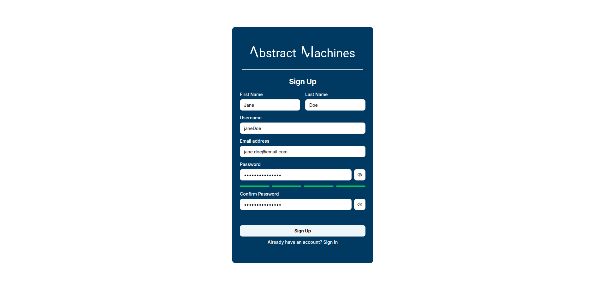

> Ensure the username is unique, you are using a valid email, and the password contains 8-24 characters, include at least 1 lowercase letter, 1 uppercase letter, 1 number and 1 special character.

## Step 2: Create a New Domain

A **Domain** in Magistrala is a logically isolated environment where you manage your IoT ecosystem — including clients, channels, rules, alarms, dashboards, and more. Think of it as your private workspace for managing related devices and data flows.

To create a new domain:

1. After you register, you will be redirected to the domains page.
   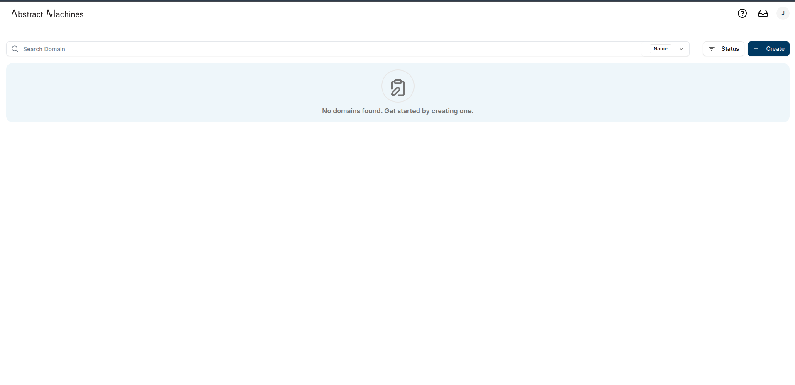
2. Click on the "Create Domain" button to create a new domain.
3. The name and route are compulsory. The **route** needs to be **unique**.
   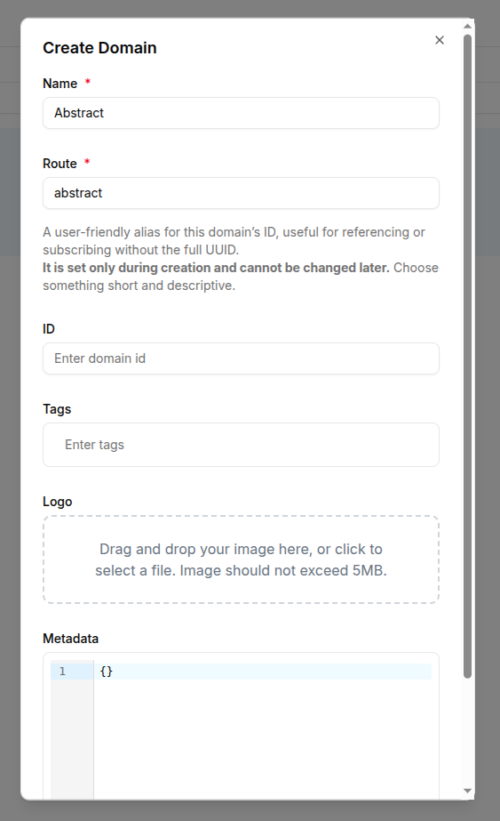
4. Other optional parameters include: - ID: If you'd like to use a custom domain ID instead of an auto-generated one. - tags: Useful for categorizing or filtering domains. - Logo: Upload an image/logo to visually represent your domain in the UI. - metadata: Attach any custom JSON key-value pairs(e.g. project type, environment, or business unit identifiers).
   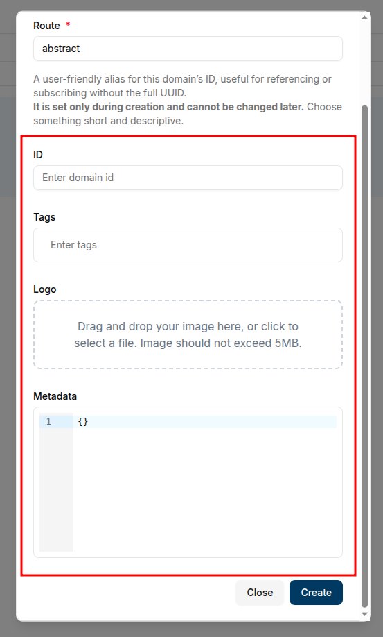

After creation, the domain will appear on your homepage.
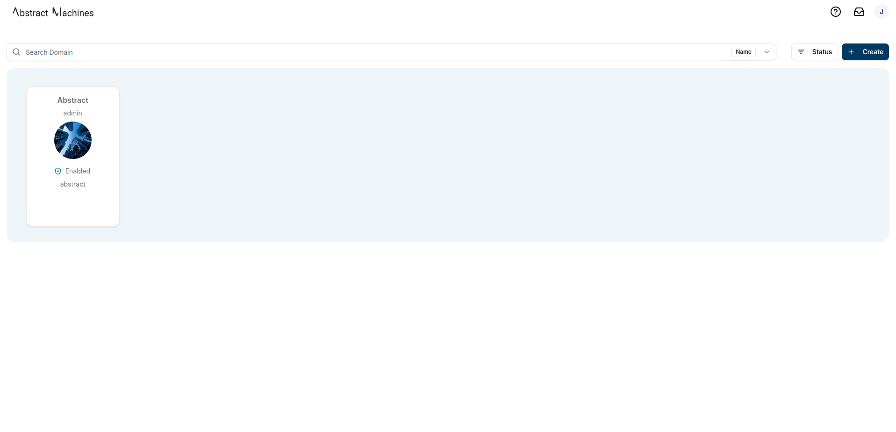

## Step 3: Manage the Domain

1. Click on the domain card to manage the domain.
2. Once inside the domain, the **Home Dashboard** will show you key metrics:
   - Number of enabled and disabled **members**.
   - Number of enabled and disabled **clients**.
   - Number of enabled and disabled **channels**.
   - Number of enabled and disabled **groups**.
   - List of your latest **dashboards**.

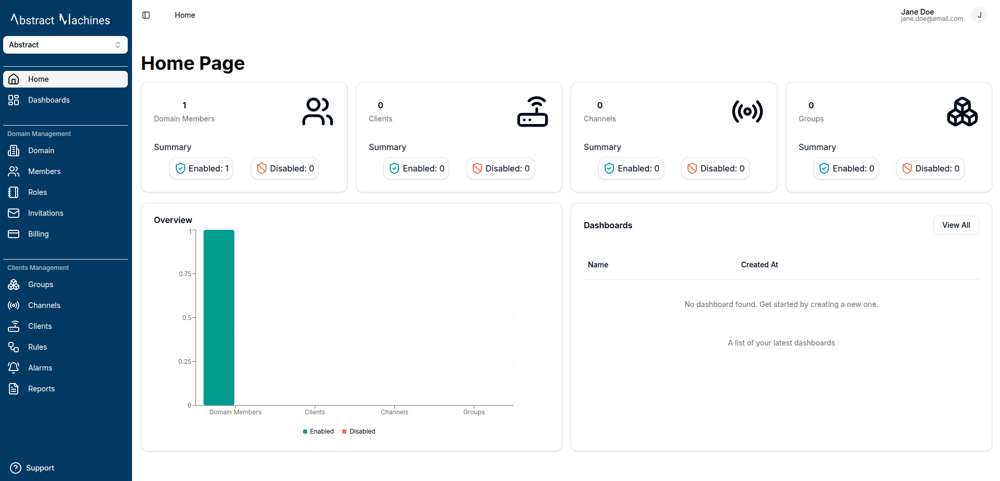

> Since this is a new domain, most counts will be 0 — except members, where you are currently the only one.

3. Click on the `Domain` tab on the sidebar to manage the domain info. From this page, you can:

   - Edit the domain name
   - Add or update tags
   - Upload a logo
   - Attach custom metadata (JSON format)
   - Enable or disable the domain
   - Copy the domain ID and route URL for reference

   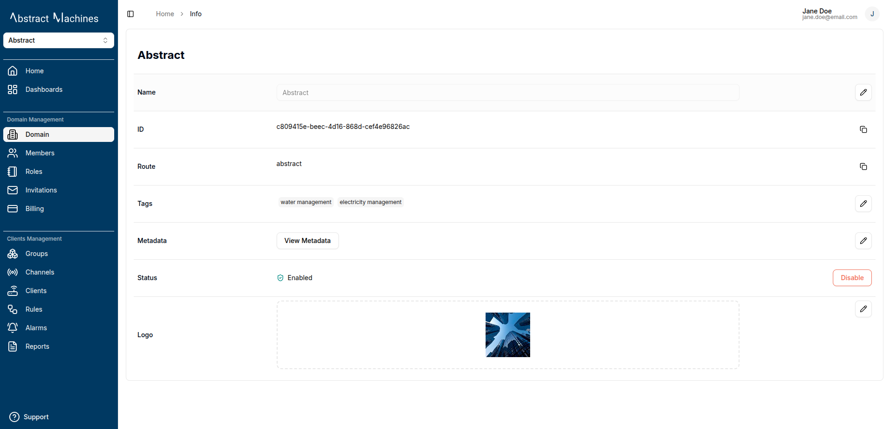

4. Click on `Members` to manage the domain members. On this page you are able to assign a user directly to the domain with a given role. You can be able to search for a user based on their username. Once a user is assigned to the domain, you are able to remove them from the domain by clicking on the trash icon.

   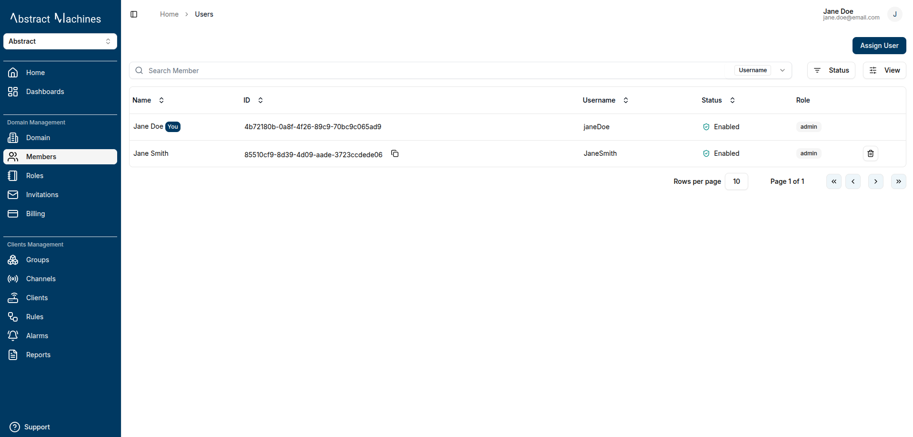

5. Navigate to `Roles` tabs to manage the domain roles. You can be able to create, update as well as delete roles while on this page.

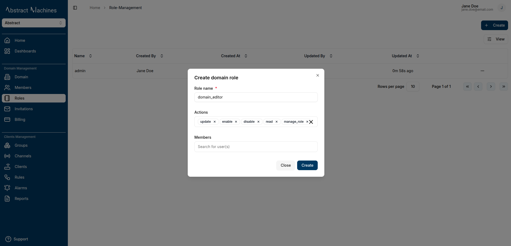

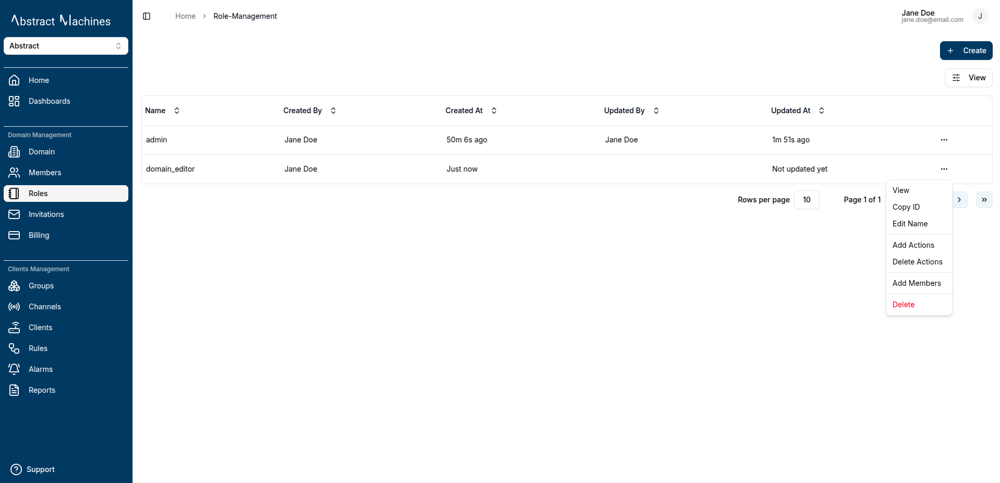

6. To invite a user to the domain, click on `Invitations` to view the invitations page. On this page you can be able to search for a user based on their username and invite them to the domain with a given role.

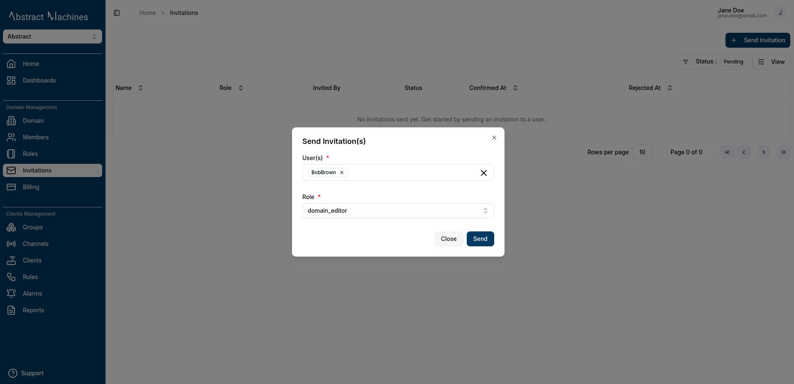

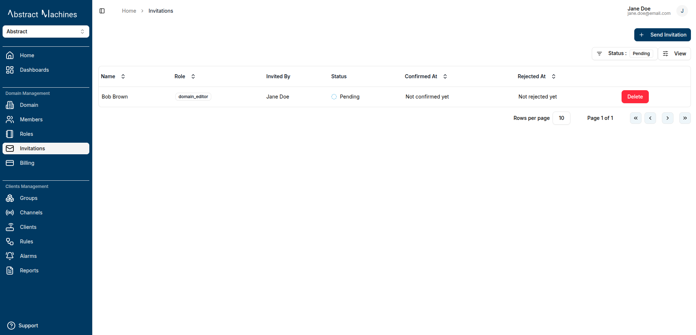

## Step 4: Create and Manage Groups

Groups help you to logically organize clients and channels.

1. To create a group, navigate to the `Groups` tab on the sidebar, click on the `+ create` button on the group sidebar. Enter the following fields:
   - Name: This is compulsory
   - Description
   - Parent - This is the parent group
   - Metadata
2. Once the group is created, you are able to manage it in the group page. In this page you can:
   - Update group name
   - Update description
   - Attach custom metadata (JSON format)
   - Enable or disable the group
   - Copy the group ID
   - Add group to a parent group
   - Share the group with other domain members
   - Delete group

## Step 5: Create and Manage Channels

While in the group page, navigate to the channels tab on the group top nav. You can optionally manage channels in the global channels page on the sidebar, if you don't want to place the channel in any group.
While on this page:

1. Click on `+ Create` to create a new channel. The following fields are available:
   - Name - Compulsory
   - Route - can be used in place of the full UUID
   - Tags
   - Metadata
2. You can optionally assign an already existing channel to the group by clicking on the `Assign Channels` button and selecting the channels you want to add to the group.
3. Once the channel has been added, click on the channel row to view and manage the channel.

## Step 6: Create and Manage Clients

Navigate to the clients tab on the group top nav. While on this page:

1. Click on `+ Create` to create an new client. The following fields are available:
   - Name - Compulsory
   - Key - used to authorize the client to send messages
   - Tags
   - Metadata
2. You can optionally assign an already existing client to the group by clicking on the `Assign Clients` button and selecting the clients you want to add to the group.
3. Once the client has been added, click on the client row to view and manage the client

## Step 7: Connect Clients to Channels

While on the view client page:

1. Navigate to the connections tab on the client top nav
2. Click the `Connect` button, select the channels you want to connect to, and the connection type - `subscribe` (read messages in the channel) or `publish` (send messages in the channel) or `both`.

You can optionally connect a client via the connections tab in the channel section.

## Step 8: Create a Rule to Save Messages

To be able to store messages in the Magistrala internal storage, you need to create a rule for this. Our Rules Engine provides powerful, flexible message processing via scriptable rules.
To create a rule:

1. Navigate to the `Rules` page on the sidebar. This page allows you to list, create and manage rules.
2. Click on `+ Create` to start creating a rule.This will redirect you to the create rule page.
3. While on this page, you are able to add an input node, logic node, and output node(s). To learn more about these please view our user guide docs on the [Rules Engine](https://docs.magistrala.abstractmachines.fr/user-guide/rules-engine#view-a-rule).
4. To store messages being sent in the channel, select the input node, and choose the channel you want to store messages for. You can optionally add the topic to filter the messages being stored.
5. Select `Add Logic` to add the logic node. Select the `Code Editor`. The default code provided (Lua script) allows you to store messages if you send messages in SenML format. If you send messages in another format e.g. JSON, please refer to our [storage guide](https://docs.magistrala.abstractmachines.fr/user-guide/rules-engine#store-messages) on how to convert the messages to SenML format.
6. Click `Add Output` and select `Internal DB` option as the output node.
7. You can optionally connect the nodes together to visually illustrate the data flow.
8. Once everything is set, click `Save Rule` to save the rule. This will open a dialog box, requesting for you to provide the rule name. Please provide a descriptive name so as to keep proper track of what the rules do.
9. You can optionally set a schedule to trigger the rule execution at specific periods.

## Step 9: Send a Message in a Channel via the UI

To send a message in a channel via the UI, go back to the view channel page and click on the

## Step 10: Create Alarms using Rules

## Step 11: View Alarms in the Alarms Page

## Step 12: Generate, Schedule and Update Reports

## Step 13: Manage Dashboards

## Step 14: Invite Users to Your Domain

## Step 15: Update User Preferences
