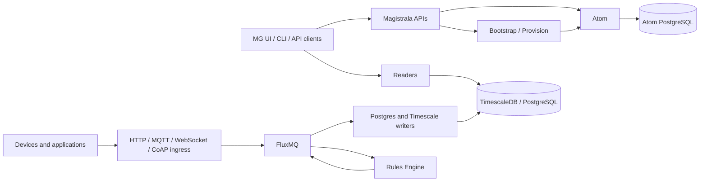

## Components

Magistrala is composed from a small set of runtime services and two external core systems:
[Atom][atom] for identity, credentials, domains, roles, policies, certificates, and audit, and
[FluxMQ][fluxmq] for MQTT/AMQP message transport and event streams.

The product concepts exposed in the UI and APIs still use Magistrala names such as users,
clients, channels, groups, and domains. In the current deployment those concepts are backed by
Atom objects:

| Magistrala concept | Atom primitive |
| :----------------- | :------------- |
| Domain             | Tenant         |
| User               | Entity         |
| Client             | Entity         |
| Channel            | Resource       |
| Group              | Group          |
| Role / policy      | Role assignment or direct policy |

The current Docker environment wires these URLs to Atom endpoints, for example
`MG_DOMAINS_URL=http://atom:8080/tenants`, `MG_USERS_URL=http://atom:8080/entities`,
`MG_CLIENTS_URL=http://atom:8080/entities`, and
`MG_CHANNELS_URL=http://atom:8080/resources`.

Magistrala's main runtime components are:

| Component                         | Description |
| :-------------------------------- | :---------- |
| [Atom][atom]                      | Identity, credentials, domains, roles, policies, certificates, and audit system of record. |
| [Atom bootstrap][atom-bootstrap]  | Seeds Atom with Magistrala profiles, service identities, and service tokens used by the deployment. |
| [FluxMQ][fluxmq]                  | Message broker and event stream layer used by protocol ingress, writers, and internal services. |
| [certs][certs]                    | Certificate management integration for client and service certificates. |
| [bootstrap][bootstrap]            | Provides configuration for newly created or enrolled clients. |
| [provision][provision]            | Provides automated provisioning flows for clients and channels. |
| [consumers][consumers]            | Receives messages and persists or forwards them to configured destinations. |
| [readers][readers]                | Implements message readers for PostgreSQL and TimescaleDB. |
| [rules-engine][ee-rules-engine]   | Enterprise Edition workflow engine for scheduled and message-triggered processing. |

## Domain Model

The platform consists of the following core entities: **user**, **client**, **channel**, **group**, and **domain**.

`User` represents the real human user of the system. Users authenticate through Atom-backed credentials and, once logged in, can manage domains, groups, clients, channels, and roles according to their permissions.

`Group` represents a logical grouping of clients, channels, or other groups. It simplifies access control by allowing related entities to be managed together. Groups can form a parent-child hierarchy, and roles determine what members can do with the group and its associated entities.

`Client` represents a device or application connected to Magistrala. Clients publish and subscribe through channels, and roles determine which users can manage or interact with them.

`Channel` represents a communication channel. It is the message route that connected clients publish to or subscribe from. A client can connect to multiple channels, and a channel can have multiple connected clients. Connections can grant publish, subscribe, or publish-and-subscribe behavior.

`Domain` represents a top-level organizational unit that encompasses groups, channels, clients, rules, reports, and alarms. A user's role on a domain determines what actions they can perform on the domain and the entities inside it.

## Messaging

Magistrala is built on [FluxMQ][fluxmq] as the primary broker and event-stream layer. Protocol adapters and internal services publish to FluxMQ routes derived from domains, channels, and subtopics, while writers and processors consume from broker-managed streams. Some deployments may still include [NATS][nats] or other infrastructure components for internal messaging, but FluxMQ is the current default broker in the Docker deployment.

In general, there is no constraint put on content that is being exchanged through channels. However, in order to be post-processed and normalized, messages should be formatted using [SenML][senml].

## Edge

Magistrala platform can be run on the edge as well. Deploying Magistrala on a gateway makes it able to collect, store and analyze data, organize and authenticate devices. To connect Magistrala instances running on a gateway with Magistrala in a cloud we can use the following gateway service:

- [Agent][agent]

## Unified IoT Platform

Running Magistrala on gateway moves computation from cloud towards the edge thus decentralizing IoT system. Since we can deploy same Magistrala code on gateway and in the cloud there are many benefits but the biggest one is easy deployment and adoption - once engineers understand how to deploy and maintain the platform, they will be able to apply those same skills to any part of the edge-fog-cloud continuum. This is because the platform is designed to be consistent, making it easy for engineers to move between them. This consistency will save engineers time and effort, and it will also help to improve the reliability and security of the platform. Same set of tools can be used, same patches and bug fixes can be applied. The whole system is much easier to reason about, and the maintenance is much easier and less costly.

[atom]: https://github.com/absmach/atom
[fluxmq]: https://github.com/absmach/fluxmq
[atom-bootstrap]: https://github.com/absmach/magistrala/tree/main/cmd/atom-bootstrap
[certs]: https://github.com/absmach/magistrala/tree/main/certs
[bootstrap]: https://github.com/absmach/magistrala/tree/main/bootstrap
[consumers]: https://github.com/absmach/magistrala/tree/main/consumers
[provision]: https://github.com/absmach/magistrala/tree/main/provision
[readers]: https://github.com/absmach/magistrala/tree/main/readers
[ee-rules-engine]: /dev-guide/services/rules-engine
[nats]: https://nats.io/
[rabbitmq]: https://www.rabbitmq.com/
[vernemq]: https://vernemq.com/
[kafka]: https://kafka.apache.org/
[senml]: https://tools.ietf.org/html/draft-ietf-core-senml-08
[agent]: /dev-guide/edge#agent
