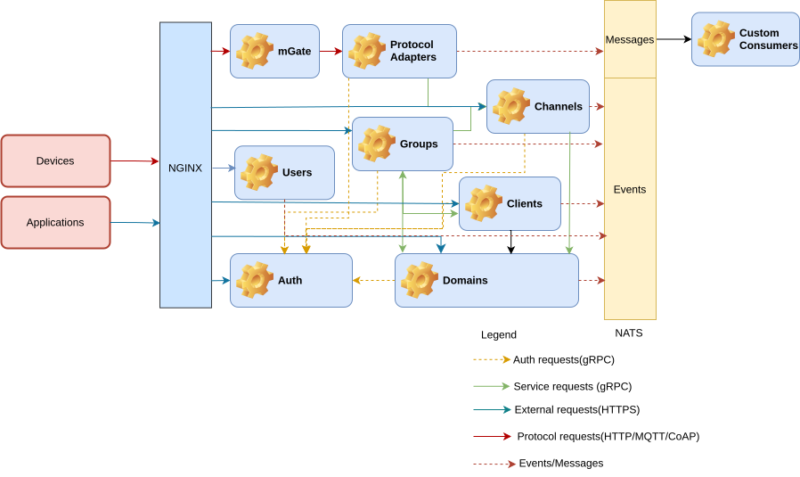

Magistrala is built on top of [FluxMQ](https://github.com/absmach/fluxmq), a message broker designed for both messaging and durable event streams, and on [Atom](https://github.com/absmach/atom), a lightweight identity-and-authorization service that is the system of record for domains, users, clients, channels, groups, roles, and policies. Magistrala itself provides everything around them: protocol adapters, device provisioning, data processing, and observability.

## Who Connects

Three kinds of callers reach the platform: operators and apps — the web UI, mobile clients, the CLI, and SDKs — over HTTPS; external integrations, such as other services, automations, and data systems, over HTTP or AMQP; and devices and gateways — sensors, actuators, edge nodes — over MQTT, WebSocket, HTTP, or CoAP.

## Platform Core

**NGINX** is the platform's API gateway. It terminates TLS and routes HTTPS, MQTT(S), WebSocket, and AMQP traffic to the services behind it.

**FluxMQ** is a three-node broker cluster that handles protocol adapters, message brokering, and durable event streams for MQTT v3/v5, WebSocket, HTTP, CoAP, and AMQP. Internal services connect to it as authenticated local principals — a client certificate plus a SASL secret — rather than as ordinary clients, which lets the broker attach a trustworthy transport protocol and identity to every message it stores. Every message published to the platform lands on the `m` stream; the Rules Engine consumes it, and republishes onto the `writers` and `alarms` streams that the storage and alarm services consume.

The **FluxMQ auth bridge** sits between FluxMQ and Atom. It handles the broker's auth callouts — validating a connecting client's credentials and looking up its routes — and proxies HTTP publish requests.

**Atom** is Magistrala's identity, authorization, and catalog service. It runs as its own deployment with its own PostgreSQL database, and is the system of record for domains, users, clients, channels, groups, roles, and policies. It issues the JWTs and JWKS that every other service validates on every request. See [Domain Model](#domain-model) below for how Magistrala's concepts map onto Atom's.

## Application & Data Services

- **UX layer** — the Magistrala UI and its UI backend, served through NGINX and authorized against Atom. Handles console aggregation, images, and metadata.
- **Rules Engine** (Enterprise Edition) — consumes the `m` stream, applies rules to process, transform, and route messages, and emits the results back onto the `writers` and `alarms` streams.
- **Alarms** (Enterprise Edition) — an event consumer and API that turns rule-triggered events into alarm lifecycle records, authorized against Atom.
- **Reports** (Enterprise Edition) — schedules queries against message history through the Timescale Reader and renders them to PDF via Gotenberg, then emails them out.
- **Timescale Writer** — a durable stream consumer that stores normalized messages in TimescaleDB.
- **Timescale Reader** — an HTTP and gRPC query API over the same data, used by the UI backend, Rules Engine, and Reports, and authorized against Atom.

## Persistence

Each service that needs durable storage owns its own PostgreSQL database — Rules DB, Alarms DB, Reports DB — while the UX layer's data (console state, images, metadata) lives in its own PostgreSQL- and SeaweedFS-backed store. Messages themselves land in a shared TimescaleDB, written by the Timescale Writer and served to readers through the Timescale Reader. See [Storage Architecture](/dev-guide/storage-architecture) for the full breakdown of what lives where and why.

## Observability

Platform services and the UI export distributed traces to **Jaeger** via **OpenTelemetry**, giving visibility into how a request or message moves across the system.

## Domain Model

Magistrala keeps its own product concepts — **domain**, **user**, **client**, **channel**, and **group** — but Atom is their system of record:

| Magistrala concept | Atom concept              | Meaning                                                             |
| :------------------ | :-------------------------- | :--------------------------------------------------------------------- |
| Domain              | Tenant                     | Isolation boundary for one organization, project, or environment      |
| User                | Entity, kind `human`       | A person who logs in and uses the UI/API                              |
| Client              | Entity, kind `device`      | A device or application that sends/receives data                      |
| Channel             | Resource, kind `channel`   | A messaging/data path that clients can publish or subscribe to        |
| Group               | Group                      | A collection of users, clients, channels, or other grouped objects    |

`Domain` is the top-level organizational unit — every user, client, channel, and group belongs to one, and a user's role on a domain determines what they can do inside it.

`User` is a person who authenticates against Atom to obtain an access token, then manages domains, groups, clients, and channels in CRUD fashion and defines access control by assigning roles.

`Group` is a logical grouping of clients, channels, or other groups, used to simplify access control — a user who holds a role on a group can access everything the group contains. Groups support a parent/child hierarchy.

`Client` represents a device or application connected to Magistrala that exchanges messages with other clients. Roles determine which actions a role member can perform on a client.

`Channel` is a communication channel — a message topic that any connected client can publish or subscribe to, and a grouping mechanism for clients. A client's connection to a channel is publish-only, subscribe-only, or both.

## Identity & Access Control

Atom access control is built from **actions** (single permission verbs like `read`, `write`, `delete`, `role.manage`, `policy.manage`, `publish`, `subscribe`), **permission blocks** (where those actions apply — for example, read and publish on all channels in domain `d1`), and **roles** (a named bundle of permission blocks assigned to a user). A user holding the `tenant-admin` role on a domain can typically manage every client, channel, group, rule, alarm, and report inside it; narrower, object-scoped roles — such as a reader role on a single channel — restrict that further. See [Storage Architecture § Authorization](/dev-guide/storage-architecture#authorization) for how a permission check is evaluated on the message path.

## Messaging

FluxMQ is Magistrala's default messaging and event-streaming backbone, with NATS available as a build-time alternative. There is no constraint on the content exchanged through a channel, but messages should be formatted using [SenML][senml] so they can be post-processed and normalized.

## Edge

Magistrala can run on the edge as well. Deploying it on a gateway lets it collect, store, and analyze data, and organize and authenticate devices locally. To connect a gateway deployment back to a cloud deployment, use the [Agent][agent] service.

## Unified IoT Platform

Running Magistrala on a gateway moves computation from the cloud toward the edge, decentralizing the system. Because the same codebase runs on the gateway and in the cloud, engineers who learn to deploy and maintain the platform can apply the same skills anywhere along the edge-fog-cloud continuum — the same tools, the same patches, the same operational playbook — which makes the whole system easier to reason about and cheaper to maintain.

[senml]: https://tools.ietf.org/html/draft-ietf-core-senml-08
[agent]: /dev-guide/edge#agent
