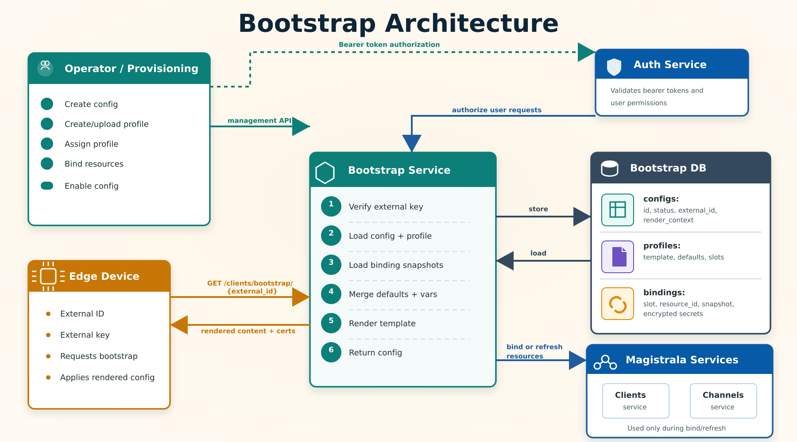

**Bootstrapping** is the process where a device retrieves the configuration it needs to start or recover communication with Magistrala. A device usually bootstraps when:

- it has only bootstrap credentials and does not yet have its runtime configuration
- it cannot connect with the configured Magistrala services
- it needs to refresh its local configuration

> **Note:** Bootstrapping and provisioning are distinct.
>
> - **Provisioning** creates or manages Magistrala entities such as clients and channels.
> - **Bootstrapping** stores device bootstrap configs, renders templates, and returns the rendered configuration to the device.

## Architecture

Bootstrap no longer treats a config as a Magistrala client with connected channels. A bootstrap config is now an enrollment-like record owned by Bootstrap. It can reference a profile, carry per-device render variables, and bind explicit resources such as clients or channels.



The diagram shows two Bootstrap flows. In the **management flow**, Bootstrap calls Magistrala services during bind or refresh to read the current client or channel data, then stores that data as binding snapshots in Bootstrap DB. In the **device bootstrap flow**, Bootstrap does not call Clients or Channels services; it renders from the config, profile, and binding snapshots already stored in Bootstrap.

The main resources are:

- **Config:** A Bootstrap-owned device enrollment. It stores `id`, `external_id`, hashed `external_key`, optional `profile_id`, `render_context`, legacy certificate fields, and `status`.
- **Profile:** A reusable template for rendering device configuration. Profiles store `template_format`, `content_template`, shared `defaults`, and declared `binding_slots`.
- **Binding slot:** A named placeholder declared by a profile, for example `mqtt_client`, `telemetry`, or `commands`.
- **Binding snapshot:** A point-in-time copy of a bound resource. Bootstrap stores the resource `type`, `resource_id`, non-secret `snapshot`, and encrypted `secret_snapshot`.
- **Render context:** The data injected into templates. It is composed from profile defaults, config render context, device identity, and binding snapshots.

Bootstrap does not automatically keep clients and channels synchronized during rendering. Resource data is copied into binding snapshots when resources are bound or refreshed. This keeps the device bootstrap path local to Bootstrap.

### Binding Slots

A binding slot is a named placeholder in a profile that says, "this template needs a resource here." It does not create the resource. It only declares what kind of resource must be attached before the profile can render correctly.

For example, a Raspberry Pi temperature profile can declare these slots:

```json
[
  {
    "name": "mqtt_client",
    "type": "client",
    "required": true
  },
  {
    "name": "telemetry",
    "type": "channel",
    "required": true
  }
]
```

This means every config using that profile must bind:

- `mqtt_client` to an existing Magistrala client.
- `telemetry` to an existing Magistrala channel.

After binding, the template can read the resolved data through `.Bindings`. For example, `.Bindings.mqtt_client.ID` refers to the bound client ID, and `.Bindings.telemetry.ID` refers to the bound channel ID.

The optional `fields` list on a slot controls which keys are copied from the resource into the binding snapshot when binding or refreshing. If omitted, all fields the resolver provides are snapshotted. Restrict `fields` to limit what data Bootstrap stores.

## Bootstrap Flow

1. Create a config with an `external_id` and `external_key`.
2. Create or upload a profile template.
3. Assign the profile to the config.
4. Bind profile slots to concrete resources.
5. The device calls the bootstrap endpoint with its external credentials.
6. Bootstrap verifies the external key, loads the profile and bindings, renders the template, and returns the rendered config.

If you want to prevent devices from bootstrapping while the profile and bindings are being set up, disable the config after creation and re-enable it when ready.

Configs start enabled. An enabled config is immediately available for device bootstrap. Disable a config to prevent devices from bootstrapping while the profile or bindings are still being configured, then re-enable it when ready.

## Configs

Configs are managed under the compatibility path:

```http
/{domain_id}/clients/configs
```

Although the path contains `clients`, configs are Bootstrap-owned records. The create request does not take a `client_id`, `client_secret`, or channel list.

### Create Config

```bash
curl -s -S -i -X POST \
  -H "Authorization: Bearer <user_token>" \
  -H "Content-Type: application/json" \
  http://localhost:9013/<domain_id>/clients/configs \
  -d '{
    "external_id": "01:6:0:sb:sa",
    "external_key": "device-bootstrap-key",
    "name": "warehouse sensor config",
    "profile_id": "77708c94-3ff5-4068-ab5b-72d1318a9f1c",
    "render_context": {
      "site": "warehouse-1",
      "region": "nairobi"
    }
  }'
```

`external_id` identifies the device during bootstrap. `external_key` is the secret known by the device and is hashed with scrypt before storage. The plain value is never returned by the API.

`render_context` contains per-device variables. During template rendering, these values are merged with profile `defaults`.

The response body is the created config. The `id` is server-generated. `status` is always `enabled` on creation regardless of what is sent. `name` must be unique within a domain — attempting to create a second config with the same name in the same domain returns `409 Conflict`.

```json
{
  "id": "3094cf29-e73f-4be1-a4d2-b5c5d7a827ec",
  "external_id": "01:6:0:sb:sa",
  "name": "warehouse sensor config",
  "status": "enabled",
  "profile_id": "77708c94-3ff5-4068-ab5b-72d1318a9f1c",
  "render_context": {
    "site": "warehouse-1",
    "region": "nairobi"
  }
}
```

### Config Fields

```json
{
  "id": "3094cf29-e73f-4be1-a4d2-b5c5d7a827ec",
  "external_id": "01:6:0:sb:sa",
  "name": "warehouse sensor config",
  "status": "enabled",
  "profile_id": "77708c94-3ff5-4068-ab5b-72d1318a9f1c",
  "render_context": {
    "site": "warehouse-1",
    "region": "nairobi"
  },
  "content": "",
  "client_cert": "",
  "client_key": "",
  "ca_cert": ""
}
```

`status` replaces the old `state` field. Valid status values are `enabled` and `disabled`. Numeric values are still accepted: `0` = `enabled`, `1` = `disabled`.

`content` is a static fallback string. When no profile is assigned, Bootstrap returns this value as the rendered output. When a profile is assigned, `content` is ignored during rendering.

### Config Endpoints

| Method | Path | Description |
| --- | --- | --- |
| `POST` | `/{domain_id}/clients/configs` | Create a config |
| `GET` | `/{domain_id}/clients/configs` | List configs |
| `GET` | `/{domain_id}/clients/configs/{config_id}` | View a config |
| `PATCH` | `/{domain_id}/clients/configs/{config_id}` | Update editable config fields |
| `DELETE` | `/{domain_id}/clients/configs/{config_id}` | Remove a config |
| `PATCH` | `/{domain_id}/clients/configs/certs/{config_id}` | Update legacy certificate fields |
| `POST` | `/{domain_id}/clients/configs/{config_id}/enable` | Enable device bootstrap for a config |
| `POST` | `/{domain_id}/clients/configs/{config_id}/disable` | Disable device bootstrap for a config |

List configs supports pagination and filters such as `status`, `external_id`, `id`, and partial `name`. By default, listing returns only `enabled` configs. Pass `?status=all` to list configs regardless of status, or `?status=disabled` to list only disabled configs.

## Profiles

Profiles define reusable device templates. A profile can declare binding slots so operators know which resources must be bound before rendering.

Profiles are managed under:

```http
/{domain_id}/clients/bootstrap/profiles
```

### Create Profile

```bash
curl -s -S -i -X POST \
  -H "Authorization: Bearer <user_token>" \
  -H "Content-Type: application/json" \
  http://localhost:9013/<domain_id>/clients/bootstrap/profiles \
  -d '{
    "name": "mqtt sensor profile",
    "description": "Renders MQTT settings for a sensor",
    "template_format": "json",
    "defaults": {
      "qos": 1,
      "region": "nairobi"
    },
    "binding_slots": [
      {
        "name": "mqtt_client",
        "type": "client",
        "required": true,
        "fields": ["id", "name"]
      },
      {
        "name": "telemetry",
        "type": "channel",
        "required": true,
        "fields": ["id", "name"]
      }
    ],
    "content_template": "{\n  \"device_id\": \"{{ .Device.ID }}\",\n  \"external_id\": \"{{ .Device.ExternalID }}\",\n  \"site\": \"{{ .Vars.site }}\",\n  \"client_id\": \"{{ (index .Bindings \"mqtt_client\").ID }}\",\n  \"telemetry_channel\": \"{{ (index .Bindings \"telemetry\").ID }}\",\n  \"qos\": {{ .Vars.qos }}\n}"
  }'
```

`version` increments automatically on every profile update. It is read-only and is included in profile responses. Use it to track whether a profile has changed since a device last bootstrapped.

Supported `template_format` values are:

| Format | Behavior |
| --- | --- |
| `go-template` | Render with Go `text/template` |
| `json` | Render as a Go template, then validate the result as JSON |
| `yaml` | Render as a Go template, then validate the result as YAML |
| `toml` | Render as a Go template, then validate the result as TOML |
| `raw` | Return `content_template` without template execution |

Template rendering uses `missingkey=error`, so missing variables fail rendering instead of silently producing invalid output.

Templates are validated at create and update time. Submitting a profile with an invalid Go template syntax returns an error immediately, before the profile is saved.

### Upload Profile

Profiles can also be uploaded as JSON, YAML, or TOML:

```bash
curl -s -S -i -X POST \
  -H "Authorization: Bearer <user_token>" \
  -H "Content-Type: application/yaml" \
  http://localhost:9013/<domain_id>/clients/bootstrap/profiles/upload \
  --data-binary @profile.yaml
```

The uploaded document uses the same fields as the create profile request.

### Profile Slots

The slots-only endpoint returns just the binding slots declared by a profile:

```bash
curl -s -S \
  -H "Authorization: Bearer <user_token>" \
  http://localhost:9013/<domain_id>/clients/bootstrap/profiles/<profile_id>/slots
```

Example response:

```json
{
  "binding_slots": [
    {
      "name": "mqtt_client",
      "type": "client",
      "required": true,
      "fields": ["id", "name"]
    }
  ]
}
```

### Render Preview

Render preview renders a profile without changing stored configs or bindings. It is useful for validating templates before assigning them to devices.

```bash
curl -s -S -X POST \
  -H "Authorization: Bearer <user_token>" \
  -H "Content-Type: application/json" \
  http://localhost:9013/<domain_id>/clients/bootstrap/profiles/<profile_id>/render-preview \
  -d '{
    "config": {
      "id": "preview-config",
      "external_id": "01:6:0:sb:sa",
      "render_context": {
        "site": "warehouse-1"
      }
    },
    "bindings": [
      {
        "slot": "mqtt_client",
        "type": "client",
        "resource_id": "a-client-id",
        "snapshot": {
          "id": "a-client-id",
          "name": "sensor-client"
        }
      }
    ]
  }'
```

Example response:

```json
{
  "content": "{\n  \"device_id\": \"preview-config\",\n  \"site\": \"warehouse-1\"\n}"
}
```

### Profile Endpoints

| Method | Path | Description |
| --- | --- | --- |
| `POST` | `/{domain_id}/clients/bootstrap/profiles` | Create a profile |
| `POST` | `/{domain_id}/clients/bootstrap/profiles/upload` | Upload a JSON, YAML, or TOML profile |
| `GET` | `/{domain_id}/clients/bootstrap/profiles` | List profiles |
| `GET` | `/{domain_id}/clients/bootstrap/profiles/{profile_id}` | View a profile |
| `GET` | `/{domain_id}/clients/bootstrap/profiles/{profile_id}/slots` | List profile binding slots |
| `POST` | `/{domain_id}/clients/bootstrap/profiles/{profile_id}/render-preview` | Preview rendered profile output |
| `PATCH` | `/{domain_id}/clients/bootstrap/profiles/{profile_id}` | Update a profile |
| `DELETE` | `/{domain_id}/clients/bootstrap/profiles/{profile_id}` | Remove a profile |

## Bindings

Bindings connect a config to the concrete resources required by its profile. Binding stores snapshots in Bootstrap so rendering does not need to call the clients or channels services.

Bindings are managed under:

```http
/{domain_id}/clients/bootstrap/enrollments
```

In this path, `enrollment` means the Bootstrap config. There is no separate create-enrollment endpoint; create configs with `POST /{domain_id}/clients/configs`.

### Assign Profile

```bash
curl -s -S -i -X PATCH \
  -H "Authorization: Bearer <user_token>" \
  -H "Content-Type: application/json" \
  http://localhost:9013/<domain_id>/clients/bootstrap/enrollments/<config_id>/profile \
  -d '{
    "profile_id": "77708c94-3ff5-4068-ab5b-72d1318a9f1c"
  }'
```

### Bind Resources

```bash
curl -s -S -i -X PUT \
  -H "Authorization: Bearer <user_token>" \
  -H "Content-Type: application/json" \
  http://localhost:9013/<domain_id>/clients/bootstrap/enrollments/<config_id>/bindings \
  -d '{
    "bindings": [
      {
        "slot": "mqtt_client",
        "type": "client",
        "resource_id": "a7c1e8c0-c7e1-422e-8d7c-be0493f8142a"
      },
      {
        "slot": "telemetry",
        "type": "channel",
        "resource_id": "4819d016-6059-472d-9e39-eb10a9ccb30e"
      }
    ]
  }'
```

The profile must declare the requested slot, and the requested `type` must match the slot type. Required slots must be bound before the config can render successfully.

When a binding of type `channel` is saved, Bootstrap also calls the Magistrala Clients service to connect the enrolled client (`config.id`) to that channel. This means the device's client gains access to the channel as part of the bind operation. No separate connection step is needed.

### List Bindings

```bash
curl -s -S \
  -H "Authorization: Bearer <user_token>" \
  http://localhost:9013/<domain_id>/clients/bootstrap/enrollments/<config_id>/bindings
```

Example response:

```json
{
  "bindings": [
    {
      "config_id": "3094cf29-e73f-4be1-a4d2-b5c5d7a827ec",
      "slot": "mqtt_client",
      "type": "client",
      "resource_id": "a7c1e8c0-c7e1-422e-8d7c-be0493f8142a",
      "snapshot": {
        "id": "a7c1e8c0-c7e1-422e-8d7c-be0493f8142a",
        "name": "sensor-client"
      },
      "updated_at": "2026-05-05T10:00:00Z"
    }
  ]
}
```

`secret_snapshot` is encrypted at rest and is not returned by the list endpoint. It is decrypted only when rendering.

### Binding Endpoints

| Method | Path | Description |
| --- | --- | --- |
| `PATCH` | `/{domain_id}/clients/bootstrap/enrollments/{config_id}/profile` | Assign a profile to a config |
| `PUT` | `/{domain_id}/clients/bootstrap/enrollments/{config_id}/bindings` | Bind resources and store snapshots |
| `GET` | `/{domain_id}/clients/bootstrap/enrollments/{config_id}/bindings` | List binding snapshots |
| `POST` | `/{domain_id}/clients/bootstrap/enrollments/{config_id}/bindings/refresh` | Refresh stored binding snapshots |

`refresh` re-calls Magistrala Clients and Channels services to update the stored snapshots for every binding on the config. Use it after a bound client's credentials rotate or a channel is reconfigured. Rendering always uses the last stored snapshot, so devices will not see updated resource data until after a refresh.

## Template Data

Profile templates receive this render context:

```go
type RenderContext struct {
    Device   DeviceContext
    Vars     map[string]any
    Bindings map[string]BindingContext
}
```

Template fields:

| Field | Description |
| --- | --- |
| `.Device.ID` | The Bootstrap config `id` for this device enrollment |
| `.Device.ExternalID` | Device external ID |
| `.Device.DomainID` | Domain ID |
| `.Vars` | Profile defaults merged with config `render_context` |
| `.Bindings` | Binding contexts keyed by slot name |
| `.Bindings.<slot>.Type` | Bound resource type |
| `.Bindings.<slot>.ID` | Bound resource ID |
| `.Bindings.<slot>.Snapshot` | Non-secret snapshot fields |
| `.Bindings.<slot>.Secret` | Decrypted secret snapshot fields available during render |

Profile `defaults` are merged first, then config `render_context` values are applied on top. Config values always win over profile defaults when both have the same key. `.Device.*` identity fields are always available regardless of what is in `defaults` or `render_context`.

Templates are rendered with `missingkey=error`. A template that references `.Vars.key` where `key` is absent from both `defaults` and `render_context` will fail rendering and Bootstrap will return an error to the device.

## Device Bootstrap

Devices fetch rendered configuration with their external credentials:

```bash
curl -s -S -i \
  -H "Authorization: Client <external_key>" \
  http://localhost:9013/clients/bootstrap/<external_id>
```

Example response:

```json
{
  "id": "3094cf29-e73f-4be1-a4d2-b5c5d7a827ec",
  "content": "{\n  \"device_id\": \"3094cf29-e73f-4be1-a4d2-b5c5d7a827ec\"\n}",
  "client_cert": "",
  "client_key": "",
  "ca_cert": ""
}
```

The response `content` is the rendered profile output when a profile is assigned. If no profile is assigned, Bootstrap returns the config's stored `content` field value without template processing.

**Render errors** — Bootstrap returns a non-2xx status if the config is disabled, a required binding slot has no snapshot, or template execution fails. Devices should treat any error response as a signal to retry after a backoff.

Device bootstrap endpoints:

| Method | Path | Description |
| --- | --- | --- |
| `GET` | `/clients/bootstrap/` | Bootstrap with external credentials |
| `GET` | `/clients/bootstrap/{external_id}` | Bootstrap by external ID |
| `GET` | `/clients/bootstrap/secure/{external_id}` | Secure bootstrap with encrypted external key and encrypted response |

## Operational Endpoints

| Method | Path | Description |
| --- | --- | --- |
| `GET` | `/health` | Service health check |
| `GET` | `/metrics` | Prometheus metrics |

## Secure Bootstrap

Secure bootstrap is used when a device cannot rely on transport-level encryption yet. The device encrypts its external key with the Bootstrap encryption key, sends the encrypted value as the client authorization credential, and receives an encrypted response.

The encryption key is configured with `MG_BOOTSTRAP_ENCRYPT_KEY`. Bootstrap reads this value on startup.

### Encrypt the External Key

```go
package main

import (
    "crypto/aes"
    "crypto/cipher"
    "crypto/rand"
    "fmt"
    "io"
)

func encrypt(key, data []byte) ([]byte, error) {
    block, err := aes.NewCipher(key)
    if err != nil {
        return nil, err
    }

    ciphertext := make([]byte, aes.BlockSize+len(data))
    iv := ciphertext[:aes.BlockSize]
    if _, err := io.ReadFull(rand.Reader, iv); err != nil {
        return nil, err
    }

    stream := cipher.NewCFBEncrypter(block, iv)
    stream.XORKeyStream(ciphertext[aes.BlockSize:], data)
    return ciphertext, nil
}

func main() {
    encrypted, err := encrypt([]byte("<crypto_key>"), []byte("<external_key>"))
    if err != nil {
        panic(err)
    }
    fmt.Printf("%x\n", encrypted)
}
```

### Call Secure Bootstrap

```bash
curl --location 'http://localhost:9013/clients/bootstrap/secure/<external_id>' \
  --header 'Accept: application/json' \
  --header 'Authorization: Client <encrypted_external_key>' \
  --output bootstrap-response.bin
```

The response is encrypted binary data. Decrypt it with the same `MG_BOOTSTRAP_ENCRYPT_KEY`.

## CLI

The Magistrala CLI exposes the main Bootstrap operations:

```bash
magistrala-cli bootstrap create '<JSON_config>' <domain_id> <user_auth_token>
magistrala-cli bootstrap get all <domain_id> <user_auth_token>
magistrala-cli bootstrap get <config_id> <domain_id> <user_auth_token>
magistrala-cli bootstrap update config '<JSON_config>' <domain_id> <user_auth_token>
magistrala-cli bootstrap remove <config_id> <domain_id> <user_auth_token>
magistrala-cli bootstrap whitelist '<JSON_config>' <domain_id> <user_auth_token>
magistrala-cli bootstrap bootstrap <external_id> <external_key>
magistrala-cli bootstrap bootstrap secure <external_id> <external_key> <crypto_key>
magistrala-cli bootstrap profiles create '<JSON_profile>' <domain_id> <user_auth_token>
magistrala-cli bootstrap profiles get all <domain_id> <user_auth_token>
magistrala-cli bootstrap profiles get <profile_id> <domain_id> <user_auth_token>
magistrala-cli bootstrap profiles update '<JSON_profile>' <domain_id> <user_auth_token>
magistrala-cli bootstrap profiles remove <profile_id> <domain_id> <user_auth_token>
magistrala-cli bootstrap enrollments assign-profile <config_id> <profile_id> <domain_id> <user_auth_token>
magistrala-cli bootstrap enrollments bind <config_id> '<JSON_bindings>' <domain_id> <user_auth_token>
magistrala-cli bootstrap enrollments get-bindings <config_id> <domain_id> <user_auth_token>
magistrala-cli bootstrap enrollments refresh-bindings <config_id> <domain_id> <user_auth_token>
```

The CLI still uses `whitelist` for compatibility, but the underlying model is config `status` with `enabled` and `disabled` values.

## Endpoint Examples

Use these examples as quick smoke tests for every Bootstrap endpoint. Replace `<domain_id>`, `<config_id>`, `<profile_id>`, `<external_id>`, `<external_key>`, `<encrypted_external_key>`, and `<user_token>` with real values.

### Configs

Create a config:

```bash
curl -s -S -i -X POST \
  -H "Authorization: Bearer <user_token>" \
  -H "Content-Type: application/json" \
  http://localhost:9013/<domain_id>/clients/configs \
  -d '{
    "external_id": "01:6:0:sb:sa",
    "external_key": "device-bootstrap-key",
    "name": "warehouse sensor config",
    "render_context": {
      "site": "warehouse-1"
    }
  }'
```

List configs (enabled only by default):

```bash
curl -s -S \
  -H "Authorization: Bearer <user_token>" \
  'http://localhost:9013/<domain_id>/clients/configs?offset=0&limit=10'
```

List all configs regardless of status:

```bash
curl -s -S \
  -H "Authorization: Bearer <user_token>" \
  'http://localhost:9013/<domain_id>/clients/configs?offset=0&limit=10&status=all'
```

View a config:

```bash
curl -s -S \
  -H "Authorization: Bearer <user_token>" \
  http://localhost:9013/<domain_id>/clients/configs/<config_id>
```

Update a config:

```bash
curl -s -S -i -X PATCH \
  -H "Authorization: Bearer <user_token>" \
  -H "Content-Type: application/json" \
  http://localhost:9013/<domain_id>/clients/configs/<config_id> \
  -d '{
    "name": "updated warehouse config",
    "render_context": {
      "site": "warehouse-2"
    }
  }'
```

Update config certificates:

```bash
curl -s -S -i -X PATCH \
  -H "Authorization: Bearer <user_token>" \
  -H "Content-Type: application/json" \
  http://localhost:9013/<domain_id>/clients/configs/certs/<config_id> \
  -d '{
    "client_cert": "PEM client certificate",
    "client_key": "PEM client key",
    "ca_cert": "PEM CA certificate"
  }'
```

Enable a config:

```bash
curl -s -S -i -X POST \
  -H "Authorization: Bearer <user_token>" \
  http://localhost:9013/<domain_id>/clients/configs/<config_id>/enable
```

Disable a config:

```bash
curl -s -S -i -X POST \
  -H "Authorization: Bearer <user_token>" \
  http://localhost:9013/<domain_id>/clients/configs/<config_id>/disable
```

Delete a config:

```bash
curl -s -S -i -X DELETE \
  -H "Authorization: Bearer <user_token>" \
  http://localhost:9013/<domain_id>/clients/configs/<config_id>
```

### Profiles

Create a profile:

```bash
curl -s -S -i -X POST \
  -H "Authorization: Bearer <user_token>" \
  -H "Content-Type: application/json" \
  http://localhost:9013/<domain_id>/clients/bootstrap/profiles \
  -d '{
    "name": "mqtt profile",
    "template_format": "json",
    "defaults": {
      "qos": 1
    },
    "binding_slots": [
      {
        "name": "mqtt_client",
        "type": "client",
        "required": true
      }
    ],
    "content_template": "{ \"device_id\": \"{{ .Device.ID }}\", \"client_id\": \"{{ (index .Bindings \"mqtt_client\").ID }}\" }"
  }'
```

Upload a profile:

```bash
curl -s -S -i -X POST \
  -H "Authorization: Bearer <user_token>" \
  -H "Content-Type: application/yaml" \
  http://localhost:9013/<domain_id>/clients/bootstrap/profiles/upload \
  --data-binary @profile.yaml
```

List profiles:

```bash
curl -s -S \
  -H "Authorization: Bearer <user_token>" \
  'http://localhost:9013/<domain_id>/clients/bootstrap/profiles?offset=0&limit=10'
```

View a profile:

```bash
curl -s -S \
  -H "Authorization: Bearer <user_token>" \
  http://localhost:9013/<domain_id>/clients/bootstrap/profiles/<profile_id>
```

List profile slots:

```bash
curl -s -S \
  -H "Authorization: Bearer <user_token>" \
  http://localhost:9013/<domain_id>/clients/bootstrap/profiles/<profile_id>/slots
```

Render preview:

```bash
curl -s -S -X POST \
  -H "Authorization: Bearer <user_token>" \
  -H "Content-Type: application/json" \
  http://localhost:9013/<domain_id>/clients/bootstrap/profiles/<profile_id>/render-preview \
  -d '{
    "config": {
      "id": "preview-config",
      "external_id": "01:6:0:sb:sa",
      "render_context": {
        "site": "warehouse-1"
      }
    },
    "bindings": [
      {
        "slot": "mqtt_client",
        "type": "client",
        "resource_id": "client-id",
        "snapshot": {
          "id": "client-id",
          "name": "sensor-client"
        }
      }
    ]
  }'
```

Update a profile:

```bash
curl -s -S -i -X PATCH \
  -H "Authorization: Bearer <user_token>" \
  -H "Content-Type: application/json" \
  http://localhost:9013/<domain_id>/clients/bootstrap/profiles/<profile_id> \
  -d '{
    "name": "updated mqtt profile",
    "template_format": "json",
    "content_template": "{ \"device_id\": \"{{ .Device.ID }}\" }"
  }'
```

Delete a profile:

```bash
curl -s -S -i -X DELETE \
  -H "Authorization: Bearer <user_token>" \
  http://localhost:9013/<domain_id>/clients/bootstrap/profiles/<profile_id>
```

### Enrollment Bindings

Assign a profile:

```bash
curl -s -S -i -X PATCH \
  -H "Authorization: Bearer <user_token>" \
  -H "Content-Type: application/json" \
  http://localhost:9013/<domain_id>/clients/bootstrap/enrollments/<config_id>/profile \
  -d '{
    "profile_id": "<profile_id>"
  }'
```

Bind resources:

```bash
curl -s -S -i -X PUT \
  -H "Authorization: Bearer <user_token>" \
  -H "Content-Type: application/json" \
  http://localhost:9013/<domain_id>/clients/bootstrap/enrollments/<config_id>/bindings \
  -d '{
    "bindings": [
      {
        "slot": "mqtt_client",
        "type": "client",
        "resource_id": "client-id"
      }
    ]
  }'
```

List bindings:

```bash
curl -s -S \
  -H "Authorization: Bearer <user_token>" \
  http://localhost:9013/<domain_id>/clients/bootstrap/enrollments/<config_id>/bindings
```

Refresh bindings:

```bash
curl -s -S -i -X POST \
  -H "Authorization: Bearer <user_token>" \
  http://localhost:9013/<domain_id>/clients/bootstrap/enrollments/<config_id>/bindings/refresh
```

### Device Bootstrap

Bootstrap with external credentials:

```bash
curl -s -S -i \
  -H "Authorization: Client <external_key>" \
  http://localhost:9013/clients/bootstrap/
```

Bootstrap by external ID:

```bash
curl -s -S -i \
  -H "Authorization: Client <external_key>" \
  http://localhost:9013/clients/bootstrap/<external_id>
```

Secure bootstrap:

```bash
curl -s -S -i \
  -H "Authorization: Client <encrypted_external_key>" \
  http://localhost:9013/clients/bootstrap/secure/<external_id> \
  --output bootstrap-response.bin
```

### Operations

Health check:

```bash
curl -s -S http://localhost:9013/health
```

Prometheus metrics:

```bash
curl -s -S http://localhost:9013/metrics
```

## Real-World Example: Raspberry Pi Temperature Sensor

Imagine a Raspberry Pi with a DHT22 temperature sensor. The Pi should receive an MQTT configuration from Bootstrap, then publish temperature readings to a Magistrala telemetry channel.

The important split is:

- Magistrala owns the runtime resources: the client and channels.
- Bootstrap owns the device enrollment: external credentials, profile template, and binding snapshots.
- The Raspberry Pi only needs its bootstrap URL, `external_id`, and `external_key` before first boot.

### 1. Create Magistrala Runtime Resources

First create the resources the Pi will use after bootstrap:

- Create a Magistrala client, for example `raspberry-pi-warehouse-1`.
- Create a telemetry channel, for example `warehouse-1-temperature`.
- Optionally create a commands channel, for example `warehouse-1-pi-commands`.
- Connect the client to the channels using the normal Magistrala client/channel connection flow.

After this step, keep these values:

```text
client_id            = 6b5f5f74-f3b1-4b78-9d9a-4b7d9b0f2d11
client_secret        = stored by Magistrala clients service
telemetry_channel_id = 0df6c6a5-0dc7-4bb7-8298-0e3c8a89d913
commands_channel_id  = f9b6b1d2-66a1-4d9d-a509-75e6ddc3a2c8
```

You do not copy the client secret into the Bootstrap config manually. When Bootstrap binds the client resource, it snapshots the client identity and stores the client secret in encrypted `secret_snapshot`.

### 2. Create a Bootstrap Profile

Create a profile that knows what the Pi configuration should look like. This example renders JSON that the Pi can write to a local config file.

```bash
curl -s -S -i -X POST \
  -H "Authorization: Bearer <user_token>" \
  -H "Content-Type: application/json" \
  http://localhost:9013/<domain_id>/clients/bootstrap/profiles \
  -d '{
    "name": "raspberry-pi-temperature-profile",
    "description": "MQTT config for Raspberry Pi temperature sensors",
    "template_format": "json",
    "defaults": {
      "mqtt_host": "localhost",
      "mqtt_port": 8883,
      "sample_interval_seconds": 30,
      "sensor": "DHT22"
    },
    "binding_slots": [
      {
        "name": "mqtt_client",
        "type": "client",
        "required": true,
        "fields": ["id", "identity", "secret"]
      },
      {
        "name": "telemetry",
        "type": "channel",
        "required": true,
        "fields": ["id", "name"]
      },
      {
        "name": "commands",
        "type": "channel",
        "required": false,
        "fields": ["id", "name"]
      }
    ],
    "content_template": "{\n  \"device\": {\n    \"id\": \"{{ .Device.ID }}\",\n    \"external_id\": \"{{ .Device.ExternalID }}\",\n    \"site\": \"{{ .Vars.site }}\",\n    \"sensor\": \"{{ .Vars.sensor }}\",\n    \"sample_interval_seconds\": {{ .Vars.sample_interval_seconds }}\n  },\n  \"mqtt\": {\n    \"host\": \"{{ .Vars.mqtt_host }}\",\n    \"port\": {{ .Vars.mqtt_port }},\n    \"client_id\": \"{{ index (index .Bindings \"mqtt_client\").Snapshot \"identity\" }}\",\n    \"client_secret\": \"{{ index (index .Bindings \"mqtt_client\").Secret \"secret\" }}\",\n    \"telemetry_channel_id\": \"{{ (index .Bindings \"telemetry\").ID }}\"\n  }\n}"
  }'
```

Save the returned profile ID:

```text
profile_id = 77708c94-3ff5-4068-ab5b-72d1318a9f1c
```

### 3. Create a Bootstrap Config for the Pi

The config represents this physical Raspberry Pi. The `external_id` can be a serial number, MAC address, asset tag, or another stable ID burned into the device image.

```bash
curl -s -S -i -X POST \
  -H "Authorization: Bearer <user_token>" \
  -H "Content-Type: application/json" \
  http://localhost:9013/<domain_id>/clients/configs \
  -d '{
    "external_id": "rpi-warehouse-1-temp-001",
    "external_key": "rpi-temp-001-bootstrap-key",
    "name": "Raspberry Pi warehouse 1 temperature sensor",
    "profile_id": "77708c94-3ff5-4068-ab5b-72d1318a9f1c",
    "render_context": {
      "site": "warehouse-1",
      "sample_interval_seconds": 15
    }
  }'
```

Save the config ID from the response body `id` field (also present in the `Location` response header):

```text
config_id = 3094cf29-e73f-4be1-a4d2-b5c5d7a827ec
```

The config-specific `sample_interval_seconds` overrides the profile default, so this Pi samples every 15 seconds.

### 4. Bind the Pi Config to Magistrala Resources

Now bind the profile slots to the client and channels you created in Magistrala.

```bash
curl -s -S -i -X PUT \
  -H "Authorization: Bearer <user_token>" \
  -H "Content-Type: application/json" \
  http://localhost:9013/<domain_id>/clients/bootstrap/enrollments/3094cf29-e73f-4be1-a4d2-b5c5d7a827ec/bindings \
  -d '{
    "bindings": [
      {
        "slot": "mqtt_client",
        "type": "client",
        "resource_id": "6b5f5f74-f3b1-4b78-9d9a-4b7d9b0f2d11"
      },
      {
        "slot": "telemetry",
        "type": "channel",
        "resource_id": "0df6c6a5-0dc7-4bb7-8298-0e3c8a89d913"
      },
      {
        "slot": "commands",
        "type": "channel",
        "resource_id": "f9b6b1d2-66a1-4d9d-a509-75e6ddc3a2c8"
      }
    ]
  }'
```

Binding validates the resources and stores snapshots in Bootstrap. If the client secret or channel details change later, refresh bindings before the Pi bootstraps again.

### 5. Preview the Rendered Config

Before enabling the device, preview the profile output with sample binding snapshots. `render-preview` does not load stored bindings by itself; it renders the profile with the config and bindings you send in the preview request.

```bash
curl -s -S -X POST \
  -H "Authorization: Bearer <user_token>" \
  -H "Content-Type: application/json" \
  http://localhost:9013/<domain_id>/clients/bootstrap/profiles/77708c94-3ff5-4068-ab5b-72d1318a9f1c/render-preview \
  -d '{
    "config": {
      "id": "3094cf29-e73f-4be1-a4d2-b5c5d7a827ec",
      "external_id": "rpi-warehouse-1-temp-001",
      "render_context": {
        "site": "warehouse-1",
        "sample_interval_seconds": 15
      }
    },
    "bindings": [
      {
        "slot": "mqtt_client",
        "type": "client",
        "resource_id": "6b5f5f74-f3b1-4b78-9d9a-4b7d9b0f2d11",
        "snapshot": {
          "id": "6b5f5f74-f3b1-4b78-9d9a-4b7d9b0f2d11",
          "identity": "raspberry-pi-warehouse-1"
        },
        "secret_snapshot": {
          "secret": "example-client-secret"
        }
      },
      {
        "slot": "telemetry",
        "type": "channel",
        "resource_id": "0df6c6a5-0dc7-4bb7-8298-0e3c8a89d913",
        "snapshot": {
          "id": "0df6c6a5-0dc7-4bb7-8298-0e3c8a89d913",
          "name": "warehouse-1-temperature"
        }
      }
    ]
  }'
```

For the real device flow, Bootstrap uses the stored binding snapshots from step 4 when the Pi calls the device bootstrap endpoint.

### 6. Enable the Config

The config is created enabled by default. If you disabled it during setup to prevent premature bootstraps, re-enable it now that the profile and required bindings are ready:

```bash
curl -s -S -i -X POST \
  -H "Authorization: Bearer <user_token>" \
  http://localhost:9013/<domain_id>/clients/configs/3094cf29-e73f-4be1-a4d2-b5c5d7a827ec/enable
```

### 7. Bootstrap from the Raspberry Pi

On first boot, the Pi calls Bootstrap with the external credentials you placed on the device:

```bash
curl -s -S \
  -H "Authorization: Client rpi-temp-001-bootstrap-key" \
  http://localhost:9013/clients/bootstrap/rpi-warehouse-1-temp-001
```

The response `content` is the rendered JSON configuration. The Pi saves it locally and uses it to connect to Magistrala MQTT:

```json
{
  "device": {
    "id": "3094cf29-e73f-4be1-a4d2-b5c5d7a827ec",
    "external_id": "rpi-warehouse-1-temp-001",
    "site": "warehouse-1",
    "sensor": "DHT22",
    "sample_interval_seconds": 15
  },
  "mqtt": {
    "host": "localhost",
    "port": 8883,
    "client_id": "raspberry-pi-warehouse-1",
    "client_secret": "example-client-secret",
    "telemetry_channel_id": "0df6c6a5-0dc7-4bb7-8298-0e3c8a89d913"
  }
}
```

After that, the Pi reads the DHT22 sensor every 15 seconds and publishes readings to the configured telemetry channel.

## Compatibility Notes

- The `/clients/configs` path is kept for compatibility, but configs are no longer client-owned records.
- Legacy certificate fields remain on configs and can still be updated through the certs endpoint.
- The old `state` naming has moved to `status`. Numeric values are still accepted: `0` = `enabled`, `1` = `disabled`. Note that if you have existing records written by an older version of the service that stored `0` for disabled, those records will now be read as enabled. Migrate the numeric values if needed.
- Configs are created enabled by default. Disable a config during setup to block device access, then re-enable when ready.
- Binding a `channel` resource automatically connects the enrolled client to that channel in Magistrala. No separate connection step is needed.
- Binding snapshots are the source for template resource data. If a client or channel changes after binding, refresh the bindings before the next bootstrap render.
