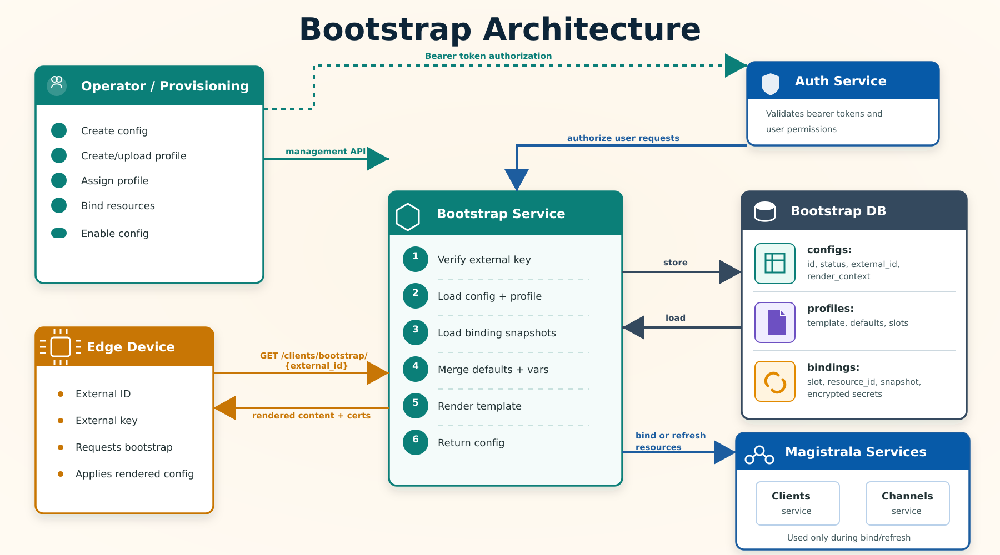

**Bootstrapping** is the process where a device retrieves the configuration it needs to start or recover communication with Magistrala. A device usually bootstraps when:

- it has only bootstrap credentials and does not yet have its runtime configuration
- it cannot connect with the configured Magistrala services
- it needs to refresh its local configuration

> **Note:** Bootstrapping and provisioning are distinct.
>
> - **Provisioning** creates or manages Magistrala entities such as devices and channels.
> - **Bootstrapping** stores device bootstrap configs, renders templates, and returns the rendered configuration to the device.

## Architecture

Bootstrap does not treat a config as a Magistrala device with connected channels. A bootstrap config is an enrollment-like record owned by Bootstrap. It can reference a profile, carry per-device render variables, and bind explicit resources such as devices or channels.



The diagram shows two Bootstrap flows. In the **management flow**, Bootstrap calls Magistrala services during bind or refresh to read the current device or channel data, then stores that data as binding snapshots in Bootstrap DB. In the **device bootstrap flow**, Bootstrap does not call the Devices or Channels services; it renders from the config, profile, and binding snapshots already stored in Bootstrap.

The main resources are:

- **Config:** A Bootstrap-owned device enrollment. It stores `id`, `external_id`, an encrypted `external_key`, optional `profile_id`, legacy certificate fields, and `status`.
- **Profile:** A reusable template for rendering device configuration. Profiles store `template_format`, `content_template`, shared `defaults`, and declared `binding_slots`.
- **Binding slot:** A named placeholder declared by a profile, for example `mqtt_client`, `telemetry`, or `commands`.
- **Binding snapshot:** A point-in-time copy of a bound resource. Bootstrap stores the resource `type`, `resource_id`, and non-secret `snapshot`.
- **Render context:** The data injected into templates. It is composed from profile defaults, config `render_context`, device identity, and binding snapshots.

Bootstrap does not automatically keep devices and channels synchronized during rendering. Resource data is copied into binding snapshots when resources are bound or refreshed. This keeps the device bootstrap path local to Bootstrap. Binding a resource only stores a snapshot of it — it does not create a connection between a device and a channel on the Magistrala side. If a device also needs to be connected to a channel to exchange messages, do that separately through the normal Devices/Channels connection flow.

### Binding Slots

A binding slot is a named placeholder in a profile that says, "this template needs a resource here." It does not create the resource. It only declares what kind of resource must be attached before the profile can render correctly.

For example, a Raspberry Pi temperature profile can declare these slots:

```json
[
  {
    "name": "mqtt_client",
    "type": "device",
    "required": true
  },
  {
    "name": "telemetry",
    "type": "channel",
    "required": true
  }
]
```

This means every config using that profile must bind:

- `mqtt_client` to an existing Magistrala device.
- `telemetry` to an existing Magistrala channel.

`type` must be `device` or `channel`; a binding request's `type` must match the slot's declared type exactly, or the bind is rejected with a 400.

After binding, the template can read the resolved data through `.Bindings`. For example, `.Bindings.mqtt_client.ID` refers to the bound device ID, and `.Bindings.telemetry.ID` refers to the bound channel ID.

The optional `fields` list on a slot controls which keys are copied from the resource into the binding snapshot when binding or refreshing. If omitted, all fields the resolver provides are snapshotted. Restrict `fields` to limit what data Bootstrap stores.

## Bootstrap Flow

1. Create a config with an `external_id` and `external_key`.
2. Create or upload a profile template.
3. Assign the profile to the config.
4. Bind profile slots to concrete resources.
5. The device requests a challenge, then proves possession of its external key to redeem it.
6. Bootstrap verifies the proof, loads the profile and bindings, renders the template, and returns the rendered config in an encrypted envelope.

If you want to prevent devices from bootstrapping while the profile and bindings are being set up, disable the config after creation and re-enable it when ready.

Configs start enabled. An enabled config is immediately available for device bootstrap. Disable a config to prevent devices from bootstrapping while the profile or bindings are still being configured, then re-enable it when ready.

## Configs

Configs are managed under:

```http
/{workspace_id}/devices/configs
```

### Create Config

```bash
curl -s -S -i -X POST \
  -H "Authorization: Bearer <user_token>" \
  -H "Content-Type: application/json" \
  http://localhost:9013/<workspace_id>/devices/configs \
  -d '{
    "external_id": "01:6:0:sb:sa",
    "external_key": "device-bootstrap-key",
    "name": "warehouse sensor config"
  }'
```

`external_id` identifies the device during bootstrap. `external_key` is optional: leave it out and Bootstrap generates a strong random one for you. Either way, the key is HKDF-derived and AES-256-GCM encrypted before storage — it is never hashed, and a workspace member with permission to view the config can read it back in plaintext through the management API (`GET .../devices/configs/{config_id}`), for example to hand it to a device during provisioning.

The response body is the created config, with its `external_key` decrypted back to plaintext so you can copy it onto the device. The `id` is server-generated. `status` is always `enabled` on creation regardless of what is sent. `name` must be unique within a workspace — attempting to create a second config with the same name in the same workspace returns `409 Conflict`.

```json
{
  "id": "3094cf29-e73f-4be1-a4d2-b5c5d7a827ec",
  "external_id": "01:6:0:sb:sa",
  "external_key": "eabGAhKfkBdHZgKpa3eOlTOmcI3c5dCVJtLweEj2IM8",
  "bootstrap_key_version": 1,
  "name": "warehouse sensor config",
  "status": "enabled"
}
```

### Config Fields

```json
{
  "id": "3094cf29-e73f-4be1-a4d2-b5c5d7a827ec",
  "external_id": "01:6:0:sb:sa",
  "external_key": "eabGAhKfkBdHZgKpa3eOlTOmcI3c5dCVJtLweEj2IM8",
  "bootstrap_key_version": 1,
  "name": "warehouse sensor config",
  "status": "enabled",
  "profile_id": "77708c94-3ff5-4068-ab5b-72d1318a9f1c",
  "content": "",
  "client_cert": "",
  "client_key": "",
  "ca_cert": ""
}
```

`status` is `enabled` or `disabled`. Numeric values are still accepted on write: `0` = `enabled`, `1` = `disabled`.

`bootstrap_key_version` increments whenever the config's external key is replaced (see [Encryption and the device bootstrap protocol](#encryption-and-the-device-bootstrap-protocol)); an outstanding device-side challenge issued against an older key version is rejected.

`content` is a static fallback string. When no profile is assigned, Bootstrap returns this value as the rendered output. When a profile is assigned, `content` is ignored during rendering.

`client_cert`, `client_key`, and `ca_cert` are legacy fields from the older certificate-based bootstrap flow. They are unrelated to `external_key` and are updated through a separate endpoint.

### Config Endpoints

| Method | Path | Description |
| --- | --- | --- |
| `POST` | `/{workspace_id}/devices/configs` | Create a config |
| `GET` | `/{workspace_id}/devices/configs` | List configs |
| `GET` | `/{workspace_id}/devices/configs/{config_id}` | View a config |
| `PATCH` | `/{workspace_id}/devices/configs/{config_id}` | Update editable config fields |
| `DELETE` | `/{workspace_id}/devices/configs/{config_id}` | Remove a config |
| `PATCH` | `/{workspace_id}/devices/configs/certs/{config_id}` | Update legacy certificate fields |
| `POST` | `/{workspace_id}/devices/configs/{config_id}/enable` | Enable device bootstrap for a config |
| `POST` | `/{workspace_id}/devices/configs/{config_id}/disable` | Disable device bootstrap for a config |

List configs supports pagination and filters such as `status`, `external_id`, `id`, and partial `name`. By default, listing returns only `enabled` configs. Pass `?status=all` to list configs regardless of status, or `?status=disabled` to list only disabled configs.

## Profiles

Profiles define reusable device templates. A profile can declare binding slots so operators know which resources must be bound before rendering.

Profiles are managed under:

```http
/{workspace_id}/devices/bootstrap/profiles
```

### Create Profile

```bash
curl -s -S -i -X POST \
  -H "Authorization: Bearer <user_token>" \
  -H "Content-Type: application/json" \
  http://localhost:9013/<workspace_id>/devices/bootstrap/profiles \
  -d '{
    "name": "mqtt sensor profile",
    "description": "Renders MQTT settings for a sensor",
    "template_format": "json",
    "defaults": {
      "qos": 1,
      "region": "nairobi"
    },
    "binding_slots": [
      {
        "name": "mqtt_client",
        "type": "device",
        "required": true,
        "fields": ["id", "name"]
      },
      {
        "name": "telemetry",
        "type": "channel",
        "required": true,
        "fields": ["id", "name"]
      }
    ],
    "content_template": "{\n  \"device_id\": \"{{ .Device.ID }}\",\n  \"external_id\": \"{{ .Device.ExternalID }}\",\n  \"site\": \"{{ .Vars.site }}\",\n  \"client_id\": \"{{ (index .Bindings \"mqtt_client\").ID }}\",\n  \"telemetry_channel\": \"{{ (index .Bindings \"telemetry\").ID }}\",\n  \"qos\": {{ .Vars.qos }}\n}"
  }'
```

`version` increments automatically on every profile update. It is read-only and is included in profile responses. Use it to track whether a profile has changed since a device last bootstrapped.

Supported `template_format` values are:

| Format | Behavior |
| --- | --- |
| `go-template` | Render with Go `text/template` |
| `json` | Render as a Go template, then validate the result as JSON |
| `yaml` | Render as a Go template, then validate the result as YAML |
| `toml` | Render as a Go template, then validate the result as TOML |
| `raw` | Return `content_template` without template execution |

Template rendering uses `missingkey=error`, so missing variables fail rendering instead of silently producing invalid output.

The Go-template syntax of `content_template` is validated at create and update time, and submitting invalid syntax returns an error immediately. This check only parses the `{{ }}` template actions; it cannot know whether the rendered *output* is valid JSON/YAML/TOML until the template actually runs with real values, so a syntactically valid template can still fail JSON/YAML/TOML validation later, at render-preview or device-bootstrap time.

### Upload Profile

Profiles can also be uploaded as JSON, YAML, or TOML:

```bash
curl -s -S -i -X POST \
  -H "Authorization: Bearer <user_token>" \
  -H "Content-Type: application/yaml" \
  http://localhost:9013/<workspace_id>/devices/bootstrap/profiles/upload \
  --data-binary @profile.yaml
```

The uploaded document uses the same fields as the create profile request.

### Profile Slots

The slots-only endpoint returns just the binding slots declared by a profile:

```bash
curl -s -S \
  -H "Authorization: Bearer <user_token>" \
  http://localhost:9013/<workspace_id>/devices/bootstrap/profiles/<profile_id>/slots
```

Example response:

```json
{
  "binding_slots": [
    {
      "name": "mqtt_client",
      "type": "device",
      "required": true,
      "fields": ["id", "name"]
    }
  ]
}
```

### Render Preview

Render preview renders a profile without changing stored configs or bindings. It is useful for validating templates before assigning them to devices.

```bash
curl -s -S -X POST \
  -H "Authorization: Bearer <user_token>" \
  -H "Content-Type: application/json" \
  http://localhost:9013/<workspace_id>/devices/bootstrap/profiles/<profile_id>/render-preview \
  -d '{
    "config": {
      "id": "preview-config",
      "external_id": "01:6:0:sb:sa",
      "render_context": {
        "site": "warehouse-1"
      }
    },
    "bindings": [
      {
        "slot": "mqtt_client",
        "type": "device",
        "resource_id": "a-device-id",
        "snapshot": {
          "id": "a-device-id",
          "name": "sensor-device"
        }
      }
    ]
  }'
```

Example response:

```json
{
  "content_type": "application/json",
  "content": "{\n  \"device_id\": \"preview-config\"\n}"
}
```

### Profile Endpoints

| Method | Path | Description |
| --- | --- | --- |
| `POST` | `/{workspace_id}/devices/bootstrap/profiles` | Create a profile |
| `POST` | `/{workspace_id}/devices/bootstrap/profiles/upload` | Upload a JSON, YAML, or TOML profile |
| `GET` | `/{workspace_id}/devices/bootstrap/profiles` | List profiles |
| `GET` | `/{workspace_id}/devices/bootstrap/profiles/{profile_id}` | View a profile |
| `GET` | `/{workspace_id}/devices/bootstrap/profiles/{profile_id}/slots` | List profile binding slots |
| `POST` | `/{workspace_id}/devices/bootstrap/profiles/{profile_id}/render-preview` | Preview rendered profile output |
| `PATCH` | `/{workspace_id}/devices/bootstrap/profiles/{profile_id}` | Update a profile |
| `DELETE` | `/{workspace_id}/devices/bootstrap/profiles/{profile_id}` | Remove a profile |

## Bindings

Bindings connect a config to the concrete resources required by its profile. Binding stores snapshots in Bootstrap so rendering does not need to call the devices or channels services.

Bindings are managed under:

```http
/{workspace_id}/devices/bootstrap/enrollments
```

In this path, `enrollment` means the Bootstrap config. There is no separate create-enrollment endpoint; create configs with `POST /{workspace_id}/devices/configs`.

### Assign Profile

```bash
curl -s -S -i -X PATCH \
  -H "Authorization: Bearer <user_token>" \
  -H "Content-Type: application/json" \
  http://localhost:9013/<workspace_id>/devices/bootstrap/enrollments/<config_id>/profile \
  -d '{
    "profile_id": "77708c94-3ff5-4068-ab5b-72d1318a9f1c"
  }'
```

### Bind Resources

```bash
curl -s -S -i -X PUT \
  -H "Authorization: Bearer <user_token>" \
  -H "Content-Type: application/json" \
  http://localhost:9013/<workspace_id>/devices/bootstrap/enrollments/<config_id>/bindings \
  -d '{
    "bindings": [
      {
        "slot": "mqtt_client",
        "type": "device",
        "resource_id": "a7c1e8c0-c7e1-422e-8d7c-be0493f8142a"
      },
      {
        "slot": "telemetry",
        "type": "channel",
        "resource_id": "4819d016-6059-472d-9e39-eb10a9ccb30e"
      }
    ]
  }'
```

The profile must declare the requested slot, and the requested `type` must match the slot type exactly — a `device` binding against a `channel` slot (or vice versa) is rejected with `400 Bad Request`. Required slots must be bound before the config can render successfully.

Binding only stores a snapshot of the resource in Bootstrap; it does not connect the device to a channel on the Magistrala side. Set up that connection separately through the normal Devices/Channels flow if the device also needs to exchange messages on it.

### List Bindings

```bash
curl -s -S \
  -H "Authorization: Bearer <user_token>" \
  http://localhost:9013/<workspace_id>/devices/bootstrap/enrollments/<config_id>/bindings
```

Example response:

```json
{
  "bindings": [
    {
      "config_id": "3094cf29-e73f-4be1-a4d2-b5c5d7a827ec",
      "slot": "mqtt_client",
      "type": "device",
      "resource_id": "a7c1e8c0-c7e1-422e-8d7c-be0493f8142a",
      "snapshot": {
        "id": "a7c1e8c0-c7e1-422e-8d7c-be0493f8142a",
        "name": "sensor-device",
        "workspace_id": "886b4266-77d1-4258-abae-2931fb4f16de"
      },
      "updated_at": "2026-05-05T10:00:00Z"
    }
  ]
}
```

A device's `secret` (used by a `mqtt_client` slot's `Secret` template field) is encrypted at rest and is not returned by the list endpoint. It is decrypted only when rendering.

### Binding Endpoints

| Method | Path | Description |
| --- | --- | --- |
| `PATCH` | `/{workspace_id}/devices/bootstrap/enrollments/{config_id}/profile` | Assign a profile to a config |
| `PUT` | `/{workspace_id}/devices/bootstrap/enrollments/{config_id}/bindings` | Bind resources and store snapshots |
| `GET` | `/{workspace_id}/devices/bootstrap/enrollments/{config_id}/bindings` | List binding snapshots |
| `POST` | `/{workspace_id}/devices/bootstrap/enrollments/{config_id}/bindings/refresh` | Refresh stored binding snapshots |

`refresh` re-calls Magistrala Devices and Channels services to update the stored snapshots for every binding on the config. Use it after a bound device's credentials rotate or a channel is reconfigured. Rendering always uses the last stored snapshot, so devices will not see updated resource data until after a refresh.

## Template Data

Profile templates receive this render context:

```go
type RenderContext struct {
    Device   DeviceContext
    Vars     map[string]any
    Bindings map[string]BindingContext
}
```

Template fields:

| Field | Description |
| --- | --- |
| `.Device.ID` | The Bootstrap config `id` for this device enrollment |
| `.Device.ExternalID` | Device external ID |
| `.Device.DomainID` | Workspace ID |
| `.Vars` | Profile defaults merged with config `render_context` |
| `.Bindings` | Binding contexts keyed by slot name |
| `.Bindings.<slot>.Type` | Bound resource type (`device` or `channel`) |
| `.Bindings.<slot>.ID` | Bound resource ID |
| `.Bindings.<slot>.Snapshot` | Non-secret snapshot fields |
| `.Bindings.<slot>.Secret` | Decrypted secret snapshot fields available during render |

Profile `defaults` are merged first, then config `render_context` values are applied on top. Config values always win over profile defaults when both have the same key. `.Device.*` identity fields are always available regardless of what is in `defaults` or `render_context`.

Templates are rendered with `missingkey=error`. A template that references `.Vars.key` where `key` is absent from both `defaults` and `render_context` will fail rendering and Bootstrap will return an error to the device.

## Encryption and the device bootstrap protocol

Every enrollment has a Bootstrap root key: its exact UTF-8 bytes are the `external_key` you set (or the random one Bootstrap generates when you omit it). The device never sends that root key over the network. Instead it proves possession of it through a short-lived challenge:

1. The device requests a challenge: `POST /devices/bootstrap/challenges/{externalID}`. Bootstrap returns a `challenge_id`, a `server_nonce`, an `expires_at` (one minute from issue), and the enrollment's current `key_version`.
2. The device generates a random 32-byte nonce of its own, then derives a 32-byte authentication key with HKDF-SHA256 (salt = external ID, info = `magistrala-bootstrap-auth-v1`) from the root key.
3. It HMACs the newline-separated values `v1`, external ID, challenge ID, server nonce, device nonce, and decimal key version, to produce a proof.
4. It sends the unpadded-base64url device nonce and proof to `POST /devices/bootstrap/configurations/{externalID}`.
5. Bootstrap verifies the proof, consumes the (single-use) challenge, renders the config, and returns an AES-256-GCM encrypted envelope. The device derives the response key the same way (same root key and salt, but info `magistrala-bootstrap-response-v1`) and decrypts it locally.
6. `content_type` in the decrypted response tells the device how to parse `content` (`application/json`, `application/yaml`, `application/toml`, or `text/plain`).

This application-layer encryption protects device authentication and Bootstrap content even when a constrained deployment uses plain HTTP. Plain HTTP still reveals network metadata and permits traffic blocking, replay attempts, and denial of service, so HTTPS should be used whenever the device supports it.

Replacing an enrollment's external key (`PATCH .../devices/configs/{config_id}` with a new `external_key`) increments `bootstrap_key_version` and invalidates any outstanding challenge issued under the old version.

### Worked example

```bash
# 1. Request a challenge
curl -s -X POST http://localhost:9013/devices/bootstrap/challenges/01%3A6%3A0%3Asb%3Asa
```

```json
{
  "challenge_id": "2fe5726c-4cae-41e2-a049-3ecbb526abe9",
  "server_nonce": "c5ZwwkR44sBwwyiBEiDjmUaRUa2YxLudNViG_1p3U48",
  "expires_at": "2026-09-01T15:29:30.983547599Z",
  "key_version": 1
}
```

```bash
# 2. Send the device nonce and HMAC proof computed from the root key
curl -s -X POST http://localhost:9013/devices/bootstrap/configurations/01%3A6%3A0%3Asb%3Asa \
  -H "Content-Type: application/json" \
  -d '{
    "challenge_id": "2fe5726c-4cae-41e2-a049-3ecbb526abe9",
    "device_nonce": "60PftF9v18fzxeem8G0p1Ft5S72yEscbWO9CD5f__Yg",
    "proof": "wjc03bEYYtk54BYYyegBLr8iGaI7-N6gyOskAfo6EDc"
  }'
```

```json
{
  "version": "v1",
  "key_version": 1,
  "challenge_id": "2fe5726c-4cae-41e2-a049-3ecbb526abe9",
  "nonce": "3a8CZrRj1v7MGQZB",
  "ciphertext": "yzjDsCsQexDaOp8r-w1LuA3ZMqsNKS8aSGmkWLT4LFrvtnHRlPoQxvifshfqhMBy9KWNpXONcaov0KYyYPhMgK9ENsLDRNnlAiUklD0GhlAN90UxGLvAZJ-4lLPpw-PHjKlleFjP"
}
```

Decrypting `ciphertext` locally with the response key yields the rendered config, for example:

```json
{
  "id": "c49cb881-417e-4d9c-8b92-405a50490580",
  "content_type": "text/plain",
  "content": ""
}
```

Working reference implementations of steps 2–5 (deriving the keys, computing the proof, and decrypting the response with the Web Crypto API) ship in the workspace UI itself: open a config's detail page and use the **Device provisioning and test** panel, or read its implementation for a language-agnostic walkthrough of the protocol.

**Render errors** — Bootstrap returns a non-2xx status if the config is disabled, a required binding slot has no snapshot, or template execution fails. Devices should treat any error response as a signal to retry after a backoff.

Device bootstrap endpoints:

| Method | Path | Description |
| --- | --- | --- |
| `POST` | `/devices/bootstrap/challenges/{external_id}` | Request a one-minute, single-use challenge |
| `POST` | `/devices/bootstrap/configurations/{external_id}` | Redeem a challenge with a proof; returns the encrypted config |

## Operational Endpoints

| Method | Path | Description |
| --- | --- | --- |
| `GET` | `/health` | Service health check |
| `GET` | `/metrics` | Prometheus metrics |

## CLI

The Magistrala CLI exposes the management side of Bootstrap:

```bash
magistrala-cli bootstrap create '<JSON_config>' <workspace_id> <user_auth_token>
magistrala-cli bootstrap get all <workspace_id> <user_auth_token>
magistrala-cli bootstrap get <config_id> <workspace_id> <user_auth_token>
magistrala-cli bootstrap update config '<JSON_config>' <workspace_id> <user_auth_token>
magistrala-cli bootstrap remove <config_id> <workspace_id> <user_auth_token>
magistrala-cli bootstrap whitelist '<JSON_config>' <workspace_id> <user_auth_token>
magistrala-cli bootstrap profiles create '<JSON_profile>' <workspace_id> <user_auth_token>
magistrala-cli bootstrap profiles get all <workspace_id> <user_auth_token>
magistrala-cli bootstrap profiles get <profile_id> <workspace_id> <user_auth_token>
magistrala-cli bootstrap profiles update '<JSON_profile>' <workspace_id> <user_auth_token>
magistrala-cli bootstrap profiles remove <profile_id> <workspace_id> <user_auth_token>
magistrala-cli bootstrap enrollments assign-profile <config_id> <profile_id> <workspace_id> <user_auth_token>
magistrala-cli bootstrap enrollments bind <config_id> '<JSON_bindings>' <workspace_id> <user_auth_token>
magistrala-cli bootstrap enrollments get-bindings <config_id> <workspace_id> <user_auth_token>
magistrala-cli bootstrap enrollments refresh-bindings <config_id> <workspace_id> <user_auth_token>
```

The CLI still uses `whitelist` for compatibility; it calls the same config `status` enable/disable endpoints as the UI.

The CLI's own `bootstrap bootstrap <external_id> <external_key>` device-simulation subcommand has not yet been updated to the challenge/proof protocol above and does not currently work against this service version. To exercise the device side — whether that's testing an integration or debugging a config — use the worked `curl` example above, the UI's **Device provisioning and test** panel, or a device-side implementation of the protocol.

## Compatibility Notes

- The old `state` naming has moved to `status`. Numeric values are still accepted on write: `0` = `enabled`, `1` = `disabled`.
- Configs are created enabled by default. Disable a config during setup to block device access, then re-enable when ready.
- Binding snapshots are the source for template resource data. If a device or channel changes after binding, refresh the bindings before the next bootstrap render. Binding does not create a device-to-channel connection by itself.
- Legacy certificate fields (`client_cert`, `client_key`, `ca_cert`) remain on configs and can still be updated through the certs endpoint, for deployments still on the older certificate-based bootstrap flow.
