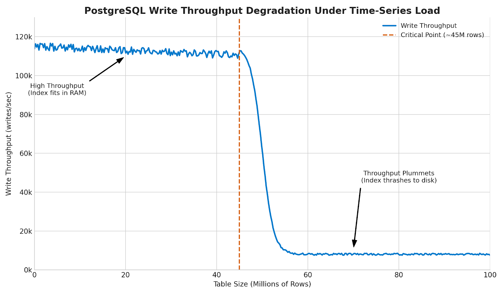
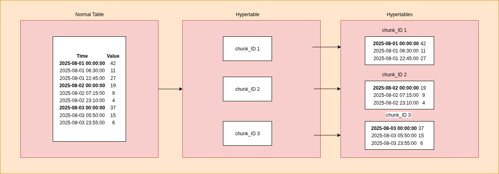
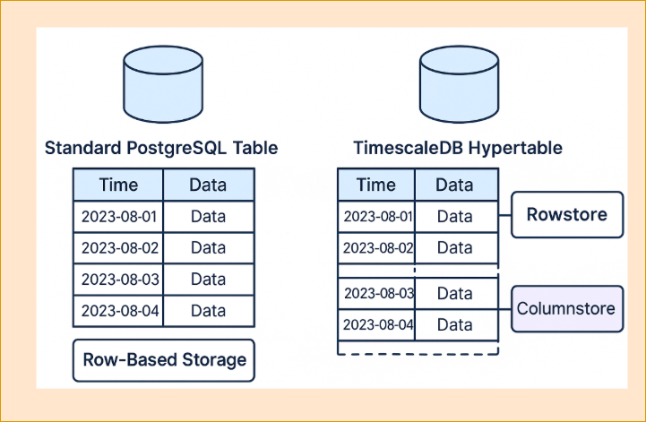

## Introduction

Building a modern IoT messaging platform is no small feat. And when that platform is engineered to be distributed, highly scalable, and secure, the complexity increases exponentially. Why? The goal quickly shifts from just handling a high volume of messages to managing an ecosystem that connects countless users and millions of devices interacting through a mix of communication protocols. So, how do you manage your most valuable asset — your data — at this scale?

A common temptation is to throw a single, massive database at the problem. But that's a recipe for disaster — a classic "jack of all trades, master of none" that quickly buckles under pressure. It not only creates performance bottlenecks, but also limits scalability and opens the door to security risks. The truth is, the data flowing through a modern IoT messaging platform isn't all the same. It comes in many forms — structured, unstructured, relational, temporal, binary — and each type has its own specific needs.

That is where Magistrala takes a smarter path. Rather than forcing every kind of data into a single model, it embraces **polyglot persistence** — a strategy that is as practical as it is powerful. The idea is simple: use the right tool for the job. Magistrala breaks its storage needs down like this:

- **Identity & core metadata**: users, clients (devices or applications), groups, channels, domains, and the roles and policies that govern them. This data changes relatively infrequently but must always be consistent.
- **Time-series message data**: the billions of messages published by clients, where each message is an immutable event stamped with a precise time.
- **Authorization**: who can perform which action on which resource, evaluated with very low latency on every request.
- **Objects & binary assets**: larger or unstructured payloads that don't belong in a relational or time-series store.

The table below gives a high-level overview of this strategy, which the following sections explore in detail.

| Data Domain                        | Selected Technology                     |
| ---------------------------------- | --------------------------------------- |
| Identity & core entity metadata    | PostgreSQL (managed by **Atom**)        |
| Time-series message data           | **TimescaleDB**                         |
| Authorization decisions            | **Atom** (policy decision point)        |
| Objects & binary assets            | **SeaweedFS** (S3-compatible)           |
| Message transport / event bus      | **FluxMQ** (AMQP 0.9.1)                  |

## Core Metadata & Identity

Magistrala keeps its familiar product concepts — domains, users, clients, channels, groups, connections, rules, reports, and alarms — but it does **not** run its own identity, credential, role, or policy database. Instead it builds directly on **[Atom](https://github.com/absmach/atom)**, a lightweight identity-and-authorization service (a slimmer alternative to Keycloak) that persists everything in **PostgreSQL** and acts as the system of record for the control plane.

Magistrala's concepts map onto Atom's native primitives rather than onto bespoke tables:

| Magistrala concept                  | Atom primitive                    | Stored as                                       |
| ----------------------------------- | --------------------------------- | ----------------------------------------------- |
| Domain                              | Tenant                            | `tenants` row (tenant id = domain UUID)         |
| User                                | Entity (`kind = human`)           | `entities` row, usually global (`tenant_id` null) |
| Client (device/application)         | Entity (`kind = device`/`service`) | tenant-owned `entities` row                     |
| Channel / Rule / Report / Alarm     | Resource                          | tenant-owned `resources` row                    |
| Group boundary                      | Object Group                      | `object_groups`                                 |
| Set of subjects                     | Principal Group                   | `principal_groups`                              |
| Connection / access grant           | Role assignment or Direct Policy  | `role_assignments` / `direct_policies`          |
| Credentials (password, API key, cert) | Credential                      | `credentials`                                   |

Application-specific fields that Atom doesn't model natively live in an `attributes.magistrala` JSONB blob on the object, so Magistrala never needs a second store. Because a Magistrala **domain** is an Atom **tenant**, multi-tenancy is a first-class property of the schema — every entity, resource, group, role, and credential is scoped to a tenant.

This metadata changes relatively infrequently compared with the message firehose, but when it does it must update atomically, consistently, and reliably, because it is the foundation the whole platform rests on. That is why it lives in a relational database.

### Why PostgreSQL?

- **ACID Transactions**
  PostgreSQL guarantees atomicity, consistency, isolation, and durability. Multi-step operations — like creating a user, assigning clients, or updating channel access — either succeed entirely or not at all. This eliminates any chance of partial, invalid state.

- **Enforced Relational Integrity**
  Atom's schema captures real-world constraints at the database level. An entity's `tenant_id` is a foreign key into `tenants` (`ON DELETE CASCADE`), so a client can never belong to a non-existent domain; a `credential` references its `entity_id` the same way, so credentials can't outlive their owner; a `CHECK` limits an entity's `kind` to `human`/`device`/`service`/`workload`/`application`; and a unique index on `(name, tenant_id)` keeps names unambiguous within a tenant. These rules hold regardless of application logic.

- **Race Condition Protection**
  With transactional isolation and row-level locking, PostgreSQL prevents concurrent operations from corrupting critical state, which is especially important under multi-tenant workloads.

- **Operational Maturity**
  PostgreSQL comes with a well-developed ecosystem of tools for monitoring, backup, replication, and schema migration. This reduces ops complexity and enables confident day-to-day administration.

- **Auditability**
  The relational model makes it easy to trace historical state, apply row-level security, and version schema changes in ways that are deterministic and reviewable.

- **Simplified Application Logic**
  By enforcing constraints at the database layer, application logic can stay clean. It doesn't have to double-check for invalid references or race conditions — it can rely on the database to reject impossible operations.

Together these guarantees keep Magistrala's control plane robust, auditable, and resistant to data anomalies even under high-scale concurrent operations. To appreciate why a relational store is the right choice here, consider the alternative. What if the team had opted for a flexible NoSQL document database for this same job? While NoSQL databases are powerful for other tasks, they would introduce significant problems for managing this specific type of core metadata.

Let's make this concrete.

### Modeling a client-to-channel connection

Connecting a `client` to a `channel` shows both why the relational model matters and how Atom avoids bespoke join tables. There is **no `connections` table** — a connection is expressed with Atom's generic access primitives:

- **Preferred — a role assignment.** A role carries a permission block that applies to the channel resource with the `publish`/`subscribe` actions, and that role is assigned to the client entity (or to a Principal Group it belongs to).
- **Strict runtime links — a Direct Policy.** A trusted Magistrala service can attach a Direct Policy (`subject = client entity`, `permission_block = publish/subscribe on the channel resource`). Direct Policies are created only by trusted flows and are audited.

Both the client (an `entities` row) and the channel (a `resources` row) carry a `tenant_id` foreign key, so a client can only ever be linked to a channel **within the same tenant** — cross-tenant linkage is structurally impossible, and there is no separate `connections` or `direct_grants` table to keep in sync.

Contrast this with a schemaless **NoSQL** store like MongoDB or DynamoDB, where the same operation relies on best-effort writes: nothing guarantees the referenced entity or resource exists, nothing prevents cross-tenant linking, and referential integrity has to be re-implemented in application code. The result is broken routing, cross-tenant data leakage, and brittle access rules.

### Querying

The relational model also makes listings fast and safe. Suppose you need every active device in a domain tagged `region:EU`. Because Atom indexes the `attributes` JSONB (a GIN index) alongside `tenant_id` and `kind`, this is a single indexed query:

```sql
SELECT id, name
FROM entities
WHERE tenant_id = $1
  AND kind = 'device'
  AND status = 'active'
  AND attributes -> 'magistrala' -> 'tags' @> '["region:EU"]';
```

Crucially, Atom applies **authorization filtering in SQL**: a listing returns only the objects the caller is allowed to `read`, rather than fetching everything and running a permission check per row. A schemaless store would forfeit both the guaranteed validity of those references and the ability to express this filtering efficiently — pushing complexity, latency, and inconsistency back into the application.

---

## Message Storage

In Magistrala, every piece of client data, event log, or telemetry update is recorded as a message with a timestamp. This makes message storage a time-series challenge. Messages are generated, queued, and consumed in a stream and exhibit specific properties:

- **High write volume**: the system must sustain hundreds of thousands to millions of writes per second, particularly during IoT bursts or synchronized device reporting.
- **Time-driven access patterns**: every data point is indexed by time.
- **Append-only semantics**: messages are immutable. Once published, they are not modified or deleted.

But the requirements extend beyond these properties. The message store must also deliver on the following fronts:

- **Query flexibility**: users must be able to query messages by any attribute, including channel, publisher, name, or value.
- **Operational simplicity**: the database should automate low-level tasks like time-based partitioning, reducing the need for dedicated administration.
- **Reliability**: the system must provide transactional guarantees for message persistence.

Finding a single database that excels across all of these fronts is challenging, and after evaluation Magistrala chose **TimescaleDB** as the default message store. To understand that choice, it helps to see how other excellent databases fall short for this specific use case.

### The PostgreSQL Scaling Problem

PostgreSQL is the gold standard for relational databases, offering strong reliability and the full power of SQL. But out of the box, a single ever-growing `messages` table struggles at this scale: as the table grows, its B-tree indexes grow with it, and once those indexes no longer fit in memory, write throughput drops sharply because every insert starts hitting disk. You can partition the table manually, but that is a complex, error-prone process you then have to manage yourself indefinitely.



The chart above visualizes this exact performance cliff. On the left, write throughput is high and stable while the table's indexes fit within RAM. As the table grows past a critical point, the database can no longer hold the indexes in memory and must constantly read from disk. This "disk thrashing" state is shown on the right, where performance collapses to a fraction of its original rate.

### Time-Series Alternatives

Purpose-built time-series databases such as InfluxDB ingest simple metrics quickly, but their data models are tuned for time-based lookups rather than the rich, multi-attribute, high-cardinality queries typical of large IoT fleets. Magistrala chose **TimescaleDB** because it delivers time-series scale while remaining 100% Postgres-compatible — keeping the reliability, tooling, and full SQL the rest of the platform already relies on.

### TimescaleDB

TimescaleDB is not a completely separate database technology; it is implemented as an extension for PostgreSQL. As a result, Magistrala gains best-in-class time-series capabilities without the overhead of introducing and managing an entirely new database system. The platform reuses the same connection protocols, client libraries, and backup tools already in place for PostgreSQL, and creating and working with hypertables looks like standard Postgres.

The core feature that makes TimescaleDB effective is the **hypertable**. From a user's point of view, a hypertable looks like a single ordinary table, but it is in fact an abstraction (more precisely, a virtual view) over many smaller, regular PostgreSQL tables called **chunks**. Each chunk is defined by a time range and only contains data that falls within it. When a new record is inserted into a hypertable, one of two things happens in the background:

- If a chunk with the appropriate time range already exists, the record is simply inserted into it.
- Otherwise, the chunk is first created and then the record is inserted.

For example, with a chunk interval of 1 day, all rows for the 1st of August go to one chunk, all rows for the 2nd of August to another, and so on. If a new row arrives for the 17th of August, a new chunk for that date is created and the row inserted into it.



Magistrala creates the `messages` hypertable with a **1-day chunk interval** (`create_hypertable('messages', by_range('time', 86400000000000))`), so each chunk holds a single day of data. Chunk size is a tuning knob: if chunks are too big, the benefit of partitioning diminishes because a partition holds more data than the PostgreSQL cache can manage; if there are too many, you can overwhelm the query planner and add management overhead. (TimescaleDB can additionally compress older chunks into a columnstore, but the message hypertable is not configured for compression out of the box.)



The architecture provides two key benefits:

- **Sustained ingest performance**: new data is written only to the most recent chunk. Because that chunk is small, its indexes fit comfortably in memory, which avoids the disk-I/O bottleneck that cripples a large single-table setup as the dataset grows.
- **Faster time-range queries**: when a user queries for data within a specific time range, the planner uses **chunk pruning** — it only scans the chunks that overlap the range and ignores the rest of the data on disk, so time-bounded queries stay fast as the table grows.

### The messages hypertable

The `timescale-writer` service consumes messages from the broker and persists them into a `messages` hypertable. Its schema captures the SenML message fields:

```sql
CREATE TABLE IF NOT EXISTS messages (
    time          BIGINT NOT NULL,
    channel       UUID,
    subtopic      VARCHAR(254),
    publisher     VARCHAR(254),
    protocol      TEXT,
    name          VARCHAR(254),
    unit          TEXT,
    value         FLOAT,
    string_value  TEXT,
    bool_value    BOOL,
    data_value    BYTEA,
    sum           FLOAT,
    update_time   FLOAT,
    PRIMARY KEY (time, channel, subtopic, protocol, publisher, name)
);
```

Because every message carries its `channel`, `publisher`, `subtopic`, `name`, and `value`, you can express nuanced, indexed queries entirely within the hypertable. For example, "the last 100 temperature readings above 5°C on a given channel":

```sql
SELECT time, publisher, value
FROM messages
WHERE channel = $1
  AND name = 'temperature'
  AND value > 5
  AND time > $2
ORDER BY time DESC
LIMIT 100;
```

TimescaleDB's planner first uses chunk pruning to narrow the scan to the relevant time chunks, then applies the attribute filters against the hypertable's indexes. Message rows reference entities by identifier (`channel`, `publisher`) rather than by foreign key — the time-series store and the identity store (Atom's PostgreSQL) are deliberately separate services. Mapping those identifiers back to human-readable metadata (client names, tenant, location) is resolved at the application layer through Atom, keeping the high-write message path decoupled from the control plane.

---

## Authorization

Magistrala requires a mechanism to determine which users can access which resources across tenants, domains, and devices. The access-control logic must span a wide range of actions: publishing to channels, subscribing to topics, provisioning clients, and managing domains. Traditional Role-Based Access Control (RBAC), which assigns users fixed roles like "admin" or "viewer," is not expressive enough — and modeling these relationships directly in a relational schema would require recursive joins, join tables, and nested queries that are slow, brittle, and hard to maintain.

To address this, Magistrala externalizes identity and authorization to **Atom**, a dedicated identity-and-authorization service (a lightweight alternative to Keycloak). Atom acts as a **policy decision point (PDP)**: services ask Atom a direct question — "is this subject allowed to perform this action on this resource?" — and Atom returns the decision.

Atom's access model is built from a small set of primitives:

| Atom concept         | Meaning                                                | Example                                        |
| -------------------- | ------------------------------------------------------ | ---------------------------------------------- |
| **Tenant**           | Top-level boundary                                     | Magistrala domain `d1`                         |
| **Action**           | A single action                                        | `read`, `publish`, `role.manage`               |
| **Permission Block** | Scope + actions + effect + conditions                  | "topic in Plant-A → read, publish"             |
| **Role**             | A named collection of Permission Blocks                | `Plant Operator` bundles client + channel access |
| **Role Assignment**  | Grants a role to an entity or Principal Group          | assign `Plant Operator` to `user1`             |
| **Direct Policy**    | Grants one Permission Block directly to a subject      | `client1` can publish to `channel1`            |
| **Principal Group**  | A collection of identities                             | `Operators` contains `user1`, `user2`          |
| **Object Group**     | A boundary/container for objects                       | `Plant-A` contains clients, channels, groups   |

In Atom, **every principal is a first-class entity** — humans, devices, services, and workloads are all treated the same way, with no special "user" class. Access is granted by assigning roles (bundles of permission blocks) to identities or principal groups, or by attaching a direct policy for one-off grants, and can be further constrained with **ABAC guardrails** (attribute-based conditions). Everything is scoped to a tenant, so a grant in domain `d1` never leaks into domain `d2`.

### Evaluating a permission

Suppose a sensor tries to publish. At runtime Magistrala calls Atom's gRPC `Check` with the subject, the target resource, the action, and request context:

```json
{
  "subject_id": "sensor-001-entity-id",
  "resource_id": "temperature-resource-id",
  "action": "publish",
  "context": { "protocol": "mqtt", "topic": "factory-1.temperature" }
}
```

Atom returns a decision and a reason:

```json
{ "allowed": true, "reason": "allowed" }
```

To reach that decision, Atom checks, in order:

1. `publish` is a valid action for a channel (Action Applicability).
2. The subject (`sensor-001`) is active.
3. The subject is directly assigned a role — or belongs to a Principal Group that is — with a matching permission block.
4. That permission block applies to the target resource (`temperature`).
5. **Deny overrides allow.**
6. **Default deny** if no allow matches.

Because this is a purpose-built engine rather than a set of recursive SQL joins, authorization stays fast and predictable even as the number of entities, roles, and policies grows — which is critical for a real-time messaging system that authorizes on every publish and subscribe. Magistrala treats Atom as authoritative: if Atom denies, the operation is rejected.

### Enforcing it on the message path

Authorization isn't only an API-layer concern. Magistrala's message broker, **FluxMQ**, ships with an **auth bridge** (`fluxmq-auth`) that calls Atom to authorize every publish and subscribe. A device cannot publish to a channel it has no permission for, because the broker itself asks Atom `authz.check` before accepting the connection or message. Identity, authorization, and transport are wired together end to end.

---

## An end-to-end message journey

The elegance of a polyglot architecture shows when the pieces work together. Let's trace a single message through the stack to illustrate the interplay between **Atom** (PostgreSQL), **FluxMQ**, and **TimescaleDB**.

### Scenario

An HVAC sensor (a Magistrala client) in `Building-A` is configured to publish temperature readings to a channel. A facility manager later logs into a dashboard to view the temperature trends from the last 24 hours.

1. **Connection & authentication (Atom):**
   The HVAC sensor connects to a Magistrala protocol adapter and presents its credentials (for example a client ID and secret, or a certificate). The adapter validates those credentials against **Atom**, which confirms the client is a known, active entity and establishes its identity.

2. **Authorization to publish (Atom via FluxMQ):**
   Before accepting any data, the broker's auth bridge asks Atom whether the sensor may publish to the target channel — an `authz.check` for the `publish` action on that channel within the client's domain. Atom evaluates the relevant roles and policies and returns **allow**.

3. **Message ingestion (FluxMQ):**
   With authentication and authorization complete, the adapter accepts the reading and publishes it as a standardized message onto the internal **FluxMQ** message bus (AMQP 0.9.1). FluxMQ runs as a clustered broker and also backs Magistrala's event stream.

4. **Message persistence (TimescaleDB):**
   The `timescale-writer` service, subscribed to the relevant subject, consumes the message from the bus, normalizes the payload, and inserts it as a new row in the `messages` hypertable within **TimescaleDB**.

5. **Authorization to read (Atom):**
   Hours later the facility manager logs into the web application. Using the manager's session, the backend asks **Atom** whether they may view data on that channel. Atom confirms and returns **allow**.

6. **Data retrieval (TimescaleDB):**
   The backend calls the `timescale-reader` service's HTTP API, which constructs a time-bound query and sends it to TimescaleDB:

   ```sql
   SELECT * FROM messages WHERE channel = $1 AND time > $2;
   ```

   The database scans only the relevant time chunks and returns the requested data, which the application renders on the manager's dashboard.

---

## Object Storage

Not every payload fits neatly into a relational row or a time-series point. For larger or binary assets, Magistrala uses **SeaweedFS**, an S3-compatible object store, exposed to services through the `MG_BACKEND_OBJECT_STORAGE_ENDPOINT` configuration. Keeping bulky objects out of PostgreSQL and TimescaleDB preserves the performance characteristics that make those stores good at their respective jobs, while still giving the platform durable, horizontally scalable storage for the data that belongs there.

## Message storage backends

Message persistence follows a **writer/reader** pattern that keeps the transport and the storage engine decoupled:

- **Writers** subscribe to the internal message bus (FluxMQ, with NATS available as a build-time alternative) and store messages in the chosen backend.
- **Readers** expose an HTTP API for querying stored messages.

Magistrala ships writer and reader services for two backends:

| Backend         | Writer service      | Reader service      |
| --------------- | ------------------- | ------------------- |
| **TimescaleDB** | `timescale-writer`  | `timescale-reader`  |
| **PostgreSQL**  | `postgres-writer`   | `postgres-reader`   |

TimescaleDB is the default for production-scale time-series workloads; the plain-PostgreSQL backend is available for smaller or simpler deployments. Because both share the same message structure, switching between them requires no change to the core message format.

In conclusion, Magistrala's polyglot architecture avoids the trade-offs of one-size-fits-all systems. PostgreSQL (via Atom) keeps identity and metadata consistent, TimescaleDB scales time-series messages, Atom makes fast authorization decisions, FluxMQ moves messages, and SeaweedFS holds bulky objects. Each system does one job well, and together they form a platform that is consistent, scalable, and secure by design.
