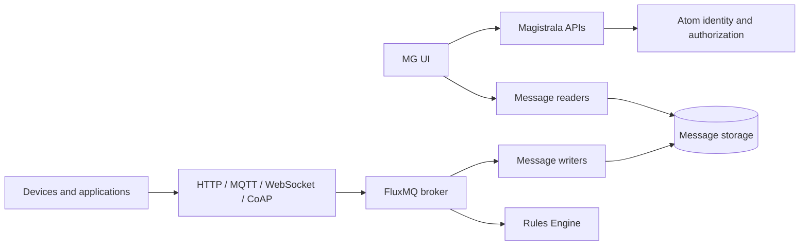

## Components

Magistrala IoT platform is composed of Atom-backed identity and authorization, FluxMQ-backed messaging and event streams, protocol ingress, writers/readers, bootstrap and provision services, and Enterprise Edition services such as the rules engine, alarms, and reports. For the full component reference, see the [Architecture page in the Dev Guide](/dev-guide/architecture).

## Domain Model

The platform consists of the following core entities: **user**, **client**, **channel**, **group**, and **domain**.

`User` represents the real (human) user of the system. Users are represented via their email address, first and last names, a unique username, and password used as their credentials in order to obtain an access token. Once logged into the system, a user can manage their resources (i.e. domains, groups, clients and channels) in CRUD fashion and define access control policies through roles.

`Group` represents a logical grouping of clients, channels or other groups. It simplifies access control management by allowing entities to be grouped together. A user becomes a member of a group through a role, which determines what actions they can perform on the group and its associated entities. Groups support a parent–child hierarchy.

`Client` represents a device or application connected to Magistrala that uses the platform for message exchange. Clients have roles to which users are members, determining which actions the role member can perform on them.

`Channel` represents a communication channel — a message topic consumed by all clients connected to it. It also serves as a grouping mechanism for clients. A client connected to a channel forms a connection that can be Publish-only, Subscribe-only, or Publish-and-Subscribe.

`Domain` represents a top-level organizational unit that encompasses groups, channels, and clients. All these entities must belong to a domain. A user's role on a domain determines what actions they can perform on the domain and the entities within it.

## Messaging

Magistrala uses [FluxMQ][fluxmq] as its primary broker and event-stream layer. Protocol ingress and internal services publish to routes derived from domains, channels, and subtopics, while writers and processors consume from broker-managed streams.

In general, there is no constraint put on content that is being exchanged through channels. However, in order to be post-processed and normalized, messages should be formatted using [SenML][senml].

## Edge

Magistrala platform can be run on the edge as well. Deploying Magistrala on a gateway makes it able to collect, store and analyze data, organize and authenticate devices. To connect Magistrala instances running on a gateway with Magistrala in a cloud we can use the following gateway service:

- [Agent][agent]

## Unified IoT Platform

Running Magistrala on gateway moves computation from cloud towards the edge thus decentralizing IoT system. Since we can deploy same Magistrala code on gateway and in the cloud there are many benefits but the biggest one is easy deployment and adoption - once engineers understand how to deploy and maintain the platform, they will be able to apply those same skills to any part of the edge-fog-cloud continuum. This is because the platform is designed to be consistent, making it easy for engineers to move between them. This consistency will save engineers time and effort, and it will also help to improve the reliability and security of the platform. Same set of tools can be used, same patches and bug fixes can be applied. The whole system is much easier to reason about, and the maintenance is much easier and less costly.

[nats]: https://nats.io/
[fluxmq]: https://github.com/absmach/fluxmq
[rabbitmq]: https://www.rabbitmq.com/
[vernemq]: https://vernemq.com/
[kafka]: https://kafka.apache.org/
[senml]: https://tools.ietf.org/html/draft-ietf-core-senml-08
[agent]: /dev-guide/edge#agent
