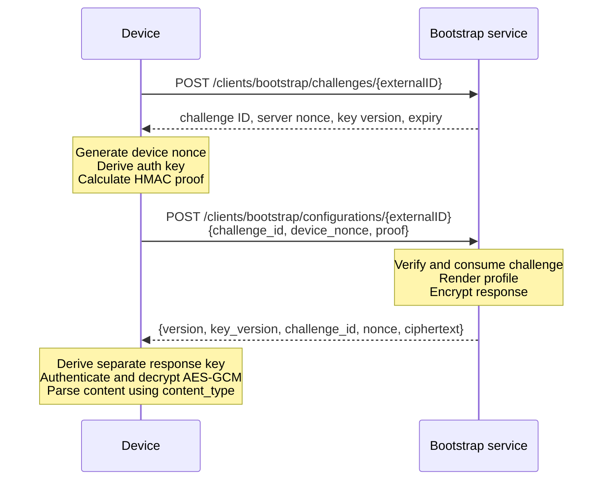

This guide shows how firmware or an edge application retrieves its Bootstrap configuration.

Complete [Manage Bootstrap in the UI](./manage-in-ui) first. The enrollment must be enabled, have a profile, and have all required bindings.

## Device inputs

The device needs four values installed through a trusted provisioning process:

```text
BOOTSTRAP_URL=https://bootstrap.example.com
EXTERNAL_ID=warehouse-gateway-07
EXTERNAL_KEY=replace-with-the-device-secret
KEY_VERSION=1
```

The external key may be any text containing at least 10 characters. Use its exact UTF-8 bytes as the protocol root key. Do not base64-decode it, even when the generated key happens to look like base64url.

The examples read the URL, external ID, and external key from environment variables so the key is not committed to source control.

## Protocol at a glance



### Step 1: request a challenge

```bash
curl --request POST \
  "http://localhost:9010/clients/bootstrap/challenges/warehouse-gateway-07"
```

Example response:

```json
{
  "challenge_id": "1c071d17-38a5-475a-8929-fb5f39895be4",
  "server_nonce": "M0kR9vVNyxP8zBq40k7q1QO6rGk7J8cNq2L5sW3yX9A",
  "expires_at": "2026-07-24T12:01:00Z",
  "key_version": 1
}
```

The challenge expires after one minute and can be used once. The device does not need a correct wall clock; it only needs to complete the exchange promptly.

### Step 2: create the proof locally

Generate a fresh random 32-byte device nonce and encode it as unpadded base64url.

Derive a 32-byte authentication key:

```text
HKDF-SHA256(
  input key = exact UTF-8 bytes of external_key,
  salt      = UTF-8 bytes of external_id,
  info      = "magistrala-bootstrap-auth-v1",
  length    = 32
)
```

Join these values with a single newline character and no trailing newline:

```text
v1
external_id
challenge_id
server_nonce
device_nonce
key_version_as_decimal
```

Calculate HMAC-SHA256 over those UTF-8 bytes with the derived authentication key. Encode the 32-byte result as unpadded base64url. That text is `proof`.

### Step 3: exchange the proof

```http
POST /clients/bootstrap/configurations/{externalID}
Content-Type: application/json
```

```json
{
  "challenge_id": "1c071d17-38a5-475a-8929-fb5f39895be4",
  "device_nonce": "unpadded-base64url-32-byte-device-nonce",
  "proof": "unpadded-base64url-hmac-sha256-proof"
}
```

The response is an encrypted envelope:

```json
{
  "version": "v1",
  "key_version": 1,
  "challenge_id": "1c071d17-38a5-475a-8929-fb5f39895be4",
  "nonce": "unpadded-base64url-aes-gcm-nonce",
  "ciphertext": "unpadded-base64url-ciphertext-followed-by-gcm-tag"
}
```

### Step 4: decrypt and parse

Derive a separate 32-byte response key:

```text
HKDF-SHA256(
  input key = exact UTF-8 bytes of external_key,
  salt      = UTF-8 bytes of external_id,
  info      = "magistrala-bootstrap-response-v1",
  length    = 32
)
```

Build AES-GCM additional authenticated data by newline-joining:

```text
bootstrap-response-v1
external_id
challenge_id
server_nonce
device_nonce
key_version_as_decimal
```

Decrypt the envelope with AES-256-GCM. The decoded `ciphertext` contains the encrypted bytes followed by the 16-byte GCM authentication tag.

The plaintext is a JSON object. Its `content` field is still a string:

```json
{
  "id": "enrollment-uuid",
  "content_type": "application/json",
  "content": "{\"channels\":{\"telemetry\":{\"id\":\"channel-uuid\"}}}"
}
```

Parse that string according to `content_type`.

## Node.js client

Requires Node.js 20 or newer. It uses only built-in modules.

Save as `bootstrap.mjs`:

```javascript
import {
  createDecipheriv,
  createHmac,
  hkdfSync,
  randomBytes,
} from "node:crypto";

const bootstrapUrl = process.env.BOOTSTRAP_URL;
const externalId = process.env.EXTERNAL_ID;
const externalKey = process.env.EXTERNAL_KEY;

if (!bootstrapUrl || !externalId || !externalKey) {
  throw new Error("Set BOOTSTRAP_URL, EXTERNAL_ID, and EXTERNAL_KEY");
}
if ([...externalKey].length < 10) {
  throw new Error("EXTERNAL_KEY must contain at least 10 characters");
}

const rootKey = Buffer.from(externalKey, "utf8");
const derive = (info) =>
  Buffer.from(
    hkdfSync(
      "sha256",
      rootKey,
      Buffer.from(externalId, "utf8"),
      Buffer.from(info, "utf8"),
      32,
    ),
  );

async function jsonRequest(url, options) {
  const response = await fetch(url, options);
  const body = await response.text();
  if (!response.ok) {
    throw new Error(`Bootstrap returned ${response.status}: ${body}`);
  }
  return JSON.parse(body);
}

// Step 1: request a one-minute, single-use challenge.
const challenge = await jsonRequest(
  `${bootstrapUrl}/clients/bootstrap/challenges/${encodeURIComponent(externalId)}`,
  { method: "POST" },
);

// Step 2: generate a nonce and prove possession of the external key.
const deviceNonce = randomBytes(32).toString("base64url");
const proofInput = [
  "v1",
  externalId,
  challenge.challenge_id,
  challenge.server_nonce,
  deviceNonce,
  String(challenge.key_version),
].join("\n");
const proof = createHmac(
  "sha256",
  derive("magistrala-bootstrap-auth-v1"),
)
  .update(proofInput, "utf8")
  .digest("base64url");

// Step 3: send the proof and receive the encrypted envelope.
const envelope = await jsonRequest(
  `${bootstrapUrl}/clients/bootstrap/configurations/${encodeURIComponent(externalId)}`,
  {
    method: "POST",
    headers: { "Content-Type": "application/json" },
    body: JSON.stringify({
      challenge_id: challenge.challenge_id,
      device_nonce: deviceNonce,
      proof,
    }),
  },
);

if (
  envelope.version !== "v1" ||
  envelope.challenge_id !== challenge.challenge_id ||
  envelope.key_version !== challenge.key_version
) {
  throw new Error("Bootstrap response does not match the challenge");
}

// Step 4: authenticate and decrypt ciphertext || 16-byte GCM tag.
const sealed = Buffer.from(envelope.ciphertext, "base64url");
if (sealed.length < 16) throw new Error("Invalid encrypted response");
const ciphertext = sealed.subarray(0, sealed.length - 16);
const tag = sealed.subarray(sealed.length - 16);
const aad = [
  "bootstrap-response-v1",
  externalId,
  challenge.challenge_id,
  challenge.server_nonce,
  deviceNonce,
  String(challenge.key_version),
].join("\n");

const decipher = createDecipheriv(
  "aes-256-gcm",
  derive("magistrala-bootstrap-response-v1"),
  Buffer.from(envelope.nonce, "base64url"),
);
decipher.setAAD(Buffer.from(aad, "utf8"));
decipher.setAuthTag(tag);
const plaintext = Buffer.concat([
  decipher.update(ciphertext),
  decipher.final(),
]);

const config = JSON.parse(plaintext.toString("utf8"));
if (config.content_type === "application/json") {
  config.content = JSON.parse(config.content);
}
console.log(JSON.stringify(config, null, 2));
```

Run it:

```bash
BOOTSTRAP_URL=http://localhost:9010 \
EXTERNAL_ID=warehouse-gateway-07 \
EXTERNAL_KEY='replace-with-the-device-secret' \
node bootstrap.mjs
```

## Python client

Requires Python 3.10 or newer.

Install the two dependencies:

```bash
python -m pip install requests cryptography
```

Save as `bootstrap.py`:

```python
import base64
import json
import os
from urllib.parse import quote

import requests
from cryptography.hazmat.primitives import hashes, hmac
from cryptography.hazmat.primitives.ciphers.aead import AESGCM
from cryptography.hazmat.primitives.kdf.hkdf import HKDF


bootstrap_url = os.environ["BOOTSTRAP_URL"].rstrip("/")
external_id = os.environ["EXTERNAL_ID"]
external_key = os.environ["EXTERNAL_KEY"]
escaped_id = quote(external_id, safe="")

if len(external_key) < 10:
    raise ValueError("EXTERNAL_KEY must contain at least 10 characters")


def b64url_encode(value: bytes) -> str:
    return base64.urlsafe_b64encode(value).rstrip(b"=").decode("ascii")


def b64url_decode(value: str) -> bytes:
    return base64.urlsafe_b64decode(value + "=" * (-len(value) % 4))


def derive(info: str) -> bytes:
    return HKDF(
        algorithm=hashes.SHA256(),
        length=32,
        salt=external_id.encode("utf-8"),
        info=info.encode("utf-8"),
    ).derive(external_key.encode("utf-8"))


# Step 1: request a one-minute, single-use challenge.
challenge_response = requests.post(
    f"{bootstrap_url}/clients/bootstrap/challenges/{escaped_id}",
    timeout=10,
)
challenge_response.raise_for_status()
challenge = challenge_response.json()

# Step 2: generate a nonce and prove possession of the external key.
device_nonce = b64url_encode(os.urandom(32))
proof_input = "\n".join(
    [
        "v1",
        external_id,
        challenge["challenge_id"],
        challenge["server_nonce"],
        device_nonce,
        str(challenge["key_version"]),
    ]
)
signer = hmac.HMAC(
    derive("magistrala-bootstrap-auth-v1"),
    hashes.SHA256(),
)
signer.update(proof_input.encode("utf-8"))
proof = b64url_encode(signer.finalize())

# Step 3: exchange the proof for the encrypted response.
config_response = requests.post(
    f"{bootstrap_url}/clients/bootstrap/configurations/{escaped_id}",
    json={
        "challenge_id": challenge["challenge_id"],
        "device_nonce": device_nonce,
        "proof": proof,
    },
    timeout=10,
)
config_response.raise_for_status()
envelope = config_response.json()

if (
    envelope["version"] != "v1"
    or envelope["challenge_id"] != challenge["challenge_id"]
    or envelope["key_version"] != challenge["key_version"]
):
    raise ValueError("Bootstrap response does not match the challenge")

# Step 4: authenticate and decrypt ciphertext || GCM tag.
aad = "\n".join(
    [
        "bootstrap-response-v1",
        external_id,
        challenge["challenge_id"],
        challenge["server_nonce"],
        device_nonce,
        str(challenge["key_version"]),
    ]
)
plaintext = AESGCM(
    derive("magistrala-bootstrap-response-v1")
).decrypt(
    b64url_decode(envelope["nonce"]),
    b64url_decode(envelope["ciphertext"]),
    aad.encode("utf-8"),
)

config = json.loads(plaintext)
if config["content_type"] == "application/json":
    config["content"] = json.loads(config["content"])
print(json.dumps(config, indent=2))
```

Run it:

```bash
BOOTSTRAP_URL=http://localhost:9010 \
EXTERNAL_ID=warehouse-gateway-07 \
EXTERNAL_KEY='replace-with-the-device-secret' \
python bootstrap.py
```

## Go client

Create a small module and add the HKDF package:

```bash
mkdir bootstrap-client
cd bootstrap-client
go mod init example.com/bootstrap-client
go get golang.org/x/crypto/hkdf
```

Save as `main.go`:

```go
package main

import (
	"bytes"
	"crypto/aes"
	"crypto/cipher"
	"crypto/hmac"
	"crypto/rand"
	"crypto/sha256"
	"encoding/base64"
	"encoding/json"
	"fmt"
	"io"
	"net/http"
	"net/url"
	"os"
	"strings"
	"unicode/utf8"

	"golang.org/x/crypto/hkdf"
)

type challenge struct {
	ID          string `json:"challenge_id"`
	ServerNonce string `json:"server_nonce"`
	KeyVersion  uint64 `json:"key_version"`
}

type envelope struct {
	Version     string `json:"version"`
	KeyVersion  uint64 `json:"key_version"`
	ChallengeID string `json:"challenge_id"`
	Nonce       string `json:"nonce"`
	Ciphertext  string `json:"ciphertext"`
}

func derive(root []byte, externalID, info string) []byte {
	key := make([]byte, 32)
	reader := hkdf.New(
		sha256.New,
		root,
		[]byte(externalID),
		[]byte(info),
	)
	if _, err := io.ReadFull(reader, key); err != nil {
		panic(err)
	}
	return key
}

func jsonRequest(method, endpoint string, body io.Reader, output any) error {
	request, err := http.NewRequest(method, endpoint, body)
	if err != nil {
		return err
	}
	if body != nil {
		request.Header.Set("Content-Type", "application/json")
	}
	response, err := http.DefaultClient.Do(request)
	if err != nil {
		return err
	}
	defer response.Body.Close()
	if response.StatusCode < 200 || response.StatusCode >= 300 {
		message, _ := io.ReadAll(response.Body)
		return fmt.Errorf("Bootstrap returned %s: %s", response.Status, message)
	}
	return json.NewDecoder(response.Body).Decode(output)
}

func main() {
	bootstrapURL := strings.TrimRight(os.Getenv("BOOTSTRAP_URL"), "/")
	externalID := os.Getenv("EXTERNAL_ID")
	externalKey := os.Getenv("EXTERNAL_KEY")
	if bootstrapURL == "" || externalID == "" || externalKey == "" {
		panic("set BOOTSTRAP_URL, EXTERNAL_ID, and EXTERNAL_KEY")
	}
	if utf8.RuneCountInString(externalKey) < 10 {
		panic("EXTERNAL_KEY must contain at least 10 characters")
	}
	root := []byte(externalKey)
	escapedID := url.PathEscape(externalID)

	// Step 1: request a one-minute, single-use challenge.
	var ch challenge
	if err := jsonRequest(
		http.MethodPost,
		bootstrapURL+"/clients/bootstrap/challenges/"+escapedID,
		nil,
		&ch,
	); err != nil {
		panic(err)
	}

	// Step 2: generate a nonce and prove possession of the external key.
	nonceBytes := make([]byte, 32)
	if _, err := rand.Read(nonceBytes); err != nil {
		panic(err)
	}
	deviceNonce := base64.RawURLEncoding.EncodeToString(nonceBytes)
	proofInput := strings.Join(
		[]string{
			"v1",
			externalID,
			ch.ID,
			ch.ServerNonce,
			deviceNonce,
			fmt.Sprintf("%d", ch.KeyVersion),
		},
		"\n",
	)
	mac := hmac.New(
		sha256.New,
		derive(root, externalID, "magistrala-bootstrap-auth-v1"),
	)
	_, _ = mac.Write([]byte(proofInput))
	proof := base64.RawURLEncoding.EncodeToString(mac.Sum(nil))

	// Step 3: exchange the proof for the encrypted response.
	requestBody, err := json.Marshal(map[string]string{
		"challenge_id": ch.ID,
		"device_nonce": deviceNonce,
		"proof":        proof,
	})
	if err != nil {
		panic(err)
	}
	var encrypted envelope
	if err := jsonRequest(
		http.MethodPost,
		bootstrapURL+"/clients/bootstrap/configurations/"+escapedID,
		bytes.NewReader(requestBody),
		&encrypted,
	); err != nil {
		panic(err)
	}
	if encrypted.Version != "v1" ||
		encrypted.ChallengeID != ch.ID ||
		encrypted.KeyVersion != ch.KeyVersion {
		panic("Bootstrap response does not match the challenge")
	}

	// Step 4: authenticate and decrypt ciphertext || GCM tag.
	block, err := aes.NewCipher(
		derive(root, externalID, "magistrala-bootstrap-response-v1"),
	)
	if err != nil {
		panic(err)
	}
	aead, err := cipher.NewGCM(block)
	if err != nil {
		panic(err)
	}
	responseNonce, err := base64.RawURLEncoding.DecodeString(encrypted.Nonce)
	if err != nil {
		panic(err)
	}
	sealed, err := base64.RawURLEncoding.DecodeString(encrypted.Ciphertext)
	if err != nil {
		panic(err)
	}
	aad := strings.Join(
		[]string{
			"bootstrap-response-v1",
			externalID,
			ch.ID,
			ch.ServerNonce,
			deviceNonce,
			fmt.Sprintf("%d", ch.KeyVersion),
		},
		"\n",
	)
	plaintext, err := aead.Open(nil, responseNonce, sealed, []byte(aad))
	if err != nil {
		panic(err)
	}

	var config map[string]any
	if err := json.Unmarshal(plaintext, &config); err != nil {
		panic(err)
	}
	if config["content_type"] == "application/json" {
		content, ok := config["content"].(string)
		if !ok {
			panic("Bootstrap JSON content is not a string")
		}
		var parsed any
		if err := json.Unmarshal([]byte(content), &parsed); err != nil {
			panic(err)
		}
		config["content"] = parsed
	}
	formatted, _ := json.MarshalIndent(config, "", "  ")
	fmt.Println(string(formatted))
}
```

Run it:

```bash
BOOTSTRAP_URL=http://localhost:9010 \
EXTERNAL_ID=warehouse-gateway-07 \
EXTERNAL_KEY='replace-with-the-device-secret' \
go run .
```

## Browser JavaScript client

This example is useful for a setup utility or for understanding the UI tester. It uses Fetch and Web Crypto.

The page must be a secure context, such as HTTPS or `localhost`. The Bootstrap API must also be same-origin, CORS-enabled, or reached through a trusted server proxy.

```javascript
const bootstrapUrl = "http://localhost:9010";
const externalId = "warehouse-gateway-07";
const externalKey = "replace-with-the-device-secret";
const text = new TextEncoder();

function fromBase64Url(value) {
  const normalized = value.replace(/-/g, "+").replace(/_/g, "/");
  const padded = normalized.padEnd(
    normalized.length + ((4 - (normalized.length % 4)) % 4),
    "=",
  );
  return Uint8Array.from(atob(padded), (char) => char.charCodeAt(0));
}

function toBase64Url(value) {
  let binary = "";
  for (const byte of value) binary += String.fromCharCode(byte);
  return btoa(binary)
    .replace(/\+/g, "-")
    .replace(/\//g, "_")
    .replace(/=+$/, "");
}

async function derive(info) {
  const root = await crypto.subtle.importKey(
    "raw",
    text.encode(externalKey),
    "HKDF",
    false,
    ["deriveBits"],
  );
  return crypto.subtle.deriveBits(
    {
      name: "HKDF",
      hash: "SHA-256",
      salt: text.encode(externalId),
      info: text.encode(info),
    },
    root,
    256,
  );
}

async function jsonRequest(url, options) {
  const response = await fetch(url, options);
  const body = await response.text();
  if (!response.ok) {
    throw new Error(`Bootstrap returned ${response.status}: ${body}`);
  }
  return JSON.parse(body);
}

// Step 1: request a one-minute, single-use challenge.
const challenge = await jsonRequest(
  `${bootstrapUrl}/clients/bootstrap/challenges/${encodeURIComponent(externalId)}`,
  { method: "POST", cache: "no-store" },
);

// Step 2: generate a nonce and prove possession of the external key.
const deviceNonce = toBase64Url(
  crypto.getRandomValues(new Uint8Array(32)),
);
const proofInput = [
  "v1",
  externalId,
  challenge.challenge_id,
  challenge.server_nonce,
  deviceNonce,
  String(challenge.key_version),
].join("\n");
const authKey = await crypto.subtle.importKey(
  "raw",
  await derive("magistrala-bootstrap-auth-v1"),
  { name: "HMAC", hash: "SHA-256" },
  false,
  ["sign"],
);
const proof = toBase64Url(
  new Uint8Array(
    await crypto.subtle.sign(
      "HMAC",
      authKey,
      text.encode(proofInput),
    ),
  ),
);

// Step 3: exchange the proof for the encrypted response.
const envelope = await jsonRequest(
  `${bootstrapUrl}/clients/bootstrap/configurations/${encodeURIComponent(externalId)}`,
  {
    method: "POST",
    headers: { "Content-Type": "application/json" },
    body: JSON.stringify({
      challenge_id: challenge.challenge_id,
      device_nonce: deviceNonce,
      proof,
    }),
  },
);

if (
  envelope.version !== "v1" ||
  envelope.challenge_id !== challenge.challenge_id ||
  envelope.key_version !== challenge.key_version
) {
  throw new Error("Bootstrap response does not match the challenge");
}

// Step 4: authenticate and decrypt the response locally.
const responseKey = await crypto.subtle.importKey(
  "raw",
  await derive("magistrala-bootstrap-response-v1"),
  "AES-GCM",
  false,
  ["decrypt"],
);
const aad = [
  "bootstrap-response-v1",
  externalId,
  challenge.challenge_id,
  challenge.server_nonce,
  deviceNonce,
  String(challenge.key_version),
].join("\n");
const plaintext = await crypto.subtle.decrypt(
  {
    name: "AES-GCM",
    iv: fromBase64Url(envelope.nonce),
    additionalData: text.encode(aad),
    tagLength: 128,
  },
  responseKey,
  fromBase64Url(envelope.ciphertext),
);

const config = JSON.parse(new TextDecoder().decode(plaintext));
if (config.content_type === "application/json") {
  config.content = JSON.parse(config.content);
}
console.log(config);
```

Do not expose a production device key in browser source, HTML, logs, or analytics. The Magistrala UI tester can reveal a key only to an already authorized administrator and performs the cryptographic operations locally.

## Parsing other content types

The cryptographic flow is identical for every profile. Only the last parsing operation changes:

| `content_type` | Device action |
| --- | --- |
| `application/json` | Parse `content` with a JSON parser |
| `application/yaml` | Parse `content` with a YAML parser |
| `application/toml` | Parse `content` with a TOML parser |
| `text/plain` | Use `content` as text |

Do not guess from file extensions or the first character of the content. Use the returned `content_type`.

## Retry behavior

Use this recovery flow:

1. If a challenge expires, request a new challenge.
2. If proof exchange fails, discard the challenge and request a new one.
3. Never reuse a device nonce.
4. Apply a short randomized backoff before retrying network failures.
5. Keep the last known good configuration until a complete new response is authenticated, decrypted, parsed, and validated.
6. Replace the saved configuration atomically so a power loss cannot leave a partial file.

The device endpoint intentionally returns a generic authentication error. This prevents an attacker from learning whether an external ID, key, version, or challenge was correct.

## Production checklist

- Store the external key in a secure element, TPM, protected flash, or the best protected storage available on the device.
- Give every device a different external key.
- Do not print the key, derived keys, plaintext configuration, or private certificates in logs.
- Verify the envelope version, challenge ID, and key version before decryption.
- Treat AES-GCM authentication failure as a failed Bootstrap attempt; never use unauthenticated plaintext.
- Prefer HTTPS even though the response is encrypted at the application layer.
- Set timeouts and bounded retries.
- Validate required application fields after parsing `content`.
- Rotate the external key if it may have been exposed, then securely reprovision the device.

For exact request and response schemas, see the [Bootstrap OpenAPI document](https://docs.api.magistrala.absmach.eu/?urls.primaryName=bootstrap.yaml).
