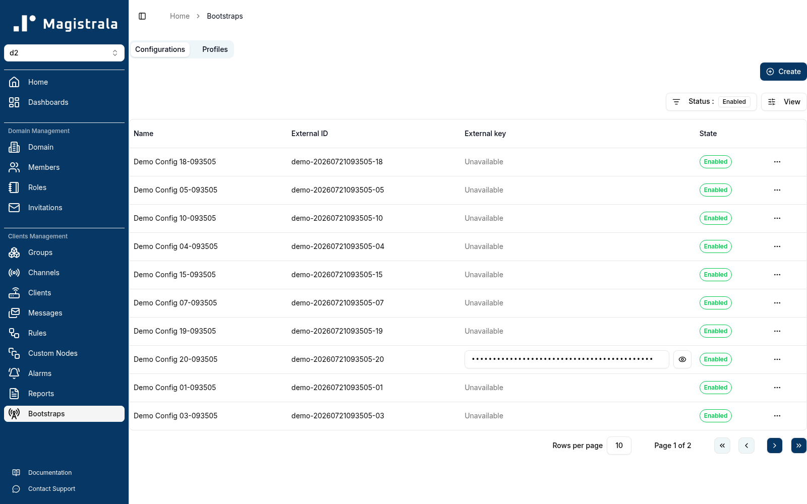
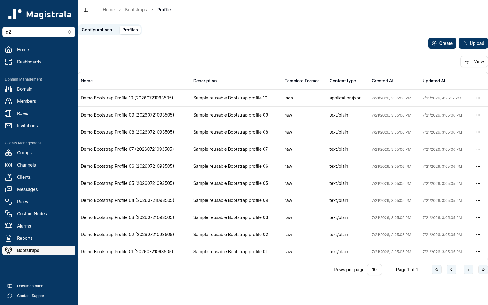
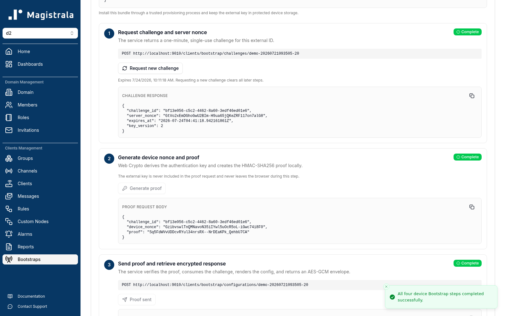
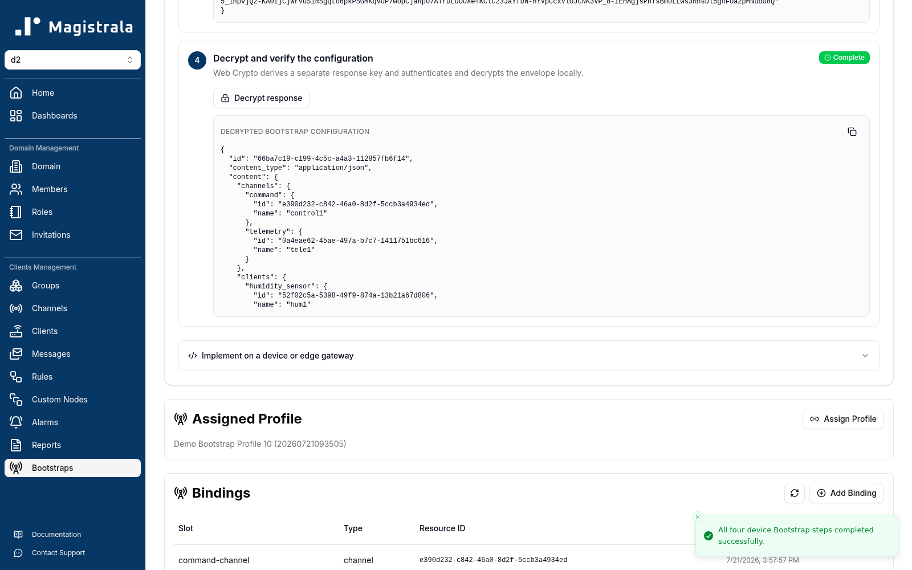

This guide prepares one device from start to finish in Magistrala UI.

Before you begin, create any Magistrala clients and channels that the device configuration should contain. You also need a domain role that permits you to manage Bootstrap resources and view the clients or channels you bind.

## 1. Open Bootstrap

Select a domain, then choose **Bootstraps** under **Clients Management** in the sidebar.

The Bootstrap area has two tabs:

- **Configurations** contains one enrollment for each device.
- **Profiles** contains reusable templates.



## 2. Create a profile

Open **Profiles**, then select **Create**.



Enter:

- **Name**: a clear reusable name, such as `cold-storage-gateway-v1`;
- **Description**: what kind of device should use the profile;
- **Template format**: use `json` for the example below;
- **Content type**: use `application/json`;
- **Content template**: the configuration template; and
- **Binding slots**: named client or channel placeholders used by the template.

### Example profile

Add these required slots:

| Slot | Type |
| --- | --- |
| `temperature-sensor` | client |
| `telemetry-channel` | channel |
| `command-channel` | channel |

Use this JSON template:

```json
{
  "device": {
    "id": {{ toJSON .Device.ID }},
    "external_id": {{ toJSON .Device.ExternalID }},
    "domain_id": {{ toJSON .Device.DomainID }}
  },
  "site": {{ toJSON (default "unassigned" .Vars.site) }},
  "clients": {
    "temperature_sensor": {
      "id": {{ toJSON (index .Bindings "temperature-sensor").ID }},
      "name": {{ toJSON (index (index .Bindings "temperature-sensor").Snapshot "name") }}
    }
  },
  "channels": {
    "telemetry": {
      "id": {{ toJSON (index .Bindings "telemetry-channel").ID }},
      "name": {{ toJSON (index (index .Bindings "telemetry-channel").Snapshot "name") }}
    },
    "command": {
      "id": {{ toJSON (index .Bindings "command-channel").ID }},
      "name": {{ toJSON (index (index .Bindings "command-channel").Snapshot "name") }}
    }
  }
}
```

The template can read:

| Template value | Source |
| --- | --- |
| `.Device.ID` | Enrollment ID |
| `.Device.ExternalID` | Device external ID |
| `.Device.DomainID` | Domain ID |
| `.Vars` | Profile defaults merged with enrollment render context |
| `.Bindings` | Resource snapshots indexed by slot name |

Available helpers are `toJSON`, `default`, and `required`. A missing template key is an error, which prevents silently sending an incomplete configuration.

## 3. Create a device enrollment

Return to **Configurations**, then select **Create**.

Enter:

- **Name**: a human-readable device name;
- **External ID**: a unique, stable device identifier;
- **External key**: leave empty to generate a strong key, or enter any key containing at least 10 characters; and
- optional certificate fields when the device needs them.

Select **Create**, open the new enrollment, and copy its provisioning bundle through a trusted process. The bundle contains the Bootstrap URL, external ID, external key, and key version.

<Callout type="warn" title="Protect the external key">

The external key authenticates the physical device. Do not place it in tickets, logs, screenshots, or source control. Store it in protected device storage.

</Callout>

New enrollments must be **Enabled** before a device can retrieve configuration. Use the state switch on the enrollment page.

## 4. Assign the profile

On the enrollment page, find **Assigned Profile**, select **Assign Profile**, and choose the profile created in step 2.

Assigning a profile tells Bootstrap which template to render for this device. It does not automatically choose the real clients and channels.

## 5. Add every required binding

In **Bindings**, select **Add Binding** once for each required slot.

For every binding:

1. Select the exact slot declared in the assigned profile.
2. Select the required type: `client` or `channel`.
3. Select the real Magistrala resource.
4. Select **Bind**.

For the example:

```text
temperature-sensor → client "Freezer temperature sensor"
telemetry-channel  → channel "Cold room telemetry"
command-channel    → channel "Cold room commands"
```

The slot name and type must match the profile. Entering `telemetry-channel-1` when the profile declares `telemetry-channel` is rejected.

### Why bindings are snapshots

Bootstrap copies the fields it needs when a resource is bound. The device retrieval path can then render without calling another service.

If the selected client's or channel's relevant data later changes, select **Refresh bindings** on the enrollment page before the next device retrieval.

### Required and optional slots

- A **required** slot must be bound. Retrieval fails until it is present.
- An **optional** slot may be omitted, but the template must also handle the missing value.

Do not make a slot optional merely to hide a setup problem. Mark it optional only when a valid device configuration can be rendered without that resource.

## 6. Test the exact device flow

Use **Device provisioning and test** on the enrollment page.

Select **Run all steps**, or perform the operations individually:

1. **Request challenge and server nonce**
2. **Generate device nonce and proof**
3. **Send proof and retrieve encrypted response**
4. **Decrypt and verify the configuration**

The proof is calculated in the browser. The external key is not included in the request.



The last step displays the decrypted response. For JSON content, the UI parses the inner `content` string and displays its object structure, including bound clients and channels.



If all four steps complete, the same provisioning values can be installed on the real device and used with one of the implementations in [Write a device client](./device-clients).

## Common problems

### Required binding slots are not bound

The assigned profile declares at least one required slot that the enrollment does not have.

Open the profile to see the exact slot names, then add the missing bindings on the enrollment page.

### Binding slot is not available

The submitted slot name does not exactly match any slot in the assigned profile, or the selected resource type differs from the declared type.

Choose the slot from the profile and use the type shown beside it.

### Device authentication failed

For security, the device endpoint returns one generic authentication error. Check:

- the external ID;
- the exact external-key text;
- the key version;
- whether the enrollment is enabled;
- whether the challenge expired; and
- whether the challenge was already used.

Request a new challenge after any failed or delayed attempt.

### Content cannot be rendered

Check that:

- the template is valid for its selected template format;
- every referenced variable exists or has a default;
- every required binding is present; and
- the rendered value matches the selected content type.

For example, selecting `application/json` requires the rendered content to be valid JSON.

### External key is unavailable

An enrollment without a retrievable key cannot use the challenge-response tester. Set a new external key containing at least 10 characters, securely reprovision the device, and use the new key version.
