**Groups** in Magistrala are collections that organize **clients** and **channels** together.  
They make it easier to assign users with specific roles to a set of related channels and clients.

## Create a Group

To create a group, click on the `Create` button present on the top of the **Groups** sidebar. You can also create multiple groups by clicking `Upload` and uploading a _.csv_ file with group **names** and any other fields you would like to add.

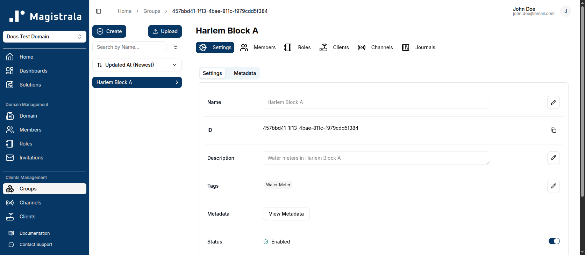

### Bulk Creation

Groups can be created in bulk using a `.csv` file with the following fields (in order):

1. **Name** (Required)  
2. **Metadata**  
3. **Description**  

A [sample groups CSV file](https://github.com/absmach/magistrala-ui/blob/main/samples/groups.csv) is available for reference.

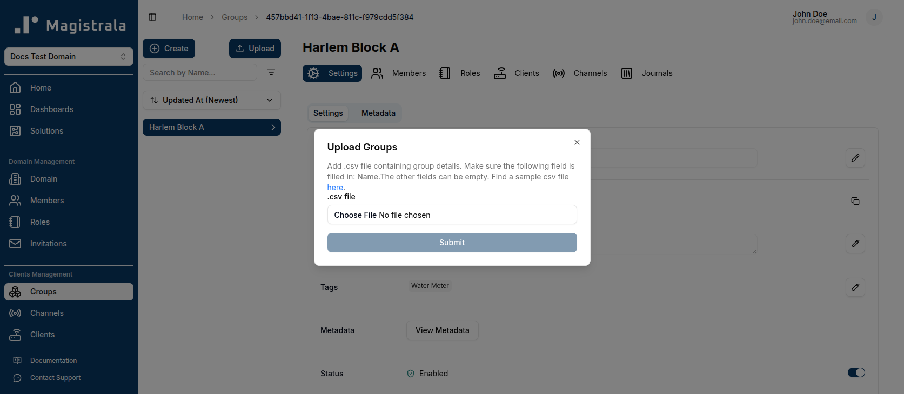

### Group Information

When creating a group, you must provide a **name** and can optionally add a **description**, **tags**, **metadata**, and a **parent group**.

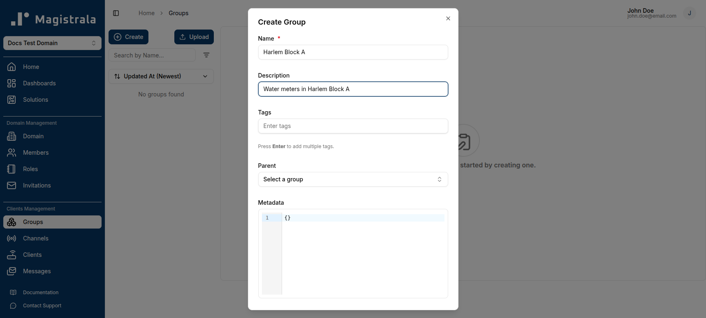

If a **parent group** is selected, the new group becomes its child.  
This creates a hierarchy where role actions assigned in the parent group are automatically inherited by all child groups.

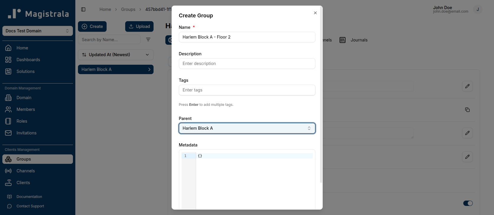

## View a Group

After creation, the group will appear in the **Groups sidebar**.

The group page has two tabs: **Settings** and **Metadata**.

### Settings Tab

The **Settings** tab displays key details about a group and allows you to edit core properties:

**Editable Fields:**
- **Name** – Group identifier
- **Description** – Optional description of the group
- **Tags** – Keywords for organization and searchability
- **Status** – Enable or disable the group using the toggle switch

**View-Only Fields:**
- **ID** – Unique group identifier
- **Metadata** – View existing metadata in JSON format (managed in the Metadata tab)

To update a field, click the **pencil** icon next to it. Once you have updated the value, click the **check** icon to save changes or the **cross** icon to cancel.

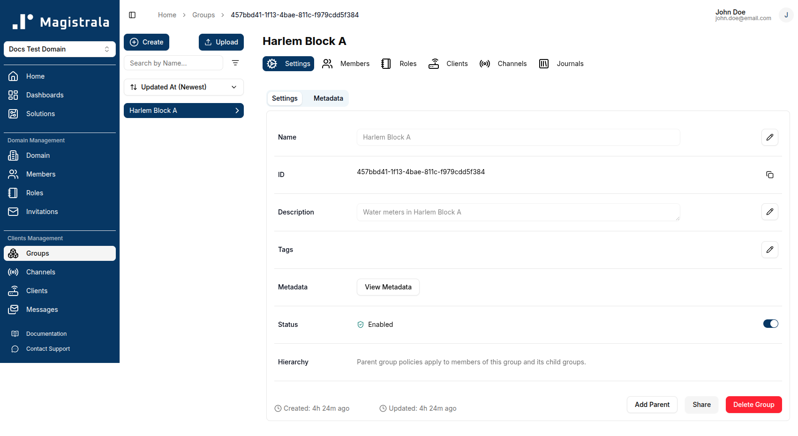

### Metadata Tab

The **Metadata** tab allows you to add, view, and manage additional information for the group. Metadata supports various value types including text, numbers, booleans, JSON objects, locations, and perimeters.

For detailed instructions on managing metadata, including working with interactive maps for location and perimeter data, see the [Metadata Management Guide](/user-guide/metadata).

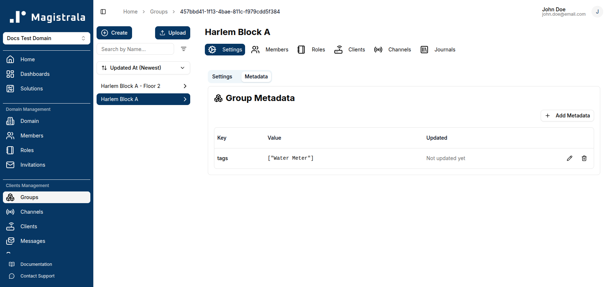

## Update a Group

While on the **View Group** page, you are allowed to update the group details such as the **name**, **description**, **metadata**, and **status**.
To update a field, click on the `pencil` icon on the far end of the field to edit. Once you have updated the value, click on the `check` icon to update the changes or the `cross` icon to cancel the change.

Groups can also be **enabled or disabled** by toggling the switch in the **Status** field.  

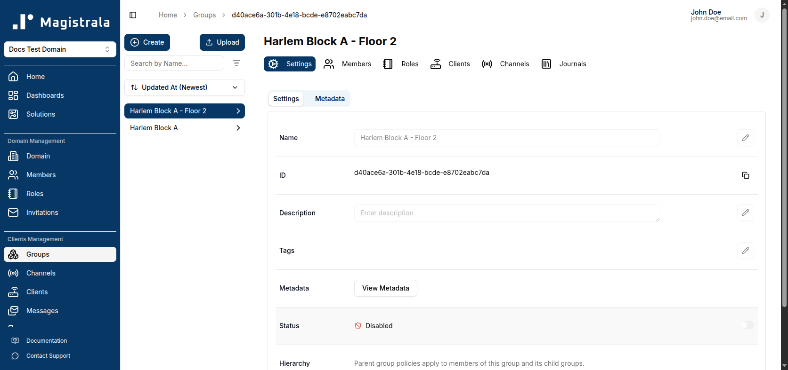

## Share a Group

A group can also be shared to another domain member with specific **group roles** attached. Clicking on the `Share` button opens up a dialog that needs a Member as well as a Role.

Group Roles will be explained in the next section.

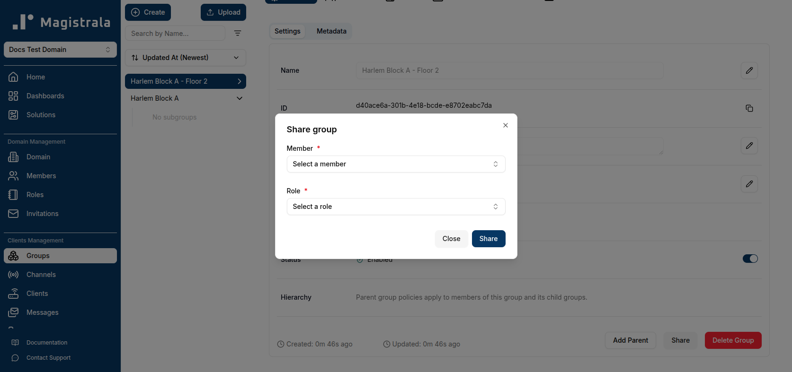

## Manage Parent Groups

To remove a child from the hierarchy it currently resides in, simply click on the `Remove Parent` button. This will remove it from the tier in the group sidebar and have it lose all the role actions and members it previously had access to.

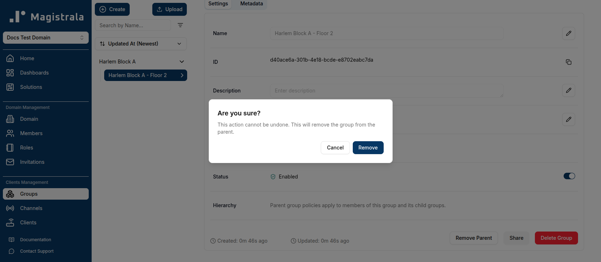

In the case of a group without a parent, the button will instead prompt you to select a parent group from the current list of groups.

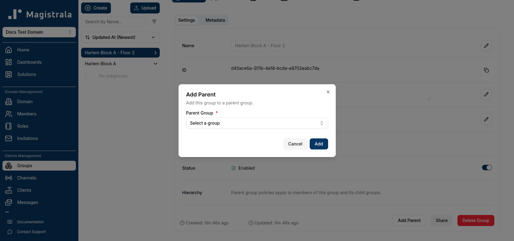

## Group Roles

### Create Group Roles

**Roles** allow you to group specific **permission blocks** and allocate them to users. The **Roles table** lists each role's **Name**, **Created By**, **Created At** and **Updated At**.

To create a role, navigate to the **Roles** section on the group navbar. Click on the `Create` button and provide a role name. The permissions and members are optional fields.

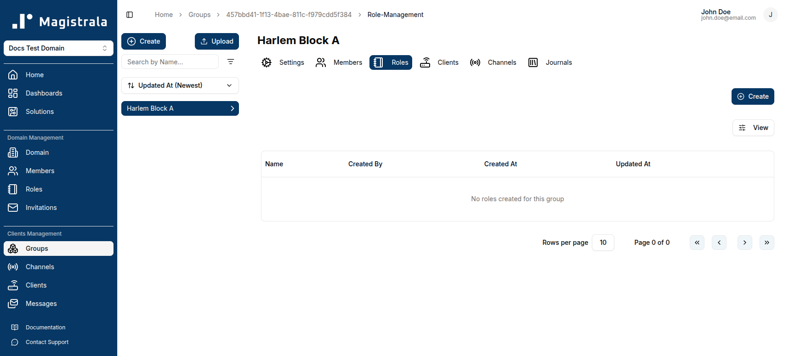

#### Role Information

When creating the Group Role, the role name is compulsory. For each permission block you choose what it **Applies to** and which **Actions** are allowed, then optionally provide members by searching for a user with their **username**. These users must be members of the same domain however.

Groups use the same generic-action model as domains, clients and channels, but with scopes that reflect the group hierarchy. The **Applies to** options are:

- **This group** – applies only to this group object
- **Clients in this group** – excludes subgroup clients
- **Channels in this group** – excludes subgroup channels
- **Direct child groups** – applies to child groups under this group
- **Clients in subgroups** – excludes clients directly in this group
- **Channels in subgroups** – excludes channels directly in this group
- **All subgroups** – applies to every nested subgroup

For each scope, the available **actions** are:

- read
- write
- delete
- role.manage
- policy.manage

### Update Group Roles

To update a **role name**, click on the `pencil` icon on the far right end of the field, update the value then click on the `check` icon to update the changes or the `cross` icon to cancel the changes.

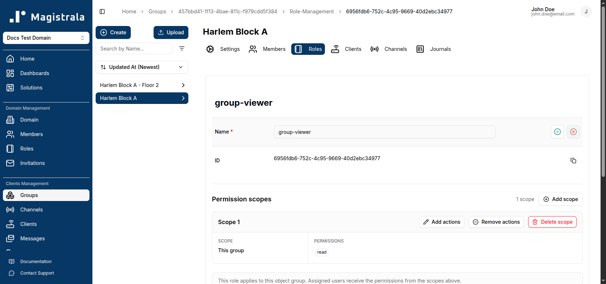

To update a role's permissions, use the **Add actions** / **Remove actions** buttons on a permission scope card. A dialog will appear where you can select additional actions.

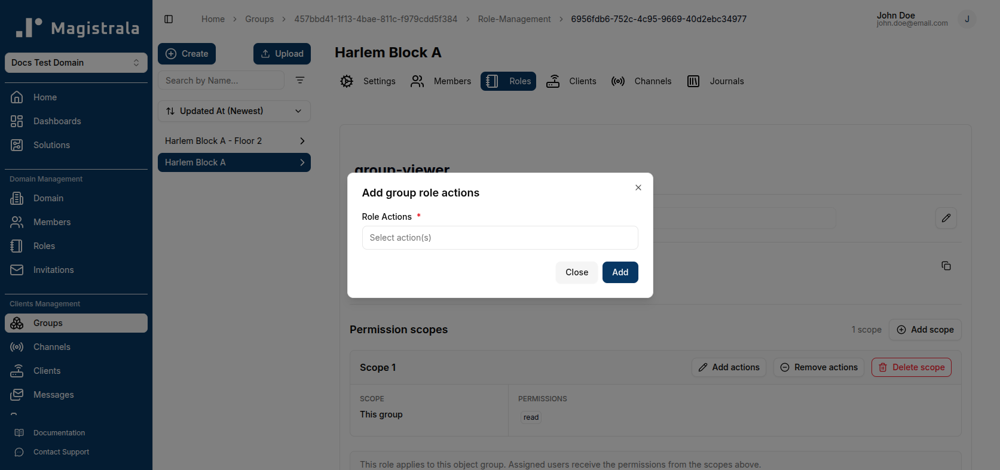

To manage **role members**, open the Members table and click **Add Members**. A dialog will allow you to search and assign users.  

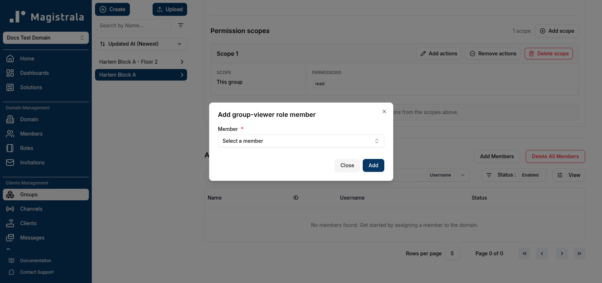

### Delete Group Roles

You can also delete actions and members by clicking on the `trash` icon. It pops up a dialog that allows you to select which action you want to remove. Optionally you can delete all of the actions by clicking on the `Delete All Actions` buttons.

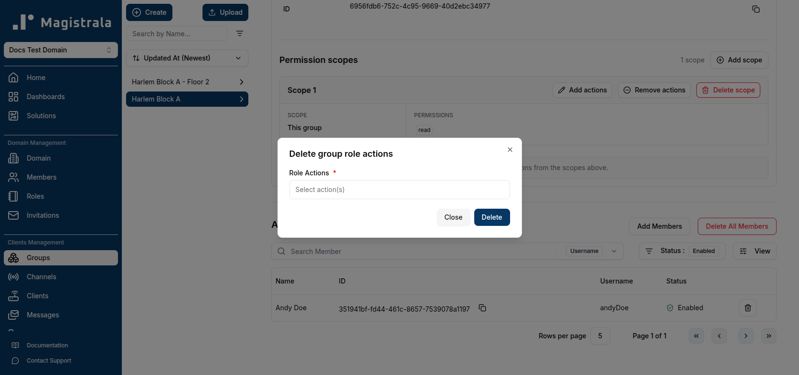

To delete All the Members in the Role simply use the `Delete All Members` button and click on the confirmation.

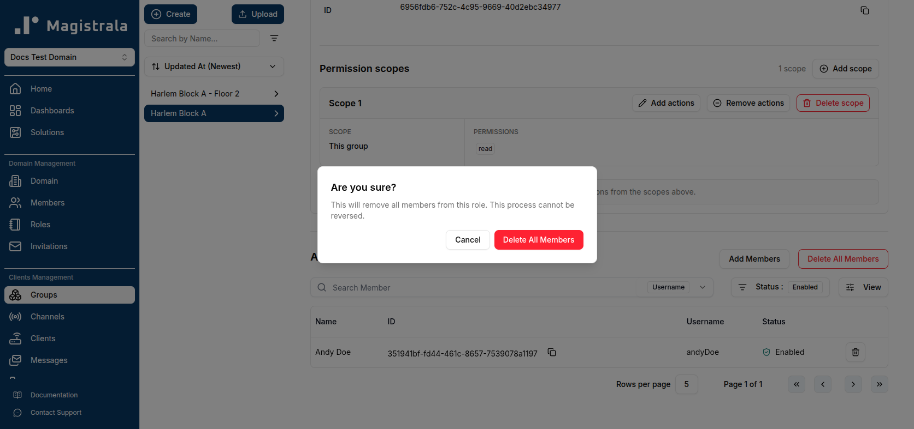

The Members table also has individual `trash` icons on each row which facilitates deleting specific Role Members.

## Group Members

We can assign a user to a group by adding them as role members. This allows a user to be able to carry out the actions present in the role over the specific group.  
To add role members, one can add them when creating a role or in the specific role page. This has been discussed in the earlier **Roles** section.

We have the capacity to add users by assigning them to a group in the **Members** section of the group. This will allow you to assign a user to a group by adding them to a specific role.

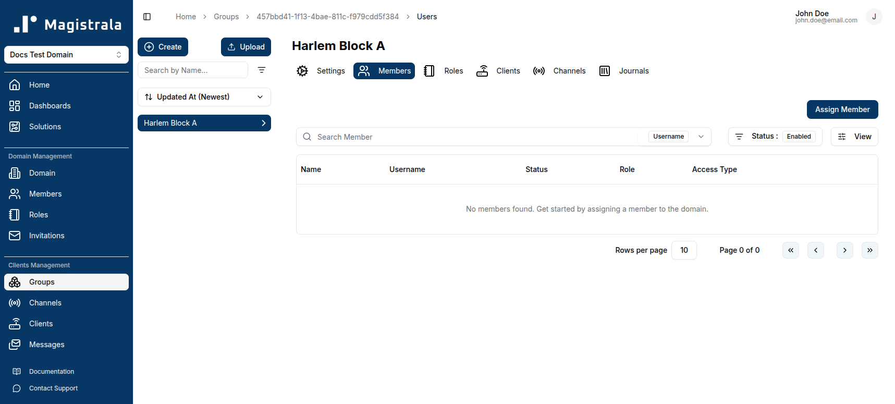

To remove members, use the **trash** icon next to each user.  

## Group Clients

Groups support managing **clients** directly at the group level.  
From here, you can **create**, **update**, **enable**, **disable**, **delete**, **assign**, and **connect** clients.  
(See the [Clients](/user-guide/clients-management/clients) section for a full overview of client functionality.)

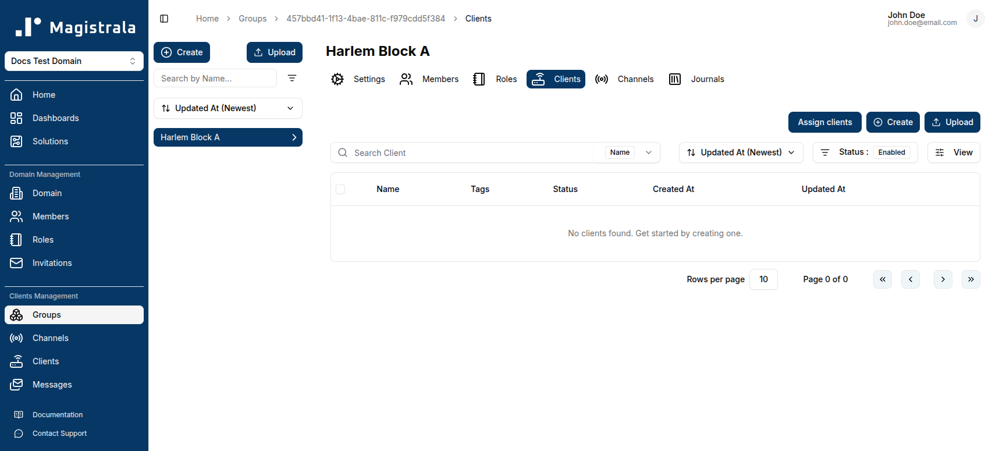

To assign clients to a group, click on the `Assign Clients` button.
A dialog will open where you can select multiple clients to attach to the group.

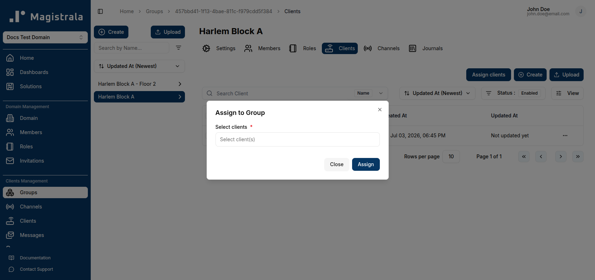

## Group Channels

Groups also support managing **channels** directly at the group level.  
You can **create**, **update**, **enable**, **disable**, **delete**, **assign**, and **connect** channels.  
(See the [Channels](/user-guide/clients-management/channels) section for more details.)

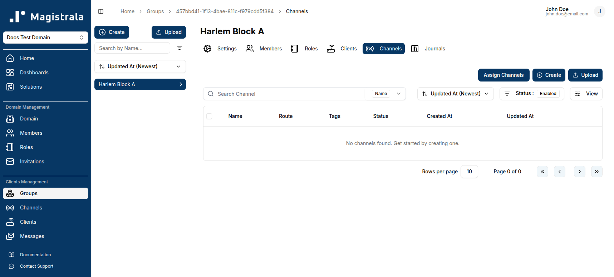

To assign channels to a group, click on the `Assign Channels` button. A dialog will open where you can select multiple channels to attach to the group.

## Journals

The **Journals** tab (formerly named **Audit Logs**) tracks all **group-related events**, including **creation**, **updates**, **disabling** and **role changes**.

Each log entry displays the **operation**, an **Occured At** timestamp, and optional **details** for deeper inspection.

You can search logs by operation type using the search input above the log table.

The most recent operations—such as `entity.create` and `entity.update`—are displayed at the top.

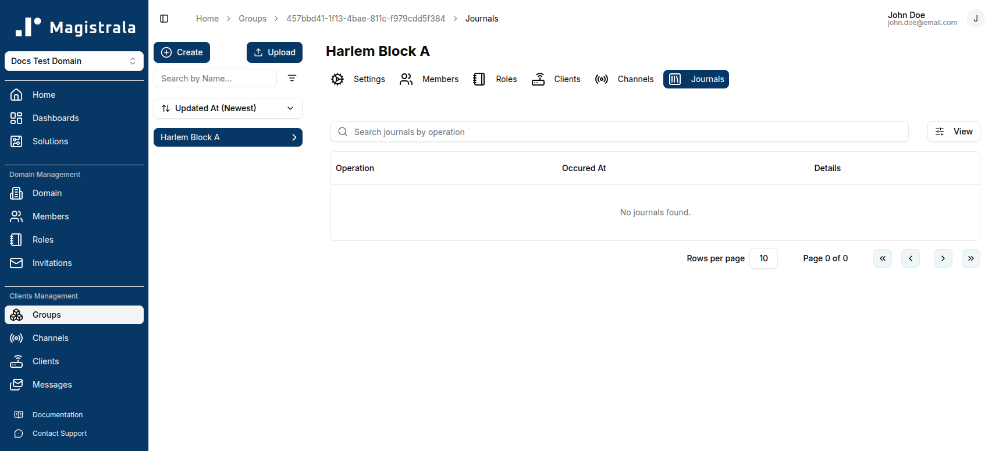

Clicking on the `···` button at the end of each row opens a modal displaying structured details about the selected operation, the same way it does for [Client](/docs/user-guide/clients-management/clients#journals) and [Channel](/docs/user-guide/clients-management/channels#journals) journals.

For most operations, the details modal shows an `outcome` field (e.g., `"allow"`), which is the access-control decision for that action.

This enables users to **trace changes**, **audit hierarchy**, and **verify authorization events** efficiently.

## Delete a Group
To permanently delete a group, click the **Delete Group** button. A confirmation dialog appears asking you to type the group’s name — use the **copy button** to copy it, paste it into the input field, then click **Delete** to finalize.

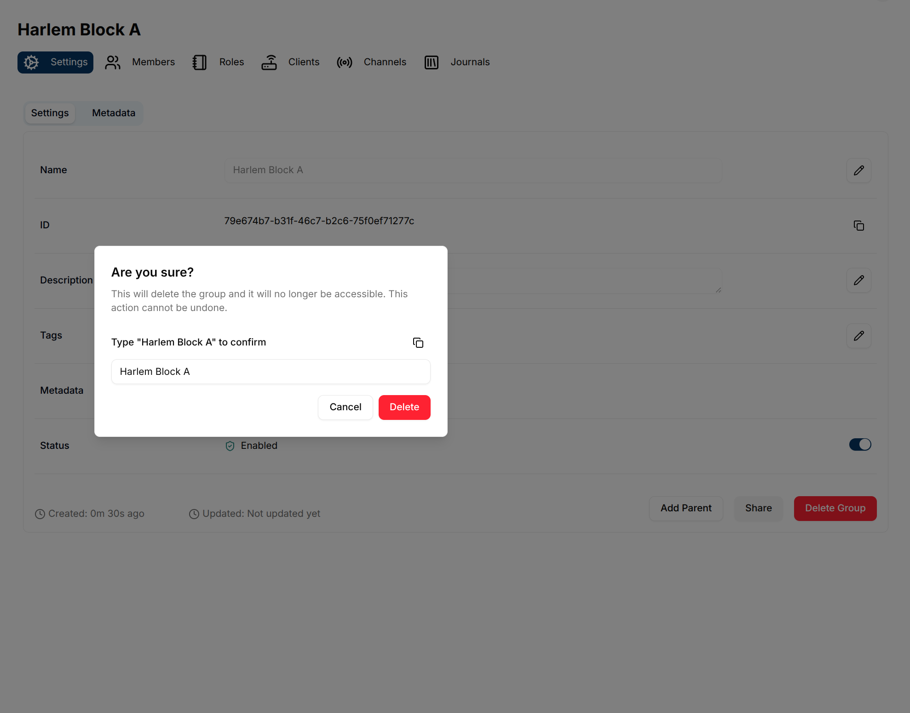
