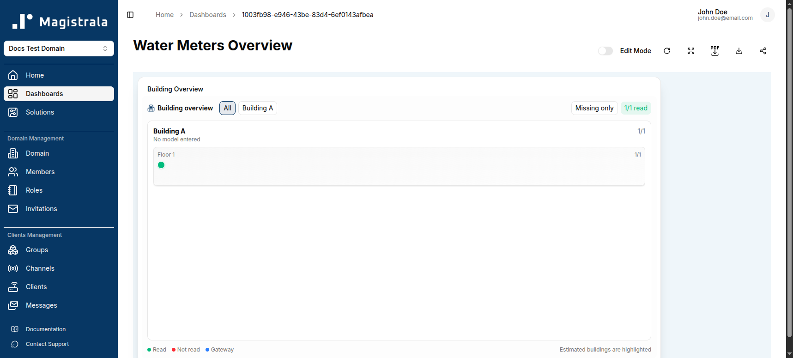
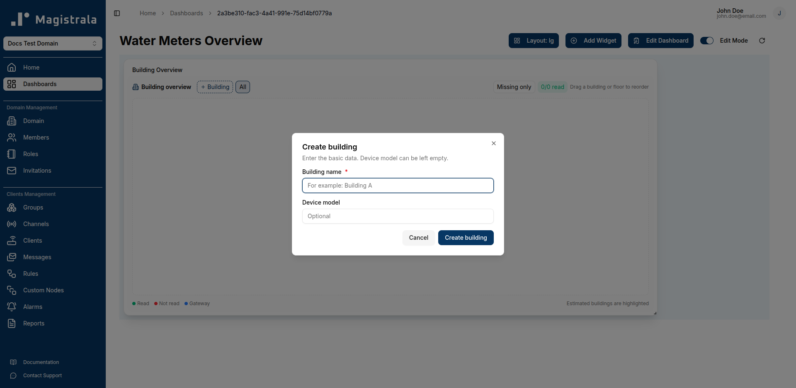
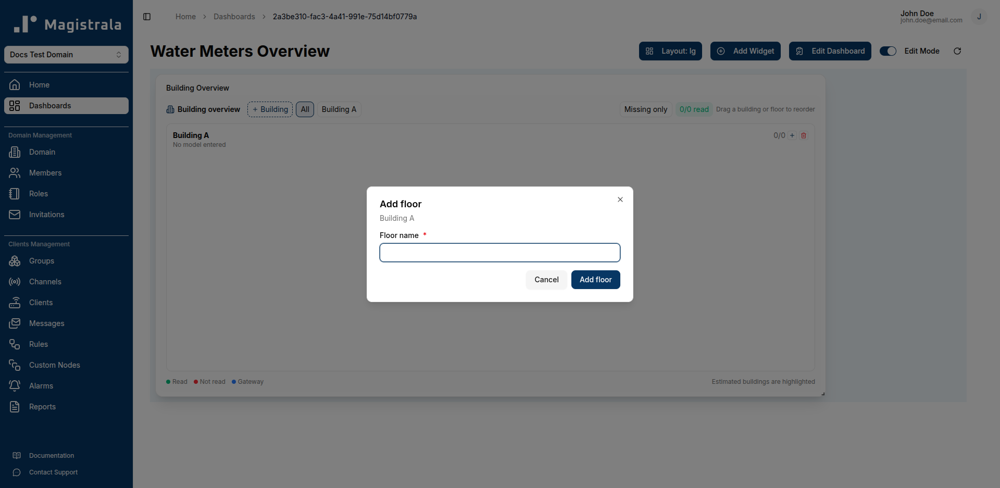
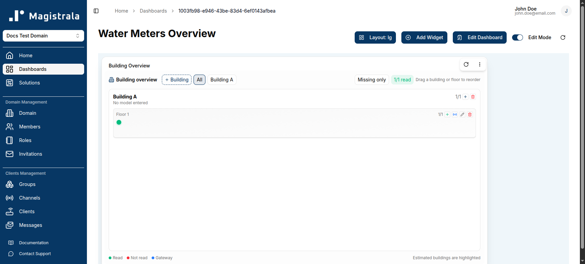
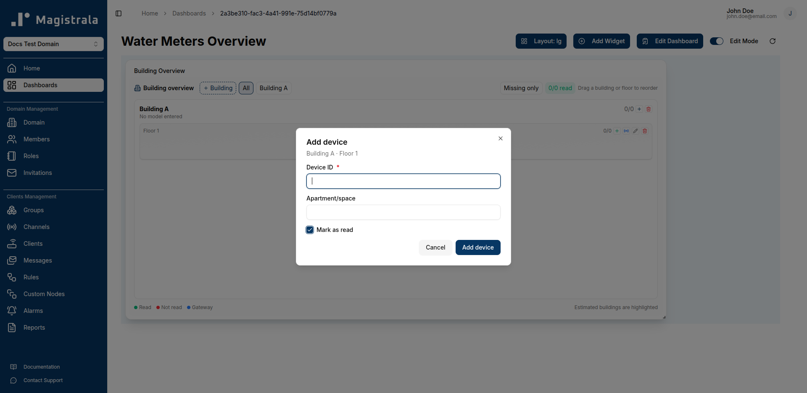

The **Building Overview** widget is a new widget type for facility-style dashboards. It shows the read/not-read status of devices grouped by **building** and **floor**, rather than plotting time-series values.

## Adding a Building Overview Widget

1. Open your dashboard and switch to **Edit Mode**.
2. Click **Add Widget**.
3. Select **Building overview** from the widget options. Unlike other widgets, it is added directly to the dashboard without a configuration dialog — you configure it in place.

## Configuring Buildings and Floors

### Create a Building

Click **`+ Building`**, then provide a **Building name** (required) and an optional **Device model**.

### Add a Floor

On the building card, click the **`+`** icon to open **Add floor**, and provide a **Floor name**.

Each floor row has icons to **Add device**, **Add gateway**, **Rename floor**, and **Delete empty floor**. Buildings and floors can be reordered by dragging them.

### Add a Device

Click **Add device** on a floor to open the **Add device** dialog. Provide the **Device ID** (required, matches a client), an optional **Apartment/space** label, and a **Mark as read** checkbox that sets the device's initial read status.

### Add a Gateway

Click **Add gateway** on a floor to associate a gateway device with that floor. Gateways are shown with a distinct marker in the widget legend.

## Reading the Widget

The widget header shows an overall **`read/total` read** count, and each device is marked with a colored status dot:

- **Read** (green) — the device has reported data and been marked read
- **Not read** (red) — the device has not been marked read
- **Gateway** (blue) — the entity is a gateway rather than a metered device

Use the **Missing only** toggle to filter the view down to devices that have not yet reported, and use the building tabs (**All**, or a specific building name) to scope the view to one building at a time.

> This widget is well suited to solution packs like [Smart Water Metering](/user-guide/solution-packs/smart-water-metering), where the goal is tracking which meters in a building have reported a reading.
