### Create a New Dashboard

After logging into a **Domain**, navigate to the **Dashboards** tab and click the `+ Create` button.

A dialog will appear prompting you to configure the new dashboard. At the top of the dialog is a **type switch** that lets you choose between creating a **Dashboard** or a **Template**.

> To learn about templates, see the [Templates Guide](/docs/user-guide/dashboards/templates).

The following fields are available when creating a dashboard:

| Field            | Required | Description                                                                                               |
| ---------------- | -------- | --------------------------------------------------------------------------------------------------------- |
| **Name**         | Yes      | A unique name for the dashboard                                                                           |
| **Description**  | No       | A short description of the dashboard's purpose                                                            |
| **Tags**         | No       | One or more tags for categorizing the dashboard                                                           |
| **Thumbnail**    | No       | An image to display on the dashboard card                                                                 |
| **Share Option** | No       | Controls who can access the dashboard (see [Update Dashboard Share State](#update-dashboard-share-state)) |

### View Dashboards

#### Card View

By default, dashboards are displayed as cards. Each card shows the dashboard name, description, thumbnail (if set), and action icons.

#### Table View

To switch to table view, click the `Show Table` button at the top right. The table displays the following columns:

| Column          | Description                                                                                  |
| --------------- | -------------------------------------------------------------------------------------------- |
| **Name**        | The dashboard or template name                                                               |
| **Description** | The dashboard or template description                                                        |
| **Template**    | Indicates whether the entry is a template                                                    |
| **Created At**  | When the dashboard was created                                                               |
| **Updated At**  | When the dashboard was last modified                                                         |
| **Actions**     | Menu with options to **View**, **Copy ID**, **Edit**, **Share**, or **Delete** the dashboard |

To return to card view, click the `Show Cards` button.

### Filter and Sort Dashboards

The dashboard listing page includes options to filter and sort your dashboards.

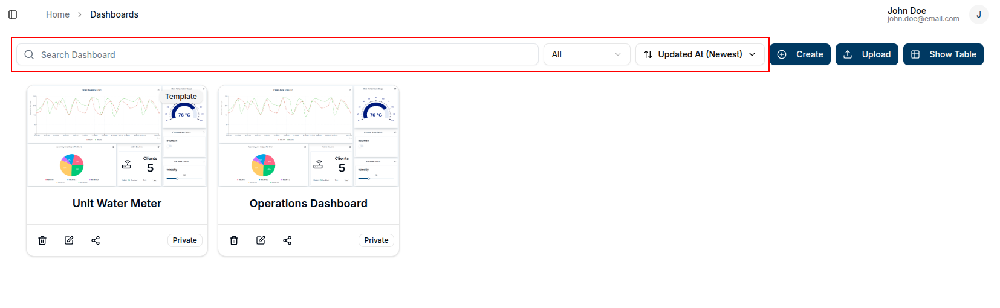

#### Filter by Type

Use the tab filters at the top of the listing to narrow results:

- **All** — shows both dashboards and templates
- **Dashboards** — shows only direct dashboards
- **Templates** — shows only templates

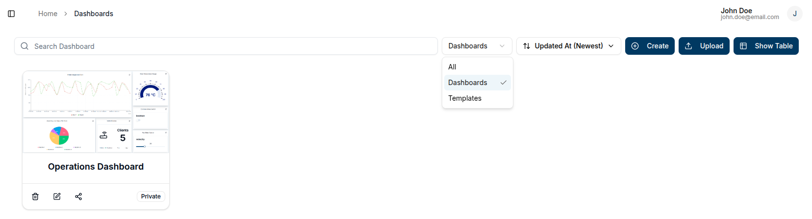

#### Search by Name

Use the search bar to find dashboards or templates by name. Results update as you type.

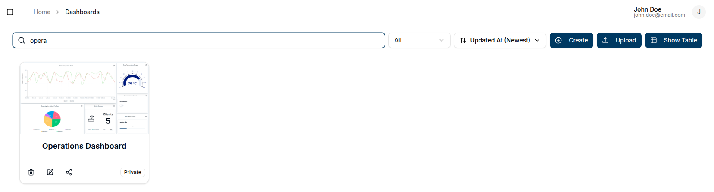

#### Sort Order

Use the sort dropdown to control the listing order. The available options are:

| Option                  | Description                             |
| ----------------------- | --------------------------------------- |
| **Updated at (newest)** | Most recently updated first _(default)_ |
| **Updated at (oldest)** | Least recently updated first            |
| **Name (A → Z)**        | Alphabetical ascending                  |
| **Name (Z → A)**        | Alphabetical descending                 |
| **Created at (newest)** | Most recently created first             |
| **Created at (oldest)** | Least recently created first            |

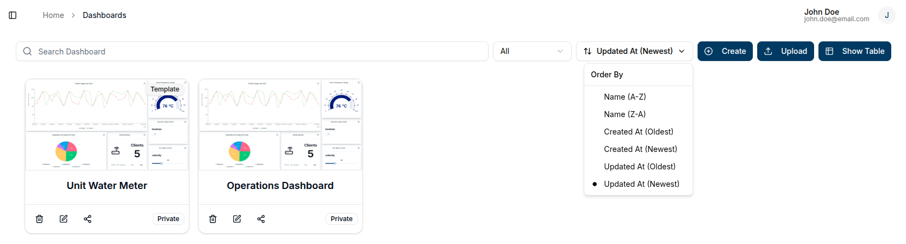

### Edit Dashboard

To edit a dashboard, click the `pencil` icon on the dashboard card or the corresponding row in table view. This opens a side panel from the right.

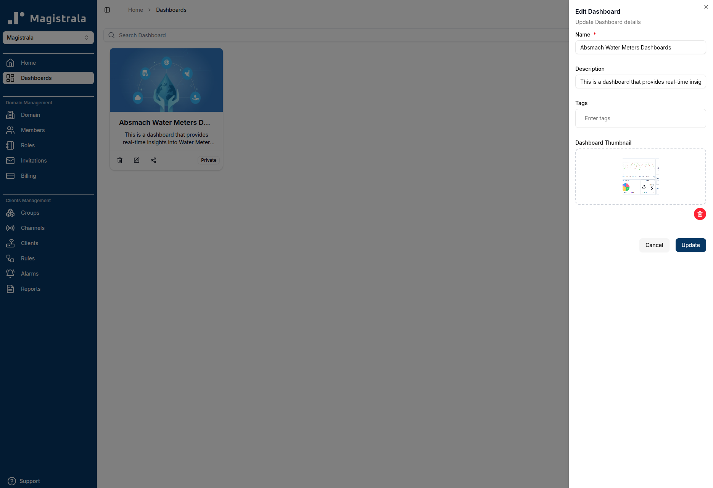

In the editing panel, you can update the dashboard's **name**, **description**, **tags**, and **thumbnail**.

### Delete Dashboard

To delete a dashboard, click the `trash` icon on the card or select **Delete** from the dropdown menu in table view.

A confirmation prompt will appear. To confirm, type the **dashboard name** exactly as shown and click **Delete**.

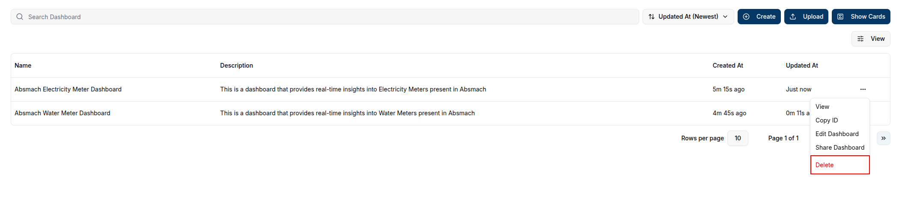

### Update Dashboard Share State

To change a dashboard's sharing settings, click the `Share` icon on the dashboard card:

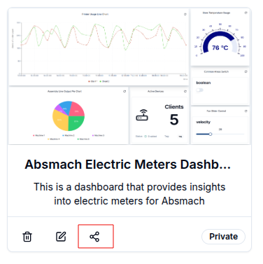

This opens a dialog with the available share options:

#### None

The dashboard is private and visible only to you.

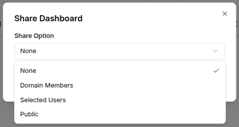

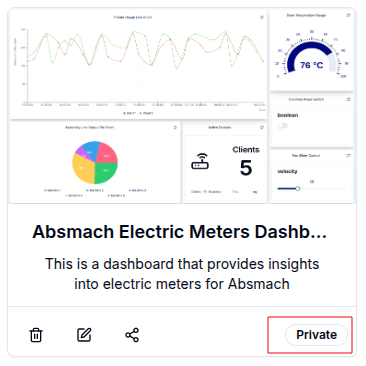

#### Domain Members

The dashboard is accessible to all members of your domain.

#### Selected Users

Only specific domain members you choose can access the dashboard. Select one or more users from the domain member list to grant access.

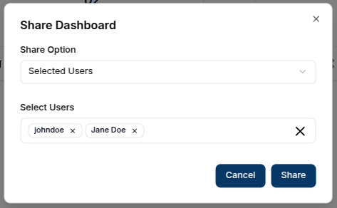

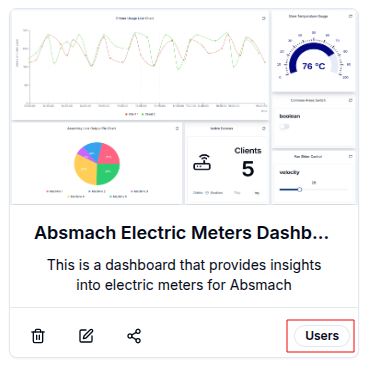

#### Public

Anyone with the link can view the dashboard — no login required.

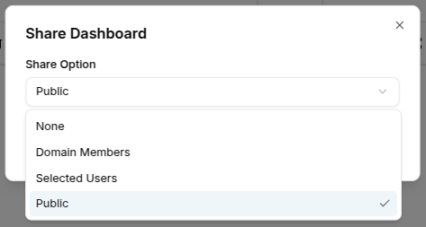

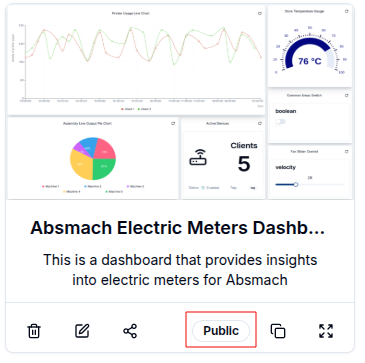

After setting the share option to **Public**:

- Click the `copy` button to copy the shareable link.

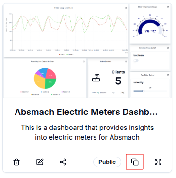

- Click the `fullscreen` icon to view the dashboard in full screen.

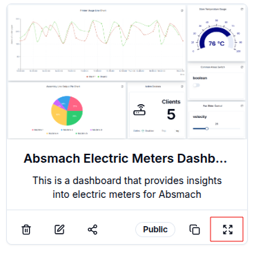

> **Note:** The following widgets are not available on public dashboards: Control widgets (Switch, Slider), Marker Map, Polygon Map, Count Card, Table Card, Alarm Count, and Alarm Table.

### Upload Dashboard

Magistrala allows dashboards to be uploaded in `.json` format.

Click the `Upload` button at the top of the dashboard listing. A dialog will open for you to select and upload a `.json` file containing the required dashboard fields.

> Make sure your file includes the dashboard **name**, **layout**, and **metadata**.

The uploaded dashboard will appear in the listing with the data from the file.

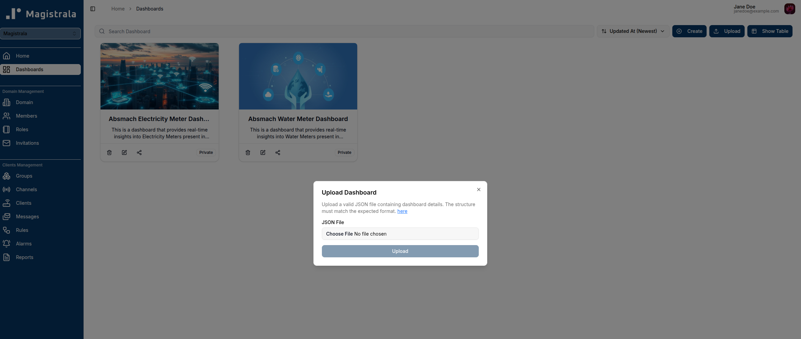

### Access a Dashboard

Click a dashboard card or the corresponding row in table view to open it.

### Customize a Dashboard

#### Edit Mode

Toggling **Edit Mode** enables dashboard editing features. In this mode, you can **add**, **modify**, or **remove** widgets, and update the dashboard's **name** and **description** using the `Edit Dashboard` button.

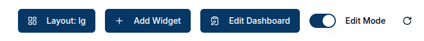

#### Choose a Layout

Layouts let you select a grid width optimized for your screen size: **desktop**, **laptop**, **tablet**, **phone**, or **small phone**.

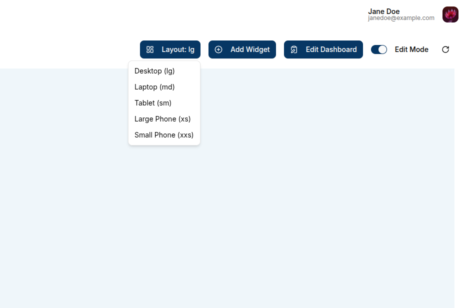

#### Add a Widget

Click `Add Widget` at the top of the page to open the widget selection dialog. Choose the widget type that best fits your data — chart, card, gauge, map, or control.

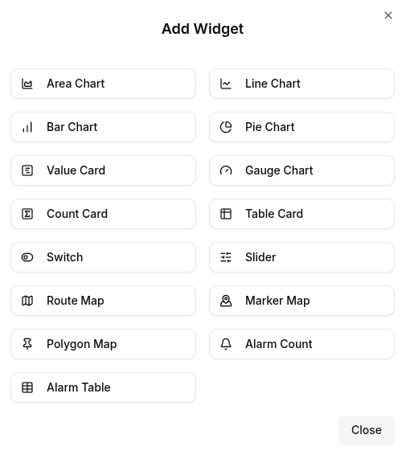

### Full-Screen Mode

Click the `Full Screen` button to expand the dashboard to fill the entire screen.

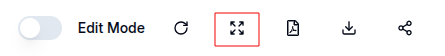

### Download a Dashboard

#### Download as PDF

Click the `PDF icon` to download the dashboard as a PDF file.

#### Download as JSON

Click the `Download icon` to download the dashboard as a JSON file.

### Share Dashboard

To update the share state from inside an open dashboard, click the `Share` icon in the dashboard toolbar.

### Delete a Dashboard

A user can delete a dashboard by clicking the `Trash` icon on the card or clicking **Delete** in the options on the dropdown menu in table view.

A confirmation dialog appears asking you to type the dashboard's name before deletion is finalized. Use the **copy button** to copy the name, paste it into the input field, then click **Delete** to permanently remove the dashboard.

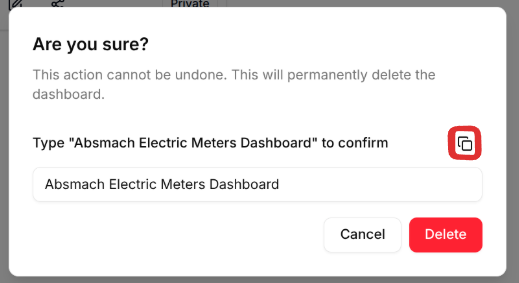
