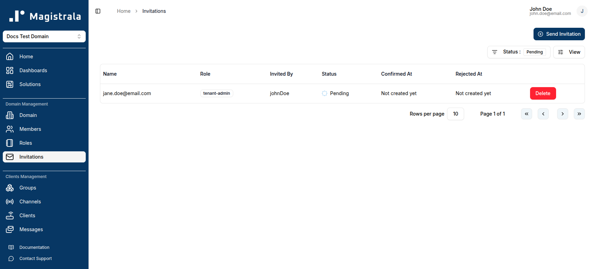
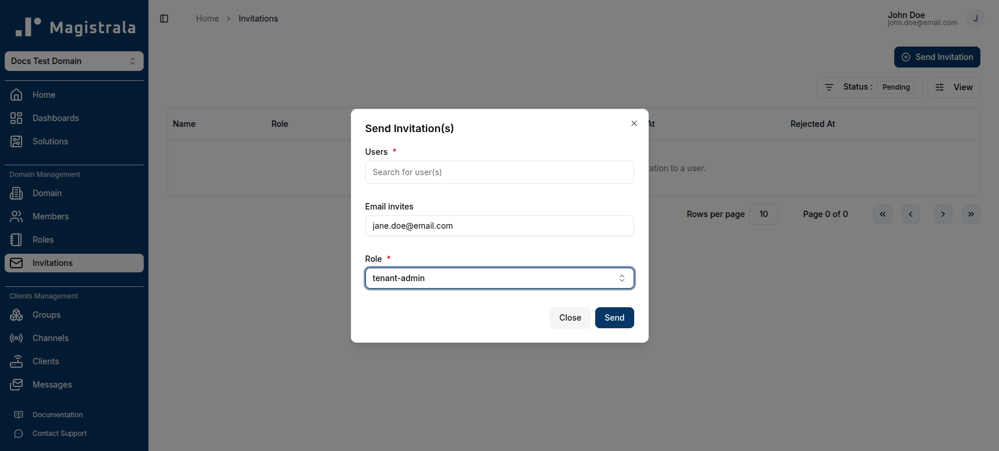
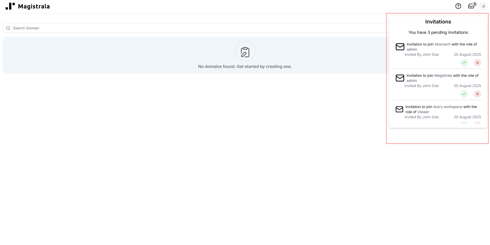
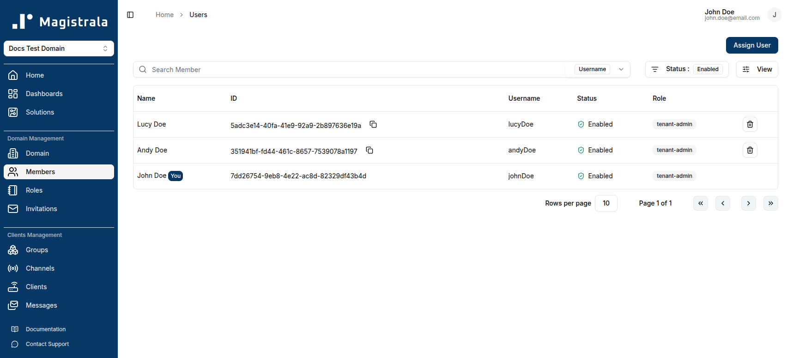
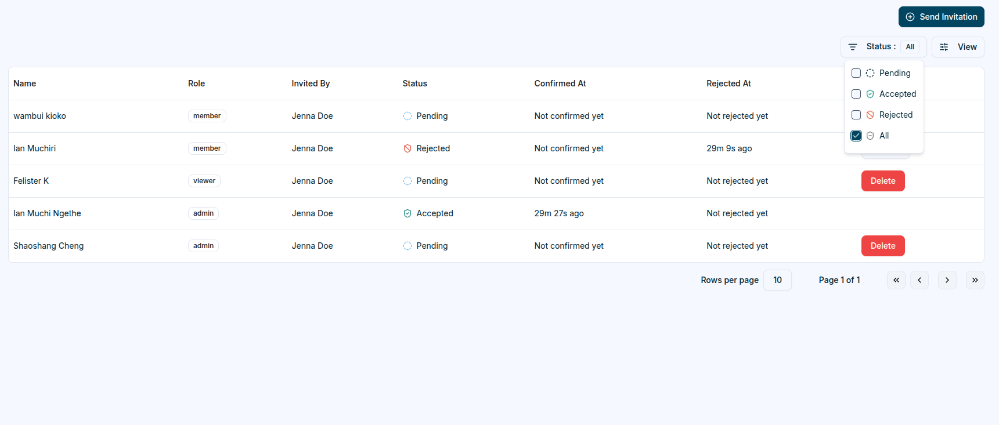

## Overview

Domain administrators can invite users to their domain with a specific role. Each role grants the invitee a predefined set of actions they can perform within the domain.
The **Invitations** tab displays invitations for the selected domain, including each invitee, role, status, inviter, and confirmation or rejection timestamps.

The **Status** column shows the current state of each invitation:

| Status       | Description                                           |
| ------------ | ----------------------------------------------------- |
| **Pending**  | Invitation sent, awaiting recipient's response.       |
| **Accepted** | Invitation accepted — the user has joined the domain. |
| **Rejected** | Invitation declined by the recipient.                 |

## Send Invitation

To invite users to a domain, the administrator can click **Send Invitation** and select one or more existing users along with the role they should receive.

**Email invites** — you can also invite people who don't yet have a Magistrala account by entering their email addresses (comma-separated) in the **Email invites** field. An account is created for them and they receive the invitation the first time they log in.

Once sent, recipients can see the pending invitation from the invitations icon in the top bar and can **accept** or **decline** it.

## Accept or Decline an Invitation

After logging in, the recipient can open the invitations popover from the top bar to review pending invitations.

The user has the option to **accept** or **decline** the invitation directly from this popover.

The user can click **View All** to navigate to the **Invitations** page, where all pending invitations are listed.

Once the invitation is accepted, the user can access the domain. Their details are added to the domain members table with the assigned role.

## Resend and Delete Invitations

The **Invitations Table** also includes management options depending on the invitation’s status:

| **Action** | **Availability**                           | **Description**                                                                    |  
| ---------- | ------------------------------------------ | ---------------------------------------------------------------------------------- |  
| **Resend** | Available for **Rejected** invitations     | Allows the administrator to resend an invitation to users who previously declined. |  
| **Delete** | Available only for **Pending** invitations | Removes a pending invitation that has not yet been accepted or rejected.           |

This keeps only active invitations editable, while accepted and rejected invitations remain available for tracking.
