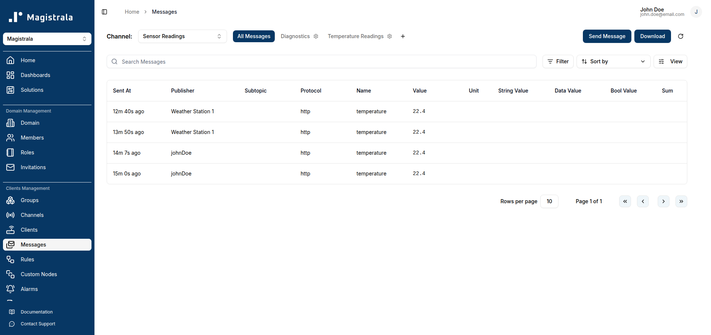
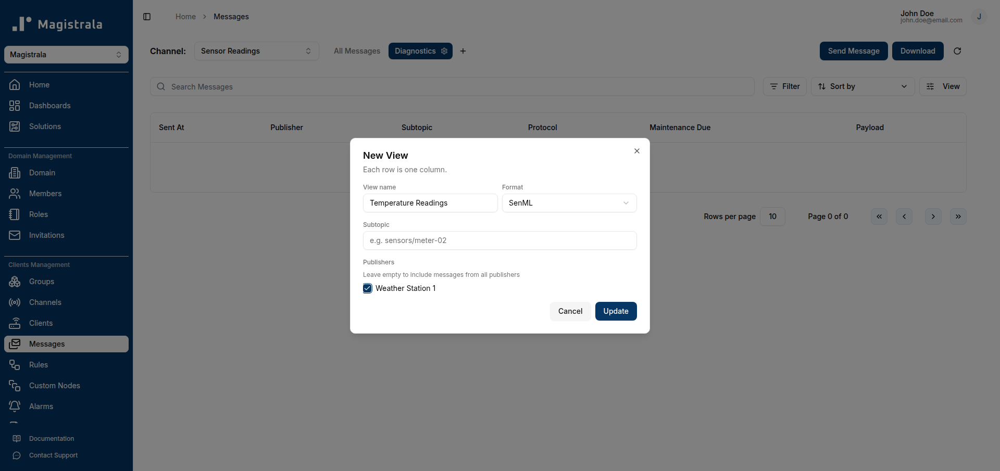
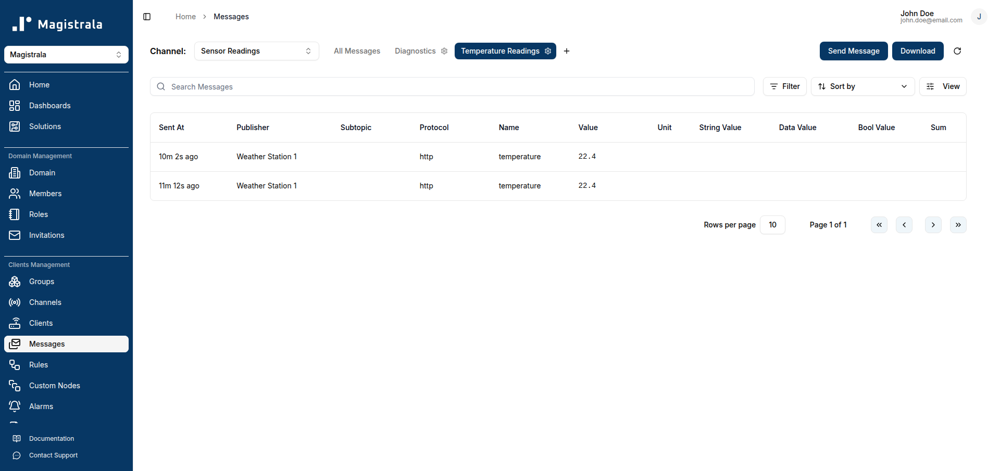
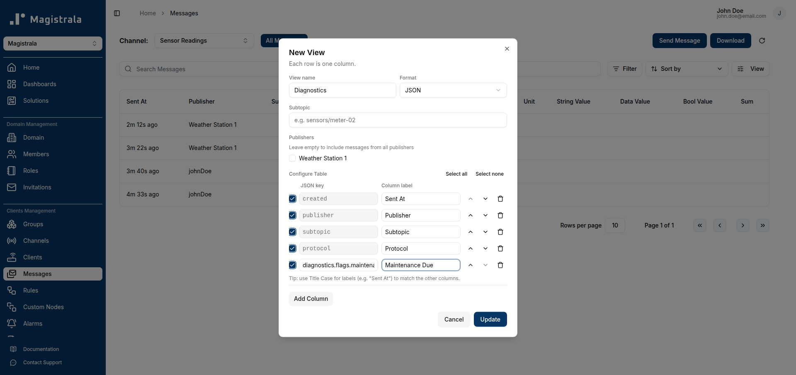
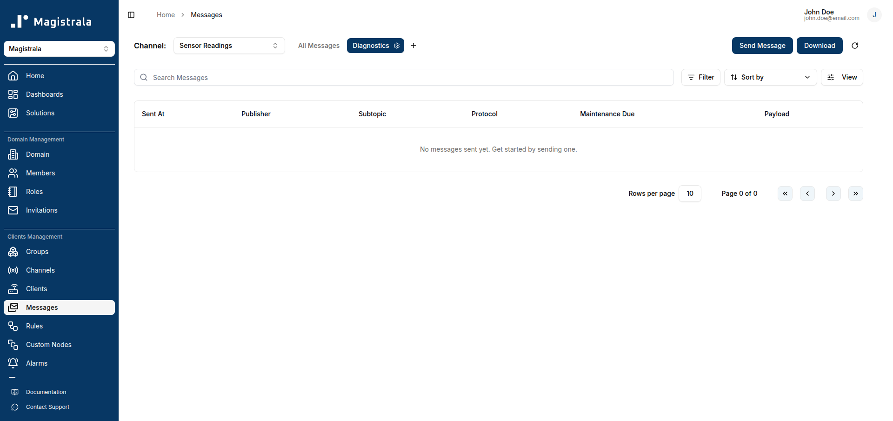
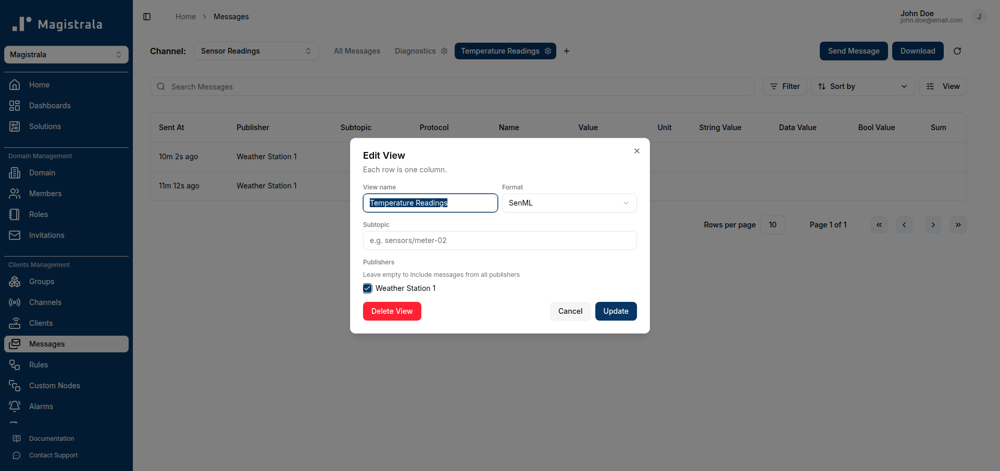

> **Message Views** is available on **Enterprise Edition** deployments only.

Message Views let you save named, reusable table configurations for a channel's messages — filtered by subtopic and/or publisher, with a custom set of columns — instead of scrolling through one long, unfiltered table every time. Views are shown as tabs above the messages table, and for **JSON**-format messages, each view also gets a built-in **Payload** column with a read-only, syntax-highlighted JSON viewer.

Views are saved per channel: the set of tabs you see is scoped to whichever channel you're currently browsing.

## Prerequisites

Messages only appear on the Messages page if a [Rule](/user-guide/rules-engine) is set up to store them in Magistrala's internal database — see [Store Messages](/user-guide/rules-engine#store-messages). The Rules Engine's **Internal DB** output node stores messages in **SenML format** only; there's currently no way to persist arbitrary JSON message payloads through the Rules Engine or the built-in **Send Message** dialog (both are SenML-shaped). A JSON-format view is still fully configurable and will work correctly once your own device or service publishes real JSON payloads to the channel — it just won't have anything to show until then.

## Accessing views

Views appear on both the domain-wide **Messages** page (`/messages`, with a channel selector) and on an individual channel's own **Messages** tab. Either way, you'll see a row of tabs above the table: **All Messages** (the default, unfiltered view) followed by any saved views, and a **+** button to create a new one.

The active tab is highlighted. **All Messages** can't be edited or deleted — it always shows every message for the channel with the default column set.

## Creating a view

Click **+** to open the view editor. Every view has:

- **View name** — required.
- **Format** — **SenML** or **JSON**. This determines both which columns are available and which stored messages the view can match (a SenML view only ever shows SenML-stored messages, and vice versa).
- **Subtopic** — optional. Restricts the view to messages published to that exact subtopic.
- **Publishers** — a checkbox list of clients that have published to this channel. Leave all unchecked to include every publisher; check one or more to restrict the view to just those publishers. If no clients have published yet, this section just shows "All publishers".

### SenML views

A SenML view has no further configuration — its column set is fixed (Sent At, Publisher, Subtopic, Protocol, Name, Value, Unit, String Value, Data Value, Bool Value, Sum), the same columns **All Messages** uses.

Here's a SenML view filtered to a single publisher, showing real messages:

### JSON views

Choosing **JSON** reveals a **Configure Table** section for building a custom column set:

- The table starts pre-populated with rows for the same base fields SenML views use (**created**, **publisher**, **subtopic**, **protocol**) — these have a fixed key (shown in a gray box) but an editable label.
- Click **Add Column** to add a row for a JSON payload field. Enter a **JSON key** and a **Column label**. Keys support **dot notation** to reach nested fields — for example `diagnostics.flags.maintenance_due` reads `payload.diagnostics.flags.maintenance_due`, walking the object tree rather than doing a flat lookup.
- Each row has a checkbox to include/exclude it without deleting it, up/down arrows to reorder columns, and a trash icon to remove the row entirely. **Select all** / **Select none** toggle every row at once.
- If any messages already exist for this channel, an **Auto-detect from latest message** button appears next to **Add Column**, which adds a row for every key found in the most recent message's payload that isn't already configured.
- A **Payload** column is always appended automatically, whether or not you configure any custom columns — there's no way to remove it. It shows a **JSON** button that opens a read-only, syntax-highlighted JSON viewer for that row's full payload, with a copy-to-clipboard button. The same viewer button also appears automatically in place of any configured column's cell whenever that column's value resolves to an object rather than a scalar (e.g. a column pointed at `diagnostics` instead of a specific leaf like `diagnostics.flags.maintenance_due`).

Since this channel has no JSON-format messages yet (see [Prerequisites](#prerequisites)), the resulting view is empty — but every column, including the always-on **Payload** column, is there and ready:

## Editing and deleting a view

Click the gear icon on any saved view's tab to reopen the editor with its current settings, including a **Delete View** button. Deleting a view only removes the saved configuration — it does not affect the underlying messages.

## Summary

| Field | SenML views | JSON views |
| --- | --- | --- |
| Name, Subtopic, Publishers | Yes | Yes |
| Column set | Fixed | Configurable, dot-notation nested keys supported |
| Payload / JSON viewer | Not applicable | Always present, can't be removed |
| Auto-detect columns | Not applicable | Available once the channel has JSON messages |
