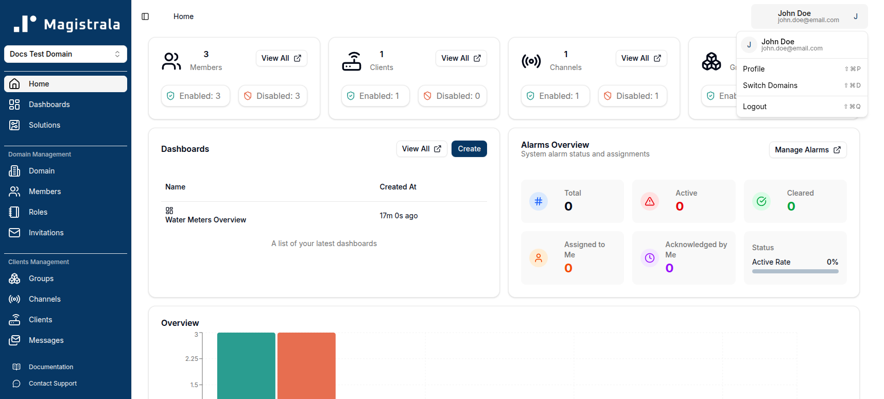
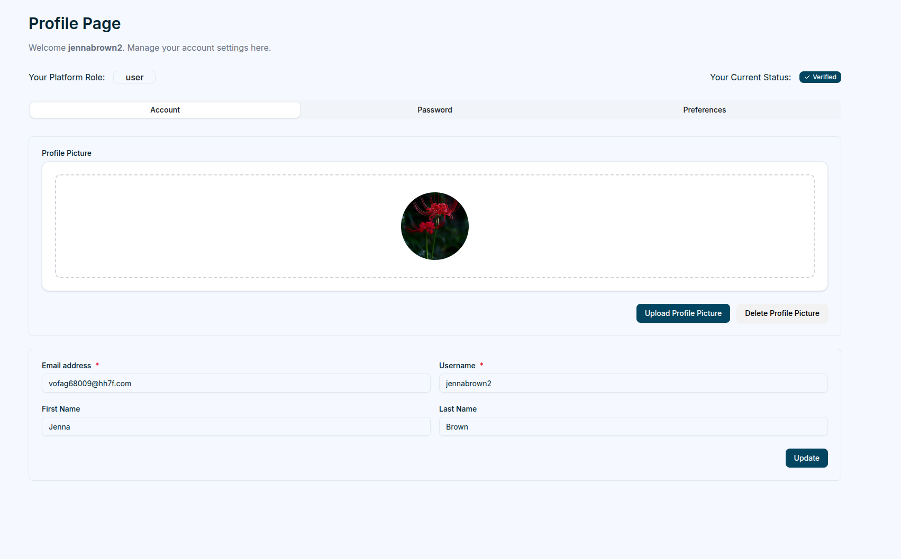
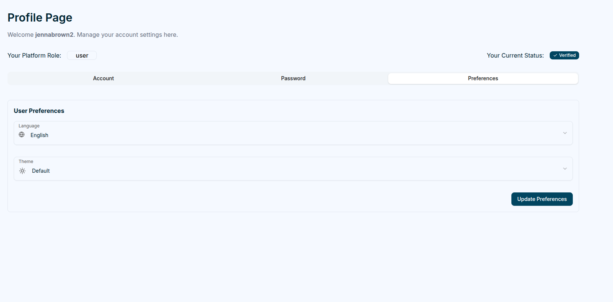
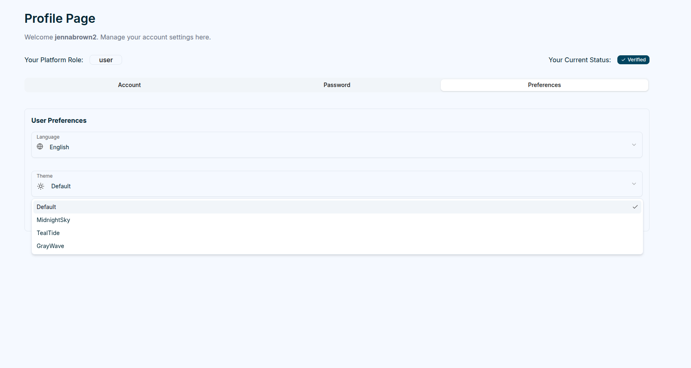
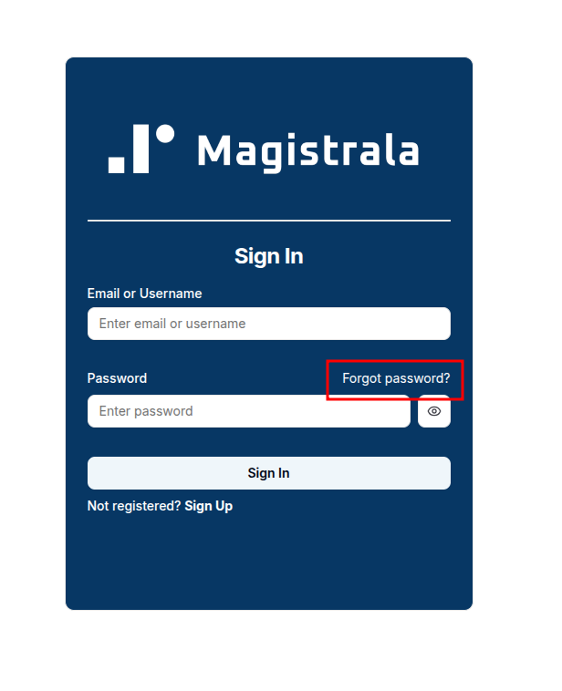
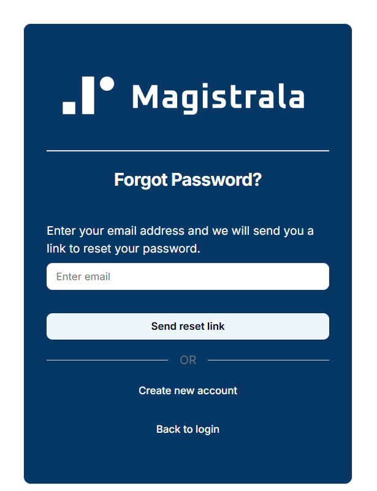
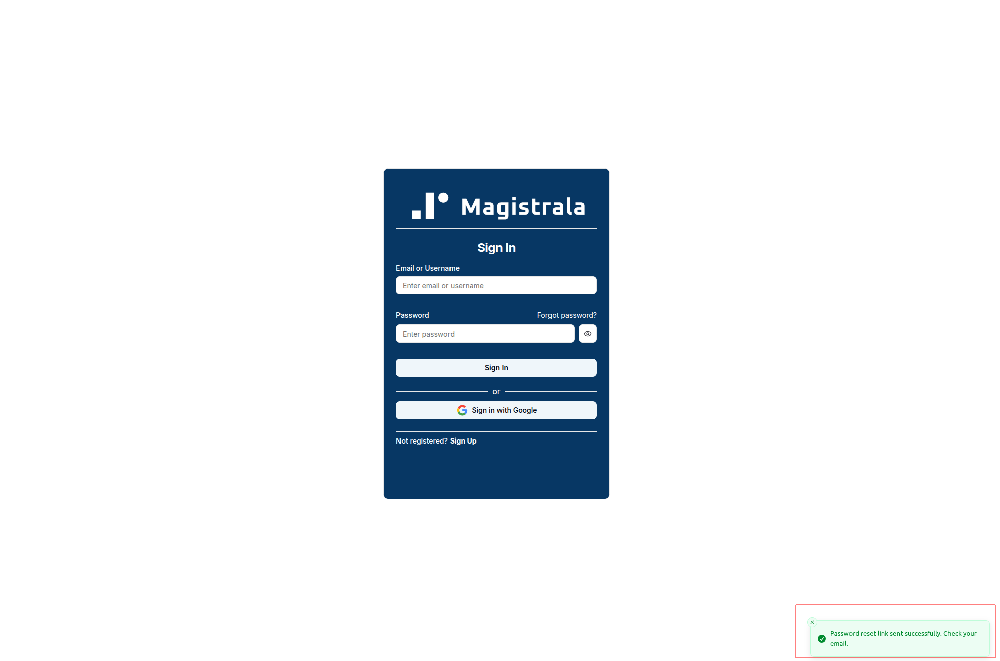
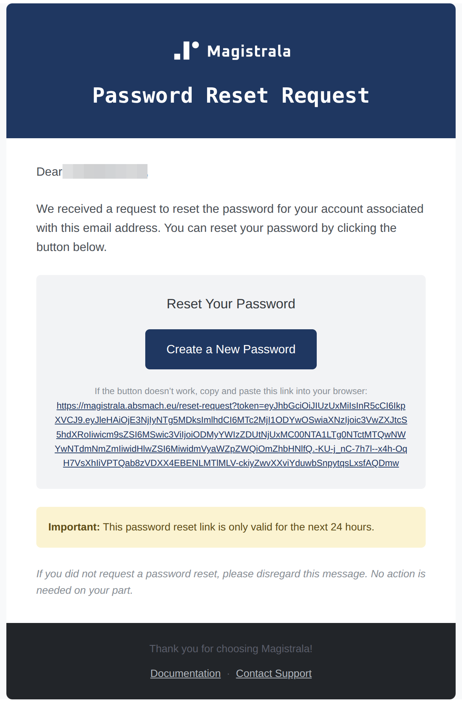
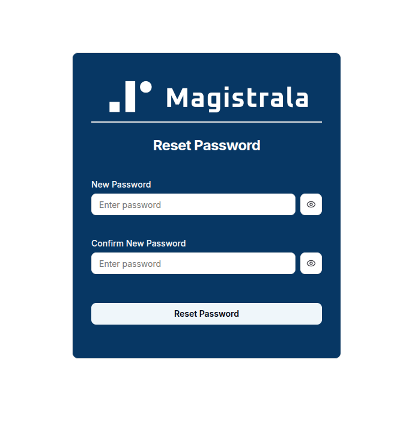

## User Profile

Each user has access to a **Profile Page**, where personal information, security settings, and preferences can be updated.

Clicking the `user profile picture` or `avatar` at the top right opens a popover.

## Standard User Menu

- **Profile** (`⇧⌘P`)
- **Switch Domains** (`⇧⌘D`)
- **Logout** (`⇧⌘Q`)

Selecting the Profile option reveals two main tabs, along with your **Platform Role** and account **Status** (e.g. Unverified) shown at the top of the page.

### Account

The **Account** tab allows users to update their username, first/last name, and upload a profile picture. The **Email address** field is read-only from this tab.

To change your password, use the [Password Recovery](#password-recovery) flow below.

### Preferences

The **Preferences** tab enables users to customize language and theme settings.

Magistrala currently supports **English**, **German**, and **Serbian** languages and offers four different themes to choose from.

## Password Recovery

Users who forget their password can initiate a password reset through the **Forgot Password** feature on the login page.

Clicking the **Forgot Password?** link redirects the user to a dedicated **Forgot Password** page, where they must enter their registered email address.

After submitting the request, Magistrala displays a success notification confirming that the reset link has been sent.

> **Password reset link sent successfully. Check your email.**

A password reset email is then delivered to the user’s inbox.  
The email includes a personalized greeting and a button that directs the user to the password reset page.

By clicking **Create a New Password**, the user is redirected to the **Reset Password** page, where they can create and confirm a new password.  
If the button does not work, the email also contains a fallback link that can be copied and pasted into a web browser.

> **Important:** The password reset link is valid for **24 hours** from the time of issue.

Once the password has been successfully updated, the user can return to the **Sign In** page and log in with the new credentials.
