## Overview

The **Reports** service enables users to generate, schedule, email and download data reports from connected devices and sensors.

## Create a report

To create a report, click the `Create Report` button at the top right of the reports page.

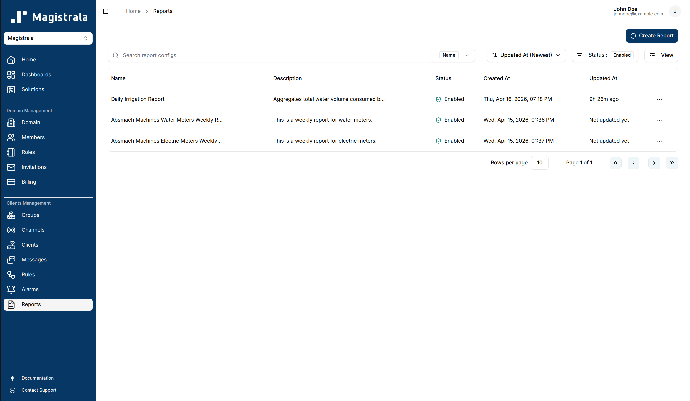

This action redirects  users to report creation page where required details can be provided. There are two main sections **Configuration** and **Metrics**.

In the Configuration section, the user is required to input general settings for the report such as:

|Property |Description| Required |
|-----------------|------------------------------------------|----------|
|Name |Descriptive name for the report| ✅ |
|Description |Additional context about the report| Optional |
|Report Title | The title for the report | ✅ |
|Report Format | The file format for the report(pdf or csv) | ✅ |
|Start Time | The start time of the report| ✅ |
|End Time | The end time for the report| Optional |
|Timezone | The timezone for displaying timestamps (e.g., "America/New_York", "Europe/London"). Defaults to UTC if not specified | Optional |
|Aggregation Method | The aggregation method e.g Maximum, Minimum e.t.c| Optional |
|Aggregation Interval |  The interval used for aggregating messages | Optional |

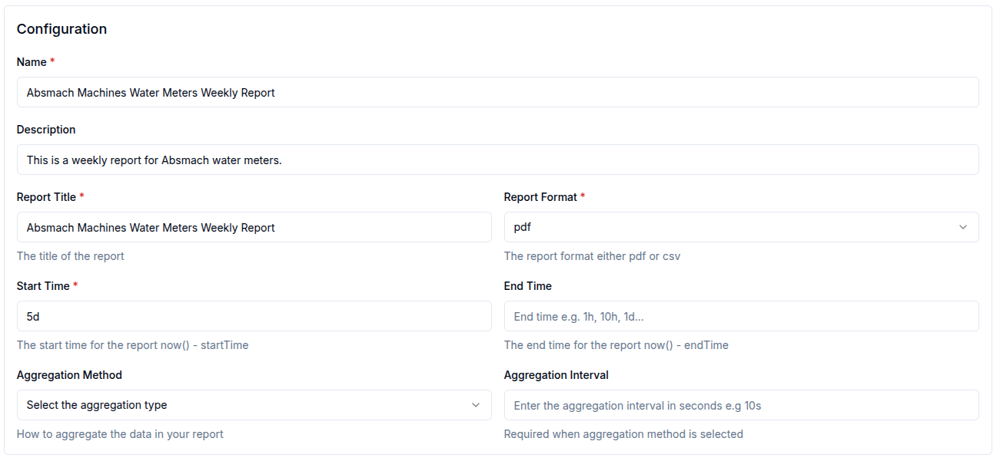

In the Metrics section, users can define specific filters such as:

|Property |Description| Required |
|-----------------|------------------------------------------|----------|
|Name | The value name of the message| ✅ |
|Channel | The channel that subscribed to the message|  ✅ |
|Clients | The clients that sent the messages| Optional |
|Subtopic | The subtopic of the message|  Optional |
|Protocol | The protocol used to send the message (HTTP, MQTT, WebSocket,or COAP)| Optional |

Users can click the `Add Metric` button to add multiple metrics to a single report.

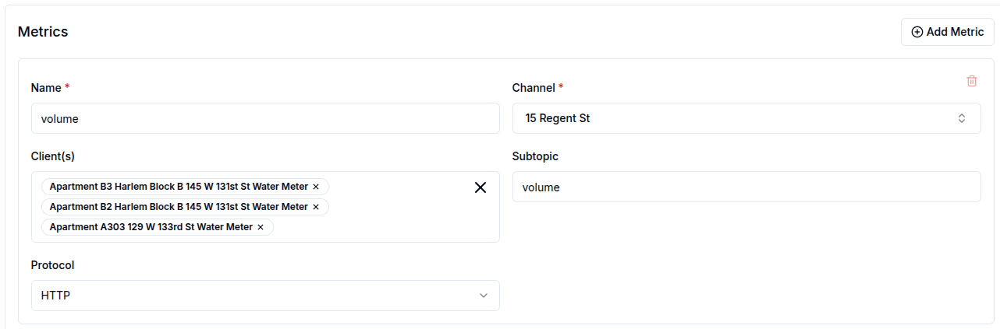

## Timezone Configuration

The Reports service supports timezone-aware timestamp display in generated reports. This allows users to view all timestamps in their preferred timezone rather than UTC.

### How to Use Timezones

When creating or scheduling a report, you can specify a timezone in the **Configuration** section:

1. Enter a valid IANA timezone name in the **Timezone** field (e.g., "America/New_York", "Europe/Paris", "Asia/Tokyo")
2. If left empty, the report will default to UTC
3. The timezone applies to:
   - Report generation timestamps (shown in headers and footers)
   - All message timestamps in both PDF and CSV formats

### Supported Timezone Formats

The service accepts IANA timezone names, such as:

- **Americas**: "America/New_York", "America/Los_Angeles", "America/Chicago"
- **Europe**: "Europe/London", "Europe/Paris", "Europe/Berlin"
- **Asia**: "Asia/Tokyo", "Asia/Shanghai", "Asia/Dubai"
- **Australia**: "Australia/Sydney", "Australia/Melbourne"
- **Africa**: "Africa/Cairo", "Africa/Johannesburg"

**Note:** Invalid timezone names will fall back to UTC automatically, and a warning will be logged.

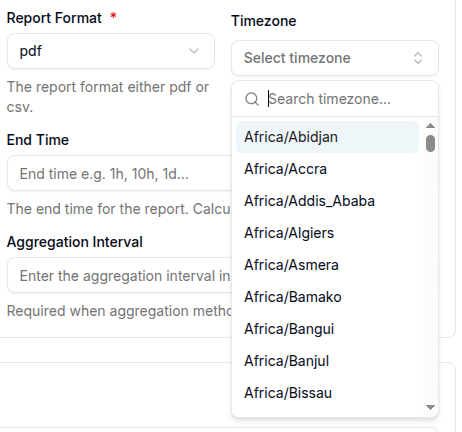

### Generate an instant report

To generate an instant report, click the `Generate Instant Report` button. The report will be generated based on the provided configuration.

### Download a report

To download a report, click the `Download Report` button. The report will be downloaded in the format specified in the report format field.

### Email a report

To email a report, click the `Email Report` button, fill in the required fields, and the report will be sent to the specified recipients.

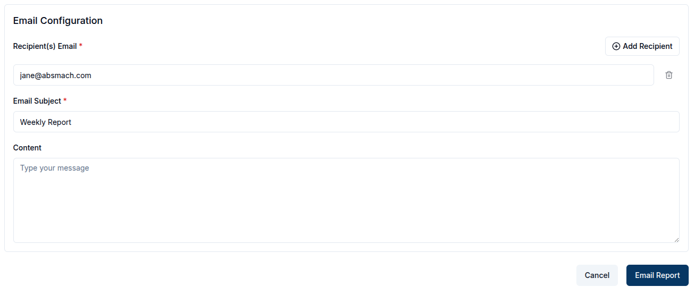

### Schedule a report

To schedule a report, click the `Schedule Report` button and two sections (**Email Configuration** and **Schedule Configuration** )appear.

In Email Configuration, users can configure how the report will be sent via email.
The fields to be filled include:

|Property |Description| Required |
|-----------------|------------------------------------------|----------|
|Recipient(s) Email | The recipient's email address(es)| ✅ |
|Email Subject | The subject line of the email  |  ✅ |
|Report Format | The file format for the report (PDF or CSV).| ✅ |

In Schedule Configuration, users can configure when the report should be sent.  
The fields to be filled include:

|Property |Description| Required |
|-----------------|------------------------------------------|----------|
|Active From  | The start date for the report| ✅ |
|Occurs at | The time of the report should be sent  |  ✅ |
|Recurring Interval | How often the report should repeat (e.g., daily, weekly). | ✅ |
|Recurring Period | How many intervals to skip between executions (e.g., 1 = every interval, 2 = every second interval, etc.).|  Optional |

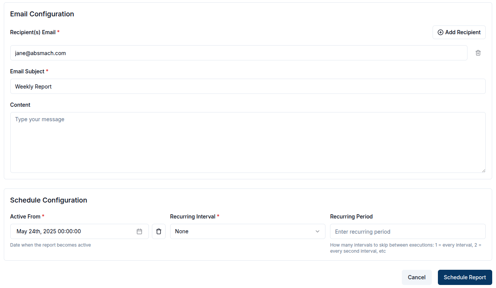

## View a report

After a report is created, it will be added to the reports table. To view a report,  click the row or click the `View` button in the row actions.

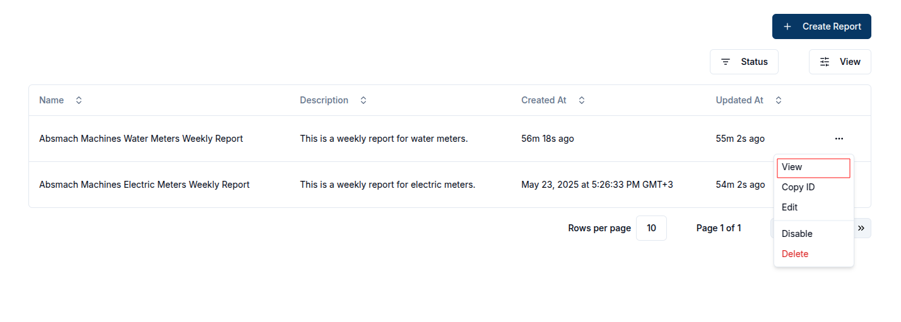

## Update a report

While on the View Report Page, the user can update the details of the report, modify the schedule, add metrics or recipients, or download the report.

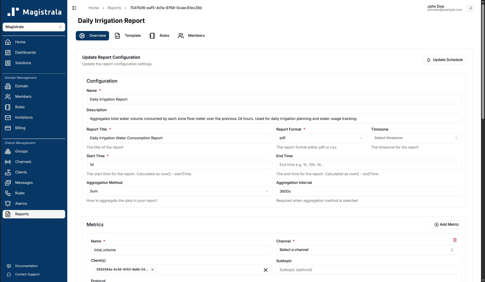

## Report Template

Each report has an associated HTML template that controls how the generated PDF report is rendered. To edit the template, navigate to the **Template** tab on the report topbar.

 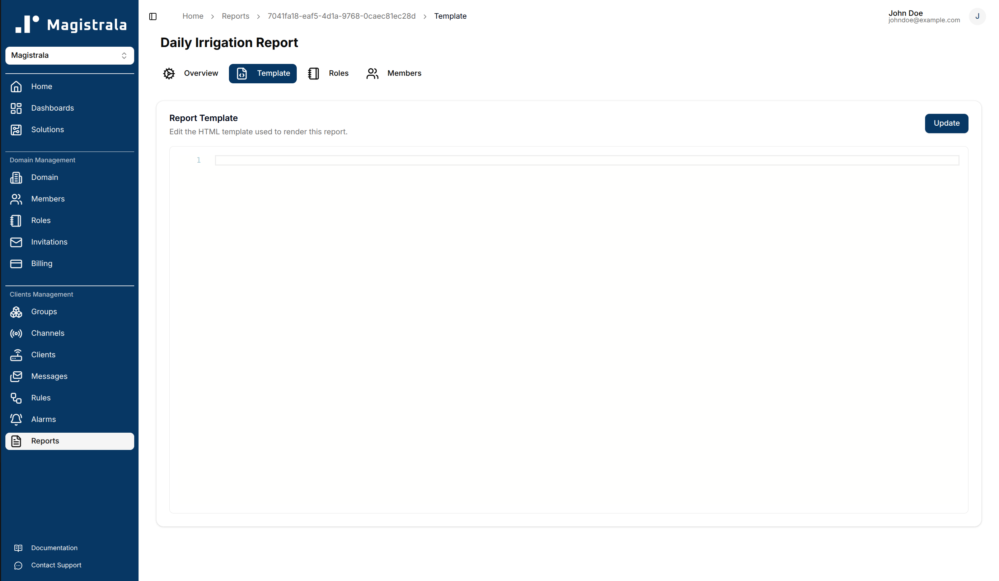

## Report Roles

Roles define a set of actions that can be allocated to users for a specific report.

To create a role, navigate to the **Roles** tab on the report topbar. Click on the `+ Create` button and provide a role name. The actions and members are optional fields.

 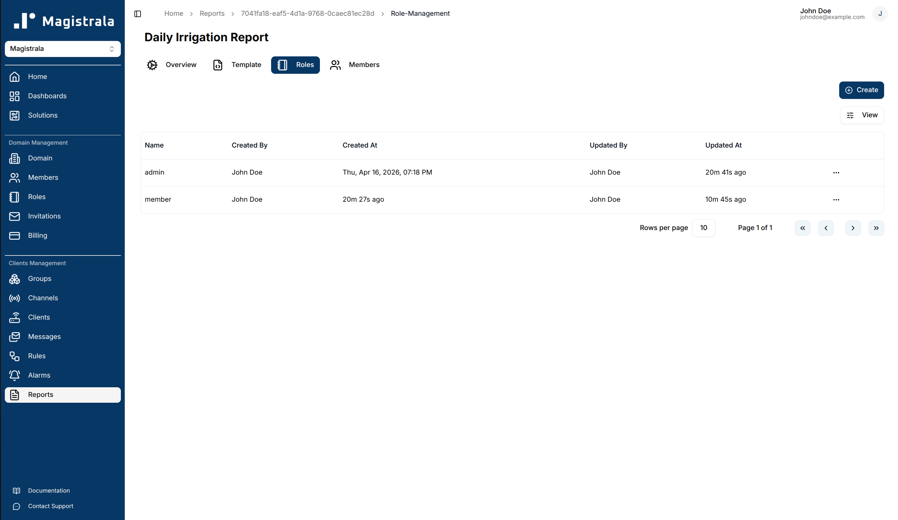

### Role Information

 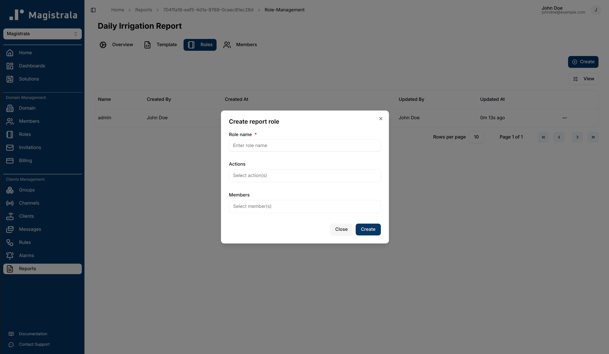

The **Role name** is compulsory. You can optionally provide the role actions by selecting from the available actions. You can also optionally provide the members by selecting from the dropdown.

The following is the list of available actions for a report:

- `report_read`
- `report_update`
- `report_delete`
- `report_manage_role`
- `report_add_role_users`
- `report_view_role_users`
- `report_remove_role_users`

#### Update Report Roles

Click a role in the **Roles table** to open its page. The page has two tables for the **Role Actions** and the assigned **Role Members**.

To update a **role name**, click on the **pencil** icon on the far right end of the field, update the value then click on the **check** icon to save or the **cross** icon to cancel.

 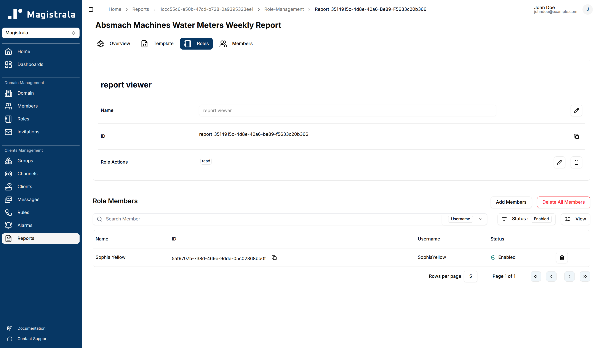

To update the **Role Actions**, click on the **pencil** icon. A dialog box will appear allowing you to select the actions you want to add.

 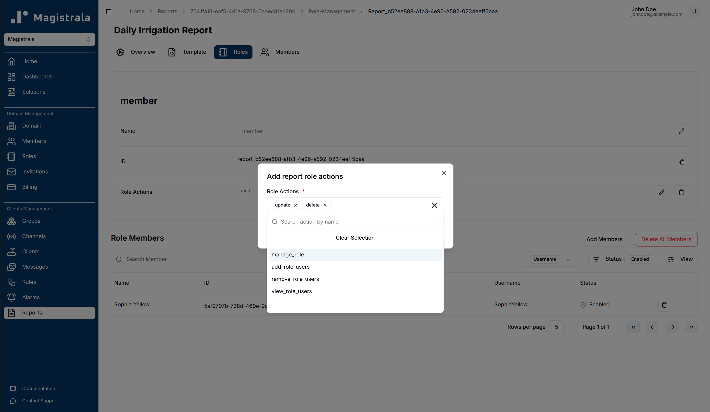

To update the **Role Members**, click the **Add Members** button. A popup dialog will appear with the list of Domain Members from which a user can select.

 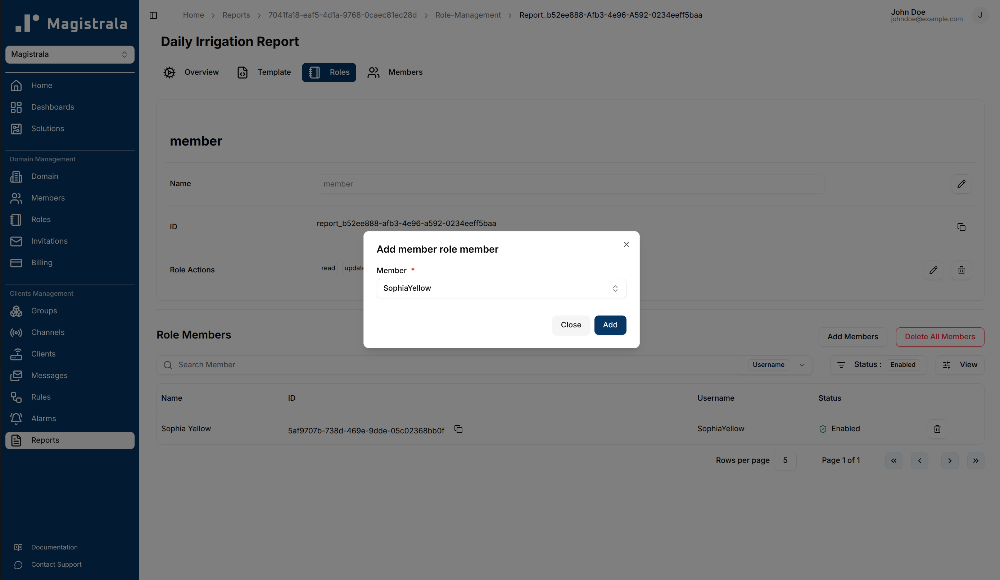

#### Delete Report Roles

You can delete actions by clicking on the **trash** icon. It opens a dialog that allows you to select which actions to remove. There is also an option to clear all the actions.

 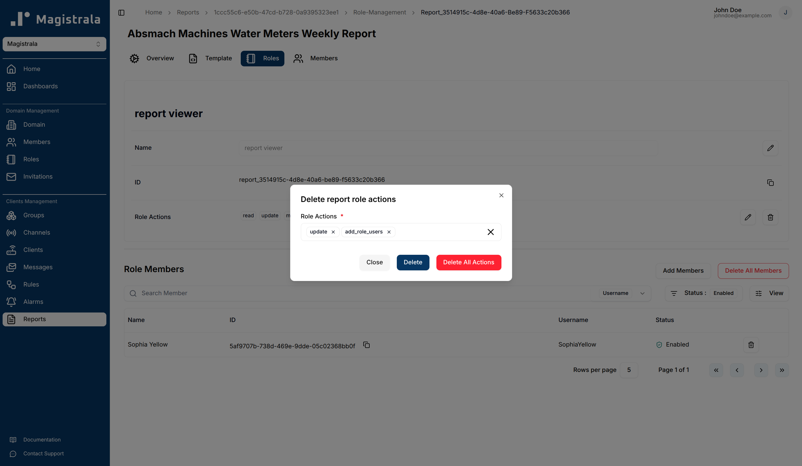

For **Role Members**, you can clear the entire table with the `Delete All Members` button:

 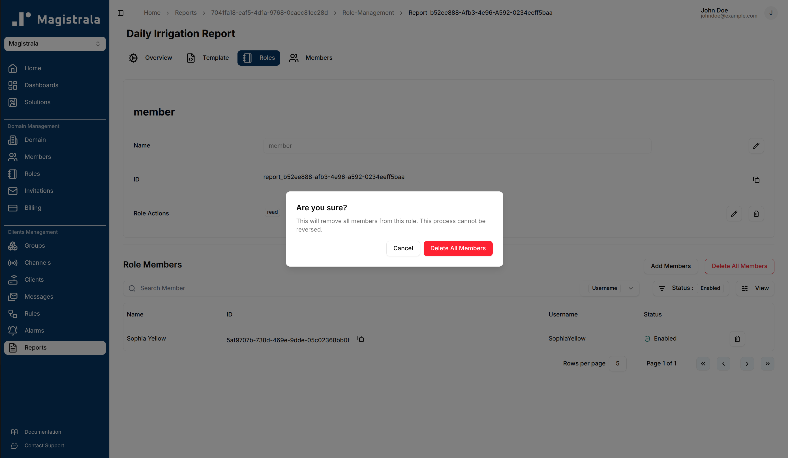

To delete specific members from the Role Members table, click on the **trash** icon next to their entry.

 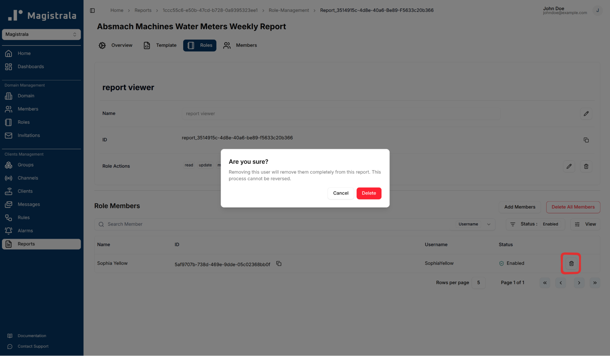

## Report Members

While members can be added through the **Roles** tab when creating a role, you can also assign members directly through the **Members** section.

Clicking the **Assign Member** button opens a dialog where you can select from the Domain Members and choose the role to assign them to.

 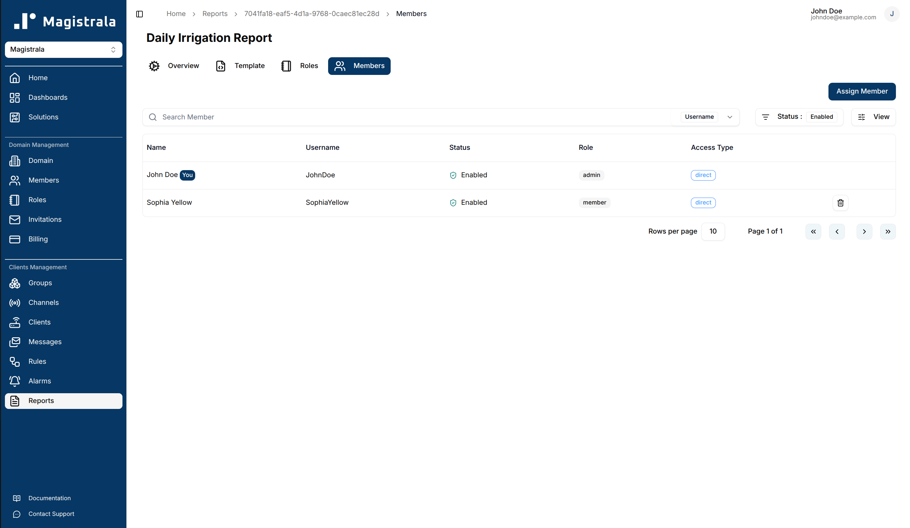

## Delete a report

To delete a report, click the **Delete** button in the row actions.

A confirmation dialog appears asking you to type the report's name before deletion is finalized. Use the **copy button** to copy the name, paste it into the input field, then click **Delete** to permanently remove the report.

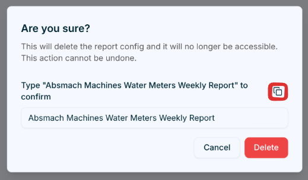
