## Overview

**Custom Nodes** let you define reusable logic scripts that can be used as logic nodes across multiple rules in the same domain. Instead of writing the same Lua or Go script in every rule, you create a Custom Node once and select it whenever you need that logic.

Custom Nodes support versioning — every time you save changes to a node, its version number increments. Rules that already use the node are not automatically updated; you must explicitly sync them to adopt the new version.

## Create a Custom Node

Navigate to **Custom Nodes** in the sidebar and click **+ Create**.

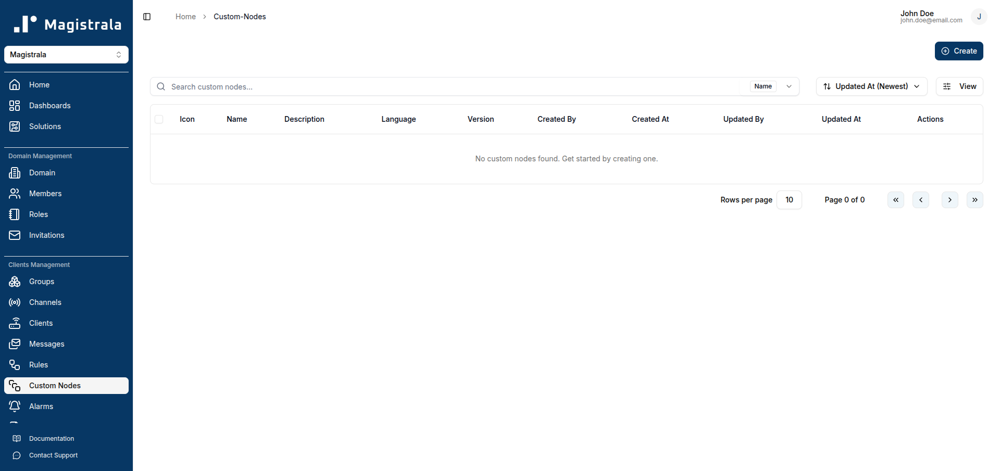

The **Create Custom Node** dialog opens.

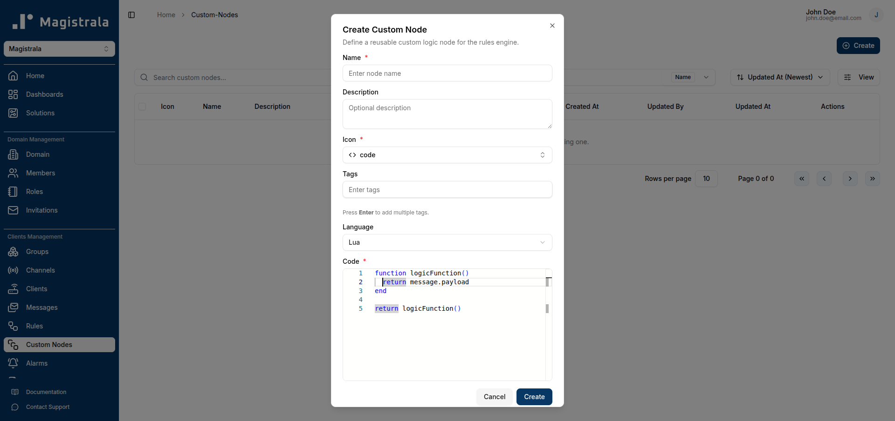

Fill in the following fields:

| Field | Required | Description |
|---|---|---|
| **Name** | Yes | A unique, descriptive name for the node. |
| **Description** | No | A short summary of what the node does. |
| **Icon** | Yes | An icon that appears on the node card in the rule canvas. |
| **Tags** | No | Comma-separated labels for filtering the node list. Press `Enter` after each tag. |
| **Language** | Yes | `Lua` (default) or `Go`. |
| **Code** | Yes | The script logic. Must define `function logicFunction()` for Lua. |

### Selecting an Icon

Click the icon field to open the icon picker. Type a keyword to filter available icons and click one to select it.

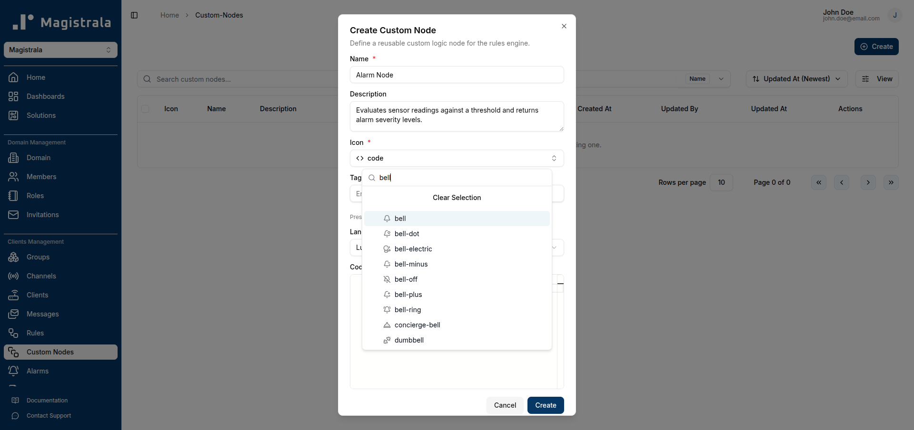

### Writing the Script

The code editor below the **Language** selector accepts either a Lua or Go script depending on the language you chose. For Lua, the script must implement `function logicFunction()` and end with `return logicFunction()`.

Example — alarm severity node:

```lua title="Lua — Alarm Severity Node"
function logicFunction()
    local results = {}
    local threshold = 2000

    for _, msg in ipairs(message.payload) do
        local value = msg.v
        local severity
        local cause

        if value >= threshold * 1.5 then
            severity = 5
            cause = "Critical level exceeded"
        elseif value >= threshold * 1.2 then
            severity = 4
            cause = "High level detected"
        elseif value >= threshold then
            severity = 3
            cause = "Threshold reached"
        end

        table.insert(results, {
            measurement = msg.n,
            value = tostring(value),
            threshold = tostring(threshold),
            cause = cause,
            unit = msg.unit,
            severity = severity,
        })
    end

    return results
end
return logicFunction()
```

Once all fields are filled, click **Create**.

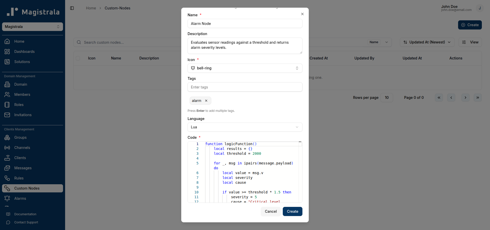

The node is added to the table and a success toast confirms the creation.

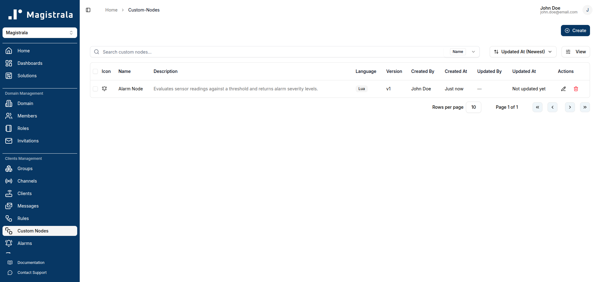

## Manage Custom Nodes

The Custom Nodes table displays:

- **Icon** — visual identifier on the rule canvas
- **Name** — node name
- **Description** — short description
- **Language** — Lua or Go
- **Version** — current version (starts at `v1`, increments on each update)
- **Created By / At** and **Updated By / At**
- **Actions** — Edit and Delete buttons

### Filter

Use the search box to filter nodes. Click the **Name** button beside the search box to switch the filter between **Name** and **Tag**.

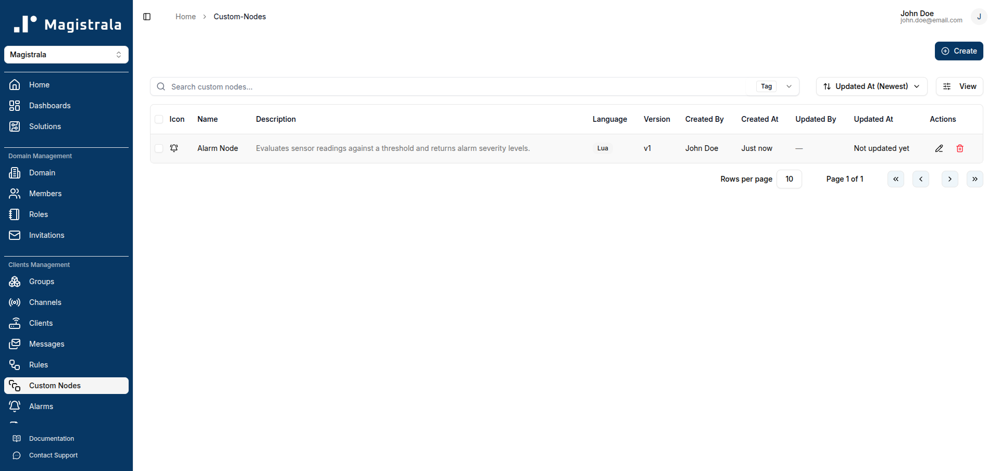

### Sort

Click the sort button (defaults to **Updated At Newest**) to change the ordering.

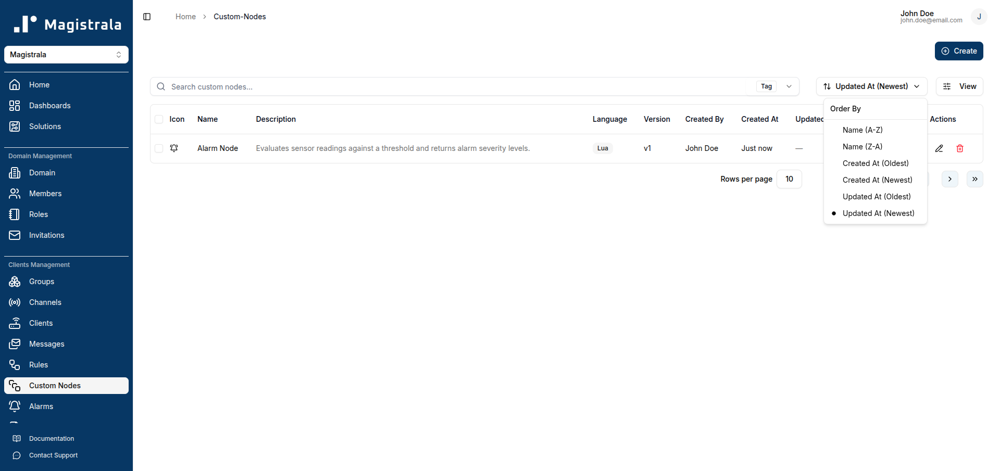

Available sort options: **Name**, **Created At**, **Updated At** — each with ascending or descending order.

## Edit a Custom Node

Click the **pencil (Edit)** icon on a node's row to open the edit dialog. All fields are pre-populated with the current values.

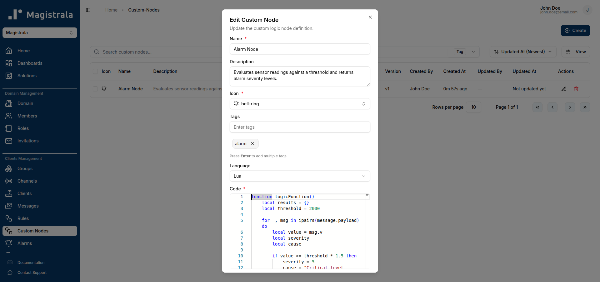

Make your changes — for example, updating the script logic:


Click **Save Changes**. The node's version increments (e.g., from `v1` to `v2`).


:::info

Saving changes to a Custom Node **does not** automatically update rules that already use it. Those rules will show an **Outdated** indicator on the node card. See [Syncing an Outdated Node](#syncing-an-outdated-node) below.

:::

## Delete a Custom Node

Click the **trash (Delete)** icon on a node's row. A confirmation dialog appears.

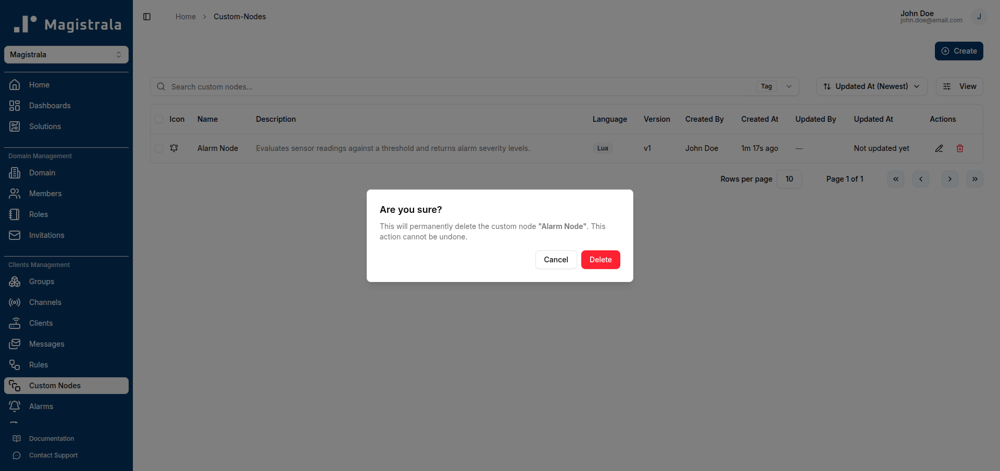

Click **Delete** to permanently remove the node.

:::info

Deleting a Custom Node does **not** affect rules that were already created using it. Those rules retain the snapshot of the node's code that was active at the time they were last saved.

:::

## Use a Custom Node in a Rule

Once a Custom Node exists, you can select it as the logic node when building a rule.

1. Navigate to **Rules** and click **Create Rule**.

   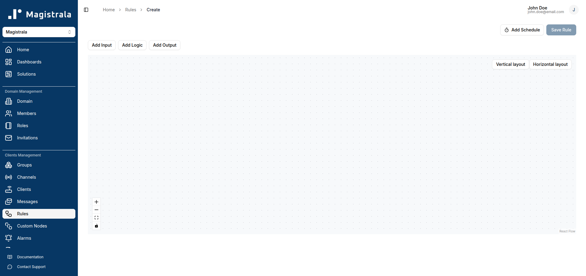

2. Click **Add Input**, choose **Channel Subscriber**, select your channel, and click **Add**.

   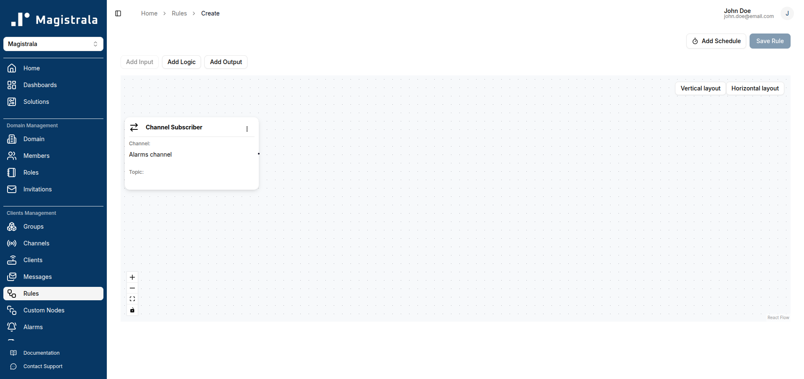

3. Click **Add Logic**. The **Select a logic type** dialog lists built-in options (Comparison, Code Editor) as well as any Custom Nodes you have created.

   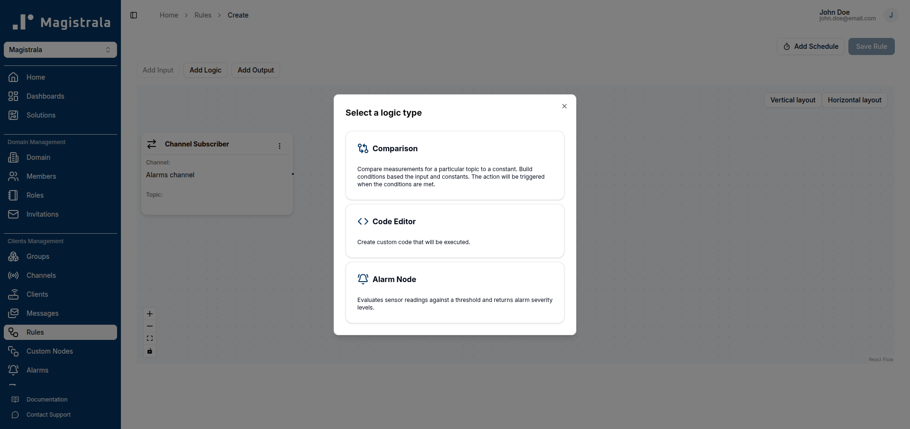

4. Click your Custom Node (e.g., **Alarm Node**) to add it to the canvas.

   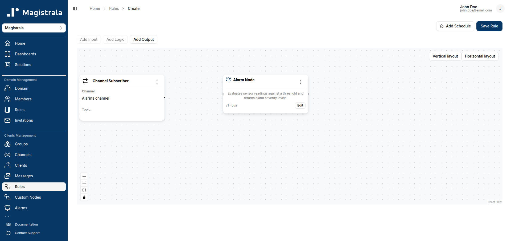

5. Click **Add Output** and configure an output node (e.g., Channel Publisher).

   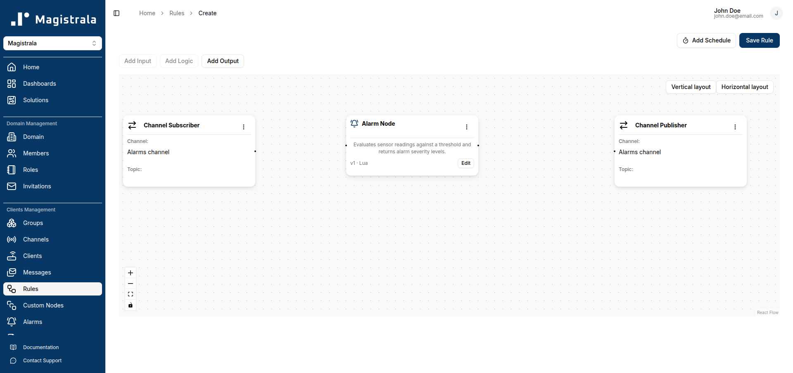

6. Click **Save Rule**, enter a name, and click **Create**.

   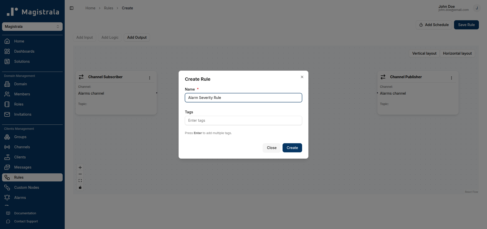

The rule is saved and the custom node logic is embedded as a versioned snapshot.

## Syncing an Outdated Node

When you update a Custom Node, any rule that uses an older version of that node shows an **Outdated** badge on the node card.

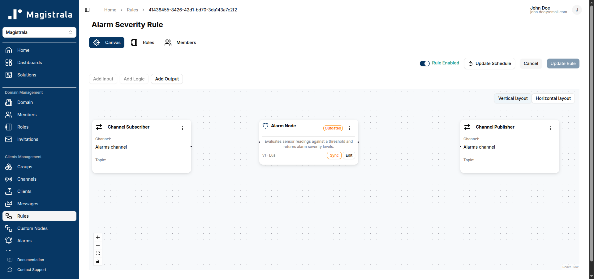

To sync the node to the latest version:

1. Open the rule and locate the node marked **Outdated**.
2. Click the **Sync** button on the node card.

   The badge disappears and the node shows the new version (e.g., `v2`).

   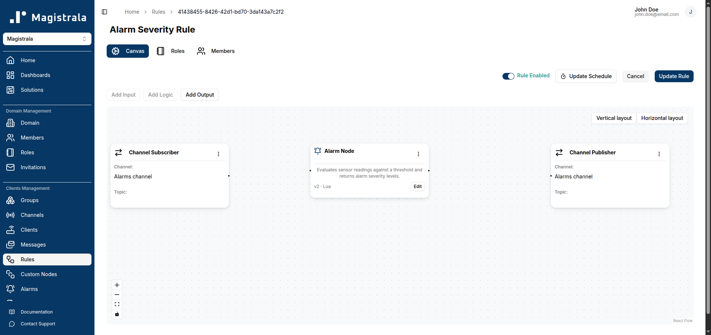

3. Click **Update Rule** to save the rule with the updated node.

   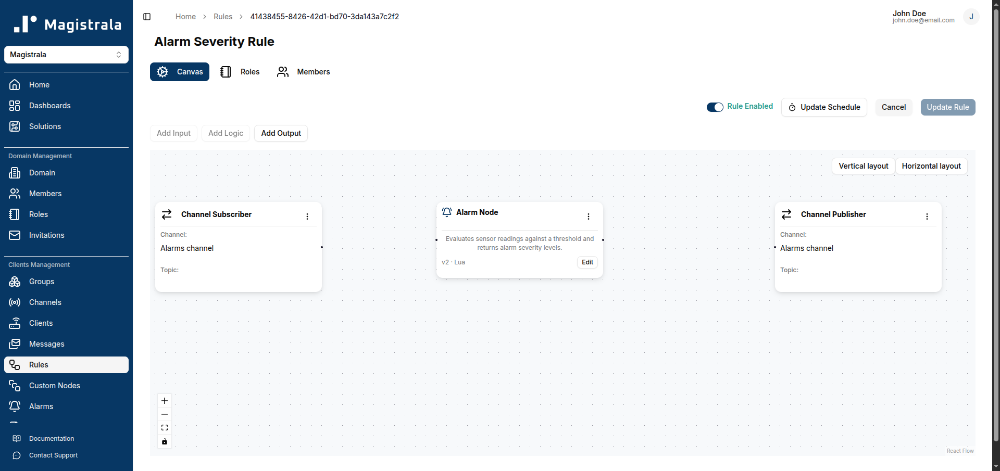

:::info

Syncing replaces the rule's local snapshot with the latest version of the Custom Node. If you want to keep the old behaviour for this specific rule, skip syncing.

:::

## Editing a Custom Node Within a Rule

You can edit the code of a Custom Node directly inside a rule without modifying the shared Custom Node definition. This lets you fine-tune the logic for one specific rule.

On the node card in the rule canvas, click the **Edit** button.

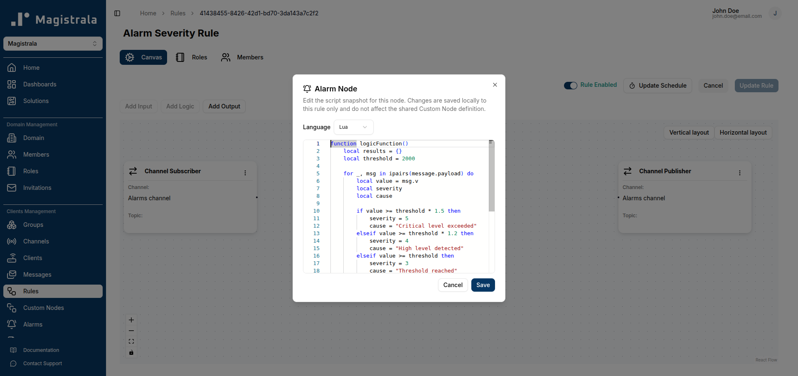

The dialog states: _"Changes are saved locally to this rule only and do not affect the shared Custom Node definition."_

Modify the script and click **Save**. The node card now reflects the local changes. Click **Update Rule** to persist them.

:::info

A locally edited node is considered in **conflict** with the main Custom Node definition — its code intentionally diverges from the shared version. If you later sync the node (via the **Sync** button), the local changes are replaced with the latest version of the shared Custom Node.

:::
