> **White Labeling** is available on **Enterprise Edition** deployments only, and only to users with the **Admin** role.

White Labeling lets you replace Magistrala's own branding with your own across the entire app — organization name, theme colors, logos, favicon, social share image, and outbound links — without a rebuild or redeploy. Changes take effect as soon as they're saved.

This guide walks through every option on the White Labeling page using a worked example: rebranding a deployment for a fictional customer, **Acme Enterprises**.

## Accessing White Labeling

Open the user menu in the top-right corner of the app (click your avatar) and select **White Labeling**.

You can also reach it from **Platform Management → White Labeling**, alongside the **Domains** and **Users** admin tabs. Both paths lead to the same page, `/platform-management/white-labeling`; the user menu is just the faster route.

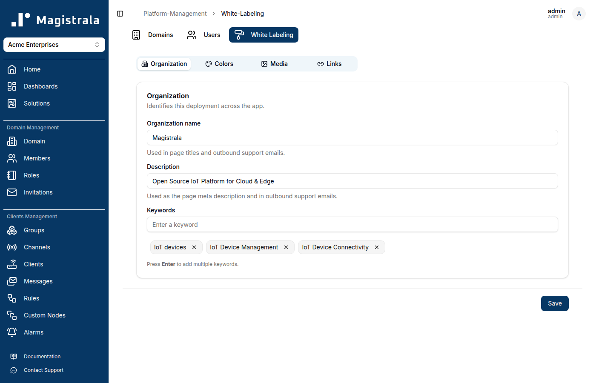

The page has four tabs — **Organization**, **Colors**, **Media**, and **Links** — plus a single **Save** button at the bottom that writes every tab's changes at once. Editing a tab doesn't save it; only **Save** commits your changes, and unsaved edits are shared across tabs until you click it.

## Organization

The **Organization** tab controls the deployment's identity: its name, meta description, and search/SEO keywords.

| Field | Where it shows up |
| --- | --- |
| **Organization name** | Browser tab titles, and outbound support emails |
| **Description** | The page's meta description, and outbound support emails |
| **Keywords** | Page meta keywords, used for SEO |

Keywords are managed as chips: type a value into the field and press **Enter** to add it, or click the **×** on an existing chip to remove it.

## Colors

The **Colors** tab re-themes the app using the same design tokens as the underlying component library, so every color used anywhere in the UI can be overridden.

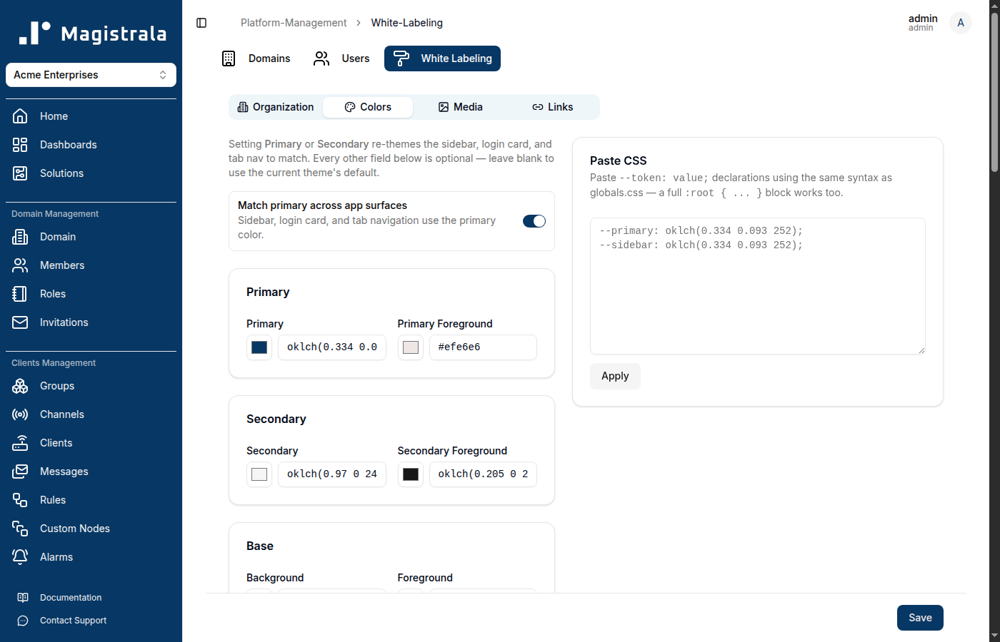

A few things worth knowing before you touch this tab:

- **Setting Primary or Secondary alone goes a long way.** These two are the only colors most deployments need — every other field is optional and falls back to the current theme's default when left blank.
- **"Match primary across app surfaces"** is on by default. With it enabled, the sidebar, login card, and tab navigation bar all follow your **Primary** color automatically. Turn it off if you want to set those surfaces to different colors than Primary using the individual **Sidebar**, **Login card**, and **Tab nav** fields further down.
- **Color fields accept hex.** Each field shows an existing value as an `oklch(...)` string (the format the app's theme is defined in), but you can type or paste a standard hex code — `#1E3A8A`, for example — directly into the text box, and the swatch next to it updates to match. You don't need to convert anything yourself.
- **Foreground colors are for text/icons drawn on top of the matching background color** (e.g. **Primary Foreground** is the text color used on Primary-colored surfaces). Leave these blank unless you have a specific contrast requirement — the app already picks readable defaults.
- Further down the tab, individual sections let you override **Base** (background/foreground), **Muted**, **Accent**, **Card**, **Popover**, **Destructive**, **Borders & focus**, **Charts**, **Sidebar**, **Login card**, and **Tab nav** colors independently.
- A **Paste CSS** box on the right accepts raw `--token: value;` declarations (or a full `:root { ... }` block copied from `globals.css`) — useful if you already have a design token export and don't want to fill in each field by hand. Click **Apply** to load them into the form (this doesn't save on its own — you still need **Save**).

For Acme Enterprises, only **Primary** (`#1E3A8A`, a navy blue) and **Secondary** (`#F59E0B`, amber) were set — everything else was left at its default:

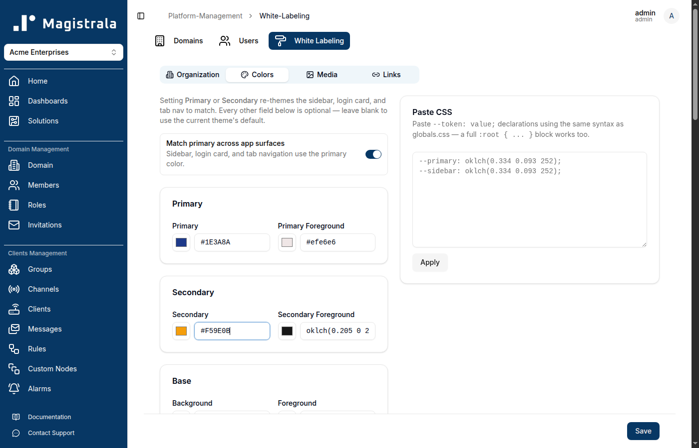

> **Note:** color changes don't preview live on this page as you type — you'll see the new theme applied once you click **Save**.

## Media

The **Media** tab handles every image asset: the main logo, the collapsed-sidebar logo, the favicon, and the social share image. Each upload accepts an image up to **5MB**.

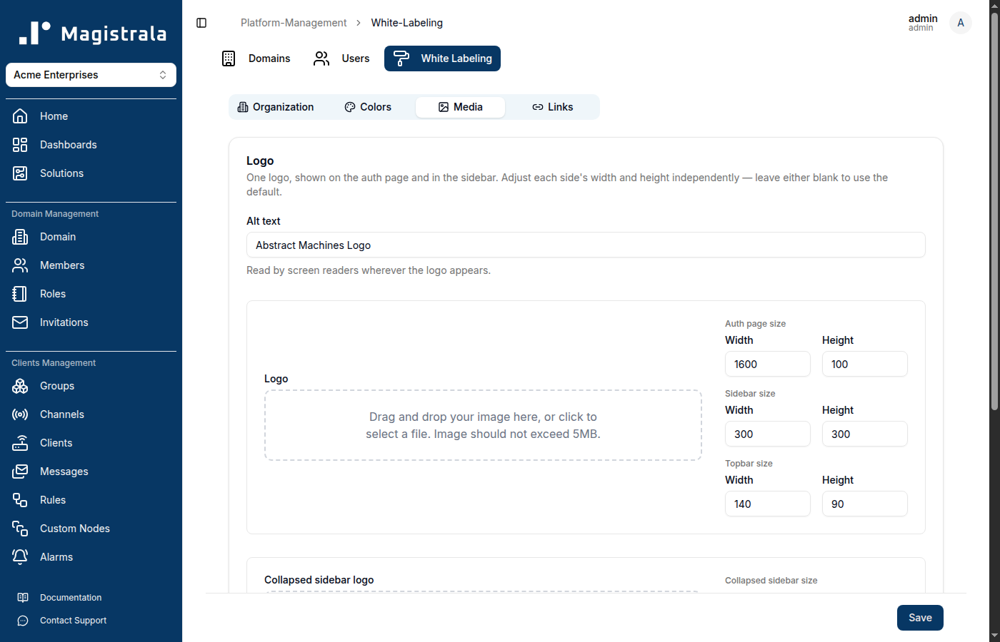

### Logo

This single **Logo** upload is shown both on the **login/auth page** and in the **expanded sidebar** (and in the top navigation bar shown before a domain is selected) — you don't upload separate images for each. Because it appears at different sizes in different places, you can set width/height independently for each surface:

- **Auth page size** — the login screen
- **Sidebar size** — the expanded sidebar
- **Topbar size** — the top bar shown pre-domain-selection

Use an SVG (or another format with a transparent background) sized roughly to its widest expected use — the width/height fields scale it down for the smaller placements, so a crisp source avoids blurring. Set **Alt text** too; it's read by screen readers everywhere the logo appears.

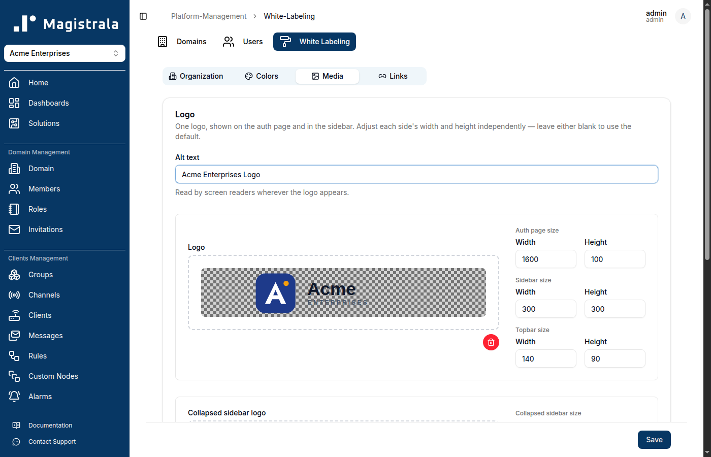

### Collapsed sidebar logo

A **separate, smaller upload** for when the sidebar is collapsed — normally just your icon/mark, without the wordmark, since there's much less horizontal space. This is the image users will see most often, so keep it simple and legible at a small size.

### Favicon & social preview

- **Favicon** — shown in the browser tab. Use a small square image; `.ico`, `.png`, or `.svg` all work.
- **Social share image** — shown in link previews when a URL to this deployment is shared on social media or in chat apps (Slack, Discord, iMessage, etc.). The conventional size is **1200×630**.

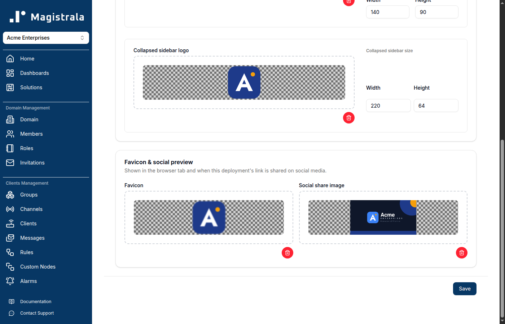

Every upload shows a live thumbnail against a checkered (transparency) background as soon as it's chosen, and a red trash icon to remove it before saving.

## Links

The **Links** tab controls outbound URLs shown around the app: the **Documentation URL** (linked from the sidebar, the support menu, and the 404 page), **Project website**, **GitHub URL**, and social links for **Twitter/X**, **LinkedIn**, and **Community**.

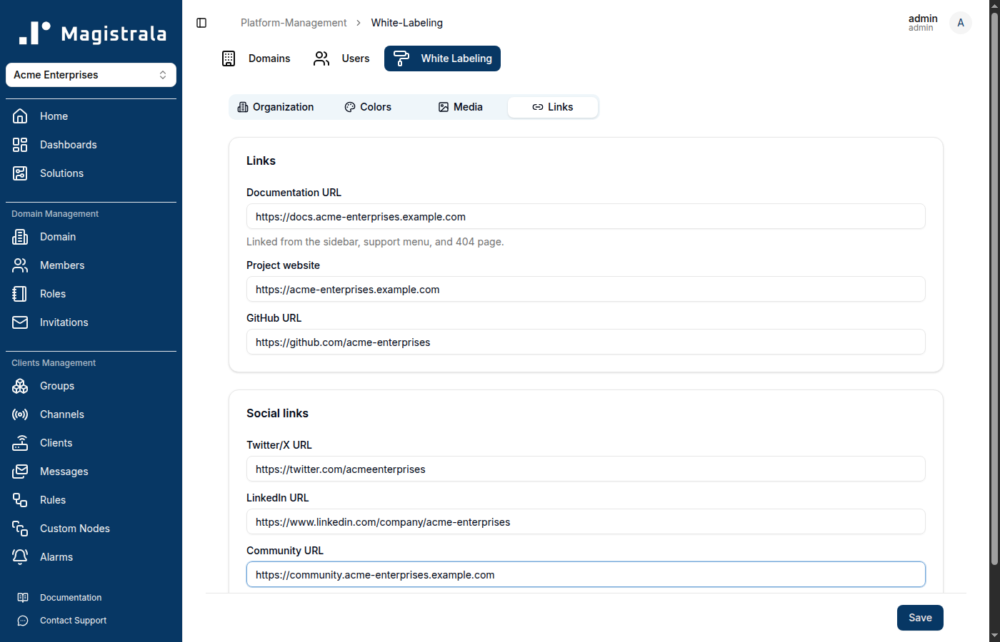

Leave any of these blank to fall back to the deployment's built-in defaults rather than hiding the element entirely — an empty field doesn't remove its link from the UI.

## Saving

Click **Save** at the bottom of the page to write every tab's changes at once — there's no per-tab save. The new branding takes effect immediately: page titles, the sidebar, the login page, the favicon, and the social share image all update right away, with no separate cache-clearing or redeploy step needed.

After saving, the White Labeling page itself reflects the new branding:

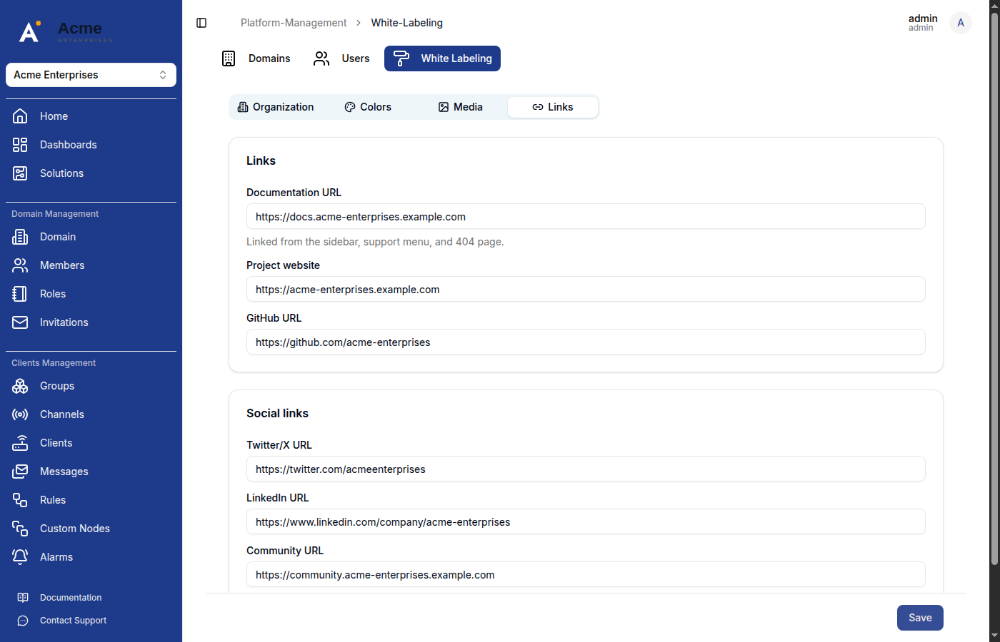

So does the rest of the app — here's the domain home page:

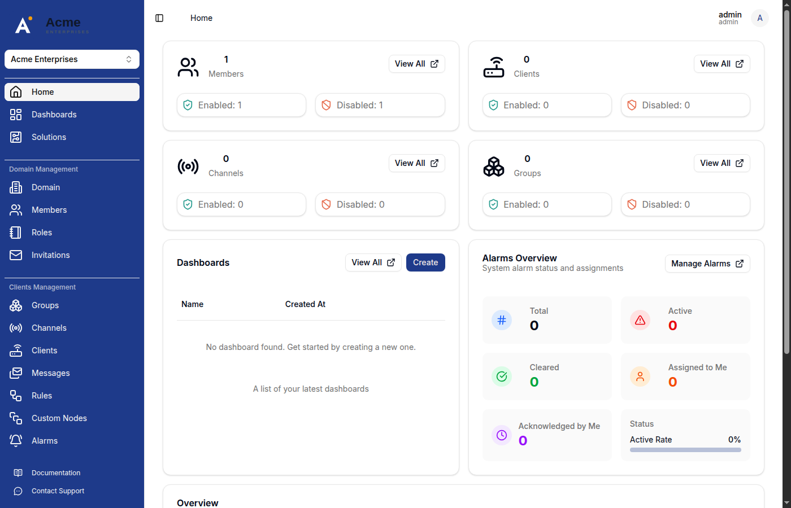

Collapsing the sidebar swaps in the smaller **Collapsed sidebar logo**:

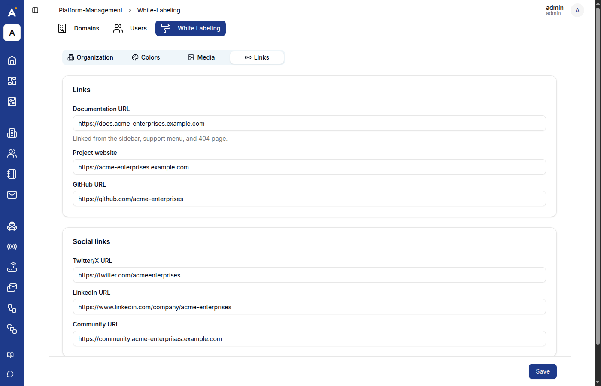

And the login page picks up the new logo and Primary color as the login card background:

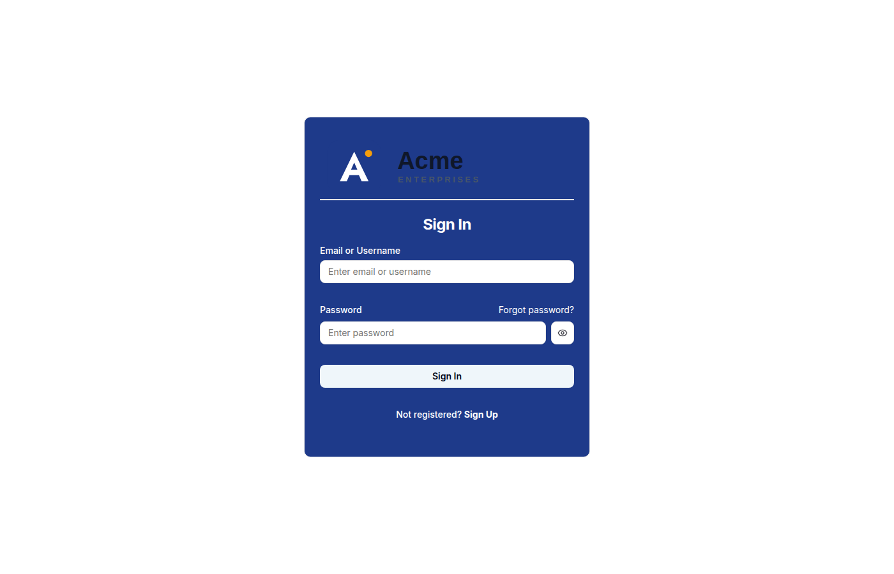

> **Design tip:** if "Match primary across app surfaces" is on, your login card background becomes your **Primary** color. Make sure your logo's wordmark (not just its icon) is legible against that color — a dark wordmark designed for a white background, like the one above, can end up low-contrast on a colored card. Test the login page after saving, not just the sidebar.

## Summary

| Tab | Controls |
| --- | --- |
| **Organization** | Name, description, keywords |
| **Colors** | Primary/Secondary theme colors, and every underlying design token |
| **Media** | Logo (auth + sidebar + topbar), collapsed sidebar logo, favicon, social share image |
| **Links** | Documentation, project website, GitHub, and social links |

All four tabs share one **Save** button — fill in what you need across any of them, then save once.
