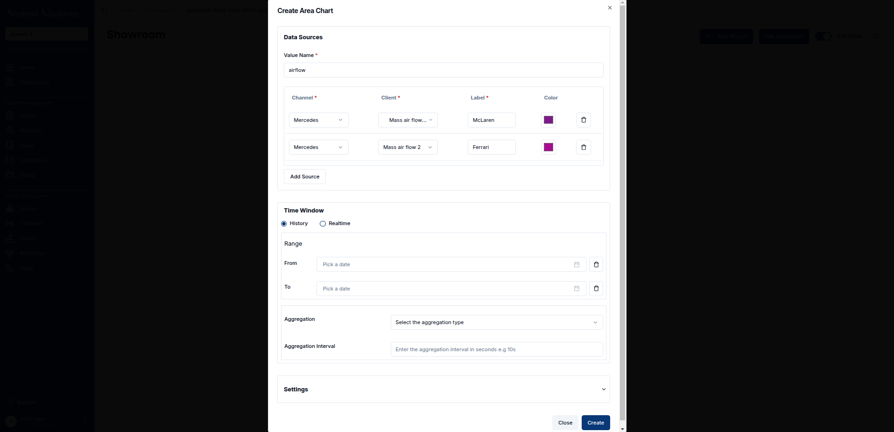
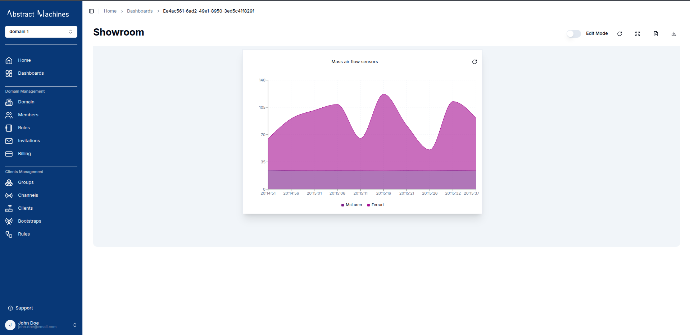
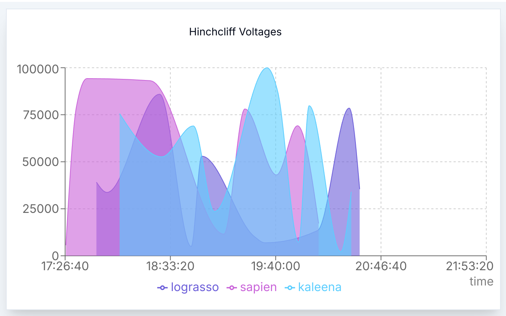
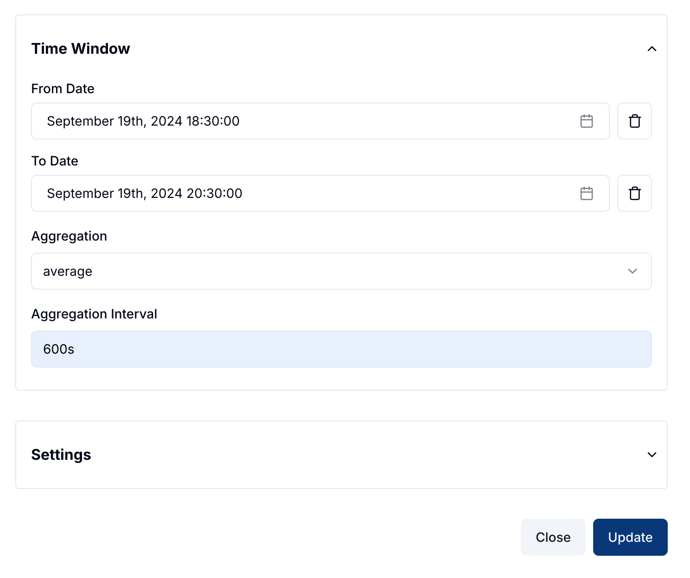
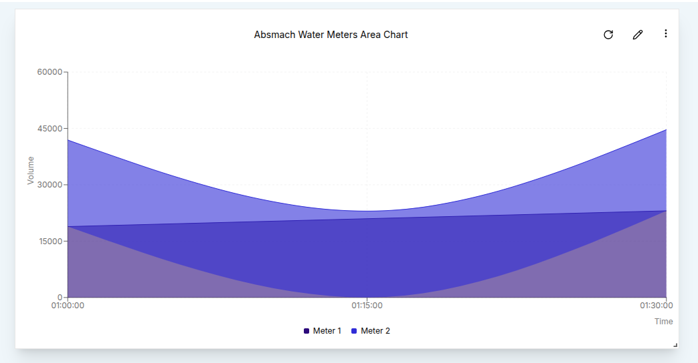

Creating an Area Chart follows a process similar to other timeseries charts, but it offers a visually distinct way to represent data trends over time.

### Create an Area Chart

To create an Area Chart, ensure your dashboard is in **Edit Mode**.
Click the '+ Add Widget' button, then select the **Area Chart** option from the widget list.
This will open the **Create Area Chart** dialog, where you can configure your settings and data sources.

#### Configuring the Area Chart

1. **Value Name**: Enter the name of the value you wish to visualize, such as voltage or temperature.
2. **Channel**: Select the channel that provides the data you want to plot.
3. **Thing**: Choose the entity or device connected to the channel.
4. **Label**: Provide a meaningful label to differentiate each data source on the chart.
5. **Area Color**: Pick a color for the filled area of the chart using the color picker.

You can also add multiple data sources by clicking the **Add Source** button.

Once the data sources are configured, you can define a **Time Window** by specifying the "From" and "To" dates, which will constrain the data shown to the specified time period.
In the **Settings** tab, you can adjust the **Update Interval** (how often the chart refreshes) and other chart appearance options.
After configuring everything, click the **Create** button to add the Area Chart to your dashboard.

### Edit an Area Chart

You can edit your Area Chart anytime by clicking the **Pencil Icon** on the top-right corner of the widget. This will open the edit sheet on the right, where you can modify data sources, the chart title, and adjust settings like the time window.

1. **Adding Data Sources**: Click on the **Add Source** button to include additional data streams.
2. **Modifying Time Window**: If you wish to change the time range for the chart, specify the "From" and "To" dates to focus the data.
3. **Aggregation**: Apply data aggregation to summarize the data points. For example, you can select **Sum**, **Average**, **Maximum**, **Minimum**, or **Count** to see aggregated values over defined intervals.

For instance ypu can switch to live data for the Area Chart.

Once you've made the necessary changes, click the **Update** button to save and apply the new settings. You'll see the chart automatically refresh with the updated data or appearance.

In many cases, you may want to summarize data by aggregating it over time intervals. For example, setting the **Aggregation Interval** to 10 minutes (600 seconds) and choosing the **Average** aggregation type will display the mean values over each 10-minute period for a 2 hour time window.

The result will be an Area Chart that shows the mean value in each time interval, providing an insightful view of your data trends.

With Area Charts, you can easily visualize changes in data over time, allowing you to track trends and patterns with a clean, filled-in graphical representation.
This chart is particularly useful for comparing cumulative values and emphasizing the overall volume of data.
