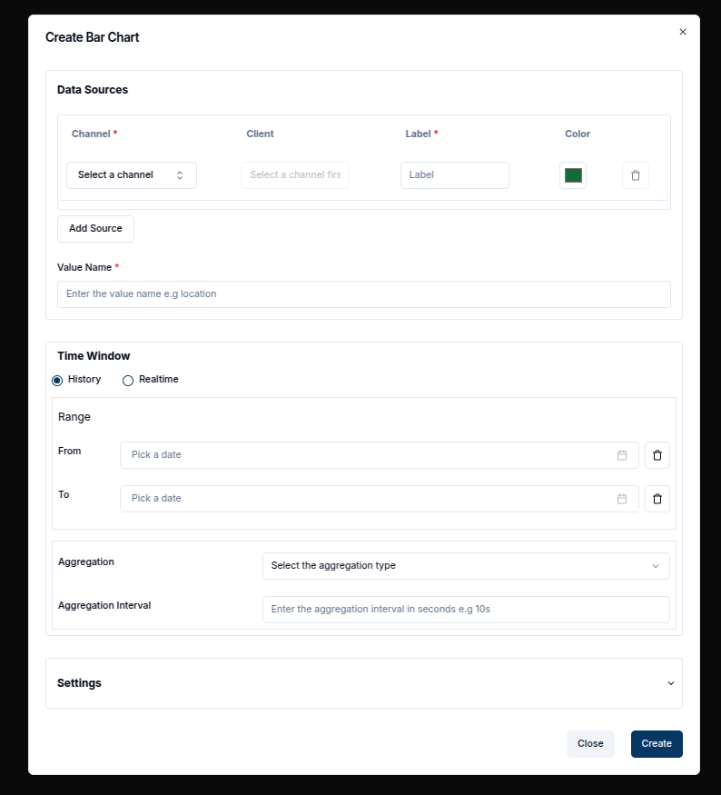

Much like the Line Chart the Bar Chart has a similar Timeseries form in its dialogbox.

### Create a Bar Chart

To create a Bar Chart, first ensure that the dashboard is in **Edit Mode**.
Click on the '+ Add Widget' button, which will open a dialog box displaying all the available widgets.
Select the **Bar Chart** option from the list.

This will open the **Create Bar Chart** dialog, where you can configure the chart’s settings and data sources just as we do with the line Chart.
The inputs with asteriks are important and must be filled in before clicking 'Create'

Once the data sources are set, you can define a **Time Window** by specifying the "From" and "To" dates, which will limit the data displayed to a specific time interval.
In the **Settings** tab, you can further customize the chart by adjusting its appearance, including the Update Interval and other relevant properties.
After configuring your chart, click the **Create** button to save the Bar Chart widget.
This will close the dialog and add the Bar Chart to your dashboard.

### Edit the Bar Chart

You can edit an existing Bar Chart by clicking the **Pencil Icon** on the top-right corner of the chart. This will open an edit sheet to the right, where you can modify the data sources, labels, time window, and other settings.

1. **Add Data Sources**: You can add more data sources by clicking the **Add Source** button and providing additional channels, things, and labels.
2. **Delete Data Sources**: To remove a data source, click on the **Trash Icon** next to the specific data source you wish to delete.

At this stage, you can also modify the chart title, labels, and intervals to suit your requirements.
Once you're done with the changes, click the **Update** button to save the modifications.

You can further filter the data shown in the chart using the **Time Window** settings, which allow you to restrict the data to a specific time range.

For example, selecting a time window from 17:30 to 19:30 will constrain the data to that range of two hours.
Additionally, you can apply **Aggregation** to the data points.

These settings help group the data and allow you to display more meaningful summaries.
For instance, applying aggregation with an interval of 10 minutes and selecting "Minimum" will display the lowest value recorded for each 10-minute interval over a two hour time window.

After applying these settings, the resulting chart will show aggregated values based on the specified criteria.

With the ability to add, edit, and delete data sources, and fine-tune time windows and aggregation, Bar Charts offer a versatile way to visualize your data on the dashboard.
