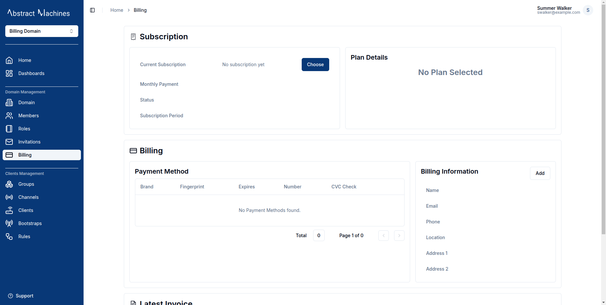

This service allows a **SuperAdmin** to create and manage Billing Plans that a User can subscribe to.
Each billing plan requires a name, amount, plan type (public or private), limits, and metadata.
While limits currently do not strictly enforce restrictions, improvements are underway to ensure compliance.

These limits define what an admin can access in terms of domains, users, groups, or devices.

To access the Billing Page as a SuperAdmin you must click on the avatar at the topbar navigation.


This will lead you to a page with all the Users, Domains and Billing Plans present in the system.
While on the Domains tab, you can change the status of each domain quite easily.
To disable any domain you can toggle on the status column.
This will bring up an alert dialog that asks for confirmation. Clicking on any of the domains will also log you into the domains.


The User's tab also shows a table with all the Users currently in the database. You can also create Users while on this page.


Then we finally move to the `Billing Plans` table.
Here we see all the billing plans present. The table first shows enabled and disabled plans.


To edit any Plan, just click on its row.
To disable it click on the outline button at the end of the table.

## Create a Billing Plan

Clicking on the '+ Create' button opens a dialogbox that has some necessary fields.


To create a new billing plan:

1. Click the '+ Create' button. This opens a dialog box with the necessary fields.
2. Name: Enter a unique name for the plan (required).

3. Amount: Specify the amount in Euros.

4. Plan Type: Choose between a public plan (available to any user across all domains) and a private plan (restricted to a specific domain).

   - Public Plan: Accessible by any user.
   - Private Plan: Limited to a single domain and will not appear in searches outside that domain.
5. Limits: These can be set according to the domains entities. They must be in JSON format however for example:

```json
{
    "users": 40,
    "things": 100,
    "groups": 10
}
```


Here is an example of a private plan that will be limited to the Song Domain:


6. Click Create to make the plan available for subscription. Note that private plans will only be visible to their specified domain.
They can also be edited if there is any need to change the name, amount or even limits on their page. Clicking on the Update button below ensures that the changes are saved to the Billing Plan.


Now that we have our plans, we can subscribe members to them.

### Add a Billing Plan

Navigate to the Billing tab on the sidenav bar. This tab will only be visible to admin members of a domain.

Magistrala employs the use of **Stripe** to handle the User's private information.
This means that we will not have the user's card payment credentials at any point in time.

The billing page has multiple cards present each important to the billing process.



In a newly created Domain without any data on billing, all the cards will be empty.
The subscription card handles the Domain's subscription plan and shows the status of the subscription.
It can be either completed where the User has already been charged and has the sub running or Incomplete where the process is not yet done and the subscription is inactuve.

The plan details generally show the user the limits present for the subscribed plan. This ensures they know their restrictions at all times.

The Billing section handles the payment of the Billing Plan.


We will start with the Billing Information. This is the User's contact and holds the addresses,  emails and name of the user to whom the subscription will be charged.

To fill this section, click on 'Add' to trigger a dialogbox.
On the form, you are required to fill in the Name, Email, Phone, Country and City of the billed customer.
State and Province or Addresses are not that important but do help in the creation of invoices.
After filling in the required data, click 'Add' and the information will be fed into the system.


Now with a working Billing Information, you can add the payment Method.
Click on the 'Add' button to gain access to the stripe page where you will fill in your cards or paypal information.
A succesful update will lead you back to the Magistrala Biling page now with an active payment method.


You can add as many payment cards as required.
Each card will undergo a check by stripe to prevent any fradulent cards from passing through the system. Also ensure that the amount of money in the card is also enough for the subscription needed.


The nest step is to add a billing plan to the domain. Under the Subscription section, 'Choose' will bring up a selection of Subscriptions.  


Currently a user cannot set any card as the default but this feature is underway.
From the drop-down, you can however delete the card or edit it.

You will notice that since we are not in the Song Domain anymore, the Deluxe plan is not visible.


Once the plan is selected, there will be an invoice and receipt generated.


Since there is no card present, the subsciption status is saved as 'Incomplete'.

The 'Update' button is used to change the current plan to a new plan.
However, since you will have not paid for the original plan, you will be unable to choose another plan.
And if you had not paid, the plan remains the same until payment is approved.

Once payment is received, there will be an invoice generated that you can download.


Lets try having a valid card in the payment information.
After entering a valid card, the status of the subscription will change to **active**


The monthly subscription also shows the subscription period which lets the user know when to next expect a bill for the plan

Now that we have a working card present, the invoices become clearer and ready for download:


Clicking on the invoice icon downloads a pdf with all the required data:


The receipt icon also downloads a receipt for the User:


### Remove a Billing Plan

This is an upcoming feature.
