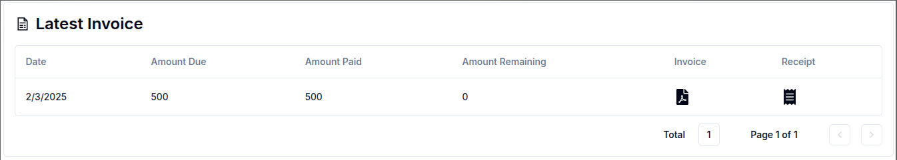

This service allows users to view and subscribe to billing plans, manage payment methods and billing information, and download generated invoices and receipts.

### Subscribe to a Billing Plan

Navigate to the Billing tab on the sidenav bar or on the user nav. This tab will only be visible to admin members of a domain.

Magistrala employs the use of **Stripe** to handle the User's private information.
This means that Magistrala will not have the user's card payment credentials at any point in time.

The billing page has multiple cards present each important to the billing process.

In a newly created domain without any data on billing, all the cards will be empty.
The subscription card handles the domain's subscription plan and shows the status of the subscription.
It can be either completed where the user has already been charged and has the sub running or incomplete where the process is not yet done and the subscription is inactuve.

The plan details generally show the user the limits of their subscribed plan. This ensures they are aware of their restrictions at all times. These limits define what can be accessed in terms of domains, users, groups, and devices.

The Billing section handles the payment of the Billing Plan.

The first part of the Billing section is Billing Information, which includes the user's contact details such as addresses, emails, and the name of the user to whom the subscription will be charged.

To fill this section, click on 'Add' to trigger a dialogbox.
On the form, you are required to fill in the Name, Email, Phone, Country and City of the billed customer.
State and Province or Addresses are not that important but do help in the creation of invoices.
After filling in the required data, click 'Add' and the information will be fed into the system.

Now with a working Billing Information, you can add the payment Method.
Click on the 'Add' button to gain access to the stripe page where you will fill in your cards or paypal information.
A succesful update will lead you back to the Magistrala Biling page now with an active payment method.

You can add as many payment cards as needed.
Each card will be verified by stripe to prevent any fradulent cards from being accepted. Ensure that the card has sufficient funds to cover the subscription cost.
You can also edit payment methods, set a default card and delete any payment method.  

To set a payment method as default simply select 'Set as default' in the dropdown.

Once payment method has been set as default, a badge showing default appears.

To delete a payment method simply select delete on the dropdown and the payment method will be deleted.

The next step is to add a billing plan to the domain. Under the Subscription section, clicking 'Choose' will display a list of available subscription plans.  

These are the plans available to the user in this example:

Once the plan is selected, an invoice will be generated.

Since there is no card present, the subsciption status is saved as 'Incomplete'.

The 'Update' button allows the user to change the current plan to a new plan.
However, you cannot select a new plan if the payment for the current plan has not been completed.
Until the payment is approved, the current plan will remain active.

Once payment is received, there will be an invoice generated that you can download.

  

Lets try having a valid card in the payment information.
After entering a valid card, the status of the subscription will change to **active**

The monthly subscription also shows the subscription period which lets the user know when to next expect a bill for the plan

Now that we have a working card present, the invoices become clearer and ready for download:

Clicking on the invoice icon downloads a pdf with all the required data:

The receipt icon also downloads a receipt for the User:

