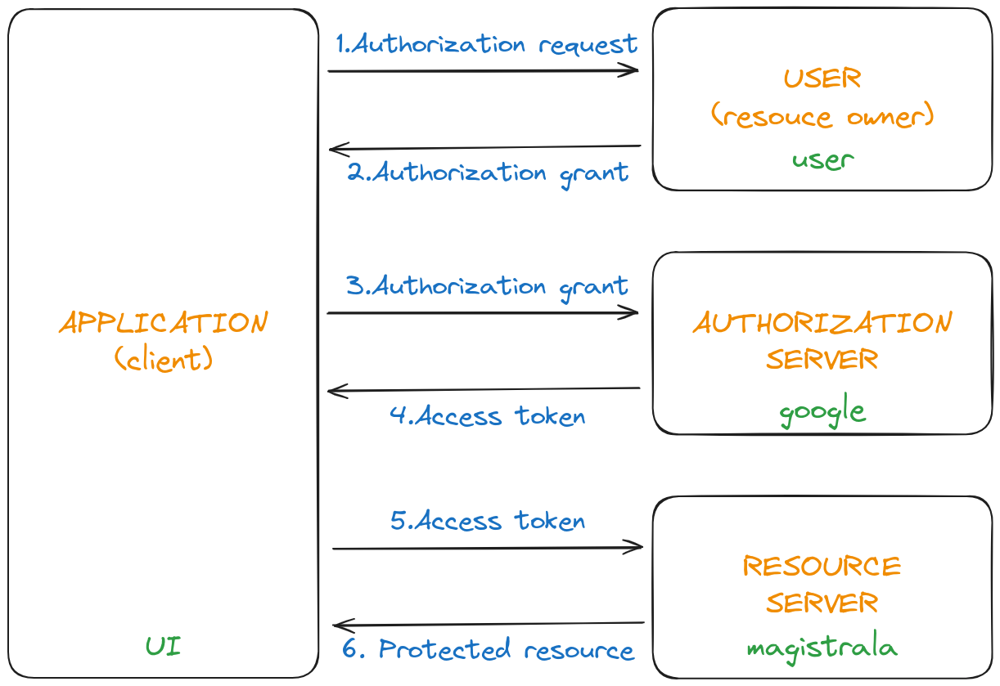
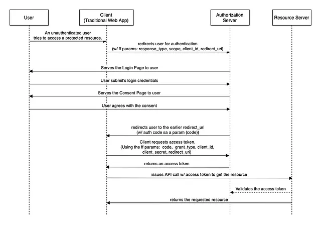

# Integrating OAuth2.0 with Magistrala

Over the past months, we have been working on integrating OAuth2.0 with Magistrala. We are happy to announce that we have completed the integration and it is [now available](https://github.com/absmach/magistrala/pull/2103). We believe that this will open up a lot of possibilities for Magistrala and we are very excited about the future of Magistrala. We are planning to add more features to the OAuth2.0 integration in future releases. We are also planning to add support for more OAuth2.0 providers. This will enable users to use their preferred OAuth2.0 provider to authenticate with Magistrala.

[OAuth2.0](https://datatracker.ietf.org/doc/html/rfc6749) is an authorization framework that facilitates a third-party application to gain restricted access to another HTTP service. This can occur either by mediating an approval process between the resource owner and the HTTP service or by enabling the third-party application to autonomously acquire access. In OAuth2.0, a client requests access to a resource controlled by the resource owner and hosted by the resource server and is issued a different set of credentials than those of the resource owner. Instead of using the resource owner's credentials to access the resource, the client obtains an access token - a string representing the grant issued to the client by the resource owner. The client uses the access token to access the protected resources hosted by the resource server.

In OAuth2.0, there are four roles:

- **Resource Owner**: An entity capable of granting access to a protected resource. When the resource owner is a person, it is referred to as an end-user.
- **Resource Server**: The server hosting the protected resources, is capable of accepting and responding to protected resource requests using access tokens.
- **Authorization Server**: The server issues access tokens to the client after successfully authenticating the resource owner and obtaining authorization.
- **Client**: An application making protected resource requests on behalf of the resource owner and with its authorization. The client is not necessarily part of the resource owner's domain.

In the context of Magistrala, the resource owner is the user, the resource server is the Magistrala service, the authorization server is the OAuth2.0 provider, and the client is the UI service. The UI service is the client because it is making protected resource requests on behalf of the user and with the user's authorization.

In OAuth2.0, there are different scopes. A scope is a mechanism in OAuth2.0 to limit an application's access to a user's account. A scope is a string that represents the access level that the application is requesting. The scope is included in the request to the authorization server. The scope is used to specify the access level that the application is requesting. The scope is a required parameter in the request to the authorization server.

With Google as the authorization server, we use `userinfo.email` and `userinfo.profile` as the scopes. The `userinfo.email` scope is used to access the user's email address. The `userinfo.profile` scope is used to access the user's profile information. The user's email address is used to uniquely identify the user. The user's profile information is used to display the user's name and profile picture in the UI.

The abstract OAuth2.0 flow is as follows:

1. The client requests authorization from the resource owner. The authorization request can be made directly to the resource owner or indirectly via the authorization server.
2. The client receives an authorization grant, which is a credential representing the resource owner's authorization, expressed using one of four grant types defined in the OAuth2.0 specification or using an extension grant type.
3. The client requests an access token by authenticating with the authorization server and presenting the authorization grant.
4. The authorization server authenticates the client and validates the authorization grant, and if valid, issues an access token.
5. The client requests the protected resource from the resource server and authenticates it by presenting the access token.
6. The resource server validates the access token, and if valid, serves the request.
7. The client receives the protected resource.

This flow is demonstrated in the following diagram:



Magistrala can now be the resource server and Google as one of the authorization servers. We have implemented the OAuth2.0 [authorization code flow](https://datatracker.ietf.org/doc/html/rfc6749#section-4.1). The authorization code flow is used to obtain an access and refresh token to authorize API requests. The UI client initiates the flow by redirecting the user to the authorization server(Google). The user authenticates and authorizes the client(Magistrala). The authorization server(Google) redirects the user back to the client(Magistrala users service) with an authorization code. The client(Magistrala users service) exchanges the authorization code for an access token and a refresh token. The access token is used to authenticate API requests(get user details). The refresh token is used to obtain a new access token when the current access token becomes invalid or expires. This flow is demonstrated in the following diagram:


_The authorization code flow(from https://medium.com/javarevisited/oauth-2-0-authorization-code-flow-in-spring-boot-d8ff393f316d)_

There are different grant types in OAuth2.0. The grant type is a string representing the authorization grant type that the client is using to request the access token. It is included in the request to the token endpoint. It is used to specify the method of obtaining the access token. It is a required parameter in the request to the token endpoint. The grant types are:

- **Authorization code**: The authorization code grant type is used to obtain both access and refresh tokens and is optimized for confidential clients.
- **Implicit**: The implicit grant type is used to obtain access tokens and is optimized for public clients known to operate a particular redirection URI. These clients are typically implemented in a browser using a scripting language such as JavaScript.
- **Resource owner password credentials**: The resource owner password credentials grant type is suitable in cases where the resource owner has a trust relationship with the client, such as the device operating system or a highly privileged application.
- **Client credentials**: The client credentials grant type is used by clients to obtain an access token outside of the context of a user.

This flow conforms to [OpenID Connect](https://openid.net/connect/) specification, which is an identity layer on top of the OAuth2.0 protocol. OpenID Connect is a simple identity layer on top of the OAuth2.0 protocol, which allows clients to verify the identity of the end-user based on the authentication performed by an authorization server, as well as to obtain basic profile information about the end-user in an interoperable and REST-like manner. We are planning to add support for OpenID Connect in future releases.

## How to use OAuth2.0 with Magistrala

Currently, we have implemented the OAuth2.0 authorization code flow with Google as the authorization server. We are planning to add support for more OAuth2.0 providers in future releases. To use OAuth2.0 with Magistrala, you need to follow the steps below:

1. You need to obtain the client ID and client secret from Google. You can obtain the client ID and client secret by creating a new project in the [Google Cloud Console](https://console.cloud.google.com/). You can find the client ID and client secret in the [credentials section](https://console.developers.google.com/apis/credentials) of the project.
2. Click on the `Create credentials` button and select `OAuth client ID`. When setting up the OAuth client, the application type should be `Web application`. Under authorized redirect URIs, you need to provide the redirect URI of the Magistrala users service. This should be something like `https://<domain>/oauth/callback/google`. The `<domain>` should be replaced with the domain of the Magistrala users service or nginix ingress. For local development, you can use `http://localhost/oauth/callback/google`.
3. Copy the client ID and client secret and provide them to the Magistrala users service. The values should be something like:

   ```env
   ### Google OAuth2
   MG_GOOGLE_CLIENT_ID="01234567-8abc0defg7hijklmnopqr23456s78tu9.apps.googleusercontent.com"
   MG_GOOGLE_CLIENT_SECRET="GOCSPX-_abCDEfG1hIJKl4MnO7pQRSTuvwxyz"
   MG_GOOGLE_REDIRECT_URL="http://localhost/oauth/callback/google"
   MG_GOOGLE_STATE="7NN28jSDAg4z"
   ```

   The state is a secret key that is shared between the client and the server. It is used to prevent CSRF attacks. The state should be a random string and should be kept secret. The state is used to verify the integrity of the response from the authorization server.
   Internally we prefix the state with `signin` or `signup` to differentiate between the sign-in and sign-up flows. This is to identify the flow that the user is in. This is important because the sign-in and sign-up flows are different and we need to handle them differently.

4. You can customize the consent screen by providing the application name and the authorized domains. You can also provide the application logo and the application homepage. You can find the consent screen in the [OAuth consent screen section](https://console.cloud.google.com/apis/credentials/consent) of the project.

More information about the OAuth2.0 authorization code flow can be found [here](https://developers.google.com/identity/openid-connect/openid-connect).

Here is an example of the OAuth2.0 authorization code flow with Google as the authorization server:

<iframe width="560" height="315" src="https://www.youtube.com/embed/DxhqnHkHolU?si=BS5PJn8Qevj8Dp1j" title="YouTube video player" frameborder="0" allow="accelerometer; autoplay; clipboard-write; encrypted-media; gyroscope; picture-in-picture; web-share" allowfullscreen></iframe>

## Integration

This is split into two parts:

### 1. Magistrala UI Service

The UI service is the client in the OAuth2.0 flow. The UI service initiates the flow by redirecting the user to the authorization server(Google).

```go
// Name returns the name of the provider.
// This is used to generate the URL for the provider.
// For example, the URL for Google is /signin/google and /signup/google.
func (cfg *config) Name() string {
    return "google"
}

// Icon returns the icon of the provider.
// This is used to display the icon of the provider in the UI.
// This is when rendering the sign-in and sign-up buttons to the user.
func (cfg *config) Icon() string {
    return "fa-google"
}

// IsEnabled returns true if the provider is enabled.
// This is used to determine if the provider is enabled or not.
// This is when rendering the sign-in and sign-up buttons to the user and when generating the URL for the provider.
func (cfg *config) IsEnabled() bool {
    return cfg.oauth2.ClientID != "" && cfg.oauth2.ClientSecret != ""
}
```

The above functions are used to generate the URL for the provider and to display the icon of the provider in the UI. The `IsEnabled` function is used to determine if the provider is enabled or not. This is used to render the sign-in and sign-up buttons to the user.

```html
{{ range $i, $c := .Providers }} {{ if $c.IsEnabled }}
<div class="text-center text-light">
  <p>or sign in with:</p>
  <button type="button" class="btn btn-link btn-floating mx-1">
    <a href="/signin/{{ $c.Name }}">
      <i class="fab {{ $c.Icon }}"></i>
    </a>
  </button>
</div>
{{ end }} {{ end }}
```

```go
// GenerateSignInURL generates the URL for the sign-in flow.
func (cfg *config) GenerateSignInURL() (string, error) {
    return cfg.generateURL(mgoauth2.SignIn.String())
}

// GenerateSignUpURL generates the URL for the sign-up flow.
func (cfg *config) GenerateSignUpURL() (string, error) {
    return cfg.generateURL(mgoauth2.SignUp.String())
}

// generateURL generates the URL for the sign-in and sign-up flows.
func (cfg *config) generateURL(state string) (string, error) {
    URL, err := url.Parse(cfg.oauth2.Endpoint.AuthURL)
    if err != nil {
        return "", fmt.Errorf("failed to parse google auth url: %s", err)
    }

    parameters := url.Values{}
    parameters.Add("client_id", cfg.oauth2.ClientID)
    parameters.Add("scope", strings.Join(cfg.oauth2.Scopes, " "))
    parameters.Add("redirect_uri", cfg.oauth2.RedirectURL)
    // response_type=code is required to get the access token
    parameters.Add("response_type", "code")
    // access_type=offline is required to get the refresh token for the first time
    parameters.Add("access_type", "offline")
    // prompt=consent is required to get the refresh token subsequently
    parameters.Add("prompt", "consent")
    // signin or signup is prepended to the state to be used in the callback state is prepended to the state to be used in the callback
    parameters.Add("state", fmt.Sprintf("%s-%s", state, cfg.state))
    URL.RawQuery = parameters.Encode()

    return URL.String(), nil
}
```

The above functions are used to generate the URL for the sign-in and sign-up flows. The `generateURL` function is used to generate the URL for the provider. The URLs are used to redirect the user to the authorization server(Google).

```go
for _, provider := range providers {
    if provider.IsEnabled() {
        r.HandleFunc("/signup/"+provider.Name(), oauth2Handler(oauth2.SignUp, provider))
        r.HandleFunc("/signin/"+provider.Name(), oauth2Handler(oauth2.SignIn, provider))
    }
}
```

```go
// oauth2Handler is a http.HandlerFunc that handles OAuth2 callbacks.
// For valid states, the handler generates the URL for the provider and redirects the user to the URL.
// For invalid states, the handler redirects the user to the login page.
func oauth2Handler(state oauth2.State, provider oauth2.Provider) http.HandlerFunc {
    return func(w http.ResponseWriter, r *http.Request) {
        var url string
        var err error
        switch state {
        case oauth2.SignIn:
            url, err = provider.GenerateSignInURL()
        case oauth2.SignUp:
            url, err = provider.GenerateSignUpURL()
        default:
            err = fmt.Errorf("invalid state")
        }

        if err != nil {
            http.Redirect(w, r, "/login", http.StatusTemporaryRedirect)
            return
        }

        http.Redirect(w, r, url, http.StatusTemporaryRedirect)
    }
}
```

### 2. Magistrala Users Service

The users service is the resource server in the OAuth2.0 flow. The users service receives the authorization code from the authorization server(Google) and exchanges the authorization code for an access and refresh token. The users service then uses the access token to obtain the user's details.

```go
// State returns the state of the provider.
// This is used to verify the integrity of the response from the authorization server.
func (cfg *config) State() string {
    return cfg.state
}

// RedirectURL returns the URL to redirect the user when the OAuth2.0 flow is complete.
func (cfg *config) RedirectURL() string {
    return cfg.uiRedirectURL
}

// ErrorURL returns the URL to redirect the user when an error occurs.
func (cfg *config) ErrorURL() string {
    return cfg.errorURL
}

// IsEnabled returns true if the provider is enabled.
// This is used to determine if the provider is enabled or not when generating the callback URL for the provider.
func (cfg *config) IsEnabled() bool {
    return cfg.config.ClientID != "" && cfg.config.ClientSecret != ""
}
```

The `IsEnabled` function is used to determine if the provider is enabled or not. This is used to generate the callback URL for the provider.

```go
for _, provider := range providers {
    r.HandleFunc("/oauth/callback/"+provider.Name(), oauth2CallbackHandler(provider, svc))
}
```

```go
// oauth2CallbackHandler is a http.HandlerFunc that handles OAuth2 callbacks.
func oauth2CallbackHandler(oauth oauth2.Provider, svc users.Service) http.HandlerFunc {
    return func(w http.ResponseWriter, r *http.Request) {
        if !oauth.IsEnabled() {
            http.Redirect(w, r, oauth.ErrorURL()+"?error=oauth%20provider%20is%20disabled", http.StatusSeeOther)
            return
        }
        // state is prefixed with signin- or signup- to indicate which flow we should use
        var state string
        var flow oauth2.State
        var err error
        if strings.Contains(r.FormValue("state"), "-") {
            state = strings.Split(r.FormValue("state"), "-")[1]
            flow, err = oauth2.ToState(strings.Split(r.FormValue("state"), "-")[0])
            if err != nil {
                http.Redirect(w, r, oauth.ErrorURL()+"?error="+err.Error(), http.StatusSeeOther) //nolint:goconst
                return
            }
        }

        if state != oauth.State() {
            http.Redirect(w, r, oauth.ErrorURL()+"?error=invalid%20state", http.StatusSeeOther)
            return
        }

        if code := r.FormValue("code"); code != "" {
            token, err := oauth.Exchange(r.Context(), code)
            if err != nil {
                http.Redirect(w, r, oauth.ErrorURL()+"?error="+err.Error(), http.StatusSeeOther)
                return
            }

            client, err := oauth.UserInfo(token.AccessToken)
            if err != nil {
                http.Redirect(w, r, oauth.ErrorURL()+"?error="+err.Error(), http.StatusSeeOther)
                return
            }

            jwt, err := svc.OAuthCallback(r.Context(), flow, client)
            if err != nil {
                http.Redirect(w, r, oauth.ErrorURL()+"?error="+err.Error(), http.StatusSeeOther)
                return
            }

            http.SetCookie(w, &http.Cookie{
                Name:     "access_token",
                Value:    jwt.AccessToken,
                Path:     "/",
                HttpOnly: true,
                Secure:   true,
            })
            http.SetCookie(w, &http.Cookie{
                Name:     "refresh_token",
                Value:    *jwt.RefreshToken,
                Path:     "/",
                HttpOnly: true,
                Secure:   true,
            })

            http.Redirect(w, r, oauth.RedirectURL(), http.StatusFound)
            return
        }

        http.Redirect(w, r, oauth.ErrorURL()+"?error=empty%20code", http.StatusSeeOther)
    }
}
```

The oauth2CallbackHandler is a http.HandlerFunc that handles OAuth2 callbacks. The handler verifies the integrity of the response from the authorization server and redirects the user to the URL when the OAuth2.0 flow is complete or when an error occurs. The handler also sets the access and refresh tokens in the user's session.

```go
func (cfg *config) UserInfo(accessToken string) (mfclients.Client, error) {
    resp, err := http.Get(userInfoURL + url.QueryEscape(accessToken))
    if err != nil {
        return mfclients.Client{}, err
    }
    defer resp.Body.Close()

    if resp.StatusCode != http.StatusOK {
        return mfclients.Client{}, svcerr.ErrAuthentication
    }

    data, err := io.ReadAll(resp.Body)
    if err != nil {
        return mfclients.Client{}, err
    }

    var user struct {
        ID      string `json:"id"`
        Name    string `json:"name"`
        Email   string `json:"email"`
        Picture string `json:"picture"`
    }
    if err := json.Unmarshal(data, &user); err != nil {
        return mfclients.Client{}, err
    }

    if user.ID == "" || user.Name == "" || user.Email == "" {
        return mfclients.Client{}, svcerr.ErrAuthentication
    }

    client := mfclients.Client{
        ID:   user.ID,
        Name: user.Name,
        Credentials: mfclients.Credentials{
            Identity: user.Email,
        },
        Metadata: map[string]interface{}{
            "oauth_provider":  providerName,
            "profile_picture": user.Picture,
        },
        Status: mfclients.EnabledStatus,
    }

    return client, nil
}
```

The `UserInfo` function is used to obtain the user's details. The function then uses the access token to obtain the user's details. The user's details are used to uniquely identify the user and to display the user's name and profile picture in the UI.

```go
func (svc service) OAuthCallback(ctx context.Context, state mgoauth2.State, client mgclients.Client) (*magistrala.Token, error) {
    switch state {
    case mgoauth2.SignIn:
        rclient, err := svc.clients.RetrieveByIdentity(ctx, client.Credentials.Identity)
        if err != nil {
            if errors.Contains(err, repoerr.ErrNotFound) {
                return &magistrala.Token{}, errors.New("user not signed up")
            }
            return &magistrala.Token{}, err
        }
        claims := &magistrala.IssueReq{
            UserId: rclient.ID,
            Type:   uint32(auth.AccessKey),
        }
        return svc.auth.Issue(ctx, claims)
    case mgoauth2.SignUp:
        rclient, err := svc.RegisterClient(ctx, "", client)
        if err != nil {
            if errors.Contains(err, repoerr.ErrConflict) {
                return &magistrala.Token{}, errors.New("user already exists")
            }
            return &magistrala.Token{}, err
        }
        claims := &magistrala.IssueReq{
            UserId: rclient.ID,
            Type:   uint32(auth.AccessKey),
        }
        return svc.auth.Issue(ctx, claims)
    default:
        return &magistrala.Token{}, fmt.Errorf("unknown state %s", state)
    }
}
```

The `OAuthCallback` function is used to handle the OAuth2.0 callback. The function issues a token to the user and sets the access and refresh tokens in the user's session. Depending on the state, the function either signs in the user or signs up the user.

We don't store the access token or refresh token since they are only used once to obtain the user's details. The access token is used to authenticate the user.

## Conclusion

In conclusion, the successful integration of OAuth2.0 with Magistrala represents a significant milestone in enhancing the security and functionality of our platform. By leveraging OAuth2.0, we enable seamless authentication and authorization processes, empowering users to securely access Magistrala services with their preferred OAuth2.0 provider. With OAuth2.0, users can grant access to their protected resources hosted on Magistrala, facilitating secure interactions between third-party applications and Magistrala services. Through the OAuth2.0 authorization code flow, users can obtain access and refresh tokens, ensuring secure and authenticated API requests.

Moving forward, we are dedicated to expanding our OAuth2.0 integration by adding support for additional providers and implementing new features to enrich the user experience. This integration not only enhances the security and usability of Magistrala but also lays the foundation for future innovations and integrations. We are excited about the opportunities that OAuth2.0 integration brings and look forward to the continued evolution of Magistrala.
