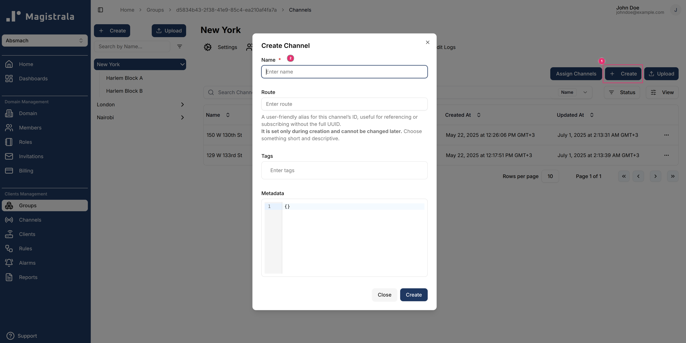
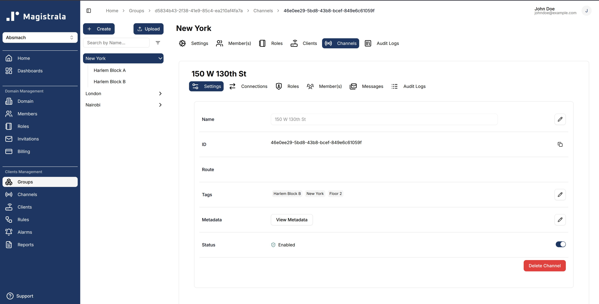
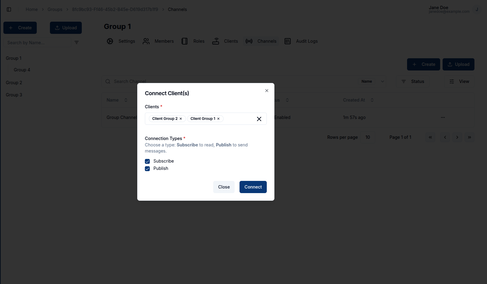
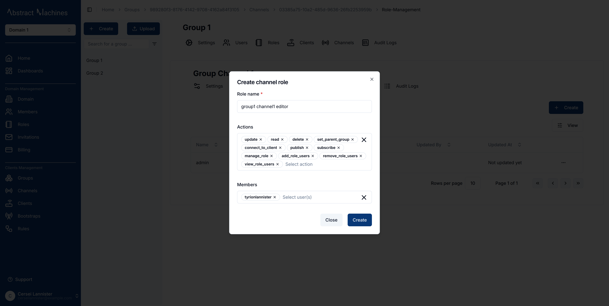

## **Creating a Channel**

Channels are considered as message conduits.

They are responsible for the messages exchange between Clients and act as message topic that can be be **published** or **subscribed** to by multiple Clients.

Each Client can **publish or subscribe** to a Channel, facilitating seamless device-to-device communication. Although subtopics can exist, they are not required for basic interactions.

To create a channel, navigate to the fourth tab under the groups and click on `+ Create`. This will open a dialog box which will take in a unique Channel name. Much like the Clients, clicking on `+ Create Channels` will allow a user to upload a _.CSV_ file with multiple channels.

### Viewing a Channel

After the Channel is created, clicking on it while it is on the Channel's table leads to the Channel View Page.

Clients can be connected to channels in groups. This is done in the **Connections** tab. There are two major connection types ie:

- **Subscribe**
- **Publish**

**User Management** in group-channels is pretty much the same as in the group-clients. A user can add roles and role actions to the channel.

Role Actions present include but are not limited to:

- update
- read
- delete
- set_parent_group
- connect_to_client
- publish
- subscribe
- manage_role
- add_role_users
- remove_role_users
- view_role_users

> Channel Users are an upcoming feature to Magistrala.
