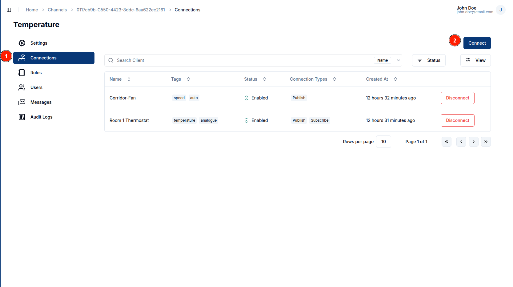
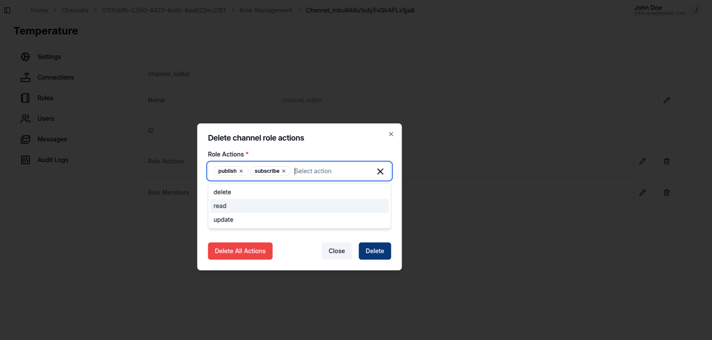

**Channels** are considered as message conduits. They are responsible for the messages exchange between Clients and act as message topic that can be **published** or **subscribed** to by multiple Clients.

Clients are able to **publish** or **subscribe** to a channel depending on the connection type they have.

## Create a Channel

To create a channel, click on the `+ Create` button present on the top-left corner of the page. You can also create multiple channels by clicking on the `+ Create Channels` button and uploading a _.csv_ file with channel **names** and any other fields you would like to add.

### Channel Information

Add a channel **_name_** and optionally **_tags_** and **_metadata_**.

### Bulk Creation

You can be able to create channels in bulk by uploading a _.csv_ file with the following fields in order:

1. Name (Required)
2. Metadata
3. Tags

A sample of the _.csv_ file can be found [here](https://github.com/absmach/magistrala-ui/blob/main/samples/channels.csv).

## View a Channel

After creating a channel, you will be able to see the created channel on the channels table. To view that channel click on the **row** or the **view** button in the row actions

This will lead you to the channel settings page, where you can view all the channel settings.

## Update a Channel

In the channel settings page, you are able to update the following channel details:

1. Name
2. Metadata
3. Status

To update a field, click on the `pencil` icon on the far end of the field to edit. Once you have updated the value, click on the `tick` icon to update the changes or the `cross` icon to cancel the change. To update the channel status, toggle the switch on the far end of the status field.

## Connect to a Client

Navigate to the `Connections` section of the channel navigation. This will lead you to the connections page where you can view the clients connected to a channel.

In this page you are able to add a connection by clicking on the `Connect` button on the top right corner.

This opens up a dialog box that allows you to select the clients you want to connect and with which connection type. A client can have both connection types selected.  
There are two connection type options:

1. **Publish**: Allows the client to send messages in the channel
2. **Subscribe**: Allows the client to read messages in the channel

To disconnect the client, click on the `Disconnect` button at the end of the channel row.

This will open up a dialog that allows you to select which connection type you want to remove. You can remove one or both of the connection types if you have multiple.

## User Management

### Roles

Roles allow you to group a specific set of actions and allocate them to users.
To create a role, navigate to the roles section on the client navbar. Click on the `+ Create` button and provide a role name. The actions and members are optional fields.

##### Role Information

The role name is complusory. You can optionally provide the role actions by selecting from the available actions. You can also optionally provide the members by searching for a user with their **username**.

The following is the list of available actions for a channel:

- update
- read
- delete
- set_parent_group
- connect_to_client
- publish
- subscribe
- manage_role
- add_role_users
- remove_role_users
- view_role_users

#### Update

To update a role name, click on the `pencil` icon on the far right end of the field, update the value then click on the `tick` icon to update the changes or the `cross` icon to cancel the changes.

To update the **actions** and **members** click on the `pencil` icon, it will pop up a dialog box allowing you to select the actions and users you want to add.

#### Delete

You can also delete actions and members by clicking on the `trash` icon. It pops up a dialog that allows you to select which action or member you want to remove. Optionally you can delete all of the actions or members by clicking on the `Delete All Actions` or `Delete All Members` buttons.

### Users

> This feature is currently under development :hammer:

## Audit Logs

Audit logs track all **group events**, from **creation** to **updates** and **disabling**.

> This feature is currently under development :hammer:

<!--
### **Create a Channel**

To create a channel, navigate to the fourth tab under the groups and click on `+ Create`. This will open a dialog box which will take in a unique Channel name. Much like the Clients, clicking on `+ Create Channels` will allow a user to upload a _.CSV_ file with multiple channels.

## View a Channel

After the Channel is created, clicking on it while it is on the Channel's table leads to the **Channel View** Page.

## Connect a Channel

Clients can be connected to channels in groups. This is done in the **Connections** tab. There are two major connection types ie:

- **Subscribe**
- **Publish**

These Channels can then be connected to a Client with either `subscribe` or `publish` connection types or both.

This is required to send messages via the channels and has been discussed in [QuickStart Guide][users-quick-start]

## User Management

**User Management** in group-channels is pretty much the same as in the group-clients. A user can add roles and role actions to the channel.

Role Actions present include but are not limited to:

- update
- read
- delete
- set_parent_group
- connect_to_client
- publish
- subscribe
- manage_role
- add_role_users
- remove_role_users
- view_role_users

> Channel Users are an upcoming feature to Magistrala.

## Send a Message

Once a Channel and Client are connected, a user can send messages with the channel as a topic and the client unique key. Messages sent are typically in SeNML format.

fields bear an asterisk. Messages are sent via _HTTP_ protocol in the UI.

The messages table will then update to include the message sent with the latest message appearing first.
Using the filter options, you can filter through a wide range of messages based on the protocol, publisher or even value.

[users-quick-start]: users-quick-start.md -->
