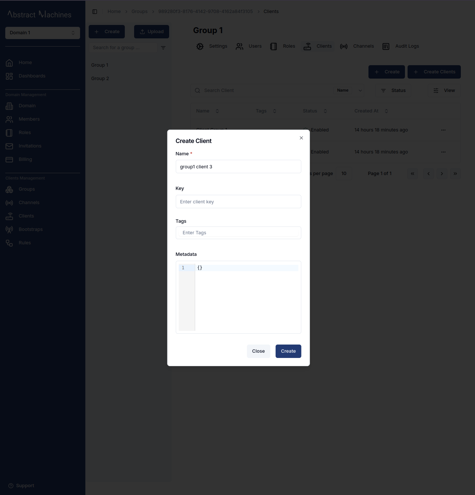
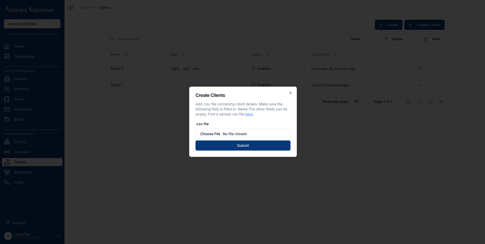
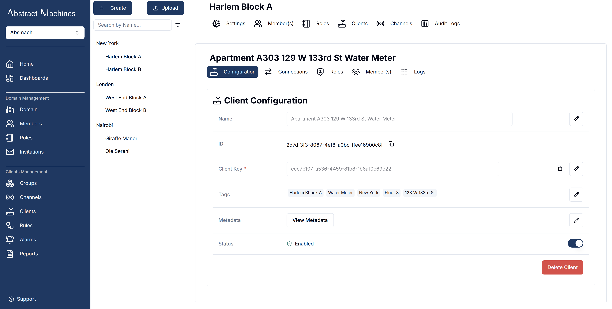
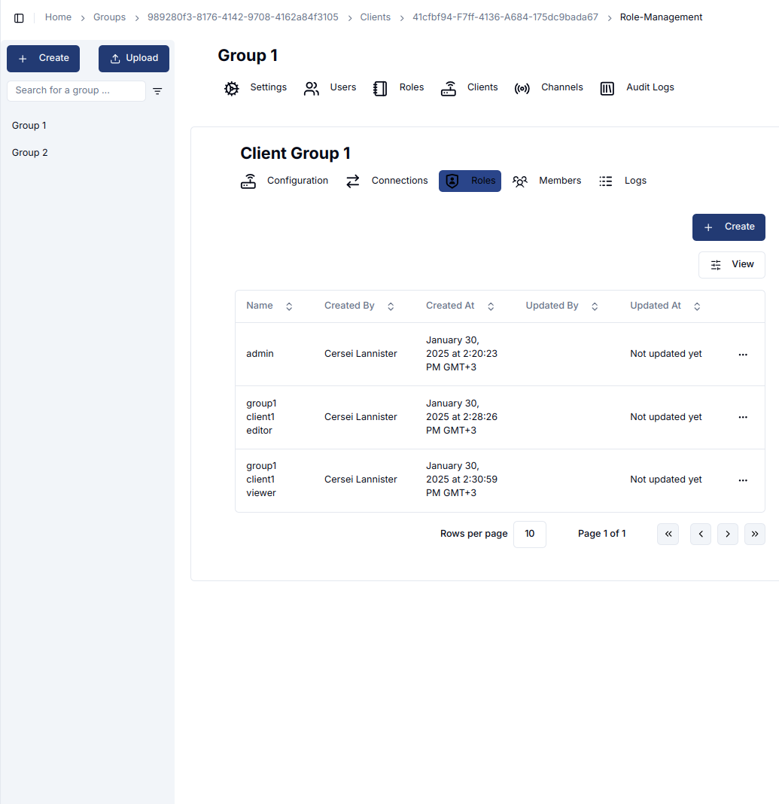
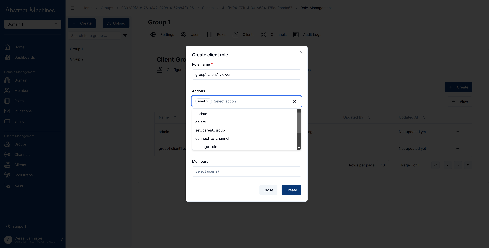

The **Clients Service** in Magistrala manages **Clients** (devices) and **Channels** (message conduits).

- A **Client** represents a device connected to Magistrala, capable of communication with other devices.
- A **Channel** serves as a conduit for message exchange between Clients, acting as a message topic that can be **published** or **subscribed** to by multiple Clients.

Each Client can **publish or subscribe** to a Channel, facilitating seamless device-to-device communication. Although subtopics can exist, they are not required for basic interactions.

---

## **Clients**

Clients are physical or virtual devices that can send and receive messages through **embedded systems**.

While Magistrala supports multiple communication protocols, the **UI currently supports HTTP**.

A Client follows this structure:

```go
// Client Struct represents a client.

type Client struct {
 ID          string      `json:"id"`
 Name        string      `json:"name,omitempty"`
 Tags        []string    `json:"tags,omitempty"`
 Domain      string      `json:"domain_id,omitempty"`
 ParentGroup string      `json:"parent_group_id,omitempty"`
 Credentials Credentials `json:"credentials,omitempty"`
 Metadata    Metadata    `json:"metadata,omitempty"`
 CreatedAt   time.Time   `json:"created_at,omitempty"`
 UpdatedAt   time.Time   `json:"updated_at,omitempty"`
 UpdatedBy   string      `json:"updated_by,omitempty"`
 Status      Status      `json:"status,omitempty"` // 1 for enabled, 0 for disabled
 Identity    string      `json:"identity,omitempty"`
 // Extended
 ParentGroupPath           string                 `json:"parent_group_path,omitempty"`
 RoleID                    string                 `json:"role_id,omitempty"`
 RoleName                  string                 `json:"role_name,omitempty"`
 Actions                   []string               `json:"actions,omitempty"`
 AccessType                string                 `json:"access_type,omitempty"`
 AccessProviderId          string                 `json:"access_provider_id,omitempty"`
 AccessProviderRoleId      string                 `json:"access_provider_role_id,omitempty"`
 AccessProviderRoleName    string                 `json:"access_provider_role_name,omitempty"`
 AccessProviderRoleActions []string               `json:"access_provider_role_actions,omitempty"`
 ConnectionTypes           []connections.ConnType `json:"connection_types,omitempty"`
}

// Credentials represent client credentials: its
// and "secret" which can be a password or access token.
type Credentials struct {
 Secret   string `json:"secret,omitempty"`   // password or token
}

```

This means any physical device with an embedded system can be assigned a unique key, which acts as a token for publishing and subscribing to a Channel.

The **clientName** is not unique but its **ID** and **secret** are.
The client ID is used during the connecting and assigning of clients while the **Key** is used primarily in sending and reading messages.

### Create a Client

A **new client** can be created by navigating to the **Clients** section of the group ID page and clicking the `+ Create` button.
A dialog box will open, requiring fields such as **Name** , **Key** which will be useful in messaging and **Metadata** which can be used in mapping.
You can add a unique key for the thing, although one is automatically generated.
Additionally, **tags** can be assigned to Clients for better organization and filtering.



Any Client created while in the group can be connected to any channel within the group.

A user can also create bulk clients by clicking on the `+ Create Clients` button. This will lead to a dialogbox that takes in a _.CSV_  file with the clients' details filled in correctly as seen in these [samples](https://github.com/absmach/magistrala-ui/tree/main/samples).



### View a Client

Once created, a **client** can be viewed and updated in the unique Client's ID page. To access the page, click on the Client in the Clients' table.

The client's data can be updated in this page and its ID copied as well.



There is a section of **Bootstrap** under the Client details. We will delve deeper into [Bootstrap Configurations][Bootstraps] later on. It is an addon that must be started from Magistrala to work on the UI.

The client can also be **disabled** which will have it present on the database with a status of 0. The user can also **enable** the client should they wish to.

### Connect a Client

There is a **Connections** tab in the **client page** is where a User can connect a Client to a Channel.

> This tab is currently inactive

### User Management

A user can view the roles and role actions available to the client as well as create new roles and role actions.



The available role actions that a client can have include:

- update
- read
- delete
- set_parent_group
- connect_to_channel
- manage_role
- add_role_users
- view_role_users
- remove_role_users



> A Group-Client can also have members present but this is an upcoming feature

[Bootstraps]: bootstraps.md
