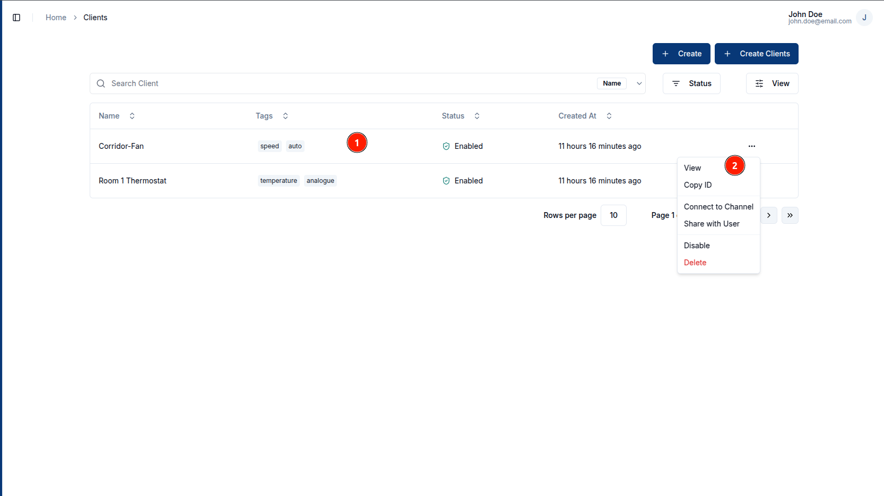
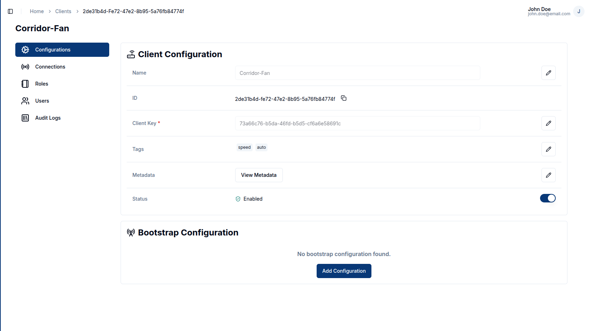
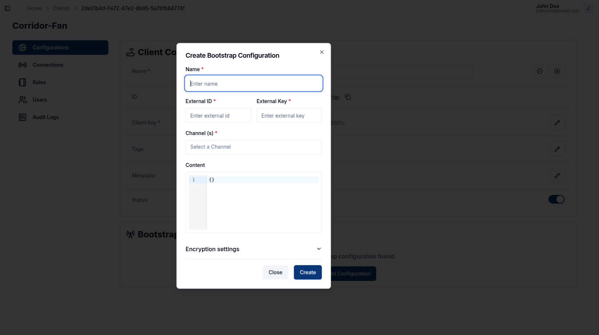
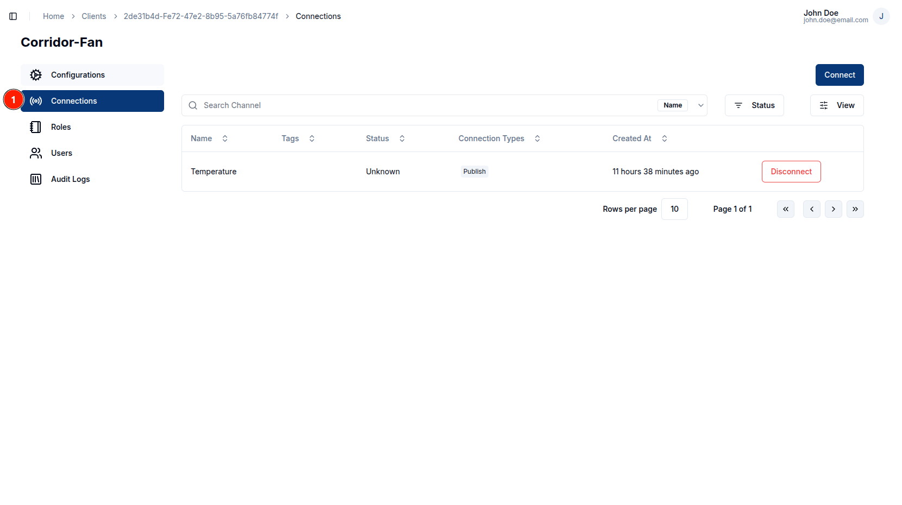
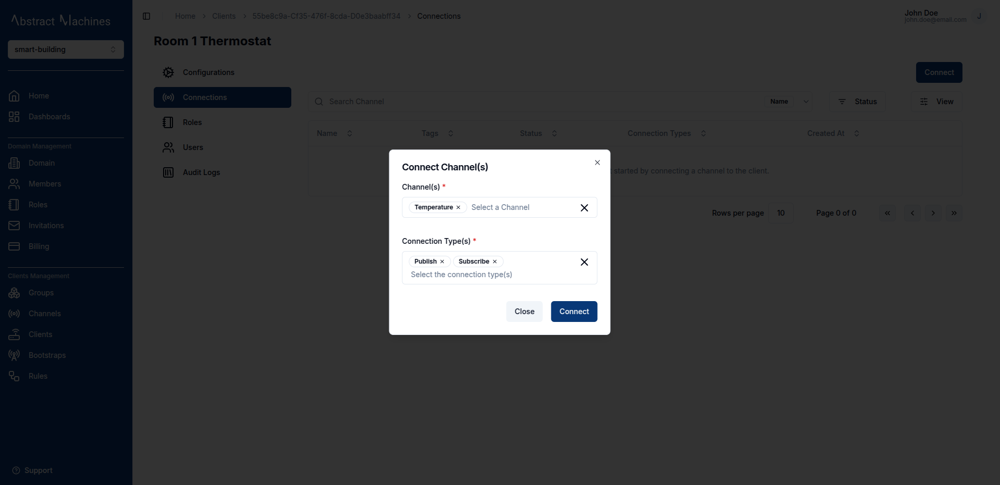
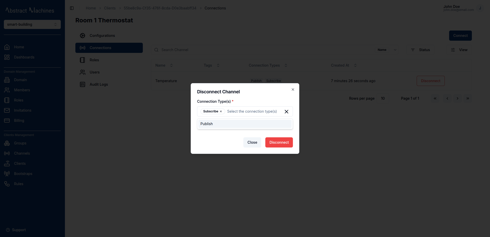

**Clients** in Magistrala can be a **device** or an **application** that can be used to publish or subscribe to messages.

## Create a Client

To create a client, click on the `+ Create` button present on the top-left corner of the page. You can also create multiple clients by clicking on the `+ Create Clients` button and uploading a _.csv_ file with client **names** and any other fields you would like to add.

### Client Information

Add a client **_name_** and optionally a **_key_** (has to be unique), **_tags_** and **_metadata_**.

The client **key** will be used to authorize the device to send messages.

### Bulk Creation

You can be able to create clients in bulk by uploading a _.csv_ file with the following fields in order:

1. Name (Required)
2. Secret
3. Tags
4. Metadata

A sample of the _.csv_ file can be found [here](https://github.com/absmach/magistrala-ui/blob/main/samples/clients.csv).

## View a Client

After creating a client, you will be able to see the created client on the clients table. To view that client click on the **row** or the **view** button in the row actions

This will lead you to the client configuration page, where you can view all the client configurations.

## Configurations

This page consists of both the client configurations which are the client details and the bootstrap configuration which are the bootstrap details for the client.

### Client Configuration

This section enables a user to update the following client details:

1. Name
2. Client Key
3. Tags
4. Metadata
5. Status

To update a field, click on the `pencil` icon on the far end of the field to edit. Once you have updated the value, click on the `tick` icon to update the changes or the `cross` icon to cancel the change. To update the client status, toggle the switch on the far end of the status field.

### Bootstrap Configuration

Bootstrap configuration of a client allows bootstrapping of the device (self-starting process that proceeds without external input). Further details of bootstrapping are discussed in the [Bootstrap section](/docs/clients/bootstraps.md).

To add a bootstrap configuration, click on the `Add Configuration` button.

A dialog box will appear allowing you to enter the following fields

1. Name (required) - A unique name for the bootstrap configuration
2. External ID (required)
3. External Key (required)
4. Channels (required) - The channels the client will connect to.
5. Content (optional)
6. Encryption Settings (optional)
   - Client Cert
   - Client Key
   - CA Cert

## Connect to a Channel

Navigate to the `Connections` section of the client navigation. This will lead you to the connections page where you can view the channels a client is connected to.

In this page you are able to add a connection by clicking on the `Connect` button on the top right corner.

This opens up a dialog box that allows you to select the channels you want to connect to and with which connection type. A client can have both connection types selected.  
There are two connection type options:

1. **Publish**: Allows the client to send messages in the channel
2. **Subscribe**: Allows the client to read messages in the channel

To disconnect from the channel, click on the `Disconnect` button at the end of the channel row.

This will open up a dialog that allows you to select which connection type you want to remove. You can remove one or both of the connection types if you have multiple.

## Client Members

### Roles

Roles allow you to group a specific set of actions and allocate them to users.
To create a role, navigate to the roles section on the client navbar. Click on the `+ Create` button and provide a role name. The actions and members are optional fields.

##### Role Information

The role name is complusory. You can optionally provide the role actions by selecting from the available actions. You can also optionally provide the members by searching for a user with their **username**.

The following is the list of available actions for a client:

- update
- read
- delete
- set_parent_group
- connect_to_channel
- manage_role
- add_role_users
- view_role_users
- remove_role_users

#### Update

To update a role name, click on the `pencil` icon on the far right end of the field, update the value then click on the `tick` icon to update the changes or the `cross` icon to cancel the changes.

To update the **actions** and **members** click on the `pencil` icon, it will pop up a dialog box allowing you to select the actions and users you want to add.

#### Delete

You can also delete actions and members by clicking on the `trash` icon. It pops up a dialog that allows you to select which action or member you want to remove. Optionally you can delete all of the actions or members by clicking on the `Delete All Actions` or `Delete All Members` buttons.

### Users

> This feature is currently under development :hammer:

## Audit Logs

Audit logs track all **group events**, from **creation** to **updates** and **disabling**.

> This feature is currently under development :hammer:
