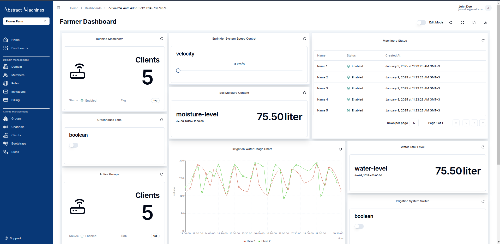
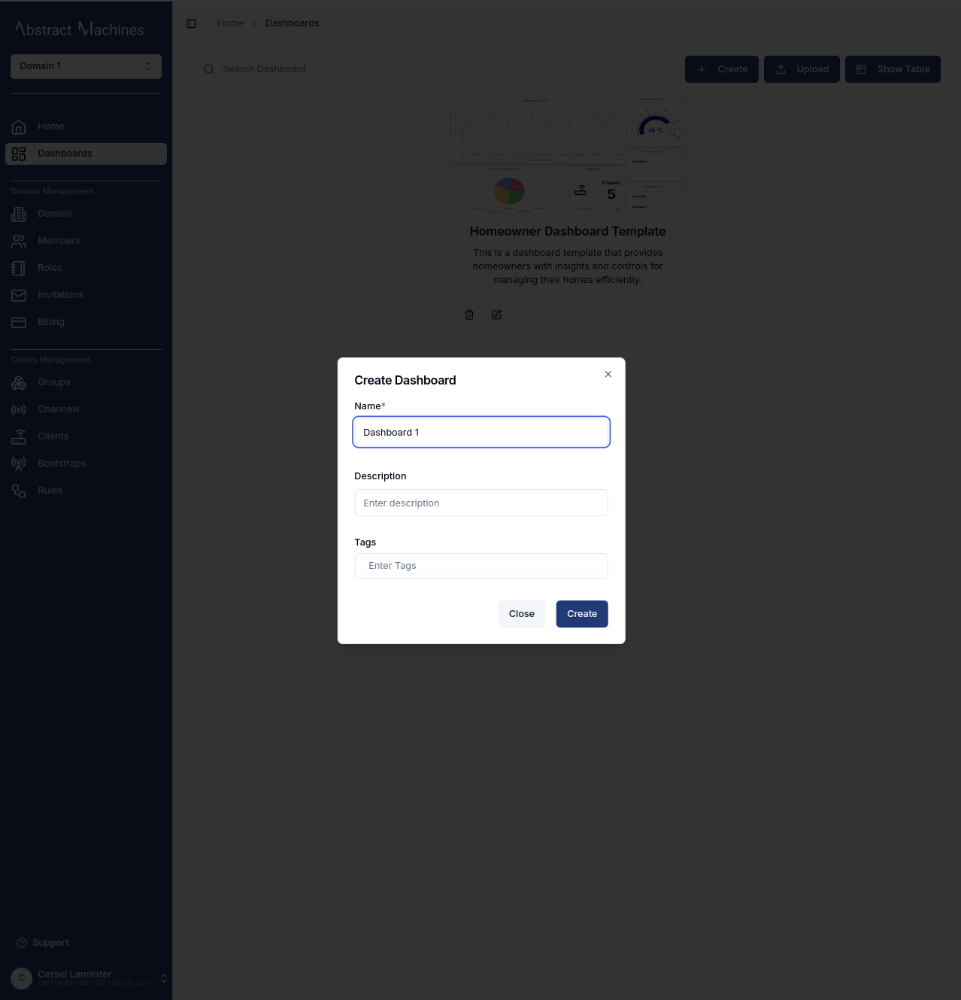
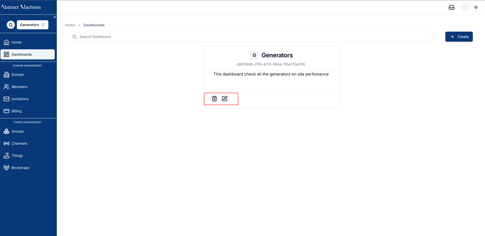
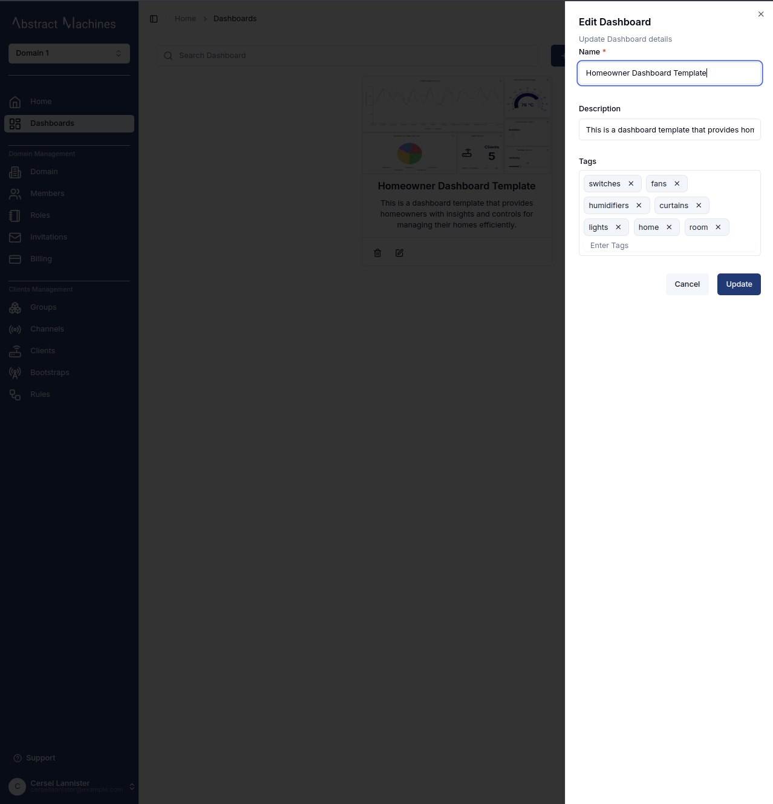
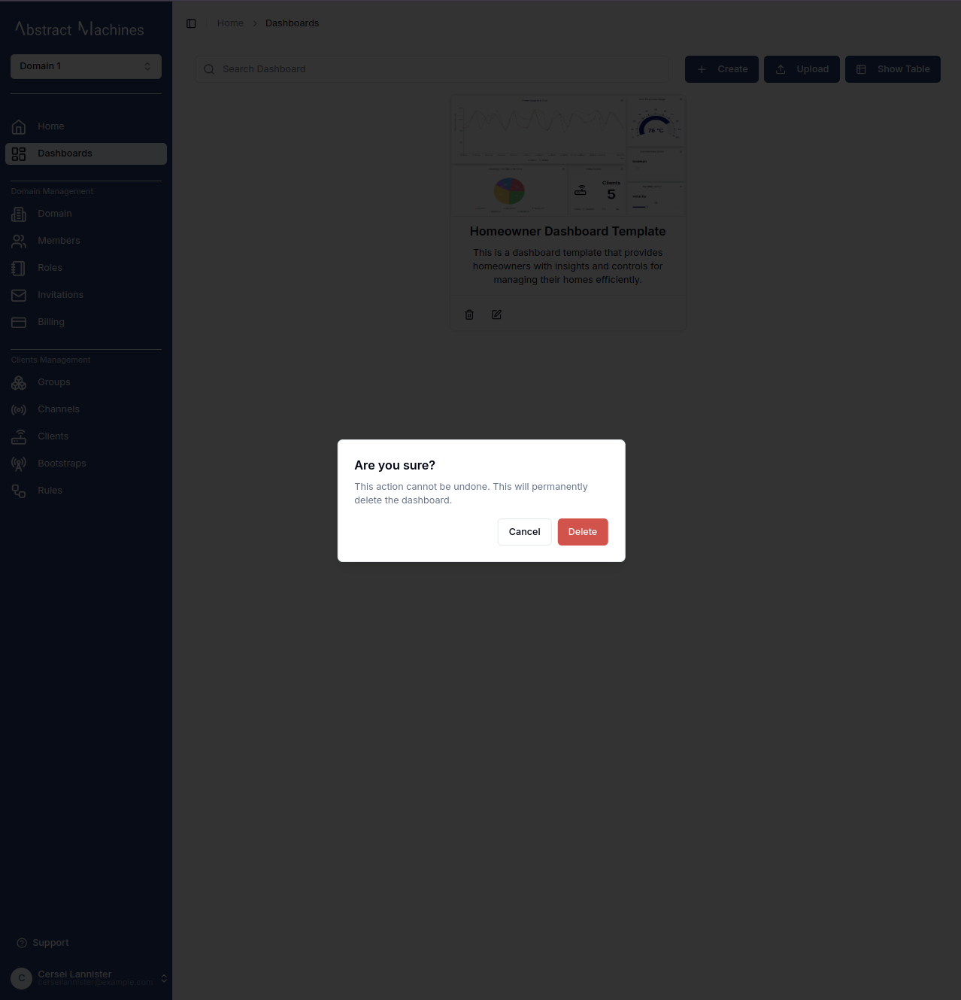
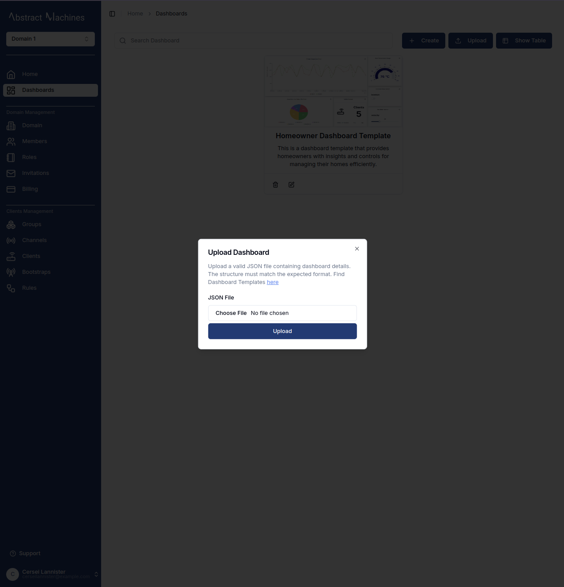
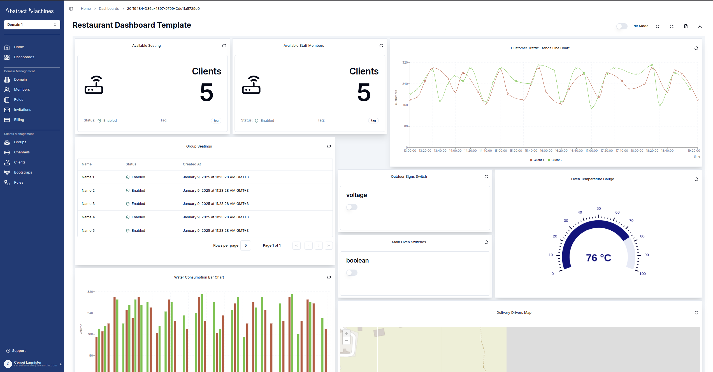

Magistrala provides a powerful feature in **Dashboards**.
Dashboards allows a user to create as well as customise instruments for monitoring and managing their data and devices efficiently.
Through the use of charts and control devices on a widget a User can adapt interfaces to their specific needs, making it easier than ever to inspect their IoT devices and data.
Each dashboard can be populated with numerous widgets which are not limited to a single _dataSource_.
Data can be displayed from devices and entities such as Clients.

## Create a New Dashboard

After loging into a **Domain**, navigate to **Dashboards** tab and click on the "+ Create" button. The dialog box that pops up will require you specifically add a Dashboard name. The tags and description not neccesary but it is good practise to have them for easier filtering.

You have now created your first Dashboard. Any subsequent dashboard will appear first on the Dashboards Page. Similarly as discussed in the **Homepage**, these Dashboards wil appear on the Table to your bottom right.

## Edit Dashboard

The Dashboard card has an `edit` button which will open a sheet on the right side navigation bar. This will allow you to edit the Dashboard's name, description and tags.

## Delete Dashboard

There is also a Trash Icon that deletes the Dashboard once clicked.
There is an alert that pops up to confirm if you'd like to have the Dashboard deleted.

## Upload Dashboard

Magistrala provides users with the ability to share and upload Dashboards.

> While sharing dashboards is currently underway, users can download Dashboards then share them to be Uploaded later by themselves or by others.

The `Upload` button at the top of the Dashboard tables triggers a dialogbox which allows a user to upload a _.JSON_ file that has all the required fields of a complete Dashboard. The Uploaded Dashboard will then be created anew in the Dashboards list with new IDs as well as the current session's Domain ID.

You can find sample to use in Uploading that already make it easier to work with the Dashboard charts and can be plugged into real life usecases [here][samples]

## View Dashboard

To acces the Dashboard, simply click on its card.
Once inside, you can start customizing it by adding charts and other widgets.
To begin, toggle **Edit Mode** to enable editing features. In this mode, you can add, modify, or remove charts and widgets.
There is also a **Full Screen Mode**, which allows the dashboard and its charts to take up the entire screen, providing a clearer view of the data.

Clicking on the pdf icon or the download icon will **download** the dashboard as a pdf file or json file respectively.

In **Edit Mode**, you will find the **Edit Dashboard** button.
This serves a similar function to the pencil icon on the dashboard card, allowing you to update the dashboard's name, tags, and description.

Now that we have our dashboard in edit mode, we can start adding charts.
Click the **Add Widget** button, which will open a dialog box displaying all the available charts and widgets for selection.

[samples]: https://github.com/absmach/magistrala-ui/tree/main/samples/dashboard-templates
