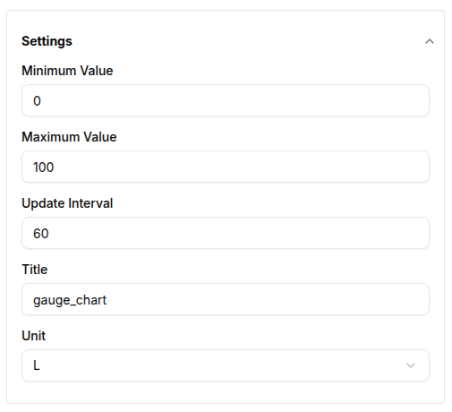
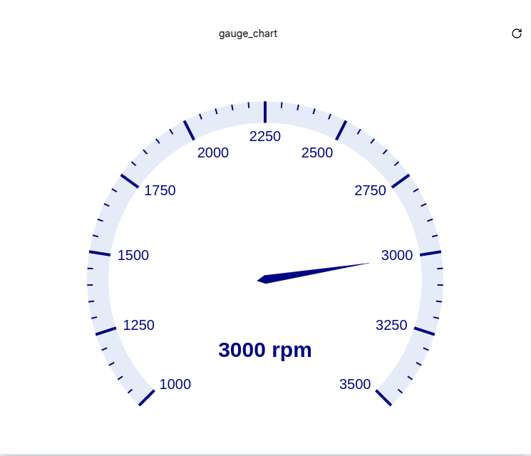

Gauges are essential widgets for visualizing the latest value of a message from a connected **Client** or **Channel**.
They provide an intuitive way to track metrics like voltage, speed, or temperature.

  

Magistrala offers different types of gauges, including:

- **Simple Gauge**
- **Temperature Gauge**
- **Speed Gauge**

Each gauge widget can be configured to show specific values based on the connected devices. Let’s explore the creation of these gauges.

---

## Simple Gauge

The **Simple Gauge** widget displays the latest value from a selected data source, like voltage, pressure, or other metrics.
The gauge is customizable, allowing you to set the minimum and maximum value range, update intervals, and title.

### Create a Simple Gauge

1. Ensure the dashboard is in **Edit Mode**.
2. Click the **+ Add Widget** button and select **Simple Gauge** from the widget list. This will open the gauge configuration dialog.

  
3. **Gauge Type**: Select **Simple Gauge** from the dropdown.
4. **Channel**: Choose the **Channel** that will provide the data for the gauge.
5. **Client**: Select the **Client** (device/entity) that is connected to the Channel whose data will be visualized.
6. **Value Name**: Specify the name of the value that will be used to fetch messages (e.g., `demovoltage`).

  
**Settings Section**
7. **Minimum Value**: Set the minimum value for the gauge, which could represent the lower limit of the metric you're tracking (e.g., `50000` for voltage).
8. **Maximum Value**: Set the maximum value for the gauge (e.g., `100000` for voltage).
9. **Update Interval**: Specify how frequently the gauge should update its value (in seconds). For instance, an interval of `600` seconds means the gauge will update every 10 minutes.
10. **Title**: Enter a descriptive title for the gauge (e.g., "Monical Voltage").
11. **Unit**: Select the unit needed for the simple gauge. It will show up on the gauge chart. There is a list of Units you can choose from for simplegauge:
[comment] add the list of units here

  
12. After configuring the gauge, click **Create** to save and add the widget to your dashboard.

Once the widget is added, the gauge will immediately begin displaying the latest value based on the settings you've applied.

  

You can edit the gauge later by clicking the **Pencil Icon** on the widget, allowing you to adjust the data sources, value name, title, or settings as needed.

  

---

## Temperature Gauge

The **Temperature Gauge** widget functions similarly to the Simple Gauge but is tailored for temperature values. It displays the latest temperature data from a connected device.

### Create a Temperature Gauge

1. Start by putting the dashboard in **Edit Mode**.
2. Click **+ Add Widget** and select **Temperature Gauge** from the list. This will open the temperature gauge configuration dialog.
3. **Gauge Type**: Select **Temperature Gauge** from the dropdown.
4. **Channel**: Choose the **Channel** that will provide the temperature data.
5. **Client**: Select the **Client** (device) connected to the channel.
6. **Value Name**: Enter the value name for the temperature data that will be used to fetch messages(e.g., `tempValue`).

  
**Settings Section**
7. **Minimum Value**: Set the minimum value for the gauge (e.g., `0` for temperatures in degrees Celsius).
8. **Maximum Value**: Set the maximum value (e.g., `20000` for temperatures in degrees Celsius).
9. **Update Interval**: Define the update frequency (in seconds), such as `60` seconds for a 5-minute update cycle.
10. **Title**: Provide a title for the temperature gauge (e.g., "Monical Temperature Gauge").
11. **Unit**: Select the unit needed for the temperature gauge. It will show up on the gauge chart. The options available are Degrees Celcius, Kelvin and Farenheight as shown below:

  
12. Click **Create** to add the Temperature Gauge to your dashboard. The gauge will immediately start reflecting the latest temperature readings.

  

You can modify the gauge by clicking the **Pencil Icon** on the widget, allowing you to adjust the data source, title, and value ranges.

---

## Speed Gauge

The **Speed Gauge** widget tracks speed or velocity values from connected devices. It functions similarly to the Simple and Temperature Gauges, but the units and appearance are tailored for speed data.

### Create a Speed Gauge

1. Ensure the dashboard is in **Edit Mode**.
2. Click **+ Add Widget** and select **Speed Gauge** from the list of available widgets.
3. **Gauge Type**: Select **Speed Gauge**.
4. **Channel**: Select the **Channel** providing the speed data.
5. **Client**: Choose the connected **Client** (device).
6. **Value Name**: Enter the name of the value that corresponds to speed (e.g., `speedValue`).

  
**Settings Section**
7. **Minimum Value**: Set the minimum speed value (e.g., `0`).
8. **Maximum Value**: Set the maximum speed value (e.g., `10000` for kilometers per hour).
9. **Update Interval**: Set how frequently the gauge should refresh (e.g., every `60` seconds).
10. **Title**: Provide a title for the speed gauge (e.g., "Monical Speed Gauge").
11. **Unit**: Select the unit needed for the simple gauge. It will show up on the gauge chart. There is a list of Units you can choose from for speed gauge.

   
11. Click **Create** to save the Speed Gauge widget. The gauge will then start showing the latest speed data.

   

---

#### **Conclusion**

Gauges provide a highly visual, intuitive way to track live data for a variety of metrics.
Whether you're monitoring voltage, temperature, or speed, these widgets offer flexibility in displaying the most important data from your connected IoT devices.

Each gauge can be customized with specific value ranges, update intervals, and labels, making them adaptable to any use case.
You can also edit existing gauges to adjust settings as your monitoring needs evolve.
