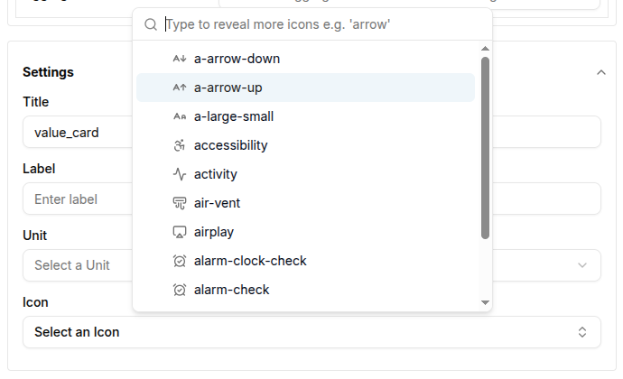
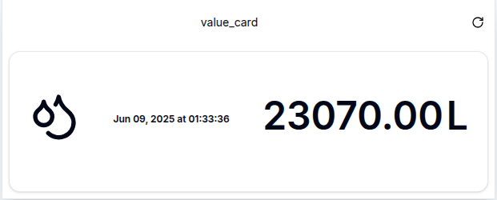
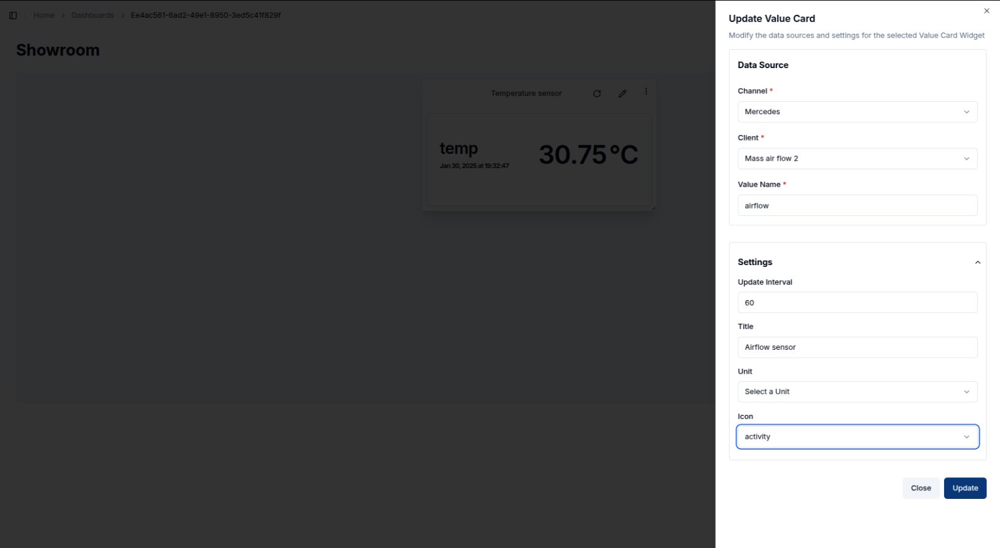
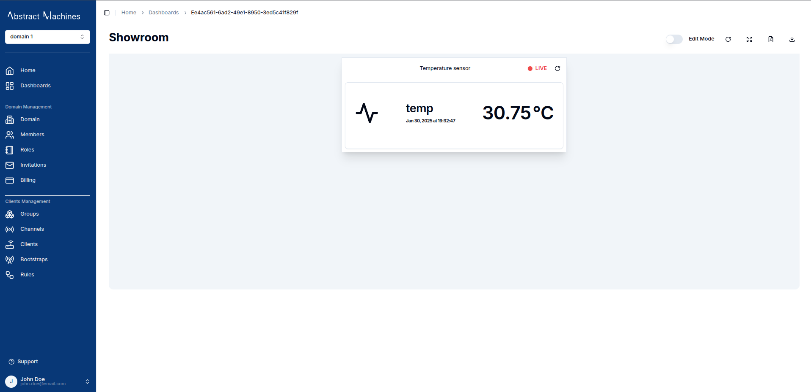

A **Value Card** displays the latest value of a message from a connected channel, providing a quick snapshot of real-time data.
Unlike timeseries charts, Value Cards do not need a time interval because they only show the most recent message from the selected data source.

## Create a Value Card

To create a Value Card, ensure your dashboard is in **Edit Mode**.
Click the '+ Add Widget' button, then select **Value Card** from the list of available widgets.

This will open the **Create Value Card** dialog, where you can configure the card's data source and appearance.

### Configuring the Value Card

1. **Channel**: Select the channel from which the card will pull data.
2. **Client**: Choose the connected device (client) that corresponds to the channel.
3. **Value Name**: Enter the value name that you wish to display on the card (e.g., demovoltage).
4. **Update Interval**: Set the interval for how often the card should refresh to show the latest message.
5. **Title**: Provide a title for your value card. This will be displayed at the top of the widget.
6. **Unit**: Specify the unit of measurement (e.g., V for volts, °C for temperature).

7. **Icon**: Select an icon that visually represents the data displayed. You can choose from a list of icons to match the context of the value.

Once all the necessary fields are completed, click the **Create** button to add the Value Card to your dashboard.
The card will immediately display the latest value from the channel, along with the associated unit and icon.

## Edit the Value Card

You can edit a Value Card by clicking the **Pencil Icon** in the top-right corner of the widget.
This will open a sheet on the right, allowing you to adjust the data source, title, icon, and other settings.

1. **Data Source**: Modify the channel, client, or value name if needed.
2. **Update Interval**: Adjust how often the card should refresh with the latest data.
3. **Title**: Change the title of the value card to reflect the new information.
4. **Unit**: Update the unit if the data type changes (e.g., from volts to amps).
5. **Icon**: Select a new icon that matches the updated data context.

Once the updates are made, click **Update** to save the changes.
The card will refresh with the new configuration, showing the updated data and icon.

### Customizing Value Cards

- **Icons**: The ability to select an icon is crucial for visually representing the type of data displayed. For example, you can choose an "activity" icon for voltage or a "thermometer" icon for temperature.
- **Display**: The value card displays the value, unit, and the last update time, ensuring that users can quickly grasp the current status of the connected device or channel.

With Value Cards, you can effectively monitor the latest value of a specific metric, making them ideal for real-time overviews of critical data from connected devices.
