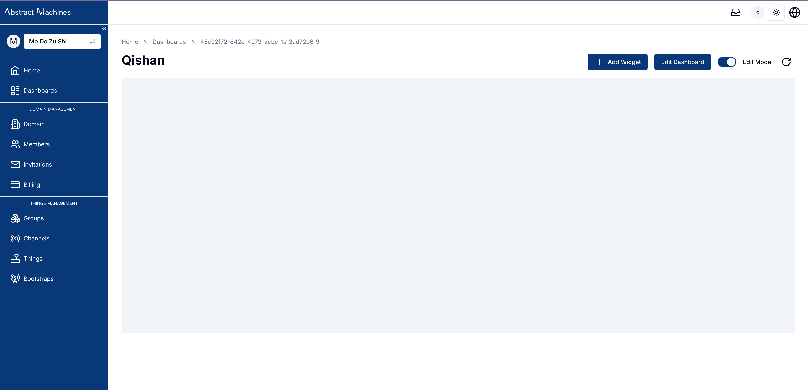

**Widgets** are the building blocks of a dashboard, allowing users to visualize and interact with their IoT data.
Each widget provides a specific way to display or control the data flowing from connected devices.
Whether you're monitoring live sensor readings or interacting with devices remotely, widgets offer the flexibility to suit your specific needs.
We currently do not support real time monitoring but that is under the works and will be included in later installments.

Magistrala offers a variety of widgets, including charts, data cards, and control elements:

- **Timeseries Charts**:
  - Line Chart
  - Bar Chart
  - Area Chart
  - Pie Chart
- **Cards**:
  - Value Card
  - Count Card
  - Table Card
- **Control Elements**:
  - Switch
  - Slider
- **Gauges**:
  - Gauge Chart
- **Maps**:
  - Route Map
  - Marker Map

Each of these widgets can be customized and configured to display data in the most meaningful way for your use case.

To use widgets effectively, particularly timeseries charts, you need to have connected entities that are actively sending data.
A guide to how to connect and send messages is provided on [Quick Start Guide][users-quick-start].
Widgets rely on messages sent from devices in the following `SeNML` format:

```json
{
  "publisher": "866783d4-b8f9-477a-9ff5-637891c25a3e",
  "protocol": "coap",
  "name": "demovoltage",
  "unit": "V",
  "time": "2024-07-30 20:33:39",
  "value": 6679038674907747000
}
```

## Add a new widget

Dashboards are built using **Widgets** that visualize data and facilitate control over other devices.
These widgets can host a variety of charts and controls.
To ensure that timeseries charts function correctly, you need to have connected channels and entities that actively send messages.

The available timeseries charts include:

- Line Charts
- Bar Charts
- Area Charts
- Pie Charts

In addition to charts, you can add various cards and control elements to your dashboard:

- Value Card
- Count Card
- Table Card
- Switch
- Slider
- Gauge Chart
- Route Map

To add a widget, select your desired chart or control from the dialpgbox. This action opens a dialog box where you can configure the necessary data sources, set additional options, and apply filters. Once you've configured the settings, click the 'Create' button to add the widget to your dashboard.



### Features of each Widget Chart

There are some standard features of the charts that ensure better visualisation and customisation of their performance and appearance.

These features include:

- Chart Appearance Settings
- Time Windows
- Filters
- Data Aggregation
- Icons

#### 1. Time Window

This represents the time interval which will be used to fetch the timeseries data of the charts.
TIme windows are used especially for timeseries charts such as Area, Line, Bar and Pie charts.


Using the calender present, the query sent to the database will then include a from and to time.

The date-time calender also has slots for times.
Clicking on the first box will allow you to enter a number within 24 hours.
If the box stays idle it wil automatically move to the minute section and then to the seconds section.

If you do not specify a date and time the charts will keep on reloading to the latest values present from the channel and client connected.

This ensures that the chart always has **Real Time** data showing. You can notice this with the live data red blinking button that is present in each real time widget.

Here is an image of the time-series Area chart we have created that uses Live Data:


#### 2. Chart Appearance Settings

These settings adjust the appearance of the Chart Widget through title names, axes names as well as the refresh rate.
Each chart has its own settings that differ at a level with the others.
They generally appear as a tab on the dialog that pops open once a user clicks on the chart they need.

To customise the title on a chart futher, click on the pencil icon on the widget after creation. This will open a sheet with the current settings.

The title has a default setting with the chart name but can be edited to your preference.

For Timeseries charts, the settings are typically the same across the board except for the pie chart.
The update Interval determines when the api request is sent to the database and is set to 60s by default. Its basically the refresh rate.
If the time window is not set, this means the chart will show the latest data after the update.
The x and y axes labels can also be altered to feature any labels needed.


For the pie-chart, the settings are unique since pie-charts require more than one data source and have no need for axes. You can only edit the title and the Update Interval

The gauge-chart also has some diverse settings that include a **minimum** and **maximum** value which controls the gauge-chart scale.
These values are set to *0* and *100* by default.
The user can also specify the Unit they desire to show up on the gauge chart from the list provided:

1. Kilometer (km)
2. Meter (m)
3. Centimeter (cm)
4. Millimeter (mm)
5. Micrometer (µm)
6. Nanometer (nm)
7. Inch (in)
8. Foot (ft)
9. Yard (yd)
10. Mile (mi)
11. Degrees Celsius (°C)
12. Kelvin (K)
13. Fahrenheit (°F)
14. Meters per Second (m/s)
15. Kilometers per Hour (km/h)
16. Miles per Hour (mph)
17. Feet per Second (ft/s)
18. Mach (Mach)
19. Knots (kn)
20. RPM (rpm)
21. Pascal (Pa)
22. Hectopascal (hPa)
23. Kilopascal (kPa)
24. Megapascal (MPa)
25. Bar (bar)
26. Counts per Second (cps)
27. pH Level (pH)
28. Volts (V)
29. Millivolts (mV)
30. Percent (%)
31. Gram (g)
32. Kilogram (kg)
33. Milligram (mg)
34. Liter (L)
35. Milliliter (mL)
36. Newton (N)
37. Joule (J)
38. Watt (W)
39. Kilowatt (kW)
40. Horsepower (hp)
41. Ampere (A)
42. Milliampere (mA)
43. Coulomb (C)
44. Ohm (Ω)

Here is an example of a chart with the unit set to *km* :


Quite similar to the Gauge Chart, Control Sliders also require a **minimum** and **maximum** value for the scale.
The steps determine the increments and decreases of each move.
They are set to *10* by default.


For maps, the **Latitude Key** and **Longitude Key** tags are essential for retrieving data from entities. These tags specifically set the latitude and longitude keys required to determine the position of the entities. By default, these tags are set to *latitude* and *longitude*.

Route maps also feature an adjustable line width, allowing the line to be modified to a suitable thickness.


The value card settings offer options to configure the update interval, unit, and title.


#### 3. Icons

The icons section provides a variety of icons that can enhance the value card's visualization.
Simply type the name of the desired icon, and it will appear on the card


#### 4. Filters

Each map has certain fields that can help filter out the data that will be displayed.
Time windows are examples of such filters.
The dataSources are also filters when it comes to the Client IDs and Channel IDs.
Currently, most charts allow multiple data Sources to be used at an instance.

Once a channel is selected, the client selected must be one that is connected to the channel to be able to fetch data from the backend.

**ValueName** is also considered a filter since it limits the request to a specific column. Valuenames typically hold the topic that the message is in:

```json
{
  "channel": "aecf0902-816d-4e38-a5b3-a1ad9a7cf9e8",
  "publisher": "2766ae94-9a08-4418-82ce-3b91cf2ccd3e",
  "protocol": "http",
  "name": "voltage",
  "unit": "V",
  "time": 1276020076.001,
  "value": 120.1
}
```

The status of an entity is also a major filter for charts such as the entity table which will limit the entities to show either the enabled or disabled status.


Gauge charts can also be filtered as Simple gauges, Temperature gauges and Speed gauges.


#### 5. Data Aggregation

Data aggregation is a powerful feature that enables the summarization of data over specific time periods.
This is particularly useful for time-series charts where you want to visualize trends or patterns over a defined period.
Magistrala currently supports the following aggregation methods:

- **Maximum**: Retrieves the highest value within the specified time window.
- **Minimum**: Retrieves the lowest value within the specified time window.
- **Average**: Calculates the mean value over the selected interval.
- **Sum**: Computes the total sum of values for the given time window.
- **Count**: Counts the number of entries in the specified interval.

For aggregation to work effectively, a **Time Window** needs to be set. The **Time Window** consists of a "From Date" and a "To Date," defining the range of time over which the aggregation will be performed.
Additionally, an **Aggregation Interval** must be specified, indicating the frequency at which the data points should be aggregated (e.g. every 10 seconds).


The combination of these settings allows you to customize how your data is aggregated and displayed on the dashboard.
For example, if you want to see the average temperature readings of a sensor every 10 minutes over the past 24 hours, you would set the "From Date" to 24 hours ago, the "To Date" to the current time, and the "Aggregation Interval" to 10 minutes.
The result will be a clear visual representation of the temperature trend.

By using data aggregation, you can gain deeper insights into your data, making it easier to monitor and analyze the performance and behavior of your IoT devices.

## Edit the Widgets

Once a widget is created, it can be easily modified to suit changing requirements. While in **Edit Mode**, simply click on the pencil icon located on the top right corner of the widget you wish to modify. This action opens a settings panel from the right side of the screen, as shown below:


In this panel, you will find all the previously configured settings and data sources. Here, you can:

- Change the **Value Name** to target a different data metric.
- Select a different **Channel** and **Thing** to pull data from another source.
- Modify the **Label** and **Color** for better visualization.
- Add additional data sources by clicking on the **Add Source** button, allowing the widget to visualize multiple data streams at once.
- Adjust the **Time Window** and other **Settings** like chart appearance, filters, and aggregation intervals as needed.


After making your desired changes, click the **Update** button to apply them. The widget will automatically refresh to display the new configuration, giving you a real-time view of the updated data.

For example, if you want to add two more data sources to your existing bar chart, click the **Add Source** button and select the desired channels and things. You can also change the title for the chart to reflect these new sources, making your dashboard even more informative.

These changes result in a new chart.

This flexibility allows you to keep your dashboard up-to-date with the latest data and make adjustments on the fly, ensuring that the visualizations always meet your monitoring and management needs.

## Delete a Widget

A widget card also has a vertical menu used for deleting the widget and toggling dummy data.
Deleting the widget is as simple as clicking the `delete` button and confirming that you would like to delete the widget.


## Dummy Data Toggle

From the widget menu, a user can elect to use Dummy Data that provides the chart data as samples. This is a quick and easy way to create dummy charts that can be used to learn the data needed for the charts.


[users-quick-start]: users-quick-start.md
