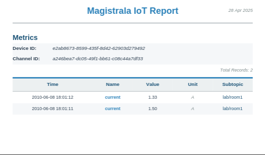

The **Reports Service** in Magistrala provides a streamlined way to generate and schedule data reports from connected devices and sensors. It allows users to collect, aggregate, and export metrics in PDF and CSV formats, either via email or direct download.

## Architecture

The Reports Service operates through three main components:

1. **Report Configurations**: Define what data to collect and how to process it
2. **Scheduler**: Handles recurring report generation based on defined schedules
3. **Generator Engine**: Generates human-readable reports in various formats.


## Reports Service Architecture

Core Concepts
Report Configuration

```go
type ReportConfig struct {
    ID          string
    Name        string
    Description string
    DomainID    string
    Config      *MetricConfig
    Metrics     []Metric      
    Email       *EmailSetting        // Email Notification settings 
    Schedule    Schedule      // Generation schedule
    ReportTemplate ReportTemplate    // Custom HTML template for PDF generation
    Status      Status        // Enabled/Disabled
    CreatedAt   time.Time
    CreatedBy   string
    UpdatedAt   time.Time
    UpdatedBy   string
}
```

| Field         | Type          | Description                              | Required |
|---------------|---------------|------------------------------------------|----------|
| ID            | string        | Auto-generated unique identifier         | Auto     |
| Name          | string        | Unique report name                       | ✅       |
| Description   | string        | Report description                       | Optional |
| DomainID      | string        | Domain context identifier                | ✅       |
| Schedule      | Schedule      | Execution schedule configuration         | ✅       |
| Config        | MetricConfig  | Data collection parameters               | ✅       |
| Email         | EmailSetting  | Email distribution settings              | Optional |
| Metrics       | []Metric      | List of metrics to include               | ✅       |
| ReportTemplate| ReportTemplate| Custom HTML template for PDF generation  | Optional |
| Status        | Status        | Enabled/Disabled state                   | ✅       |
| CreatedAt     | time.Time     | Creation timestamp                       | Auto     |
| CreatedBy     | string        | Creator ID                               | Auto     |
| UpdatedAt     | time.Time     | Last update timestamp                    | Auto     |
| UpdatedBy     | string        | Last updater ID                          | Auto     |

## Metric Structure

```go
type Metric struct {
    ChannelID  string  // Source channel for data
    ClientID   string  // Device/sensor identifier
    Name       string  // Metric name (e.g., "temperature", "current")
    Subtopic   string  // Data subtopic filter
    Protocol   string  // Protocol filter (MQTT, HTTP, etc.)
    Format     string
}
```

| Field       | Type    | Description                              | Required |
|-------------|---------|------------------------------------------|----------|
| ChannelID   | string  | Source data channel ID                   | ✅       |
| ClientID    | string  | Specific device/sensor ID                | Optional |
| Name        | string  | Metric name (e.g., "temperature")        | ✅       |
| Subtopic    | string  | Data subtopic filter                     | Optional |
| Protocol    | string  | Protocol filter (MQTT/HTTP/etc.)         | Optional |
| Format      | string  | Data format specification                | Optional |

## Report Parameters

```go
type MetricConfig struct {
    From        string      // Relative start time (e.g., "now()-24h")
    To          string      // Relative end time (e.g., "now")
    FileFormat  Format      // Optional field
    Aggregation AggConfig   // Data processing method
}

| Field         | Type      | Description                              | Required |
|---------------|-----------|------------------------------------------|----------|
| From          | string    | Start time (relative/absolute)           | ✅       |
| To            | string    | End time (relative/absolute)             | ✅       |
| FileFormat    | Format    | Output format (PDF/CSV)                  | Optional |
| Aggregation   | AggConfig | Data processing configuration            | Optional |


type AggConfig struct {
    AggType string  // "SUM", "AVG", "MIN", "MAX", "COUNT"
    Interval string
}
```

| Field     | Type        | Description                              | Required              |
|-----------|-------------|------------------------------------------|-----------------------|
| AggType   | Aggregation | Processing type (MAX/MIN/SUM/AVG/COUNT)  | If aggregation needed |
| Interval  | string      | Time window (e.g., "1h", "5m")           | If AggType specified  |

### Example configurations:

- Daily sales report at 8 AM: **DAILY** + **08:00**
- Weekly energy summary every Monday: **WEEKLY** + **00:00**
- Monthly inventory report: **MONTHLY** + **09:00**

### Report Generation

Data Collection

1. Connects to Magistrala's time-series database
2. Collects data using configured:
    - Time range (From/To)
    - Aggregation method
    - Metric filters
3. Supports complex queries across multiple devices and channels

## Output Formats

Both PDF and CSV formats contain identical data - they differ only in presentation style and file structure:

| Feature           |   PDF Format                      |	CSV Format                       |
|-------------------|-----------------------------------|------------------------------------|
| Structure	        | Multi-page document with tables   | Single-file comma-separated values |
| Headers           | Styled section headers            | Simple text row headers            |
| Data Format       | Human-readable timestamps         | Human-readable timestamps          |
| Visual Elements   | Page numbers, borders, shading    | Plain text with commas             |
| Best For          | Printing/sharing                  | Programmatic analysis              |

Example Data Representation

PDF Table:

| Time                |  Value | Unit |    Protocol    | Subtopic    |
|---------------------|--------|------|----------------|-------------|
| 2024-03-15 09:30:00 |  23.4  | °C   |      http      |  room1      |
| 2024-03-15 09:35:00 |  45.2  | °C   |      http      |  room1      |

Equivalent CSV:

```csv
Timestamp,Value,Unit,Protocol,Subtopic
2024-03-15T09:30:00Z,23.4,°C,http,room1
2024-03-15T09:35:00Z,45.2,°C,http,room1
```

### Email Integration

```go
type EmailSetting struct {
    To      []string  // Recipient addresses
    Subject string    // Email subject line
}
```

| Field     | Type     | Description                              | Required |
|-----------|----------|------------------------------------------|----------|
| To        | []string | Recipient email addresses                | ✅       |
| Subject   | string   | Email subject line                       | Optional |
| Content   | string   | Email body content                       | Optional |

> **NOTE:**
> Automatically sends generated reports via email, including a summary of the report contents in the body.

## Report Templates

The Reports Service supports custom HTML templates for PDF generation, allowing you to customize the appearance and layout of your reports. Templates use Go's standard `html/template` package and provide fine-grained control over report formatting.

### Template Structure

```go
type ReportTemplate string

func (temp ReportTemplate) Validate() error
func (temp ReportTemplate) String() string
func (temp ReportTemplate) MarshalJSON() ([]byte, error)
func (temp *ReportTemplate) UnmarshalJSON(data []byte) error
```

A template is a string containing HTML with embedded template variables and control structures. The template system validates all templates against required structure and fields before allowing their use.

### Required Template Components

The template validation system uses a tiered approach to give users maximum control while ensuring PDF generation works correctly:

#### HTML Structure Requirements

| Element | Description | Required |
|---------|-------------|----------|
| `<!DOCTYPE html>` | HTML5 document type declaration | ✅ |
| `<html>` | Root HTML element | ✅ |
| `<head>` | Document head section | ✅ |
| `<body>` | Document body section | ✅ |
| `<style>` | CSS styling section | ✅ |

#### Essential Template Variables (Required)

These fields are absolutely necessary for PDF generation:

| Variable | Description | Usage Example |
|----------|-------------|---------------|
| `{{$.Title}}` | Report title | `<title>{{$.Title}}</title>` |
| `{{range .Messages}}...{{end}}` | Message iteration block | `{{range .Messages}}<tr>...</tr>{{end}}` |
| `{{formatTime .Time}}` | Formatted timestamp | `<td>{{formatTime .Time}}</td>` |
| `{{formatValue .}}` | Formatted message value | `<td>{{formatValue .}}</td>` |

#### Recommended Template Variables (Optional)

These fields enhance the report but are not strictly required:

| Variable | Description | Usage Example |
|----------|-------------|---------------|
| `{{$.GeneratedDate}}` | Generation date | `<div>{{$.GeneratedDate}}</div>` |
| `{{$.GeneratedTime}}` | Generation time | `<span>{{$.GeneratedTime}}</span>` |
| `{{.Metric.Name}}` | Metric name | `<td>{{.Metric.Name}}</td>` |
| `{{.Metric.ChannelID}}` | Channel identifier | `<td>{{.Metric.ChannelID}}</td>` |
| `{{len .Messages}}` | Message count | `<span>{{len .Messages}}</span>` |

#### Conditional Template Variables (Use if Needed)

These fields are only required if your data uses them:

| Variable | Description | When Required |
|----------|-------------|---------------|
| `{{.Metric.ClientID}}` | Device/client identifier | When filtering by specific devices |
| `{{.Unit}}` | Value unit | When measurements have units |
| `{{.Protocol}}` | Protocol type | When protocol filtering is used |
| `{{.Subtopic}}` | Message subtopic | When subtopic filtering is used |

#### Essential CSS Classes (Required)

| CSS Class | Description | Purpose |
|-----------|-------------|---------|
| `.page` | Page container | Main page layout and styling |
| `.data-table` | Data table styling | Table layout and formatting |

#### Recommended CSS Classes (Optional)

| CSS Class | Description | Purpose |
|-----------|-------------|---------|
| `.header` | Header section | Report header area |
| `.content-area` | Main content area | Primary content container |
| `.metrics-section` | Metrics information section | Metrics overview display |
| `.footer` | Footer section | Report footer area |

#### Required Table Elements (Only if using `.data-table`)

| Element | Description | Purpose |
|---------|-------------|---------|
| `<table>` | Table container | Main table structure |
| `<thead>` | Table header section | Column headers |
| `<tbody>` | Table body section | Data rows |
| `<th>` | Table header cells | Column header definitions |
| `<td>` | Table data cells | Individual data values |

### Template Data Structure

Templates receive the following data structure:

```go
type ReportData struct {
    Title         string    // Report title
    GeneratedTime string    // Generation time (HH:MM:SS format)
    GeneratedDate string    // Generation date (DD MMM YYYY format)
    Reports       []Report  // Array of report data
}

type Report struct {
    Metric   Metric          // Metric information
    Messages []senml.Message // Sensor data messages
}

type Metric struct {
    ChannelID string // Source channel ID
    ClientID  string // Device/sensor ID
    Name      string // Metric name
    Subtopic  string // Message subtopic
    Protocol  string // Protocol used
    Format    string // Data format
}
```

### Template Functions

Templates have access to these custom functions:

| Function | Purpose | Usage |
|----------|---------|-------|
| `formatTime` | Format Unix timestamp | `{{formatTime .Time}}` |
| `formatValue` | Format message value | `{{formatValue .}}` |
| `add` | Add two integers | `{{add $a $b}}` |
| `sub` | Subtract two integers | `{{sub $a $b}}` |

### Template Management API

#### Create/Update Report Template

Update a custom template for a specific report configuration:

```bash
curl --location --request PUT 'http://localhost:9008/domains/{domainID}/reports/configs/{reportID}/template' \
--header 'Content-Type: application/json' \
--header 'Authorization: Bearer $ACCESSTOKEN' \
--data '{
    "report_template": "<!DOCTYPE html><html><head><style>.page{...}.header{...}</style></head><body>{{range .Reports}}<div class=\"page\">...</div>{{end}}</body></html>"
}'
```

#### View Report Template

Retrieve the current template for a report configuration:

```bash
curl --location 'http://localhost:9008/domains/{domainID}/reports/configs/{reportID}/template' \
--header 'Authorization: Bearer $ACCESSTOKEN'
```

Response:
```json
{
    "template": "<!DOCTYPE html><html>..."
}
```

#### Delete Report Template

Remove a custom template (reverts to default):

```bash
curl --location --request DELETE 'http://localhost:9008/domains/{domainID}/reports/configs/{reportID}/template' \
--header 'Authorization: Bearer $ACCESSTOKEN'
```

### Template Usage in Reports

Templates can be used in two ways:

1. **Configuration-level Template**: Set a custom template for a specific report configuration
2. **Request-level Template**: Include a template in individual report generation requests

#### Configuration-level Usage

```bash
curl --location 'http://localhost:9008/domains/{domainID}/reports/configs' \
--header 'Content-Type: application/json' \
--header 'Authorization: Bearer $ACCESSTOKEN' \
--data '{
    "name": "Custom Template Report",
    "description": "Report with custom template",
    "config": {
        "from": "now()-24h",
        "to": "now()",
        "title": "Daily Temperature Report"
    },
    "metrics": [...],
    "report_template": "<!DOCTYPE html>..."
}'
```

#### Request-level Usage

```bash
curl --location 'http://localhost:9008/domains/{domainID}/reports?action=download' \
--header 'Content-Type: application/json' \
--header 'Authorization: Bearer $ACCESSTOKEN' \
--data '{
    "name": "Temp Report",
    "config": {
        "from": "now()-24h", 
        "to": "now()",
        "file_format": "pdf",
        "title": "Temperature Analysis"
    },
    "metrics": [...],
    "report_template": "<!DOCTYPE html>..."
}'
```

### Template Example

Here's a complete working template that demonstrates all required elements:

```html
<!DOCTYPE html>
<html lang="en">
<head>
    <meta charset="UTF-8">
    <meta name="viewport" content="width=device-width,initial-scale=1.0">
    <title>{{$.Title}}</title>
    <style>
        /* CSS Variables for consistent theming */
        :root {
            --primary-color: #0066cc;
            --secondary-color: #004499;
            --accent-color: #ff6b35;
            /* ... additional CSS variables ... */
        }
        
        /* Required CSS Classes */
        .page {
            max-width: 210mm;
            min-height: 297mm;
            background: var(--white);
            display: flex;
            flex-direction: column;
            /* ... additional styling ... */
        }
        
        .header {
            height: var(--header-height);
            position: relative;
            flex-shrink: 0;
            /* ... header styling ... */
        }
        
        .content-area {
            flex-grow: 1;
            display: flex;
            flex-direction: column;
            /* ... content styling ... */
        }
        
        .metrics-section {
            margin-bottom: 20px;
            /* ... metrics styling ... */
        }
        
        .data-table {
            width: 100%;
            border-collapse: collapse;
            /* ... table styling ... */
        }
        
        .footer {
            height: var(--footer-height);
            border-top: 3px solid var(--subtle-color);
            /* ... footer styling ... */
        }
    </style>
</head>
<body>
    {{$totalPages := len .Reports}}
    {{$globalPage := 0}}
    {{range $index, $report := .Reports}}
    {{$globalPage = add $globalPage 1}}
    
    <div class="page">
        <div class="header">
            <div class="header-content">
                <div class="header-logo">MAGISTRALA</div>
                <div class="header-title">{{$.Title}}</div>
                <div class="header-date">{{$.GeneratedDate}}</div>
            </div>
        </div>
        
        <div class="content-area">
            <div class="metrics-section">
                <div class="metrics-info">
                    <div class="metric-row">
                        <div class="metric-label">Name:</div>
                        <div class="metric-value">{{.Metric.Name}}</div>
                    </div>
                    {{if .Metric.ClientID}}
                    <div class="metric-row">
                        <div class="metric-label">Device ID:</div>
                        <div class="metric-value">{{.Metric.ClientID}}</div>
                    </div>
                    {{end}}
                    <div class="metric-row">
                        <div class="metric-label">Channel ID:</div>
                        <div class="metric-value">{{.Metric.ChannelID}}</div>
                    </div>
                </div>
            </div>
            
            <div class="record-count">
                Total Records: {{len .Messages}}
            </div>
            
            <div class="table-container">
                <table class="data-table">
                    <thead>
                        <tr>
                            <th class="col-time">Time</th>
                            <th class="col-value">Value</th>
                            <th class="col-unit">Unit</th>
                            <th class="col-protocol">Protocol</th>
                            <th class="col-subtopic">Subtopic</th>
                        </tr>
                    </thead>
                    <tbody>
                        {{range .Messages}}
                        <tr>
                            <td class="col-time">{{formatTime .Time}}</td>
                            <td class="col-value">{{formatValue .}}</td>
                            <td class="col-unit">{{.Unit}}</td>
                            <td class="col-protocol">{{.Protocol}}</td>
                            <td class="col-subtopic">{{.Subtopic}}</td>
                        </tr>
                        {{end}}
                    </tbody>
                </table>
            </div>
        </div>
        
        <div class="footer">
            <div class="footer-content">
                <div class="footer-generated">Generated: {{$.GeneratedTime}}</div>
                <div class="footer-page">Page {{$globalPage}} of {{$totalPages}}</div>
            </div>
        </div>
    </div>
    {{end}}
</body>
</html>
```

### Minimal Template Example

For users who want maximum control and minimal requirements, here's the absolute minimal template:

```html
<!DOCTYPE html>
<html>
<head>
    <title>{{$.Title}}</title>
    <style>
        .page {
            padding: 20px;
            font-family: Arial, sans-serif;
        }
        .data-table {
            width: 100%;
            border-collapse: collapse;
            border: 1px solid #ccc;
        }
        .data-table th, .data-table td {
            border: 1px solid #ccc;
            padding: 8px;
            text-align: left;
        }
        .data-table th {
            background-color: #f5f5f5;
        }
    </style>
</head>
<body>
    {{range .Reports}}
    <div class="page">
        <h1>{{$.Title}}</h1>
        
        <table class="data-table">
            <thead>
                <tr>
                    <th>Time</th>
                    <th>Value</th>
                </tr>
            </thead>
            <tbody>
                {{range .Messages}}
                <tr>
                    <td>{{formatTime .Time}}</td>
                    <td>{{formatValue .}}</td>
                </tr>
                {{end}}
            </tbody>
        </table>
    </div>
    {{end}}
</body>
</html>
```

This minimal template includes only:
- ✅ HTML structure (`<!DOCTYPE html>`, `<html>`, `<head>`, `<body>`, `<style>`)
- ✅ Essential variables (`{{$.Title}}`, `{{range .Messages}}`, `{{formatTime .Time}}`, `{{formatValue .}}`, `{{end}}`)
- ✅ Essential CSS classes (`.page`, `.data-table`)
- ✅ Basic table structure (`<table>`, `<thead>`, `<tbody>`, `<th>`, `<td>`)

### Template Breakdown

This example demonstrates how all required elements work together:

#### 1. HTML Structure Requirements ✅
```html
<!DOCTYPE html>        <!-- Required DOCTYPE -->
<html lang="en">       <!-- Required html tag -->
<head>                 <!-- Required head section -->
<style>                <!-- Required style section -->
<body>                 <!-- Required body tag -->
```

#### 2. Required Template Variables ✅
- `{{$.Title}}` - Used in `<title>` and header section
- `{{$.GeneratedDate}}` - Displayed in header date area
- `{{$.GeneratedTime}}` - Shown in footer
- `{{.Metric.Name}}` - Metric name in info section
- `{{.Metric.ClientID}}` - Device ID (with conditional display)
- `{{.Metric.ChannelID}}` - Channel ID in info section
- `{{len .Messages}}` - Record count display
- `{{range .Messages}}...{{end}}` - Iterates through data
- `{{formatTime .Time}}` - Formats timestamps
- `{{formatValue .}}` - Formats values
- `{{.Unit}}`, `{{.Protocol}}`, `{{.Subtopic}}` - Data fields

#### 3. Required CSS Classes ✅
- `.page` - Main page container with layout properties
- `.header` - Header section styling
- `.content-area` - Main content area with flex layout
- `.metrics-section` - Metrics information styling
- `.data-table` - Table styling and layout
- `.footer` - Footer section positioning

#### 4. Required Table Elements ✅
```html
<table class="data-table">    <!-- Table container -->
  <thead>                     <!-- Table header -->
    <tr>
      <th>Time</th>           <!-- Required headers -->
      <th>Value</th>
      <th>Unit</th>
      <th>Protocol</th>
      <th>Subtopic</th>
    </tr>
  </thead>
  <tbody>                     <!-- Table body -->
    <tr>
      <td>{{formatTime .Time}}</td>  <!-- Data cells -->
      <td>{{formatValue .}}</td>
      <!-- ... more cells ... -->
    </tr>
  </tbody>
</table>
```

#### 5. Template Functions Usage ✅
- `{{add $globalPage 1}}` - Increment page counter
- `{{formatTime .Time}}` - Format Unix timestamps
- `{{formatValue .}}` - Format message values
- `{{len .Messages}}` - Count messages

#### 6. Template Control Structures ✅
```html
{{range $index, $report := .Reports}}    <!-- Loop through reports -->
  {{$globalPage = add $globalPage 1}}    <!-- Variable assignment -->
  
  {{if .Metric.ClientID}}               <!-- Conditional display -->
    <div>{{.Metric.ClientID}}</div>
  {{end}}
  
  {{range .Messages}}                   <!-- Nested loop for messages -->
    <tr>...</tr>
  {{end}}
{{end}}                                 <!-- Properly closed blocks -->
```

### Advanced Features Demonstrated

1. **CSS Custom Properties**: Using CSS variables for consistent theming
2. **Responsive Design**: Viewport meta tag and flexible layouts
3. **Print Optimization**: `@media print` styles for PDF generation
4. **Visual Enhancements**: Gradients, shadows, and modern styling
5. **Conditional Content**: Using `{{if}}` to show optional fields
6. **Page Counting**: Variable manipulation for page numbers

### Template Validation

The system uses a tiered validation approach that gives users maximum control:

#### Essential Validation (Strict)
These elements are absolutely required for PDF generation:

- **HTML Structure**: Must include proper HTML5 structure
- **Essential Variables**: Must include `{{$.Title}}`, `{{range .Messages}}`, `{{formatTime .Time}}`, `{{formatValue .}}`, and `{{end}}`
- **Essential CSS**: Must define `.page` and `.data-table` classes
- **Template Blocks**: All `{{range}}`, `{{if}}`, `{{with}}` must have corresponding `{{end}}`
- **Table Structure**: If using `.data-table`, must include `<table>`, `<thead>`, `<tbody>`, `<th>`, `<td>`

#### Recommended Validation (Warnings)
These elements improve report quality but don't prevent PDF generation:

- **Recommended Variables**: `{{$.GeneratedDate}}`, `{{$.GeneratedTime}}`, `{{.Metric.Name}}`, etc.
- **Recommended CSS**: `.header`, `.content-area`, `.metrics-section`, `.footer`
- **Table Headers**: Standard column headers for consistency

#### Validation Levels

```go
// Basic validation (required for PDF generation)
err := template.Validate()

// Extended validation with recommendations
warnings, err := template.ValidateWithRecommendations()
```

#### Common Validation Errors

| Error Type | Description | Solution |
|------------|-------------|----------|
| **Missing HTML elements** | Template lacks required HTML structure | Add `<!DOCTYPE html>`, `<html>`, `<head>`, `<body>`, `<style>` |
| **Missing essential fields** | Template lacks critical variables | Add `{{$.Title}}`, `{{range .Messages}}`, `{{formatTime .Time}}`, `{{formatValue .}}`, `{{end}}` |
| **Unmatched template blocks** | `{{range}}`, `{{if}}`, `{{with}}` without `{{end}}` | Ensure all blocks are properly closed |
| **Missing essential CSS** | Template lacks `.page` or `.data-table` classes | Define required CSS classes |
| **Incomplete table structure** | Table elements missing when using `.data-table` | Add complete table structure |

#### Flexible Usage Examples

**Ultra-minimal template (passes validation):**
```html
<!DOCTYPE html>
<html><head><title>{{$.Title}}</title><style>.page{padding:20px;}.data-table{width:100%;}</style></head>
<body>{{range .Reports}}<div class="page"><table class="data-table"><thead><tr><th>Time</th><th>Value</th></tr></thead><tbody>{{range .Messages}}<tr><td>{{formatTime .Time}}</td><td>{{formatValue .}}</td></tr>{{end}}</tbody></table></div>{{end}}</body></html>
```

**With optional fields (better user experience):**
```html
<!DOCTYPE html>
<html><head><title>{{$.Title}}</title><style>/* ... */</style></head>
<body>{{range .Reports}}<div class="page"><h1>{{$.Title}}</h1><p>Generated: {{$.GeneratedTime}}</p><p>Metric: {{.Metric.Name}}</p><table class="data-table"><!-- ... --></table></div>{{end}}</body></html>
```

### Default Template

If no custom template is provided, the system uses a built-in default template that includes:
- Professional styling with corporate color scheme
- Responsive layout optimized for PDF generation
- Automatic page breaks for multi-metric reports
- Header and footer sections with metadata
- Sortable data tables with alternating row colors

### Best Practices

1. **Start with the default template** as a reference for required structure
2. **Test template validation** before using in production
3. **Use semantic CSS classes** for maintainable styling
4. **Consider PDF constraints** when designing layouts
5. **Include proper error handling** for missing data fields
6. **Validate template blocks** are properly closed  

### API Operations

Base URL: `http://localhost:9008/{domainID}/reports`

1. Create Report Configuration

Endpoint: `POST /configs`

```bash
curl --location http://localhost:9008/domains/{domainID}/reports/configs \
--header 'Content-Type: application/json' \
--header 'Authorization: Bearer $ACCESSTOKEN' \
--data '{
    "name": "lab 1 report",
    "description": "lab 1 sensors report",
    "config": {
        "from": "now()-5d",
        "to": "now()",
        "aggregation": {
            "agg_type":"MAX",
            "interval":"1s"
        }
    },
    "metrics": [
        {
            "channel_id": "{{CHANNELID}}",
            "client_id": "{{THINGID}}",
            "name": "current",
            "subtopic": "lab/room1"
        }
    ]
    "schedule": {
        "start_datetime": "2025-04-28T00:00:00.000Z",
        "time": "0001-01-01T20:30:00.000Z",
        "recurring": "daily",
        "recurring_period": 1
    },
    "email": {
        "to": ["team@example.com"],
        "subject": "Weekly Lab Report"
    },
    "report_template": "<!DOCTYPE html><html>...</html>"
}'
```

> **Note**: The `report_template` field is optional. If provided, it must contain valid HTML with all required template elements. If omitted, the default template will be used.

Expected response:

```bash
{
    "id": "daebc977-60a6-49f9-8f9f-200474a8c697",
    "name": "lab report",
    "description": "lab 1 report",
    "domain_id": "88c2bc9a-ce3b-4dfc-804d-219177cb9a75",
    "schedule": {
        "start_datetime": "2025-04-28T00:00:00Z",
        "time": "0001-01-01T20:30:00Z",
        "recurring": "daily",
        "recurring_period": 1
    },
    "config": {
        "from": "now()-5d",
        "to": "now()",
        "aggregation": {
            "agg_type": "max",
            "interval": "1s"
        }
    },
    "email": {
        "to": [
            "team@example.com"
        ],
        "subject": "Weekly Lab Report"
    },
    "metrics": [
        {
            "channel_id": "f0e052ce-ef01-49b9-862c-2ecbc911f0a1",
            "client_id": "69a9b488-523a-4805-aae9-123febaf83f5",
            "name": "current",
            "format": ""
        }
    ],
    "status": "enabled",
    "created_at": "2025-04-28T12:59:13.768526Z",
    "created_by": "14c2a388-310d-402b-ad8e-8c0b7d9f81f1",
    "updated_at": "0001-01-01T00:00:00Z"
}
```

2. Generate Report
Endpoint: `POST /`

```bash
curl -X POST http://localhost:9008/domains/{domainID}/reports \
--header 'Content-Type: application/json' \
--header 'Authorization: Bearer $ACCESSTOKEN' \
--data '{
    "name": "lab 1 report",
    "description": "lab 1 sensors report",
    "config": {
        "from": "now()-5d",
        "to": "now()",
        "aggregation": {
            "agg_type":"MAX",
            "interval":"1s"
        }
    },
    "metrics": [
        {
            "channel_id": "{{CHANNELID}}",
            "client_id": "{{THINGID}}",
            "name": "current"
            "subtopic": "lab/room1"
        }
    ]
}'
```

Expected response:

```bash
{
    "total": 1,
    "from": "2025-04-23T08:57:29.23737193Z",
    "to": "2025-04-28T08:57:29.237409661Z",
    "aggregation": {},
    "reports": [
        {
            "metric": {
                "channel_id": "a246bea7-dc05-49f1-bb61-c08c44a7df33",
                "client_id": "e2ab8673-8599-435f-8d42-62903d279492",
                "name": "current",
                "format": ""
            },
            "messages": [
                {
                    "subtopic": "lab/room1",
                    "protocol": "http",
                    "name": "current",
                    "unit": "A",
                    "time": 1276020072001000000,
                    "value": 1.33
                },
                {
                    "subtopic": "lab/room1",
                    "protocol": "http",
                    "name": "current",
                    "unit": "A",
                    "time": 1276020071001000000,
                    "value": 1.5
                }
            ]
        }
    ]
}
```

> **Note**: This API can be used to configure multiple actions and download reports.
> The available actions are `view`, `download` and `email`. The default action is `view`. To change the action you can pass the action parameter:

```bash
curl --location 'http://localhost:9008/bd1bb2c5-ce78-4456-8725-bd1beab80250/reports?action=download' \
--header 'Content-Type: application/json' \
--header 'Authorization: Bearer $ACCESSTOKEN' \
--data '{
    "name": "lab 1 report",
    "description": "lab 1 sensors report",
    "config": {
        "from": "now()-5d",
        "to": "now()",
        "file_format": "pdf"
    },
    "metrics": [
        {
            "channel_id": "a246bea7-dc05-49f1-bb61-c08c44a7df33",
            "client_id": "e2ab8673-8599-435f-8d42-62903d279492",
            "name": "current"       
        }
    ]  
}'
```

Expected response:



> **Note**: The supported formats are `csv` and `pdf` which are set in the config field.

To send the generated report via email it can be done as follows:

```bash
curl --location 'http://localhost:9008/bd1bb2c5-ce78-4456-8725-bd1beab80250/reports?action=email' \
--header 'Content-Type: application/json' \
--header 'Authorization: Bearer $ACCESSTOKEN' \
--data-raw '{
    "name": "lab 1 report",
    "description": "lab 1 sensors report",
    "config": {
        "from": "now()-5d",
        "to": "now()",
        "file_format": "pdf"
    },
    "metrics": [
        {
            "channel_id": "a246bea7-dc05-49f1-bb61-c08c44a7df33",
            "client_id": "e2ab8673-8599-435f-8d42-62903d279492",
            "name": "current"      
        }
    ],
     "email":{
        "to": ["team@example.com"],
        "subject": "Weekly Lab Report"
    }
}'
```

3. List Report Configurations
Endpoint: `GET /configs`

```bash
curl "http://localhost:9008/domains/{domainID}/reports/configs?status=enabled&limit=10" \
--header 'Authorization: Bearer $ACCESSTOKEN'
```

Expected response:

```bash
{
    "limit": 10,
    "offset": 0,
    "total": 1,
    "report_configs": [
        {
            "id": "daebc977-60a6-49f9-8f9f-200474a8c697",
            "name": "lab report",
            "description": "lab 1 report",
            "domain_id": "88c2bc9a-ce3b-4dfc-804d-219177cb9a75",
            "schedule": {
                "start_datetime": "2025-04-28T00:00:00Z",
                "time": "0001-01-01T20:30:00Z",
                "recurring": "daily",
                "recurring_period": 1
            },
            "config": {
                "from": "now()-5d",
                "to": "now()",
                "aggregation": {
                    "agg_type": "max",
                    "interval": "1s"
                }
            },
            "email": {
                "to": [
                    "team@example.com"
                ],
                "subject": "Weekly Lab Report"
            },
            "metrics": [
                {
                    "channel_id": "f0e052ce-ef01-49b9-862c-2ecbc911f0a1",
                    "client_id": "69a9b488-523a-4805-aae9-123febaf83f5",
                    "name": "current",
                    "format": ""
                }
            ],
            "status": "enabled",
            "created_at": "2025-04-28T12:59:13.768526Z",
            "created_by": "14c2a388-310d-402b-ad8e-8c0b7d9f81f1",
            "updated_at": "0001-01-01T00:00:00Z"
        }
    ]
}
```

> **Note** : The following parameters are supported `status`, `limit`, `offset` and `name`. This allows for search by `name`

4. View report configurations
Endpoint: `GET /configs/{reportID}`

```bash
curl --location 'http://localhost:9008/{domainID}/reports/configs/{reportID}' \
--header 'Authorization: Bearer $TOKEN'
```

5. Enable Report Configuration
Activate a scheduled report configuration

Endpoint:
`POST /{domainID}/reports/configs/{reportID}/enable`

```bash
curl --location http://localhost:9008/domains/{domainID}/reports/configs/{reportID}/enable \
--header 'Authorization: Bearer $ACCESSTOKEN'
```

6. Disable Report Configuration
Pause a scheduled report generation

Endpoint:
`POST /{domainID}/reports/configs/{reportID}/disable`

```bash
curl --location http://localhost:9008/domains/{domainID}/reports/configs/{reportID}/disable \
--header 'Authorization: Bearer $ACCESSTOKEN'
```

7. Update Report Configuration
Modify an existing report configuration

Endpoint:
`PATCH /{domainID}/reports/configs/{reportID}`

```bash
curl --location --request PATCH 'http://localhost:9008/domains/{domainID}/reports/configs/{reportID}' \
--header 'Content-Type: application/json' \
--header 'Authorization: Bearer $ACCESSTOKEN' \
--data '{
    "name": "Updated Environment Report",
    "schedule": {
        "start_datetime": "2025-04-07T00:00:00.000Z",
        "time": "0001-01-01T00:00:00.000Z",
        "recurring": "daily",
        "recurring_period": 1
    }
}'
```

8. Update Report Template
Update the custom HTML template for a report configuration

Endpoint:
`PUT /{domainID}/reports/configs/{reportID}/template`

```bash
curl --location --request PUT 'http://localhost:9008/domains/{domainID}/reports/configs/{reportID}/template' \
--header 'Content-Type: application/json' \
--header 'Authorization: Bearer $ACCESSTOKEN' \
--data '{
    "report_template": "<!DOCTYPE html><html><head><style>...</style></head><body>...</body></html>"
}'
```

9. View Report Template
Retrieve the current template for a report configuration

Endpoint:
`GET /{domainID}/reports/configs/{reportID}/template`

```bash
curl --location 'http://localhost:9008/domains/{domainID}/reports/configs/{reportID}/template' \
--header 'Authorization: Bearer $ACCESSTOKEN'
```

10. Delete Report Template
Remove a custom template (reverts to default template)

Endpoint:
`DELETE /{domainID}/reports/configs/{reportID}/template`

```bash
curl --location --request DELETE 'http://localhost:9008/domains/{domainID}/reports/configs/{reportID}/template' \
--header 'Authorization: Bearer $ACCESSTOKEN'
```
