The **Reports Service** in Magistrala provides a streamlined way to generate and schedule data reports from connected devices and sensors. It allows users to collect, aggregate, and export metrics in PDF and CSV formats, either via email or direct download.

## Architecture

The Reports Service operates through three main components:

1. **Report Configurations**: Define what data to collect and how to process it
2. **Scheduler**: Handles recurring report generation based on defined schedules
3. **Generator Engine**: Generates human-readable reports in various formats.



## Reports Service Architecture

Core Concepts
Report Configuration

```go
type ReportConfig struct {
    ID          string
    Name        string
    Description string
    DomainID    string
    Config      *MetricConfig
    Metrics     []Metric      
    Email       *EmailSetting        // Email Notification settings 
    Schedule    Schedule      // Generation schedule
    Status      Status        // Enabled/Disabled
    CreatedAt   time.Time
    CreatedBy   string
    UpdatedAt   time.Time
    UpdatedBy   string
}
```

| Field         | Type          | Description                              | Required |
|---------------|---------------|------------------------------------------|----------|
| ID            | string        | Auto-generated unique identifier         | Auto     |
| Name          | string        | Unique report name                       | ✅       |
| Description   | string        | Report description                       | Optional |
| DomainID      | string        | Domain context identifier                | ✅       |
| Schedule      | Schedule      | Execution schedule configuration         | ✅       |
| Config        | MetricConfig  | Data collection parameters               | ✅       |
| Email         | EmailSetting  | Email distribution settings              | Optional |
| Metrics       | []Metric      | List of metrics to include               | ✅       |
| Status        | Status        | Enabled/Disabled state                   | ✅       |
| CreatedAt     | time.Time     | Creation timestamp                       | Auto     |
| CreatedBy     | string        | Creator ID                               | Auto     |
| UpdatedAt     | time.Time     | Last update timestamp                    | Auto     |
| UpdatedBy     | string        | Last updater ID                          | Auto     |

## Metric Structure

```go
type Metric struct {
    ChannelID  string  // Source channel for data
    ClientID   string  // Device/sensor identifier
    Name       string  // Metric name (e.g., "temperature", "current")
    Subtopic   string  // Data subtopic filter
    Protocol   string  // Protocol filter (MQTT, HTTP, etc.)
    Format     string
}
```

| Field       | Type    | Description                              | Required |
|-------------|---------|------------------------------------------|----------|
| ChannelID   | string  | Source data channel ID                   | ✅       |
| ClientID    | string  | Specific device/sensor ID                | Optional |
| Name        | string  | Metric name (e.g., "temperature")        | ✅       |
| Subtopic    | string  | Data subtopic filter                     | Optional |
| Protocol    | string  | Protocol filter (MQTT/HTTP/etc.)         | Optional |
| Format      | string  | Data format specification                | Optional |

## Report Parameters

```go
type MetricConfig struct {
    From        string      // Relative start time (e.g., "now()-24h")
    To          string      // Relative end time (e.g., "now")
    FileFormat  Format      // Optional field
    Timezone    string      // Optional field (IANA timezone name, defaults to UTC)
    Aggregation AggConfig   // Data processing method
}

| Field         | Type      | Description                              | Required |
|---------------|-----------|------------------------------------------|----------|
| From          | string    | Start time (relative/absolute)           | ✅       |
| To            | string    | End time (relative/absolute)             | ✅       |
| FileFormat    | Format    | Output format (PDF/CSV)                  | Optional |
| Timezone      | string    | IANA timezone name ("Europe/Paris")      | Optional |
| Aggregation   | AggConfig | Data processing configuration            | Optional |


type AggConfig struct {
    AggType string  // "SUM", "AVG", "MIN", "MAX", "COUNT"
    Interval string
}
```

| Field     | Type        | Description                              | Required              |
|-----------|-------------|------------------------------------------|-----------------------|
| AggType   | Aggregation | Processing type (MAX/MIN/SUM/AVG/COUNT)  | If aggregation needed |
| Interval  | string      | Time window (e.g., "1h", "5m")           | If AggType specified  |

### Example configurations

- Daily sales report at 8 AM: **DAILY** + **08:00**
- Weekly energy summary every Monday: **WEEKLY** + **00:00**
- Monthly inventory report: **MONTHLY** + **09:00**

### Report Generation

Data Collection

1. Connects to Magistrala's time-series database
2. Collects data using configured:
    - Time range (From/To)
    - Aggregation method
    - Metric filters
3. Supports complex queries across multiple devices and channels

### Timezone Support

The Reports Service supports timezone-aware report generation using IANA timezone names. This feature allows timestamps in generated reports to be displayed in the user's preferred timezone rather than UTC.

**Key Features:**

- Supports all IANA timezone names (e.g., "Europe/Paris", "America/New_York", "Asia/Tokyo")
- Defaults to UTC when no timezone is specified
- Automatically applies the timezone to:
  - Report generation timestamps (header and footer)
  - All message timestamps in both PDF and CSV formats
- Falls back to UTC gracefully if an invalid timezone is provided

**Example Timezone Values:**

- `"America/New_York"` - Eastern Time (US)
- `"Europe/London"` - British Time
- `"Asia/Tokyo"` - Japan Standard Time
- `"Australia/Sydney"` - Australian Eastern Time
- `""` or omitted - Defaults to UTC

**Note:** The timezone field is optional and can be included in the `config` section of any report configuration or generation request.

## Output Formats

Both PDF and CSV formats contain identical data - they differ only in presentation style and file structure:

| Feature           |   PDF Format                      |  CSV Format                       |
|-------------------|-----------------------------------|------------------------------------|
| Structure	        | Multi-page document with tables   | Single-file comma-separated values |
| Headers           | Styled section headers            | Simple text row headers            |
| Data Format       | Human-readable timestamps         | Human-readable timestamps          |
| Visual Elements   | Page numbers, borders, shading    | Plain text with commas             |
| Best For          | Printing/sharing                  | Programmatic analysis              |

Example Data Representation

PDF Table:

| Time                |  Value | Unit |    Protocol    | Subtopic    |
|---------------------|--------|------|----------------|-------------|
| 2024-03-15 09:30:00 |  23.4  | °C   |      http      |  room1      |
| 2024-03-15 09:35:00 |  45.2  | °C   |      http      |  room1      |

Equivalent CSV:

```csv
Timestamp,Value,Unit,Protocol,Subtopic
2024-03-15T09:30:00Z,23.4,°C,http,room1
2024-03-15T09:35:00Z,45.2,°C,http,room1
```

### Email Integration

```go
type EmailSetting struct {
    To      []string  // Recipient addresses
    Subject string    // Email subject line
}
```

| Field     | Type     | Description                              | Required |
|-----------|----------|------------------------------------------|----------|
| To        | []string | Recipient email addresses                | ✅       |
| Subject   | string   | Email subject line                       | Optional |
| Content   | string   | Email body content                       | Optional |

> **NOTE:**
> Automatically sends generated reports via email, including a summary of the report contents in the body.  

### API Operations

Base URL: `http://localhost:9008/{domainID}/reports`

1. Create Report Configuration

Endpoint: `POST /configs`

```bash
curl --location http://localhost:9008/domains/{domainID}/reports/configs \
--header 'Content-Type: application/json' \
--header 'Authorization: Bearer $ACCESSTOKEN' \
--data '{
    "name": "lab 1 report",
    "description": "lab 1 sensors report",
    "config": {
        "from": "now()-5d",
        "to": "now()",
        "timezone": "America/New_York",
        "aggregation": {
            "agg_type":"MAX",
            "interval":"1s"
        }
    },
    "metrics": [
        {
            "channel_id": "{{CHANNELID}}",
            "client_id": "{{THINGID}}",
            "name": "current",
            "subtopic": "lab/room1"
        }
    ]
    "schedule": {
        "start_datetime": "2025-04-28T00:00:00.000Z",
        "time": "0001-01-01T20:30:00.000Z",
        "recurring": "daily",
        "recurring_period": 1
    },
    "email": {
        "to": ["team@example.com"],
        "subject": "Weekly Lab Report"
    },
}'
```

Expected response:

```bash
{
    "id": "daebc977-60a6-49f9-8f9f-200474a8c697",
    "name": "lab report",
    "description": "lab 1 report",
    "domain_id": "88c2bc9a-ce3b-4dfc-804d-219177cb9a75",
    "schedule": {
        "start_datetime": "2025-04-28T00:00:00Z",
        "time": "0001-01-01T20:30:00Z",
        "recurring": "daily",
        "recurring_period": 1
    },
    "config": {
        "from": "now()-5d",
        "to": "now()",
        "timezone": "America/New_York",
        "aggregation": {
            "agg_type": "max",
            "interval": "1s"
        }
    },
    "email": {
        "to": [
            "team@example.com"
        ],
        "subject": "Weekly Lab Report"
    },
    "metrics": [
        {
            "channel_id": "f0e052ce-ef01-49b9-862c-2ecbc911f0a1",
            "client_id": "69a9b488-523a-4805-aae9-123febaf83f5",
            "name": "current",
            "format": ""
        }
    ],
    "status": "enabled",
    "created_at": "2025-04-28T12:59:13.768526Z",
    "created_by": "14c2a388-310d-402b-ad8e-8c0b7d9f81f1",
    "updated_at": "0001-01-01T00:00:00Z"
}
```

2. Generate Report
Endpoint: `POST /`

```bash
curl -X POST http://localhost:9008/domains/{domainID}/reports \
--header 'Content-Type: application/json' \
--header 'Authorization: Bearer $ACCESSTOKEN' \
--data '{
    "name": "lab 1 report",
    "description": "lab 1 sensors report",
    "config": {
        "from": "now()-5d",
        "to": "now()",
        "timezone": "Europe/London",
        "aggregation": {
            "agg_type":"MAX",
            "interval":"1s"
        }
    },
    "metrics": [
        {
            "channel_id": "{{CHANNELID}}",
            "client_id": "{{THINGID}}",
            "name": "current"
            "subtopic": "lab/room1"
        }
    ]
}'
```

Expected response:

```bash
{
    "total": 1,
    "from": "2025-04-23T08:57:29.23737193Z",
    "to": "2025-04-28T08:57:29.237409661Z",
    "aggregation": {},
    "reports": [
        {
            "metric": {
                "channel_id": "a246bea7-dc05-49f1-bb61-c08c44a7df33",
                "client_id": "e2ab8673-8599-435f-8d42-62903d279492",
                "name": "current",
                "format": ""
            },
            "messages": [
                {
                    "subtopic": "lab/room1",
                    "protocol": "http",
                    "name": "current",
                    "unit": "A",
                    "time": 1276020072001000000,
                    "value": 1.33
                },
                {
                    "subtopic": "lab/room1",
                    "protocol": "http",
                    "name": "current",
                    "unit": "A",
                    "time": 1276020071001000000,
                    "value": 1.5
                }
            ]
        }
    ]
}
```

> **Note**: This API can be used to configure multiple actions and download reports.
> The available actions are `view`, `download` and `email`. The default action is `view`. To change the action you can pass the action parameter:

```bash
curl --location 'http://localhost:9008/bd1bb2c5-ce78-4456-8725-bd1beab80250/reports?action=download' \
--header 'Content-Type: application/json' \
--header 'Authorization: Bearer $ACCESSTOKEN' \
--data '{
    "name": "lab 1 report",
    "description": "lab 1 sensors report",
    "config": {
        "from": "now()-5d",
        "to": "now()",
        "file_format": "pdf",
        "timezone": "Asia/Tokyo"
    },
    "metrics": [
        {
            "channel_id": "a246bea7-dc05-49f1-bb61-c08c44a7df33",
            "client_id": "e2ab8673-8599-435f-8d42-62903d279492",
            "name": "current"       
        }
    ]  
}'
```

Expected response:


> **Note**: The supported formats are `csv` and `pdf` which are set in the config field.

To send the generated report via email it can be done as follows:

```bash
curl --location 'http://localhost:9008/bd1bb2c5-ce78-4456-8725-bd1beab80250/reports?action=email' \
--header 'Content-Type: application/json' \
--header 'Authorization: Bearer $ACCESSTOKEN' \
--data-raw '{
    "name": "lab 1 report",
    "description": "lab 1 sensors report",
    "config": {
        "from": "now()-5d",
        "to": "now()",
        "file_format": "pdf",
        "timezone": "Australia/Sydney"
    },
    "metrics": [
        {
            "channel_id": "a246bea7-dc05-49f1-bb61-c08c44a7df33",
            "client_id": "e2ab8673-8599-435f-8d42-62903d279492",
            "name": "current"      
        }
    ],
     "email":{
        "to": ["team@example.com"],
        "subject": "Weekly Lab Report"
    }
}'
```

3. List Report Configurations
Endpoint: `GET /configs`

```bash
curl "http://localhost:9008/domains/{domainID}/reports/configs?status=enabled&limit=10" \
--header 'Authorization: Bearer $ACCESSTOKEN'
```

Expected response:

```bash
{
    "limit": 10,
    "offset": 0,
    "total": 1,
    "report_configs": [
        {
            "id": "daebc977-60a6-49f9-8f9f-200474a8c697",
            "name": "lab report",
            "description": "lab 1 report",
            "domain_id": "88c2bc9a-ce3b-4dfc-804d-219177cb9a75",
            "schedule": {
                "start_datetime": "2025-04-28T00:00:00Z",
                "time": "0001-01-01T20:30:00Z",
                "recurring": "daily",
                "recurring_period": 1
            },
            "config": {
                "from": "now()-5d",
                "to": "now()",
                "aggregation": {
                    "agg_type": "max",
                    "interval": "1s"
                }
            },
            "email": {
                "to": [
                    "team@example.com"
                ],
                "subject": "Weekly Lab Report"
            },
            "metrics": [
                {
                    "channel_id": "f0e052ce-ef01-49b9-862c-2ecbc911f0a1",
                    "client_id": "69a9b488-523a-4805-aae9-123febaf83f5",
                    "name": "current",
                    "format": ""
                }
            ],
            "status": "enabled",
            "created_at": "2025-04-28T12:59:13.768526Z",
            "created_by": "14c2a388-310d-402b-ad8e-8c0b7d9f81f1",
            "updated_at": "0001-01-01T00:00:00Z"
        }
    ]
}
```

> **Note** : The following parameters are supported `status`, `limit`, `offset` and `name`. This allows for search by `name`

4. View report configurations
Endpoint: `GET /configs/{reportID}`

```bash
curl --location 'http://localhost:9008/{domainID}/reports/configs/{reportID}' \
--header 'Authorization: Bearer $TOKEN'
```

5. Enable Report Configuration
Activate a scheduled report configuration

Endpoint:
`POST /{domainID}/reports/configs/{reportID}/enable`

```bash
curl --location http://localhost:9008/domains/{domainID}/reports/configs/{reportID}/enable \
--header 'Authorization: Bearer $ACCESSTOKEN'
```

6. Disable Report Configuration
Pause a scheduled report generation

Endpoint:
`POST /{domainID}/reports/configs/{reportID}/disable`

```bash
curl --location http://localhost:9008/domains/{domainID}/reports/configs/{reportID}/disable \
--header 'Authorization: Bearer $ACCESSTOKEN'
```

7. Update Report Configuration
Modify an existing report configuration

Endpoint:
`PATCH /{domainID}/reports/configs/{reportID}`

```bash
curl --location --request PATCH 'http://localhost:9008/domains/{domainID}/reports/configs/{reportID}' \
--header 'Content-Type: application/json' \
--header 'Authorization: Bearer $ACCESSTOKEN' \
--data '{
    "name": "Updated Environment Report",
    "schedule": {
        "start_datetime": "2025-04-07T00:00:00.000Z",
        "time": "0001-01-01T00:00:00.000Z",
        "recurring": "daily",
        "recurring_period": 1
    }
}'
```
