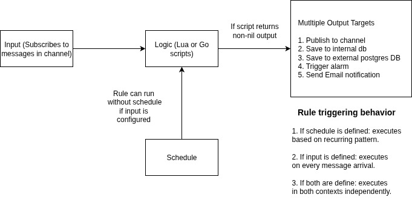

The **Rules Engine** in Magistrala provides powerful, flexible message processing via scriptable rules. Each rule can consume real-time input, run on a schedule, and forward results to multiple output targets including channels, alarms, emails, databases, and more.

## Key Features

1. **Scriptable logic** - Use Lua or Go to define message execution behavior.
2. **Flexible execution** - Rules can be triggered from input messages, schedules or both.
3. **Pluggable outputs** - Built-in support for alarms, channels, email, Postgres, and SenML writers.
4. **Secure, scoped execution** - Using domain-level isolation and bearer token authorization.
5. **Disabled rules** - Rules can be disabled individually to prevent further executions. They can also be enabled to re-start their executions.

## Architecture



The Magistrala Rules Engine is designed for **real-time** and **scheduled message processing**. Its architecture revolves around applying custom business logic to incoming messages or scheduled triggers and forwarding results to one or more output targets.

### Data Flow Summary

1. **Input**
   The engine **subscribes to a channel** (and optionally a topic) to receive messages from devices, services, or pipelines in real time.

   > If no schedule is defined, the rule executes **every time** a new message arrives on the configured channel/topic.

2. **Schedule**
   If a schedule is defined, the rule will **automatically execute** based on the configured:

- Start time
- Execution time
- Recurrence (daily, weekly, monthly)
- Recurring Interval (e.g 1,2,3 etc) - For example if recurrence is daily and interval is 2, it will repeat every 2 days.

3. **Logic**
   The incoming message or scheduled execution is processed using a user-defined script, written in:

- Lua
- Go

> The logic must return a **non-nil value** for outputs to be invoked.

4. **Output(s)**
   If the script returns a value, the rules forwards the result to one or more outputs. Supported output types include:

- _Channel_ - Forward the result to another channel and/or topic.
- _Internal DB_ - Save processed data internally.
- _Postgres DB_ - Store result in a connected Postgres database table.
- _Alarm_ - Raise and alarm event with a severity level.
- _Email_ - Send notifications to configured recipients.
- _Slack_ - Send notifications to configured slack channel.

## Core Concepts

Rules define the logic for processing messages. Each rule may specify:

- An **input channel** and **topic** to subscribe to (optional if the rule is scheduled).
- A **processing script** written in Lua or Go.
- A list of **outputs** that define where to send or store the results.
- An optional **schedule** to control when the rule is executed.
- A rule must have **at least one** of `input` or `schedule` to be executed.

### Rule Structure

```go
type Rule struct {
  ID           string            `json:"id"`
  Name         string            `json:"name"`
  DomainID     string            `json:"domain"`
  Metadata     Metadata          `json:"metadata,omitempty"`
  Tags         []string          `json:"tags,omitempty"`
  InputChannel string            `json:"input_channel"`
  InputTopic   string            `json:"input_topic"`
  Logic        Script            `json:"logic"`
  Outputs      Outputs           `json:"outputs,omitempty"`
  Schedule     schedule.Schedule `json:"schedule,omitempty"`
  Status       Status            `json:"status"`
  CreatedAt    time.Time         `json:"created_at"`
  CreatedBy    string            `json:"created_by"`
  UpdatedAt    time.Time         `json:"updated_at"`
  UpdatedBy    string            `json:"updated_by"`
}
```

| Property        | Description                                       | Required       |
| --------------- | ------------------------------------------------- | -------------- |
| `id`            | Unique identifier for the rule.                   | Auto-generated |
| `name`          | Descriptive name of the rule.                     | ✅             |
| `domain`        | Domain ID associated with the rule.               | ✅             |
| `tags`          | Optional list of tags for categorization          | Optional       |
| `input_channel` | Channel to listen for incoming messages           | ✅             |
| `input_topic`   | Topic within the input channel.                   | Optional       |
| `logic`         | Script (Lua or Go) defining message processing.   | ✅             |
| `outputs`       | List of outputs to send results to.               | ✅             |
| `schedule`      | Scheduling configuration                          | Optional       |
| `status`        | Rule state (`enabled` or `disabled` or `deleted`) | ✅             |
| `created_at`    | Timestamp when the rule was created.              | Auto-generated |
| `updated_at`    | Timestamp when the rule was last updated.         | Auto-generated |
| `metadata`      | Additional rule metadata                          | Optional       |

> **Note**: A rule must have either an `input_channel` or a `schedule` or both. If `input_channel` is omitted, the rule only executes on schedule.

### Scheduling Rules

```go
type Schedule struct {
  StartDateTime   time.Time `json:"start_datetime,omitempty"`
  Time            time.Time `json:"time,omitempty"`
  Recurring       Recurring `json:"recurring,omitempty"`
  RecurringPeriod uint      `json:"recurring_period,omitempty"`
}
```

| Property         | Description                                               |
| ---------------- | --------------------------------------------------------- |
| start_datetime   | When the rule becomes active.                             |
| time             | Time of day the rule is scheduled to run                  |
| recurring        | Recurrence pattern (`None`, `Daily`, `Weekly`, `Monthly`) |
| recurring_period | Interval multiplier (e.g. 2 = every second interval)      |

**Recurring Patterns Explained:**

- **Daily:** Runs every day at the specified time.
- **Weekly:** Runs on the same day of the week.
- **Monthly:** Runs on the same day each month.

#### Scheduling Behavior

- If schedule is present and input_channel is not set, the rule runs at scheduled intervals.
- If both are present, the rule can execute based on incoming messages and on schedule.

**Recurring Patterns Explained:**

- **Daily:** Runs every day at the specified time.
- **Weekly:** Runs on the same day of the week.
- **Monthly:** Runs on the same day each month.

#### How Scheduling Works

1. **Initialization**:

   - The scheduler starts when the service begins running via `StartScheduler()`
   - It uses a ticker to check for rules that need to be executed at regular intervals

2. **Rule Evaluation**:

   - For each tick, the scheduler:
     - Gets all enabled rules scheduled before the current time
     - For each rule, checks if it should run using `shouldRunRule()`
     - If a rule should run, processes it asynchronously

3. **Execution Timing**:
   The `shouldRunRule()` function determines if a rule should run by checking:

   - If the rule's start time has been reached
   - If the current time matches the scheduled execution time
   - For recurring rules:
     - **Daily**: Checks if the correct number of days have passed since start
     - **Weekly**: Checks if the correct number of weeks have passed since start
     - **Monthly**: Checks if the correct number of months have passed since start

4. **Recurring Patterns**:
   - `None`: Rule runs once at the specified time
   - `Daily`: Rule runs every N days where N is the RecurringPeriod
   - `Weekly`: Rule runs every N weeks
   - `Monthly`: Rule runs every N months

For example, to run a rule:

- Every day at 9 AM: Set recurring to "daily" with recurring_period = 1
- Every other week: Set recurring to "weekly" with recurring_period = 2
- Monthly on the 1st: Set recurring to "monthly" with recurring_period = 1

### Rule Logic

Scripts define the logic to process messages. Two scripting types are supported:

| Type | Language | Key Info                                       |
| ---- | -------- | ---------------------------------------------- |
| 0    | Lua      | Lightweight and flexible scripting language    |
| 1    | Go       | Scripts compiled and executed using Go plugins |

Lua Example:

```lua
function logicFunction()
  local converted_temp = (message.payload.v * 1.8 + 32)
  return {n = "Temp_fahrenheit", v = converted_temp, u = "°F"}
end
return logicFunction()
```

Go Example:

```go
package main
import (
    m "messaging"
)
func logicFunction() any {
    return m.message.Payload
}
```

The script should return a value if it triggers an action. Otherwise, it should return `nil`.

### Supported Message Formats

The Rules Engine supports multiple message formats, but when **storing messages to the internal database**, the payload **must be in SenML format**.  
Valid SenML Example:

```json
[
  { "bn": "building1/", "n": "temperature", "u": "Cel", "v": 23.5 },
  { "n": "status", "vs": "OK" }
]
```

#### Constraints

- Each entry must have a unique `n`
- Only one value field (`v`, `vs`, `vb`, `vd`) per entry
- `bn`, `u`, and `t` are optional

##### Invalid Example (duplicate `n` and multiple values)

```json
[
  {
    "n": "temperature",
    "v": 23.5,
    "n": "status",
    "vs": "OK"
  }
]
```

##### Invalid Example (more than one value field)

```json
[
  {
    "n": "status",
    "v": 1,
    "vs": "OK"
  }
]
```

##### Special Characters in `n`

Avoid using special characters in the `n` (name) field, such as:

- Slashes (`/`)
- Emojis
- Symbols like `@`, `#`, `:`

These may break internal parsing or rule pattern matching.

### Output Handling

The **outputs** field allows a rule to define **multiple destinations** or **actions** for its result. Supported output types include:

1. **channels**: Publishes the result to a specific channel/topic.
2. **save_senml**: Stores messages in Magistrala’s internal database.
3. **save_remote_pg**: Forwards the result to an external PostgreSQL database.
4. **alarms**: Triggers an alarm with a structured severity report.
5. **email**: Sends a notification email.
6. **Slack**: Sends a slack notification.

#### channels

```go
type ChannelPublisher struct {
  Type    string  `json:"type"`
  Channel string  `json:"channel"`
  Topic   string  `json:"topic"`
}
```

#### save_senml

```go
type SenML struct {
  Type    string  `json:"type"`
}
```

#### save_remote_pg

```go
type Postgres struct {
  Type    string  `json:"type"`
  Host     string `json:"host"`
  Port     int    `json:"port"`
  User     string `json:"user"`
  Password string `json:"password"`
  Database string `json:"database"`
  Table    string `json:"table"`
  Mapping  string `json:"mapping"`
}
```

#### alarms

```go
type Alarms struct {
  Type    string  `json:"type"`
  RuleID  string  `json:"rule_id"`
}
```

#### email

```go
type Email struct {
  Type    string    `json:"type"`
  To      []string  `json:"to"`
  Subject string    `json:"subject"`
  Content string    `json:"content"`
}
```

#### slack

```go
type Slack struct {
	Token     string `json:"token"`
	ChannelID string `json:"channel_id"`
	Message   string `json:"message"`
}
```

Each output type expects a different data structure depending on its destination.
For example, if your output is save_senml, it expects the result of the logic to be a valid SenML message.
e.g.

```lua
function logicFunction()
  return {
    n = message.payload.sensor,
    v = message.payload.temperature,
    u = message.payload.unit
  }
end
return logicFunction()
```

If the output is an alarm, it expects the result of the logic to be a valid alarm object.
e.g.

```lua
function logicFunction()
    local results = {}
    local threshold = 20000

    for _, msg in ipairs(message.payload) do
        local value = msg.v
        local severity
        local cause

        if value >= threshold * 1.5 then
            severity = 5
            cause = "Critical level exceeded"
        elseif value >= threshold * 1.2 then
            severity = 4
            cause = "High level detected"
        elseif value >= threshold then
            severity = 3
            cause = "Threshold reached"
        end

        table.insert(results, {
            measurement = msg.n,
            value = tostring(value),
            threshold = tostring(threshold),
            cause = cause,
            unit = msg.unit,
            severity = severity
        })
    end

    return results
end
return logicFunction()
```

#### Topic Rewriting and `.` Operator

MQTT topics received by Magistrala are rewritten into dot-separated strings for Rules Engine processing. For example:

Topic:

```bash
m/<domain_id>/c/<channel_id>/building1/floor2/temp
```

Becomes:

```bash
channels.<channel_id>.building1.floor2.temp
```

This means:

- MQTT `/` separators are rewritten as `.` internally
- Rules matching `input_topic` or using `message.subtopic` must use **dot-separated format**
- Every empty segment (e.g. double slashes `//`) is removed

### Rule Status

Rules can have one of the following statuses:

- **Enabled:** The rule is active and processes incoming messages.
- **Disabled:** The rule is inactive and does not process messages.
- **Deleted** - The rule is marked for deletion

## API Operations

The Rules Engine API exposes several endpoints for managing rules. All requests require a valid **JWT Bearer Token** for authentication.

**The Base URL:**
`http://localhost:9008`

The Rules Engine service provides the following operations:

- `create_rule` - Create a new rule
- `list_rules` - Query rules with filtering options
- `view_rule` - Retrieve a specific rule
- `update_rule` - Modify an existing rule
- `update_rule_tags`- Modify tags
- `update_rule_scheduler` - Update rule schedule
- `delete_rule` - Delete a rule
- `enable_rule` - Activate a rule
- `disable_rule` - Deactivate a rule

### Create Rule

Endpoint: `POST /{domain_id}/rules`

**Example command:**

```bash
curl --location 'http://localhost:9008/<your_domain_id>/rules' \
--header 'Content-Type: application/json' \
--header 'Authorization: Bearer <your_access_token>' \
--data '{
  "name": "High Temperature Alert",
  "input_channel": "<your_channel_id>",
  "input_topic": "temperature",
  "logic": {
    "type": 0,
    "value": "function logicFunction() return message.payload end return logicFunction()"
  },
  "outputs": [
    {
      "type": "save_senml"
    }
  ],
  "schedule": {
    "start_datetime": "2025-07-29T09:00:00Z", // must be greater than the current date-time
    "time": "2025-07-29T11:00:00Z",
    "recurring": "daily",
    "recurring_period": 1
  }
}'
```

```json title="Response"
{
  "id": "d4b5c393-70fc-4399-829c-070df5205698",
  "name": "High Temperature Alert",
  "domain": "3bf0d3e6-5383-4838-96a7-52c18da0aca0",
  "input_channel": "3214f360-cebd-449b-bc3c-9020a3be403a",
  "input_topic": "temperature",
  "logic": {
    "type": 0,
    "value": "function logicFunction() return message.payload end return logicFunction()"
  },
  "outputs": [{ "type": "save_senml" }],
  "schedule": {
    "start_datetime": "2025-07-29T04:52:21Z",
    "time": "2025-07-29T04:52:21Z",
    "recurring": "daily",
    "recurring_period": 1
  },
  "status": "enabled",
  "created_at": "2025-07-29T04:52:21.358252Z",
  "created_by": "ae03cf7d-f2e8-49ac-ab28-17481635322a",
  "updated_at": "0001-01-01T00:00:00Z",
  "updated_by": ""
}
```

### View Rule

Enpoint: `Get /{domain_id}/rules/{rule_id}`

**Example command:**

```bash
curl --location 'http://localhost:9008/<your_domain_id>/rules/<your_rule_id>' \
--header 'Authorization: Bearer <your_access_token>'
```

```json title="Response"
{
  "id": "d4b5c393-70fc-4399-829c-070df5205698",
  "name": "High Temperature Alert",
  "domain": "3bf0d3e6-5383-4838-96a7-52c18da0aca0",
  "input_channel": "3214f360-cebd-449b-bc3c-9020a3be403a",
  "input_topic": "temperature",
  "logic": {
    "type": 0,
    "value": "function logicFunction() return message.payload end return logicFunction()"
  },
  "outputs": [{ "type": "save_senml" }],
  "schedule": {
    "start_datetime": "2025-07-29T04:52:21Z",
    "time": "2025-07-30T04:52:21Z",
    "recurring": "daily",
    "recurring_period": 1
  },
  "status": "enabled",
  "created_at": "2025-07-29T04:52:21.358252Z",
  "created_by": "ae03cf7d-f2e8-49ac-ab28-17481635322a",
  "updated_at": "2025-07-29T04:52:45.844481Z",
  "updated_by": ""
}
```

### List Rules

Endpoint: `GET /{domain_id}/rules`

**Query Parameters:**

- `offset`: Pagination offset
- `limit`: Maximum number of results
- `input_channel`: Filter by input channel
- `status`: Filter by rule status

**Example command:**

```bash
curl --location 'http://localhost:9008/<your_domain_id>/rules?input_channel=<your_channel_id>&status=enabled' \
--header 'Authorization: Bearer <your_access_token>'
```

```json title="Response"
{
  "offset": 0,
  "limit": 10,
  "total": 1,
  "rules": [
    {
      "id": "d4b5c393-70fc-4399-829c-070df5205698",
      "name": "High Temperature Alert",
      "domain": "3bf0d3e6-5383-4838-96a7-52c18da0aca0",
      "input_channel": "3214f360-cebd-449b-bc3c-9020a3be403a",
      "input_topic": "temperature",
      "logic": {
        "type": 0,
        "value": "function logicFunction() return message.payload end return logicFunction()"
      },
      "outputs": [{ "type": "save_senml" }],
      "schedule": {
        "start_datetime": "2025-07-29T04:52:21Z",
        "time": "2025-07-30T04:52:21Z",
        "recurring": "daily",
        "recurring_period": 1
      },
      "status": "enabled",
      "created_at": "2025-07-29T04:52:21.358252Z",
      "created_by": "ae03cf7d-f2e8-49ac-ab28-17481635322a",
      "updated_at": "2025-07-29T04:52:45.844481Z",
      "updated_by": ""
    }
  ]
}
```

### Update Rule

Endpoint: `PATCH /{domain_id}/rules/{rule_id}`

**Example command:**

```bash
curl --location --request PATCH 'http://localhost:9008/<your_domain_id>/rules/<your_rule_id>' \
--header 'Content-Type: application/json' \
--header 'Authorization: Bearer <your_access_token>' \
--data '{
  "name": "High Temp Alert Updated"
}'
```

```json title="Response"
{
  "id": "d4b5c393-70fc-4399-829c-070df5205698",
  "name": "High Temp Alert Updated",
  "domain": "3bf0d3e6-5383-4838-96a7-52c18da0aca0",
  "input_channel": "",
  "input_topic": "",
  "logic": {
    "type": 0,
    "value": "function logicFunction() return message.payload end return logicFunction()"
  },
  "outputs": [{ "type": "save_senml" }],
  "schedule": {
    "start_datetime": "2025-07-29T04:52:21Z",
    "time": "2025-07-30T04:52:21Z",
    "recurring": "daily",
    "recurring_period": 1
  },
  "status": "enabled",
  "created_at": "2025-07-29T04:52:21.358252Z",
  "created_by": "ae03cf7d-f2e8-49ac-ab28-17481635322a",
  "updated_at": "2025-07-29T05:07:49.681315Z",
  "updated_by": "ae03cf7d-f2e8-49ac-ab28-17481635322a"
}
```

### Update Rule Tags

Endpoint: `PATCH /{domain_id}/rules/{rule_id}/tags`

**Example command:**

```bash
curl --location --request PATCH 'http://localhost:9008/<your_domain_id>/rules/<your_rule_id>/tags' \
--header 'Content-Type: application/json' \
--header 'Authorization: Bearer <your_access_token>' \
--data '{
  "tags": ["tag1","tag2"]
}'
```

```json title="Response"
{
  "id": "d4b5c393-70fc-4399-829c-070df5205698",
  "name": "High Temp Alert Updated",
  "domain": "3bf0d3e6-5383-4838-96a7-52c18da0aca0",
  "tags": ["tag1", "tag2"],
  "input_channel": "",
  "input_topic": "",
  "logic": {
    "type": 0,
    "value": "function logicFunction() return message.payload end return logicFunction()"
  },
  "outputs": [{ "type": "save_senml" }],
  "schedule": {
    "start_datetime": "2025-07-29T04:52:21Z",
    "time": "2025-07-30T04:52:21Z",
    "recurring": "daily",
    "recurring_period": 1
  },
  "status": "enabled",
  "created_at": "2025-07-29T04:52:21.358252Z",
  "created_by": "ae03cf7d-f2e8-49ac-ab28-17481635322a",
  "updated_at": "2025-07-29T05:10:54.991749Z",
  "updated_by": "ae03cf7d-f2e8-49ac-ab28-17481635322a"
}
```

### Update Rule Scheduler

Endpoint: `PATCH /{domain_id}/rules/{rule_id}/schedule`

**Example command:**

```bash
curl --location --request PATCH 'http://localhost:9008/<your_domain_id>/rules/<your_rule_id>/schedule' \
--header 'Content-Type: application/json' \
--header 'Authorization: Bearer <your_access_token>' \
--data '{
    "schedule": {
    "start_datetime": "2025-07-29T10:52:21Z",
    "time": "2025-07-30T04:52:21Z",
    "recurring": "weekly",
    "recurring_period": 2
  }
}'
```

```json title="Response"
{
  "id": "d4b5c393-70fc-4399-829c-070df5205698",
  "name": "High Temp Alert Updated",
  "domain": "3bf0d3e6-5383-4838-96a7-52c18da0aca0",
  "tags": ["tag1", "tag2"],
  "input_channel": "",
  "input_topic": "",
  "logic": {
    "type": 0,
    "value": "function logicFunction() return message.payload end return logicFunction()"
  },
  "outputs": [{ "type": "save_senml" }],
  "schedule": {
    "start_datetime": "2025-07-29T10:52:21Z",
    "time": "2025-07-30T04:52:21Z",
    "recurring": "weekly",
    "recurring_period": 2
  },
  "status": "enabled",
  "created_at": "2025-07-29T04:52:21.358252Z",
  "created_by": "ae03cf7d-f2e8-49ac-ab28-17481635322a",
  "updated_at": "2025-07-29T05:13:05.877133Z",
  "updated_by": "ae03cf7d-f2e8-49ac-ab28-17481635322a"
}
```

---

### Disable Rule

Endpoint: `POST /{domain_id}/rules/{rule_id}/disable`

**Example Command:**

```bash
curl --location --request POST 'http://localhost:9008/<your_domain_id>/rules/<your_rule_id>/disable' \
--header 'Authorization: Bearer <your_access_token>' \
```

```json title="Response"
{
  "id": "d4b5c393-70fc-4399-829c-070df5205698",
  "name": "High Temp Alert Updated",
  "domain": "3bf0d3e6-5383-4838-96a7-52c18da0aca0",
  "tags": ["tag1", "tag2"],
  "input_channel": "",
  "input_topic": "",
  "logic": {
    "type": 0,
    "value": "function logicFunction() return message.payload end return logicFunction()"
  },
  "outputs": [{ "type": "save_senml" }],
  "schedule": {
    "start_datetime": "2025-07-29T10:52:21Z",
    "time": "2025-07-30T04:52:21Z",
    "recurring": "weekly",
    "recurring_period": 2
  },
  "status": "disabled",
  "created_at": "2025-07-29T04:52:21.358252Z",
  "created_by": "ae03cf7d-f2e8-49ac-ab28-17481635322a",
  "updated_at": "2025-07-29T05:16:36.254008Z",
  "updated_by": "ae03cf7d-f2e8-49ac-ab28-17481635322a"
}
```

**Responses:**

| Status Code | Description                 |
| ----------- | --------------------------- |
| `200`       | Rule disabled successfully. |
| `400`       | Invalid rule ID.            |
| `401`       | Unauthorized access.        |
| `404`       | Rule not found.             |
| `500`       | Internal server error.      |

---

### Enable Rule

Endpoint: `POST /{domain_id}/rules/{rule_id}/enable`

The API endpoint follows the format: `http://localhost:9008/{domain_id}/rules/{ruleID}/enable`

```bash
curl --location --request POST 'http://localhost:9008/<your_domain_id>/rules/<your_rule_id>/enable' \
--header 'Authorization: Bearer <your_access_token>' \
```

```json title="Response"
{
  "id": "d4b5c393-70fc-4399-829c-070df5205698",
  "name": "High Temp Alert Updated",
  "domain": "3bf0d3e6-5383-4838-96a7-52c18da0aca0",
  "tags": ["tag1", "tag2"],
  "input_channel": "",
  "input_topic": "",
  "logic": {
    "type": 0,
    "value": "function logicFunction() return message.payload end return logicFunction()"
  },
  "outputs": [{ "type": "save_senml" }],
  "schedule": {
    "start_datetime": "2025-07-29T10:52:21Z",
    "time": "2025-07-30T04:52:21Z",
    "recurring": "weekly",
    "recurring_period": 2
  },
  "status": "enabled",
  "created_at": "2025-07-29T04:52:21.358252Z",
  "created_by": "ae03cf7d-f2e8-49ac-ab28-17481635322a",
  "updated_at": "2025-07-29T05:17:12.534919Z",
  "updated_by": "ae03cf7d-f2e8-49ac-ab28-17481635322a"
}
```

**Responses:**

| Status Code | Description                |
| ----------- | -------------------------- |
| `200`       | Rule enabled successfully. |
| `400`       | Invalid rule ID.           |
| `401`       | Unauthorized access.       |
| `404`       | Rule not found.            |
| `500`       | Internal server error.     |

---

### Delete Rule

Endpoint: `DELETE /{domain_id}/rules/{rule_id}`
**Example Command:**

```bash
curl --location --request DELETE 'http://localhost:9008/<your_domain_id>/rules/<your_rule_id>' \
--header 'Authorization: Bearer <your_access_token>' \
```

**Responses:**

| Status Code | Description            |
| ----------- | ---------------------- |
| `204`       | Rule deleted.          |
| `400`       | Invalid rule ID.       |
| `401`       | Unauthorized access.   |
| `404`       | Rule not found.        |
| `500`       | Internal server error. |

---

## Error Codes

| HTTP Code | Description                          |
| --------- | ------------------------------------ |
| `400`     | Invalid request or parameters.       |
| `401`     | Unauthorized: Missing/invalid token. |
| `403`     | Forbidden: Access denied.            |
| `404`     | Resource not found.                  |
| `415`     | Unsupported content type.            |
| `500`     | Internal server error.               |

## 🌟 Best Practices

1. **Use Descriptive Names** – Choose names that clearly convey the rule's purpose.
2. **Validate Your Scripts** – Whether Lua or Go, ensure the script returns the correct output format.
3. **Regularly Monitor Rules** – Periodically review rule execution logs.
4. **Schedule Thoughtfully** – Avoid overlapping rule executions unless necessary.
5. **Keep Output Aligned** – Match your logic output format to the selected output type (e.g., alarm, database, publish).
6. **Test New Rules** – Test rules in a controlled environment before deployment.
