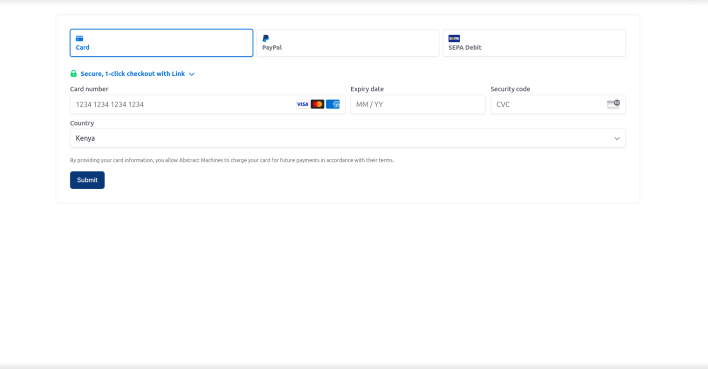
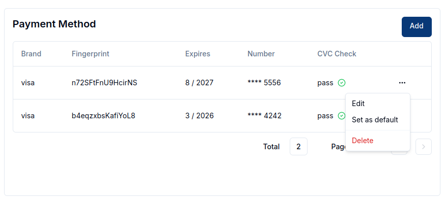

This service allows users to view and subscribe to billing plans, manage payment methods and billing information, and download generated invoices and receipts.  
Magistrala employs the use of [Stripe](https://docs.stripe.com/) to handle the user's private information.
This means that Magistrala will not have the user's card payment credentials at any point in time.

Navigate to the Billing tab on the sidenav bar. This tab will only be visible to admin members of a domain.

## Overview
The billing page has multiple sections present each important to the billing process.

In a newly created domain without any data on billing, all the sections will be empty.

## Add Billing Information
This section includes the user's contact details such as addresses, emails, and the name of the user to whom the subscription will be charged.

To fill this section, click on `Add` to trigger a dialogbox.
On the form, you are required to fill in the Name, Email, Phone, Country and City of the billed customer.
State and Province or Addresses are optional but help in the creation of invoices.
After filling in the required data, click `Add` and the information will be fed into the system.

## Subscribe to a Billing Plan
The subscription section handles the domain's subscription plan and shows the status of the subscription.

The first step is to add a billing plan to the domain this done by clicking `Choose` will display a list of available subscription plans.  

The subscription status can be either be **completed** where the user has already been charged or **incomplete** where the process is not yet done and the subscription is inactive.

The **plan details** generally show the user the limits of their subscribed plan. This ensures they are aware of their restrictions at all times. These limits define what can be accessed in terms of domains, users, groups, and devices.

## Add a Payment Method
Click on the `Add` button to gain access to the stripe page where you will fill in your cards or paypal information.
A succesful update will lead you back to the Magistrala billing page with an active payment method.

You can add as many payment cards as needed.
Each card will be verified by stripe to prevent any fraudulent cards from being accepted. Ensure that the card has sufficient funds to cover the subscription cost.
You can also edit payment methods, set a default card and delete any payment method.  

To set a payment method as default simply select 'Set as default' in the dropdown. Once payment method has been set as default, a badge showing default appears. To delete a payment method simply select 'delete' on the dropdown and the payment method will be deleted.

## Generate an Invoice
Once the plan is selected, an invoice will be generated that can be downloaded by clicking the invoice icon downloads a pdf with all the required data.
  

## Generate a Receipt
Once payment is received, there will be an receipt generated that a user can download by clicking on the receipt icon.

  