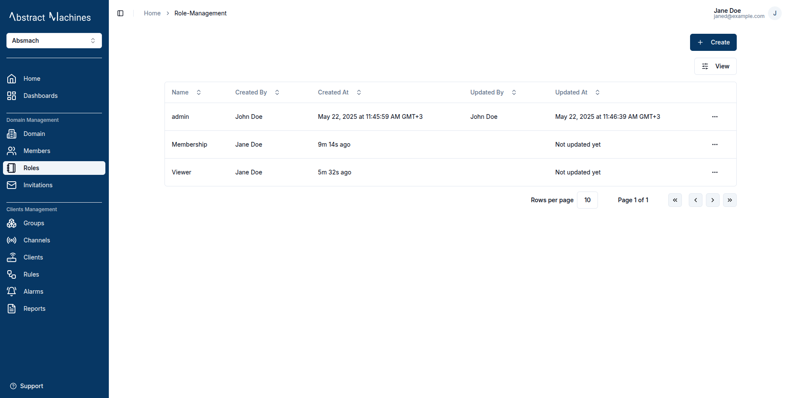

### Domain Information

Navigate to the `Domain` section in the side navigation under **Domain Management** to find out more about the domain.

Here a user can edit the Domain Name, Alias, Tags and Metadata as well as copy the Domain ID.

The Domain status can be disabled by clicking the 'Disable' button or enabled by the 'Enable' button. Disabling the domain will revoke the access for users who are not domain admins.

### Domain Roles

Domain Management covers the Roles and Role Actions present in a domain as well. From the Roles section of the Domain, the user can create new roles with varying role actions.

By default, an admin role with complete control over the domain is always present and granted to the Domain creator. 

This is a Domain Role Actions Comprehensive List:

- **General Actions**
  - update
  - enable
  - disable
  - read
  - delete

- **Role Management**
  - manage_role
  - add_role_users
  - remove_role_users
  - view_role_users

- **Client Actions**
  - client_create
  - client_update
  - client_read
  - client_delete
  - client_connect_to_channel
  - client_set_parent_group
  - client_manage_role
  - client_add_role_users
  - client_remove_role_users
  - client_view_role_users

- **Channel Actions**
  - channel_create
  - channel_update
  - channel_read
  - channel_delete
  - channel_set_parent_group
  - channel_connect_to_client
  - channel_publish
  - channel_subscribe
  - channel_manage_role
  - channel_add_role_users
  - channel_remove_role_users
  - channel_view_role_users

- **Group Actions**
  - group_create
  - group_update
  - group_read
  - group_delete
  - group_membership
  - group_set_child
  - group_set_parent
  - group_manage_role
  - group_add_role_users
  - group_remove_role_users
  - group_view_role_users

To create a new role, click on the `+ Create` button and select from the role actions as well as provide a descsriptive name for the role.

Since currently we cannot assign members to a domain, the only way to get members is by creating roles and selecting users to the roles.

Once created, these domain roles can be edited in their respective ID pages.
A user can edit the domain role id, name, role actions and role members. These fields can all be edited accordingly while on the page or by using the options on the dropdown menu.

### Domain Members

An admin or a member with the right permissions can assign users to a domain. Members must be assigned with specific roles.

> This feature is currently under maintenance

Using the search feature allows a user to easily navigate the members to find particular users.
The **Status** button can filter the members table and show enabled, disabled or all the members.
