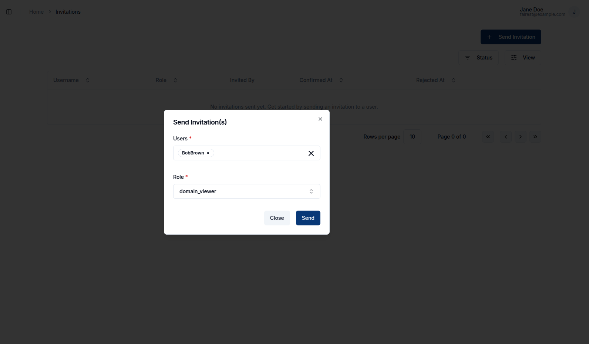

### Send Invitation
The **Invitations** Tab shows the list of invitations a user has sent out to other members of the domain.
After clicking on the 'Send Invitation' button, a user can select multiple users with a specific relation to invite to the Domain.

All invitations sent can be managed in the invitations table which shows who the invite was sent to with the respective relation. A user can also delete an individual invitation.

### Accept an Invitation

Once the invitation is sent, the user will be able to accept or decline it after they log in.
There will be a popup on the domains page showing all the pending invitations.
The user does have an option of accepting or declining the invitation on the popup. This will have a maximum of 5 messages which reload after every invitation has been accepted or declined.

They can also view more invitations after clicking 'View all' which links them to the Invitations Table.

Once the Invitation is accepted, the user will be able to log into the domain. 
