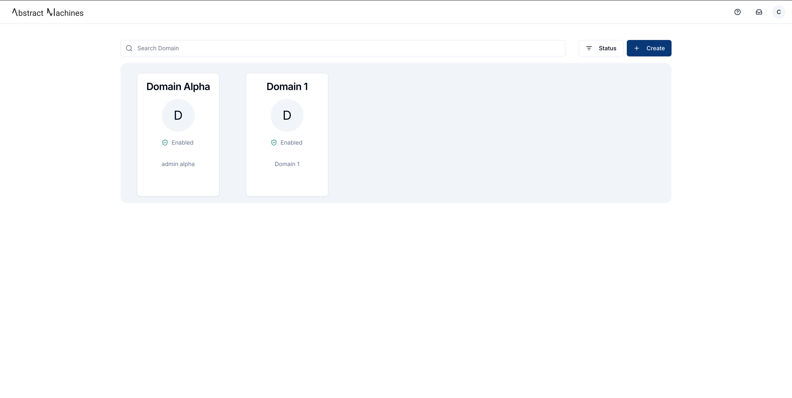
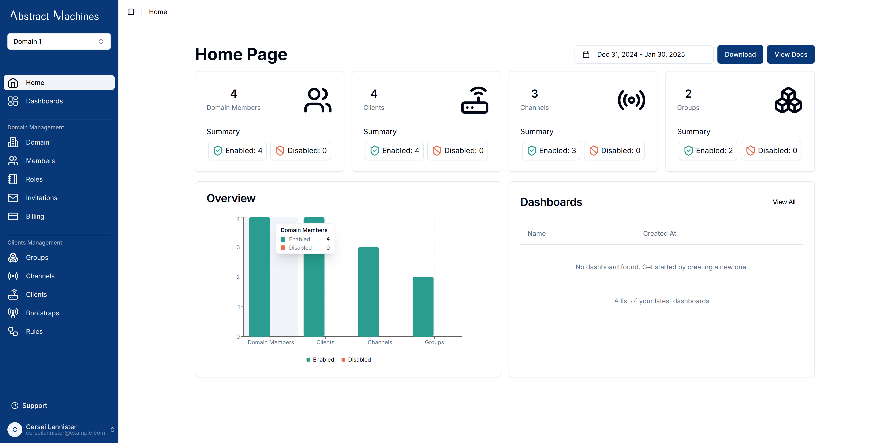
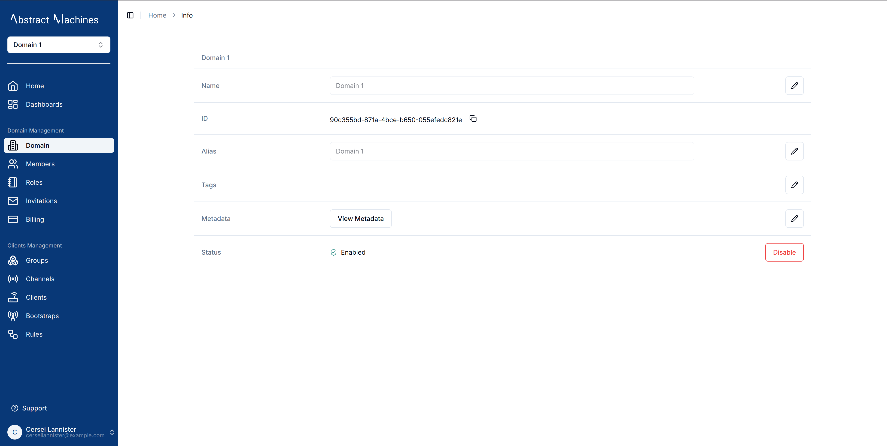
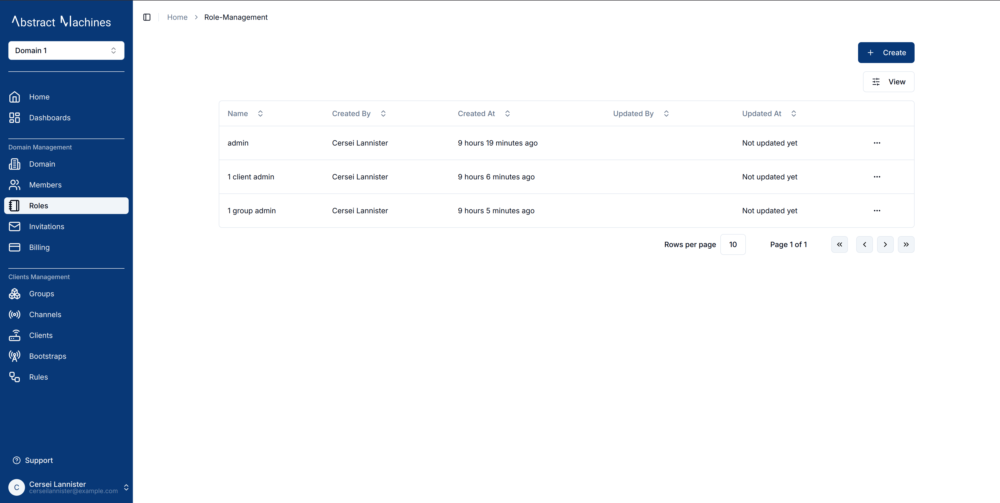
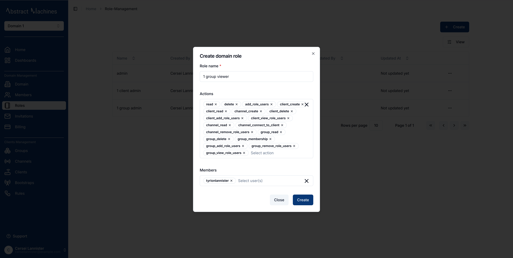
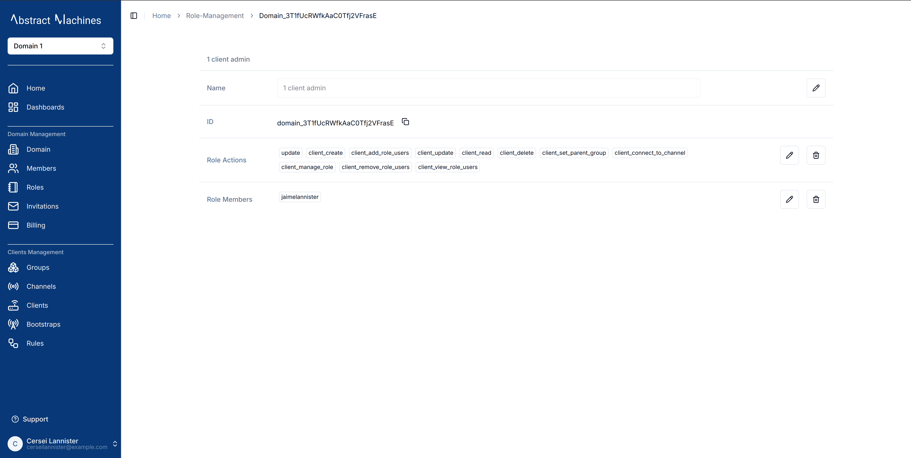
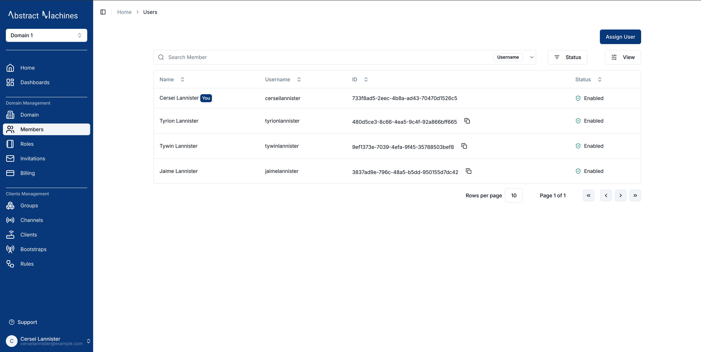

A **Domain** is a workspace that contains **Clients**, **Channels**, **Groups**, **Dashboards** as well as **Roles** and **Rules Engine** Services.
A user can create as many domains as they please. A **Super Admin** has access to all domains present in the system. But a **User** must be a member or creator of a domain to log into it.

Click on the `+ Create` button on the top right to create a new domain. Since multiple domains can have the same name, you must add an **alias** which will be a unique descriptor for the domain.

Once you create a domain, you are given **Administrator** permission over the domain.
You are able to perform all actions available over the domain and all the entities provisioned inside the domain.
You can also assign or invite members to the domain with various levels of permissions.

The domains page consists of all the active domains present. These cards have major details pertaining the domain.
The domain Name is at the top with its first letter as the **avatar** at the center of the card.
Right under that is the logged in User's relation to the domain.
We can tell that the _User_ is the `administrator` of the domain Living Room.
We can also see the Domain's status.
You can also toggle the status on the button to show either Enabled and Disabled domains.

The top navigation of the domains page has three main icons:

- Support Icon that will lead you to contact support as well as documentation.
- An Invitations Icon that will show Users all the domain they have been invited to.
- A User Icon which has **Profile**, **Domains** and **Logout** as the profile menu.

### **Domain Homepage**

Clicking on a Domain name will log you into the Domain itself and you will be redirected into the **Domain Homepage**. There is a Dashboard here with all the available entities in the domain.

The Download Button enables the download of the current Homepage as a pdf.

### **Domain Information**

To find out more about the Domain, navigate to the `Domain` section in the side navigation under **Domain Management**.

From here a user can edit the Domain Name, Alias, Tags and Metadata as well as copy the Domain ID.

The Domain status can also be toggled on or off. A dialog box pops up if you do disable a Domain since this will lead to being kicked out of the session.

### **Domain Roles**

Domain Management covers the Roles and Role Actions present in a domain as well. From the Roles section of the Domain, the user can create new roles with varying role actions.

By default, an admin role with complete control over the domain is always present and granted to the Domain creator.

This is a Domain Role Actions Comprehensive List:

- **General Actions**
  - update
  - enable
  - disable
  - read
  - delete

- **Role Management**
  - manage_role
  - add_role_users
  - remove_role_users
  - view_role_users

- **Client Actions**
  - client_create
  - client_update
  - client_read
  - client_delete
  - client_connect_to_channel
  - client_set_parent_group
  - client_manage_role
  - client_add_role_users
  - client_remove_role_users
  - client_view_role_users

- **Channel Actions**
  - channel_create
  - channel_update
  - channel_read
  - channel_delete
  - channel_set_parent_group
  - channel_connect_to_client
  - channel_publish
  - channel_subscribe
  - channel_manage_role
  - channel_add_role_users
  - channel_remove_role_users
  - channel_view_role_users

- **Group Actions**
  - group_create
  - group_update
  - group_read
  - group_delete
  - group_membership
  - group_set_child
  - group_set_parent
  - group_manage_role
  - group_add_role_users
  - group_remove_role_users
  - group_view_role_users

To create a new role, click on the `+ Create` button and select from the role actions as well as provide a descsriptive name for the role.

Since currently we cannot assign members to a domain, the only way to get members is by creating roles and selecting users to the roles.

Once created, these domain roles can be edited in their respective ID pages.
Clicking on the role leads a user to a table with the Domain Role's ID, Name, Role Actions and Role Members. These fields can all be edited accordingly while on the page.

### **User Management**

An admin or a member with the right permissions can assign members to a domain. Members must be assigned with specific roles.

> This feature is currently under maintenance

Using the search feature allows a User to easily navigate the Members to find particular users.
The **Status** button can filter the Members Table and show Enabled, Disabled or all the Members.
