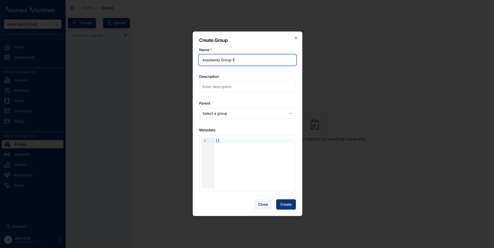
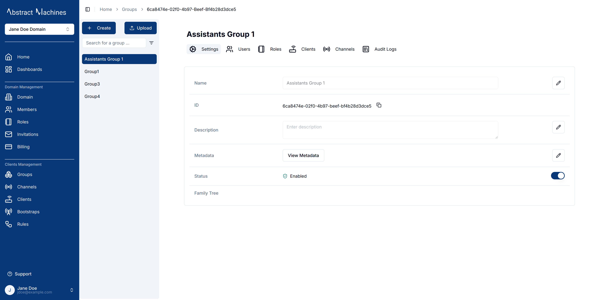
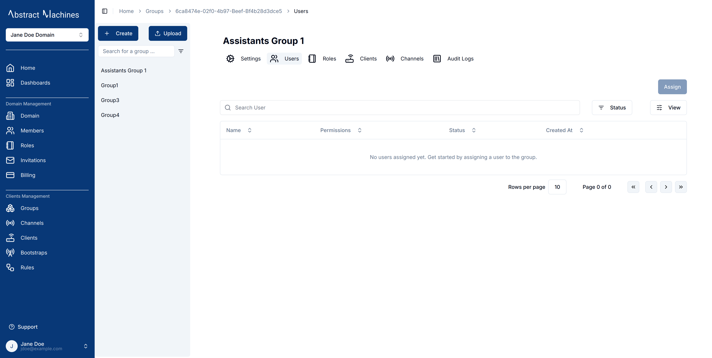
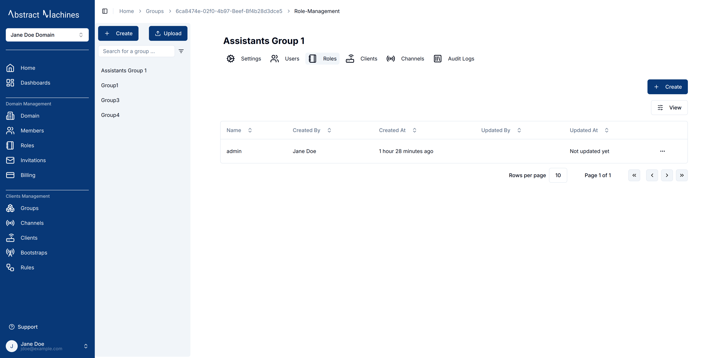
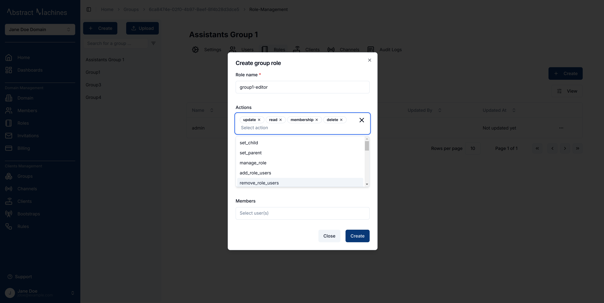
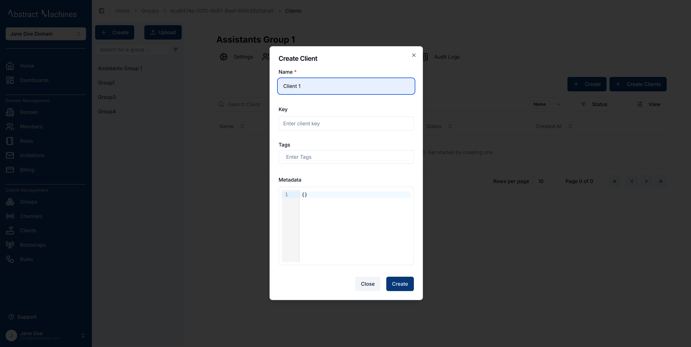
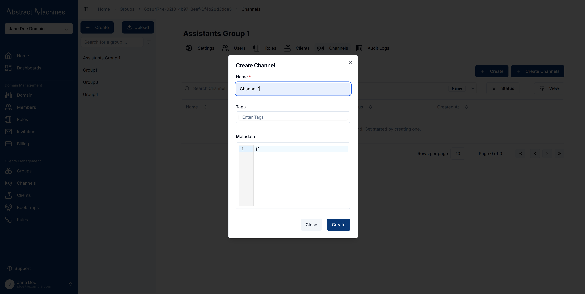

**Groups** are multiples of Users. By itself, the service can have domain members assigned to groups. These members will have all the roles and permissions that the group has over any other entity present in the group. This allows for ease of management of a multitude of Users making it more efficient.

## Creating a Group

To create a group, click on the `+ Create` button present on the top-left corner of the page. This will open a popover with all the required fields for a new group.

There is an option to add a parent to the group. This creates a hierachy. Permissions and roles can be shared down this heirachy.

You can also create multiple groups at the same time using a _.CSV_ file which has all the required fields correctly filled in. Click on the `Upload` button and add your csv file. Magistrala provides samples as shown on the popover.

### Viewing a Group

After creating a group, it will show up on the page as the first group created.

While on the View Group Page, you can edit the group name by clicking on the pencil Icon and saving your changes. The same can be done for the group description as well as Metadata.

> The family tree section shows a group's parent-child relationship:

- A group can have a **single parent**, placing it in a hierarchical level.
- A group without a parent is a **Level 1 group**, while one with a parent is **Level 2**.
- A group can have multiple child groups.

When using parent or child groups, ensure that the referenced groups already exist to avoid errors.

A group can alsp be diabled or enabled by anyone with `edit` privileges. This is just the change of state from 1 to 0 in the case of the disabling.

## User Management in Groups

### Assigning a User to a Group

A user can assign and unassign users to a specific group and provide them with policies over the entities the groups has control over.
This allows for a more streamlined approach to more than one user.
Members of the domain with edit, member and admin permissions usually are already assigned to the group.  We will discuss more on these roles and policies in the **Domain Roles** section later on.

A user can be a member of more than one group with different policies over each allowing an admin greater control over the users they have.

> This feature is currently disabled and will be added with later iterations.

### Assigning Roles to a Group

A user can assign **Roles** created in the Domain to certain groups. This can be done in the third tab of the groups page. These roles can vary depending on which role actions the user desires the group to have.

By default, the admin role is always present in the group for the admin user who created the group as well as the Super Admin.

You can create a new role and assign it to the group as well as assign a member to it upon creation.

This new role will be specific to the group entities and not visible outside the group.

Role Actions present include but are not limited to:

- **General**
  - read
  - update
  - membership
  - delete

- **Hierarchy Management**
  - set_child
  - set_parent

- **Role Management**
  - manage_role
  - add_role_users
  - remove_role_users
  - view_role_users

- **Client Permissions**
  - client_create
  - client_update
  - client_read
  - client_delete
  - client_set_parent_group
  - client_connect_to_channel
  - client_manage_role
  - client_add_role_users
  - client_remove_role_users
  - client_view_role_users

- **Channel Permissions**
  - channel_create
  - channel_update
  - channel_read
  - channel_delete
  - channel_set_parent_group
  - channel_connect_to_client
  - channel_publish
  - channel_subscribe
  - channel_manage_role
  - channel_add_role_users
  - channel_remove_role_users
  - channel_view_role_users

- **Subgroup Permissions**
  - subgroup_create
  - subgroup_channel_create
  - subgroup_client_create
  - subgroup_client_update
  - subgroup_client_read
  - subgroup_client_delete
  - subgroup_client_set_parent_group
  - subgroup_client_connect_to_channel
  - subgroup_read
  - subgroup_membership
  - subgroup_delete
  - subgroup_update
  - subgroup_set_child
  - subgroup_set_parent
  - subgroup_add_role_users
  - subgroup_manage_role
  - subgroup_remove_role_users
  - subgroup_view_role_users

### Assigning Clients to Groups

Clients present in the domain can be assigned to the group.

A user can also create clients specific to the group while on the fourth tab of the view group page. Any group member can then have permissions over the client as specified by their roles.

### Assigning Channels to Groups

A user can create a channel or channels specific to the group while on the view group channels page. Any group member can then be specified to have certain roles over the channel.

### Audit Logs

Audit logs track all **group events**, from **creation** to **updates** and **disabling**.
